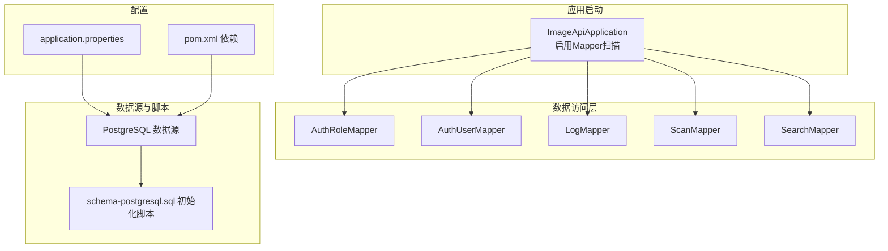
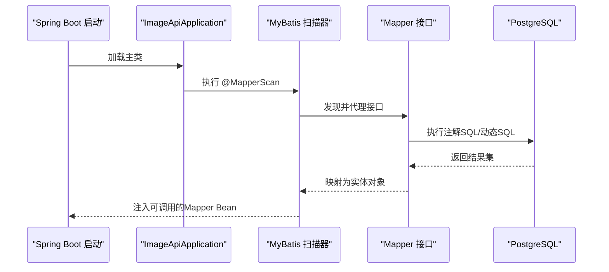
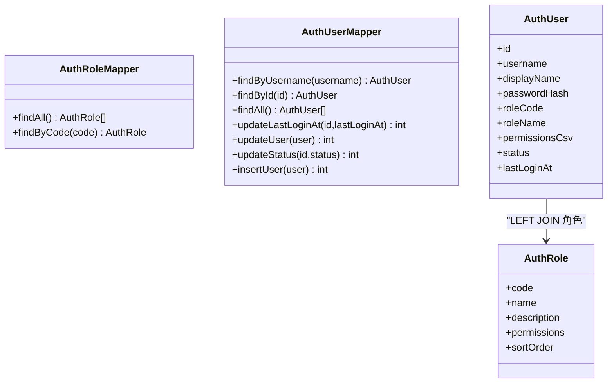
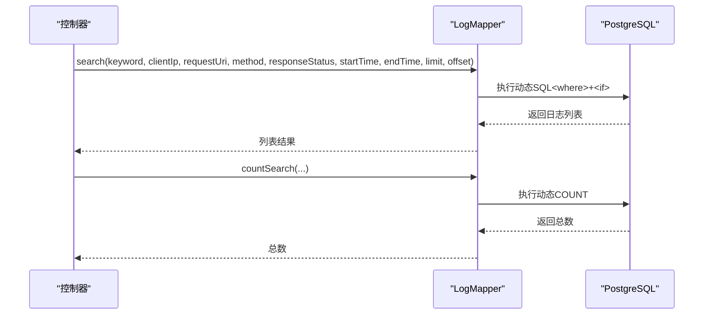
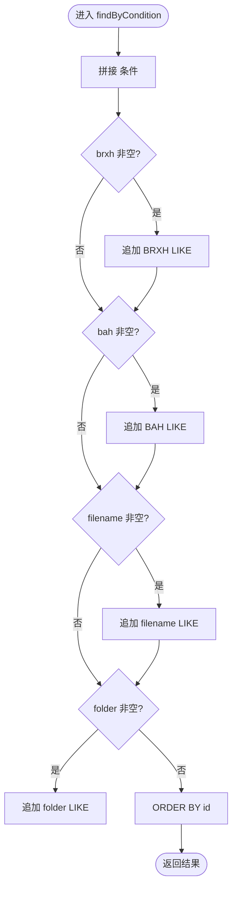
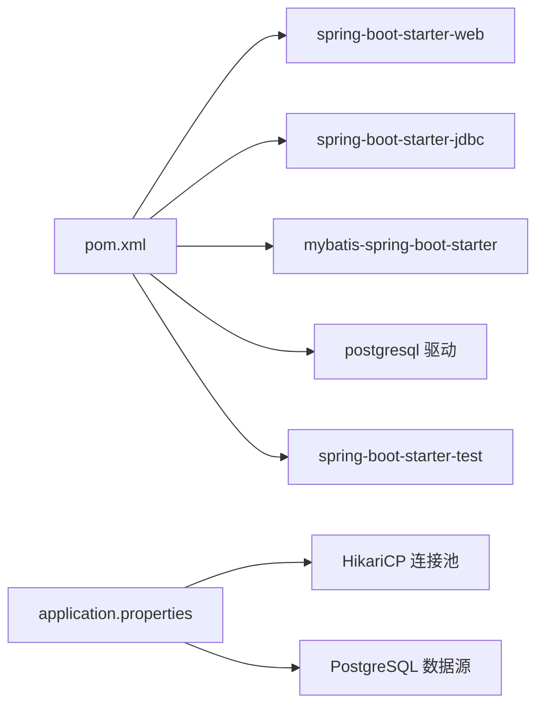

# 数据访问层

**本文引用的文件**
- [ImageApiApplication.java](file://backend-repo/src/main/java/com/zjcxph/imgapi/ImageApiApplication.java)
- [application.properties](file://backend-repo/src/main/resources/application.properties)
- [pom.xml](file://backend-repo/pom.xml)
- [schema-postgresql.sql](file://backend-repo/src/main/resources/schema-postgresql.sql)
- [schema.sql](file://mrr-db/schema.sql)
- [AuthRoleMapper.java](file://backend-repo/src/main/java/com/zjcxph/imgapi/mapper/AuthRoleMapper.java)
- [AuthUserMapper.java](file://backend-repo/src/main/java/com/zjcxph/imgapi/mapper/AuthUserMapper.java)
- [LogMapper.java](file://backend-repo/src/main/java/com/zjcxph/imgapi/mapper/LogMapper.java)
- [ScanMapper.java](file://backend-repo/src/main/java/com/zjcxph/imgapi/mapper/ScanMapper.java)
- [SearchMapper.java](file://backend-repo/src/main/java/com/zjcxph/imgapi/mapper/SearchMapper.java)

## 目录
1. [简介](#简介)
2. [项目结构](#项目结构)
3. [核心组件](#核心组件)
4. [架构总览](#架构总览)
5. [详细组件分析](#详细组件分析)
6. [依赖分析](#依赖分析)
7. [性能考虑](#性能考虑)
8. [故障排查指南](#故障排查指南)
9. [结论](#结论)
10. [附录](#附录)

## 简介
本文件面向MRR项目的后端数据访问层，系统性阐述基于MyBatis的ORM配置与使用、Mapper接口设计模式、SQL映射组织方式、数据库连接池与事务管理、实体类与数据库表映射关系及字段命名约定、动态SQL与条件查询实现、SQL性能分析与索引优化建议，以及数据访问层的单元与集成测试策略。目标是帮助开发者快速理解并高效维护数据访问层。

## 项目结构
后端采用Spring Boot + MyBatis的分层架构，数据访问层位于com.zjcxph.imgapi.mapper包中，配合实体类与资源文件中的数据库初始化脚本共同构成完整的持久化体系。应用启动时通过注解扫描Mapper接口，并加载PostgreSQL数据源与HikariCP连接池配置。

**图表来源**
- [ImageApiApplication.java:11](file://backend-repo/src/main/java/com/zjcxph/imgapi/ImageApiApplication.java#L11)
- [application.properties:10-22](file://backend-repo/src/main/resources/application.properties#L10-L22)
- [pom.xml:41-44](file://backend-repo/pom.xml#L41-L44)

**章节来源**
- [ImageApiApplication.java:11](file://backend-repo/src/main/java/com/zjcxph/imgapi/ImageApiApplication.java#L11)
- [application.properties:10-22](file://backend-repo/src/main/resources/application.properties#L10-L22)
- [pom.xml:41-44](file://backend-repo/pom.xml#L41-L44)

## 核心组件
- 应用入口与Mapper扫描：通过注解启用Mapper扫描，确保MyBatis能发现并代理各Mapper接口。
- 数据库连接池：HikariCP在application.properties中集中配置最大池大小、最小空闲、连接超时等参数。
- SQL初始化：Spring Boot自动执行schema-postgresql.sql，创建模式与表，并建立常用索引。
- Mapper接口：每个领域（角色、用户、日志、扫描、检索）均提供独立Mapper接口，采用注解式SQL或动态SQL实现CRUD与查询。

**章节来源**
- [ImageApiApplication.java:11](file://backend-repo/src/main/java/com/zjcxph/imgapi/ImageApiApplication.java#L11)
- [application.properties:15-19](file://backend-repo/src/main/resources/application.properties#L15-L19)
- [application.properties:20-22](file://backend-repo/src/main/resources/application.properties#L20-L22)
- [schema-postgresql.sql:1-109](file://backend-repo/src/main/resources/schema-postgresql.sql#L1-L109)

## 架构总览
下图展示应用启动到数据访问的关键交互路径，包括Mapper扫描、数据源初始化、SQL执行与结果映射。

**图表来源**
- [ImageApiApplication.java:11](file://backend-repo/src/main/java/com/zjcxph/imgapi/ImageApiApplication.java#L11)
- [application.properties:10-22](file://backend-repo/src/main/resources/application.properties#L10-L22)

## 详细组件分析

### 认证与授权模块（AuthRole、AuthUser）
- 设计模式：每个领域一个Mapper接口，职责单一；通过注解定义SQL，减少XML配置负担。
- 实体映射：字段别名与驼峰命名一致，便于自动映射。
- 关联查询：AuthUserMapper通过LEFT JOIN关联角色表，一次性返回用户及其权限信息。
- 事务管理：该模块未显式声明事务，遵循Spring默认传播行为；如需强一致性操作可在服务层添加事务注解。

**图表来源**
- [AuthRoleMapper.java:13-18](file://backend-repo/src/main/java/com/zjcxph/imgapi/mapper/AuthRoleMapper.java#L13-L18)
- [AuthUserMapper.java:16-77](file://backend-repo/src/main/java/com/zjcxph/imgapi/mapper/AuthUserMapper.java#L16-L77)

**章节来源**
- [AuthRoleMapper.java:10-18](file://backend-repo/src/main/java/com/zjcxph/imgapi/mapper/AuthRoleMapper.java#L10-L18)
- [AuthUserMapper.java:14-77](file://backend-repo/src/main/java/com/zjcxph/imgapi/mapper/AuthUserMapper.java#L14-L77)

### 日志访问（LogMapper）
- 动态SQL：使用`<script>`标签包裹动态条件，支持关键词、IP、URI、方法、状态、时间范围等多维过滤。
- 分页与计数：提供带分页的查询与计数查询，满足后台管理界面的列表与分页需求。
- 清理策略：提供按截止时间删除旧日志与统计旧日志数量的方法，配合定时任务清理过期日志。
- 字段映射：通过列别名统一映射到实体属性，避免命名不一致问题。

**图表来源**
- [LogMapper.java:70-113](file://backend-repo/src/main/java/com/zjcxph/imgapi/mapper/LogMapper.java#L70-L113)
- [LogMapper.java:115-145](file://backend-repo/src/main/java/com/zjcxph/imgapi/mapper/LogMapper.java#L115-L145)

**章节来源**
- [LogMapper.java:9-166](file://backend-repo/src/main/java/com/zjcxph/imgapi/mapper/LogMapper.java#L9-L166)

### 扫描与归档（ScanMapper）
- 动态更新：`<set>`与`<if>`组合实现按需更新字段，避免全量覆盖。
- 批量查询：通过`<foreach>`实现IN子句批量查询，提升路径解析效率。
- 条件查询：支持多字段模糊匹配与精确过滤，结合分页实现高性能列表。
- 插入与自增：使用useGeneratedKeys与keyProperty映射自增主键。

**图表来源**
- [ScanMapper.java:80-96](file://backend-repo/src/main/java/com/zjcxph/imgapi/mapper/ScanMapper.java#L80-L96)

**章节来源**
- [ScanMapper.java:15-131](file://backend-repo/src/main/java/com/zjcxph/imgapi/mapper/ScanMapper.java#L15-L131)

### 检索模块（SearchMapper）
- 单表查询：根据身份证号查询患者信息，返回病案号等关键字段。
- 字段映射：通过列别名与实体属性保持一致，简化映射过程。

**章节来源**
- [SearchMapper.java:9-16](file://backend-repo/src/main/java/com/zjcxph/imgapi/mapper/SearchMapper.java#L9-L16)

## 依赖分析
- Spring Boot Starter：提供Web、JDBC、MyBatis、测试等基础能力。
- MyBatis Spring Boot Starter：自动装配SqlSessionFactory与MapperScannerConfigurer。
- PostgreSQL驱动：连接PostgreSQL数据库。
- HikariCP：高性能连接池，默认在application.properties中配置。

**图表来源**
- [pom.xml:27-114](file://backend-repo/pom.xml#L27-L114)
- [application.properties:10-22](file://backend-repo/src/main/resources/application.properties#L10-L22)

**章节来源**
- [pom.xml:27-114](file://backend-repo/pom.xml#L27-L114)
- [application.properties:10-22](file://backend-repo/src/main/resources/application.properties#L10-L22)

## 性能考虑
- 连接池配置：合理设置maximum-pool-size、minimum-idle、connection-timeout、idle-timeout与max-lifetime，避免连接泄漏与抖动。
- 索引优化：schema-postgresql.sql已为高频查询字段建立索引（如mr_scan的bah、brxh，mr_statistics的bah/date/type，mr_auth_user的username/role_code，access_log的时间与组合索引），应结合慢查询日志持续评估。
- 动态SQL：优先使用`<where>`+`<if>`替代字符串拼接，避免SQL注入；对IN子句限制集合大小，防止膨胀。
- 分页策略：统一使用LIMIT/OFFSET分页，避免一次性拉取大量数据；对复杂查询先COUNT再分页。
- 字段映射：保持列别名与实体属性一致，减少手动映射开销。
- 缓存与降级：对热点查询可引入Redis缓存；对外部依赖失败时采用熔断与降级策略（Resilience4j已在依赖中）。

**章节来源**
- [application.properties:15-19](file://backend-repo/src/main/resources/application.properties#L15-L19)
- [schema-postgresql.sql:75-89](file://backend-repo/src/main/resources/schema-postgresql.sql#L75-L89)
- [pom.xml:90-93](file://backend-repo/pom.xml#L90-L93)

## 故障排查指南
- SQL执行异常：检查Mapper注解SQL语法与列别名是否与实体属性一致；确认数据库初始化脚本已成功执行。
- 连接池问题：核对HikariCP参数配置，观察连接池指标与错误日志；必要时调整最大池大小与超时时间。
- 动态SQL条件无效：确认传参非空且非空字符串；检查OGNL表达式与转义字符（如&lt;、&gt;）。
- 分页错位：确保排序字段唯一且稳定（如组合索引），避免重复值导致的分页抖动。
- 日志清理未生效：检查定时任务调度与清理阈值，确认access_time与id索引有效。

**章节来源**
- [LogMapper.java:41-51](file://backend-repo/src/main/java/com/zjcxph/imgapi/mapper/LogMapper.java#L41-L51)
- [LogMapper.java:58-68](file://backend-repo/src/main/java/com/zjcxph/imgapi/mapper/LogMapper.java#L58-L68)
- [application.properties:15-19](file://backend-repo/src/main/resources/application.properties#L15-L19)

## 结论
MRR项目的数据访问层以MyBatis为核心，结合注解式SQL与动态SQL实现了清晰的职责划分与高效的查询能力。通过合理的连接池配置、索引策略与分页方案，能够满足业务的高并发与稳定性要求。建议在服务层补充事务控制与缓存策略，并持续利用慢查询与指标监控进行性能优化。

## 附录

### 实体与表映射关系与字段命名约定
- 命名约定：数据库字段采用下划线命名，实体属性采用驼峰命名；通过列别名统一映射，避免手动映射。
- 主要表与字段：
  - mr_scan：id、brxh、bah、filename、btype、pages、openerno、uploaddate、uploadflag、folder
  - mr_statistics：bah、cid、openerno、date、type、pages
  - mr_patient：id、idcard、bah、admissiontime、department、name
  - mr_user：id、name、age、email
  - mr_auth_role：code、name、description、permissions、sort_order
  - mr_auth_user：id、username、display_name、password_hash、role_code、status、last_login_at、created_at、updated_at
  - access_log：id、client_ip、request_uri、method、user_agent、access_time、query_string、request_body、response_status、execute_time、referer

**章节来源**
- [schema-postgresql.sql:3-73](file://backend-repo/src/main/resources/schema-postgresql.sql#L3-L73)

### 测试策略
- 单元测试：针对Mapper接口编写单元测试，验证SQL执行与结果映射正确性；使用嵌入式数据库或内存数据库隔离外部依赖。
- 集成测试：通过Spring Boot Test与Testcontainers启动真实数据库环境，验证初始化脚本、连接池与事务行为。
- 性能测试：使用压力测试工具模拟高并发请求，结合数据库慢查询日志与指标监控评估Mapper层瓶颈。

**章节来源**
- [pom.xml:67-70](file://backend-repo/pom.xml#L67-L70)
- [application.properties:20-22](file://backend-repo/src/main/resources/application.properties#L20-L22)