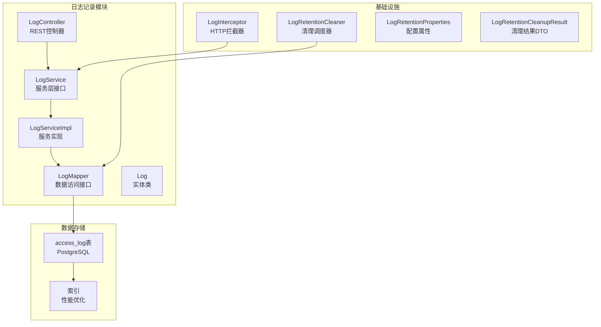
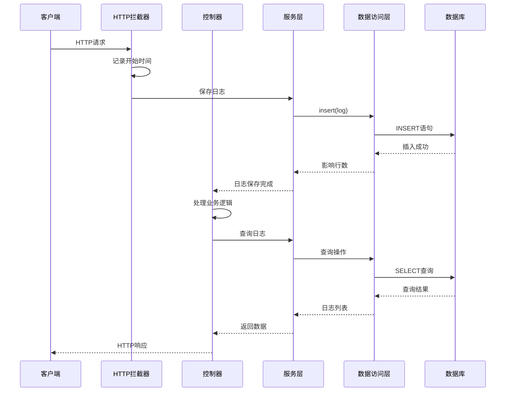
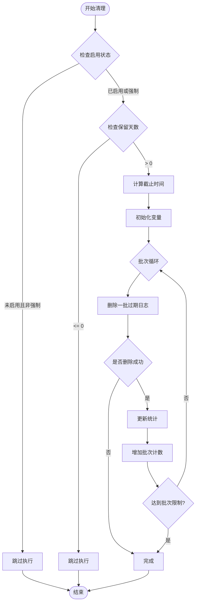
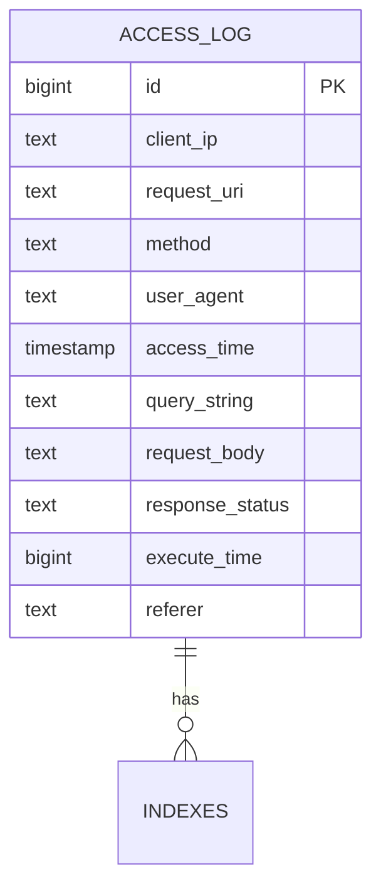
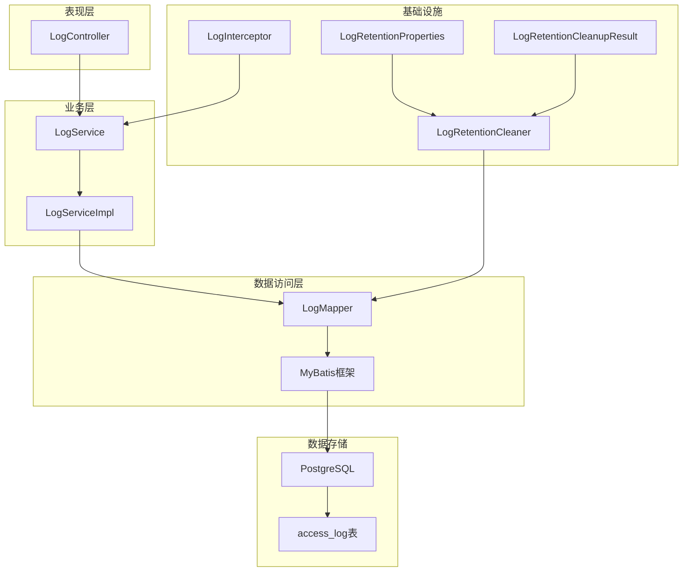

# 日志记录Mapper

**本文档引用的文件**
- [LogMapper.java](file://backend-repo/src/main/java/com/zjcxph/imgapi/mapper/LogMapper.java)
- [Log.java](file://backend-repo/src/main/java/com/zjcxph/imgapi/entity/Log.java)
- [LogServiceImpl.java](file://backend-repo/src/main/java/com/zjcxph/imgapi/service/impl/LogServiceImpl.java)
- [LogController.java](file://backend-repo/src/main/java/com/zjcxph/imgapi/controller/LogController.java)
- [LogInterceptor.java](file://backend-repo/src/main/java/com/zjcxph/imgapi/interceptors/LogInterceptor.java)
- [LogRetentionCleaner.java](file://backend-repo/src/main/java/com/zjcxph/imgapi/scheduler/LogRetentionCleaner.java)
- [LogRetentionProperties.java](file://backend-repo/src/main/java/com/zjcxph/imgapi/config/LogRetentionProperties.java)
- [LogRetentionCleanupResult.java](file://backend-repo/src/main/java/com/zjcxph/imgapi/dto/resp/LogRetentionCleanupResult.java)
- [schema-postgresql.sql](file://backend-repo/src/main/resources/schema-postgresql.sql)
- [application.properties](file://backend-repo/src/main/resources/application.properties)

## 目录
1. [简介](#简介)
2. [项目结构](#项目结构)
3. [核心组件](#核心组件)
4. [架构概览](#架构概览)
5. [详细组件分析](#详细组件分析)
6. [依赖关系分析](#依赖关系分析)
7. [性能考虑](#性能考虑)
8. [故障排除指南](#故障排除指南)
9. [结论](#结论)
10. [附录](#附录)

## 简介

本文档详细介绍了MRR（Medical Record Repository）系统中日志记录Mapper的设计与实现。该系统采用Spring Boot + MyBatis技术栈，实现了完整的访问日志记录、查询和清理功能。日志记录Mapper作为数据访问层的核心组件，负责系统访问日志的持久化存储、检索查询和生命周期管理。

系统通过HTTP拦截器自动捕获所有HTTP请求的访问信息，包括客户端IP、请求URI、HTTP方法、用户代理、响应状态等关键信息。这些日志信息被结构化存储在PostgreSQL数据库中，支持复杂的查询过滤和分页检索。

## 项目结构

日志记录功能在MRR项目中的组织结构如下：

**图表来源**
- [LogController.java:32-54](file://backend-repo/src/main/java/com/zjcxph/imgapi/controller/LogController.java#L32-L54)
- [LogServiceImpl.java:11-15](file://backend-repo/src/main/java/com/zjcxph/imgapi/service/impl/LogServiceImpl.java#L11-L15)
- [LogMapper.java:9-27](file://backend-repo/src/main/java/com/zjcxph/imgapi/mapper/LogMapper.java#L9-L27)

**章节来源**
- [LogController.java:1-245](file://backend-repo/src/main/java/com/zjcxph/imgapi/controller/LogController.java#L1-L245)
- [LogServiceImpl.java:1-71](file://backend-repo/src/main/java/com/zjcxph/imgapi/service/impl/LogServiceImpl.java#L1-L71)
- [LogMapper.java:1-166](file://backend-repo/src/main/java/com/zjcxph/imgapi/mapper/LogMapper.java#L1-L166)

## 核心组件

### LogMapper接口设计

LogMapper是日志记录功能的核心数据访问接口，采用MyBatis注解方式定义了完整的CRUD操作：

#### 数据模型映射
- **基础列映射**：包含客户端IP、请求URI、HTTP方法、用户代理、访问时间、查询字符串、请求体、响应状态、执行时间、Referer等字段
- **命名空间**：`access_log`表，主键自增
- **数据类型**：支持PostgreSQL的完整数据类型映射

#### 核心操作方法

1. **插入操作** (`insert`)
   - 支持自动生成主键
   - 返回受影响的行数

2. **查询操作** (`findAll`, `findByClientIp`, `findByRequestUri`, `findById`)
   - 支持分页查询
   - 按访问时间降序排列
   - 支持按客户端IP和请求URI精确匹配

3. **搜索操作** (`search`)
   - 支持多字段模糊搜索
   - 支持多种过滤条件组合
   - 支持时间范围查询

4. **清理操作** (`deleteOlderThan`, `countOlderThan`, `findOlderThan`)
   - 基于时间阈值的批量删除
   - 支持分页导出过期日志

**章节来源**
- [LogMapper.java:10-165](file://backend-repo/src/main/java/com/zjcxph/imgapi/mapper/LogMapper.java#L10-L165)

### Log实体类结构

Log实体类采用Lombok注解简化代码，包含以下核心字段：

- **标识字段**：`id` (Long)
- **网络信息**：`clientIp` (String)
- **请求信息**：`requestUri` (String), `method` (String)
- **用户代理**：`userAgent` (String)
- **时间戳**：`accessTime` (Date)
- **请求参数**：`queryString` (String), `requestBody` (String)
- **响应信息**：`responseStatus` (String), `executeTime` (Long)
- **导航信息**：`referer` (String)

**章节来源**
- [Log.java:7-138](file://backend-repo/src/main/java/com/zjcxph/imgapi/entity/Log.java#L7-L138)

## 架构概览

系统采用分层架构设计，确保关注点分离和职责明确：

**图表来源**
- [LogInterceptor.java:36-58](file://backend-repo/src/main/java/com/zjcxph/imgapi/interceptors/LogInterceptor.java#L36-L58)
- [LogController.java:56-63](file://backend-repo/src/main/java/com/zjcxph/imgapi/controller/LogController.java#L56-L63)
- [LogServiceImpl.java:17-20](file://backend-repo/src/main/java/com/zjcxph/imgapi/service/impl/LogServiceImpl.java#L17-L20)

**章节来源**
- [LogInterceptor.java:1-90](file://backend-repo/src/main/java/com/zjcxph/imgapi/interceptors/LogInterceptor.java#L1-L90)
- [LogController.java:32-245](file://backend-repo/src/main/java/com/zjcxph/imgapi/controller/LogController.java#L32-L245)

## 详细组件分析

### HTTP拦截器实现

LogInterceptor负责自动捕获HTTP请求的访问信息，实现零侵入的日志记录：

#### 请求处理流程
1. **预处理阶段** (`preHandle`)
   - 跳过特定类型的请求（如OPTIONS、静态资源）
   - 记录请求开始时间
   - 设置请求属性用于后续处理

2. **后处理阶段** (`afterCompletion`)
   - 计算请求执行时间
   - 构建Log对象
   - 调用服务层保存日志

#### 过滤规则
- 跳过OPTIONS预检请求
- 跳过静态资源请求
- 跳过Swagger文档请求
- 跳过Actuator监控请求
- 跳过favicon.ico和错误页面

**章节来源**
- [LogInterceptor.java:15-89](file://backend-repo/src/main/java/com/zjcxph/imgapi/interceptors/LogInterceptor.java#L15-L89)

### 日志查询功能

系统提供了多层次的日志查询能力：

#### 基础查询
- **全部日志**：支持分页查询，按时间倒序排列
- **按客户端IP**：支持按IP地址精确匹配
- **按请求URI**：支持按URL路径精确匹配
- **按ID查询**：支持单条记录查询

#### 高级搜索
- **关键字搜索**：支持在多个字段中进行模糊匹配
- **多条件组合**：支持IP、URI、HTTP方法、响应状态等条件组合
- **时间范围查询**：支持起始时间和结束时间范围

#### 分页优化
- **最大页大小限制**：防止过大请求影响性能
- **偏移量计算**：基于页码和大小计算偏移量
- **索引优化**：利用数据库索引提升查询性能

**章节来源**
- [LogServiceImpl.java:27-69](file://backend-repo/src/main/java/com/zjcxph/imgapi/service/impl/LogServiceImpl.java#L27-L69)
- [LogController.java:65-202](file://backend-repo/src/main/java/com/zjcxph/imgapi/controller/LogController.java#L65-L202)

### 日志清理策略

系统实现了智能的日志保留和清理机制：

#### 清理算法

**图表来源**
- [LogRetentionCleaner.java:39-117](file://backend-repo/src/main/java/com/zjcxph/imgapi/scheduler/LogRetentionCleaner.java#L39-L117)

#### 批量处理策略
- **批大小控制**：默认每批删除5000条记录
- **批次限制**：默认最多执行20个批次
- **渐进式清理**：避免一次性删除大量数据造成性能问题
- **剩余检查**：清理完成后检查剩余过期数据

#### 导出功能
- **CSV格式导出**：支持导出过期日志到CSV文件
- **流式传输**：避免内存溢出，支持大文件导出
- **进度跟踪**：提供总记录数和导出进度信息

**章节来源**
- [LogRetentionCleaner.java:14-119](file://backend-repo/src/main/java/com/zjcxph/imgapi/scheduler/LogRetentionCleaner.java#L14-L119)
- [LogController.java:108-148](file://backend-repo/src/main/java/com/zjcxph/imgapi/controller/LogController.java#L108-L148)

### 数据库设计

#### 表结构设计

**图表来源**
- [schema-postgresql.sql:61-73](file://backend-repo/src/main/resources/schema-postgresql.sql#L61-L73)

#### 索引优化
- **时间索引**：按访问时间降序排列，支持快速排序
- **复合索引**：时间+ID组合，支持高效分页
- **字段索引**：IP、URI、方法、响应状态等常用查询字段
- **组合索引**：方法+响应状态，支持复杂查询

**章节来源**
- [schema-postgresql.sql:83-89](file://backend-repo/src/main/resources/schema-postgresql.sql#L83-L89)

## 依赖关系分析

系统各组件之间的依赖关系清晰明确：

**图表来源**
- [LogController.java:39-53](file://backend-repo/src/main/java/com/zjcxph/imgapi/controller/LogController.java#L39-L53)
- [LogServiceImpl.java:14-15](file://backend-repo/src/main/java/com/zjcxph/imgapi/service/impl/LogServiceImpl.java#L14-L15)
- [LogRetentionCleaner.java:18-24](file://backend-repo/src/main/java/com/zjcxph/imgapi/scheduler/LogRetentionCleaner.java#L18-L24)

**章节来源**
- [LogController.java:1-245](file://backend-repo/src/main/java/com/zjcxph/imgapi/controller/LogController.java#L1-L245)
- [LogServiceImpl.java:1-71](file://backend-repo/src/main/java/com/zjcxph/imgapi/service/impl/LogServiceImpl.java#L1-L71)
- [LogRetentionCleaner.java:1-119](file://backend-repo/src/main/java/com/zjcxph/imgapi/scheduler/LogRetentionCleaner.java#L1-L119)

## 性能考虑

### 查询性能优化

#### 索引策略
- **主索引**：按访问时间降序排列，支持快速排序和分页
- **辅助索引**：针对常用查询条件建立索引
- **复合索引**：优化复杂查询场景

#### 查询优化
- **分页限制**：防止超大页大小影响性能
- **条件优化**：合理使用LIKE和精确匹配
- **字段选择**：仅查询必要字段，减少数据传输

### 存储性能优化

#### 批量操作
- **批量删除**：避免单条删除的开销
- **批量查询**：减少数据库往返次数
- **事务管理**：合理使用事务提高效率

#### 内存管理
- **流式处理**：大文件导出时使用流式处理
- **分批处理**：避免一次性加载大量数据

## 故障排除指南

### 常见问题及解决方案

#### 日志记录失败
1. **检查数据库连接**
   - 验证数据源配置
   - 确认数据库服务正常运行

2. **检查权限设置**
   - 确认数据库用户具有INSERT权限
   - 验证schema权限

#### 查询性能问题
1. **索引检查**
   - 确认相关索引存在
   - 分析查询执行计划

2. **参数优化**
   - 调整分页大小
   - 优化查询条件

#### 清理功能异常
1. **配置验证**
   - 检查清理配置参数
   - 确认定时任务启用

2. **日志分析**
   - 查看清理过程日志
   - 分析错误原因

**章节来源**
- [LogRetentionCleaner.java:110-117](file://backend-repo/src/main/java/com/zjcxph/imgapi/scheduler/LogRetentionCleaner.java#L110-L117)

## 结论

日志记录Mapper作为MRR系统的核心组件，实现了完整的访问日志管理功能。通过HTTP拦截器的自动化日志收集、MyBatis的数据访问层设计、以及智能的清理策略，系统提供了高效、可靠的日志管理能力。

该实现具有以下优势：
- **零侵入性**：通过拦截器自动记录，无需修改业务代码
- **高性能**：合理的索引设计和查询优化
- **可扩展性**：模块化设计便于功能扩展
- **可靠性**：完善的错误处理和监控机制

建议在生产环境中重点关注：
- 数据库性能监控
- 清理策略的定期评估
- 日志数据的安全存储
- 合规性要求的满足

## 附录

### 配置参数说明

| 参数名 | 默认值 | 说明 |
|--------|--------|------|
| `app.log-retention.enabled` | false | 是否启用日志清理功能 |
| `app.log-retention.cron` | 0 30 2 * * ? | 清理任务执行周期 |
| `app.log-retention.retention-days` | 1095 | 日志保留天数 |
| `app.log-retention.batch-size` | 5000 | 每批清理记录数 |
| `app.log-retention.max-batches-per-run` | 20 | 每次运行最大批次 |

### API接口说明

#### 日志查询接口
- **GET `/v2/logs/`** - 获取所有日志
- **GET `/v2/logs/{id}`** - 根据ID获取日志
- **GET `/v2/logs/ip/{ip}`** - 按IP查询日志
- **GET `/v2/logs/search`** - 高级搜索日志

#### 清理相关接口
- **POST `/v2/logs/retention/cleanup`** - 手动清理过期日志
- **GET `/v2/logs/retention/export`** - 导出过期日志