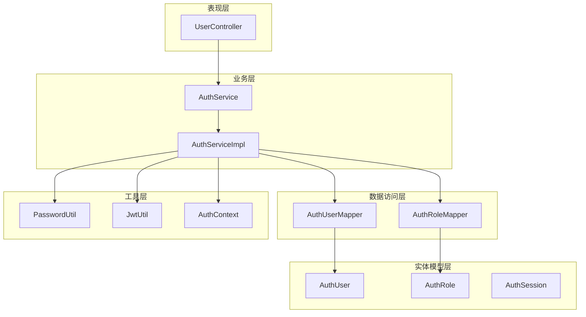
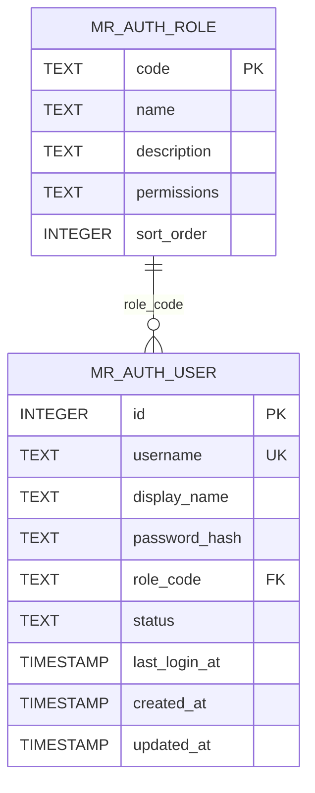
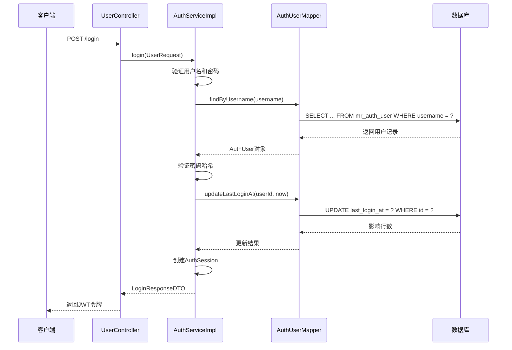
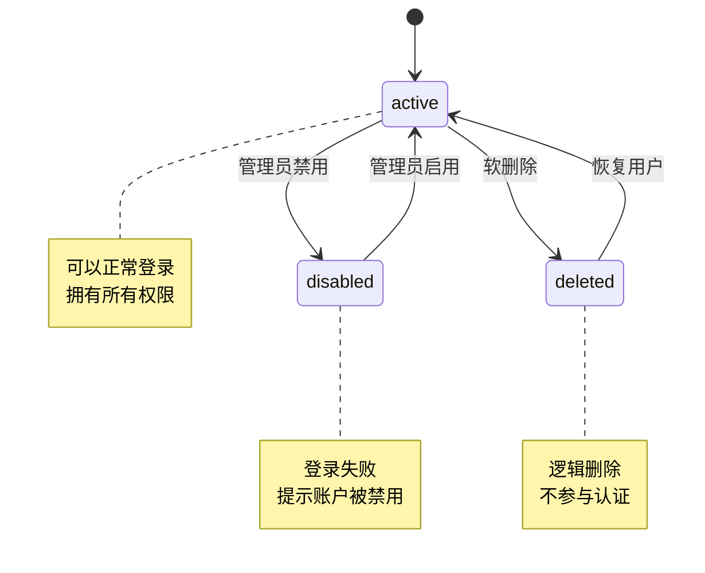
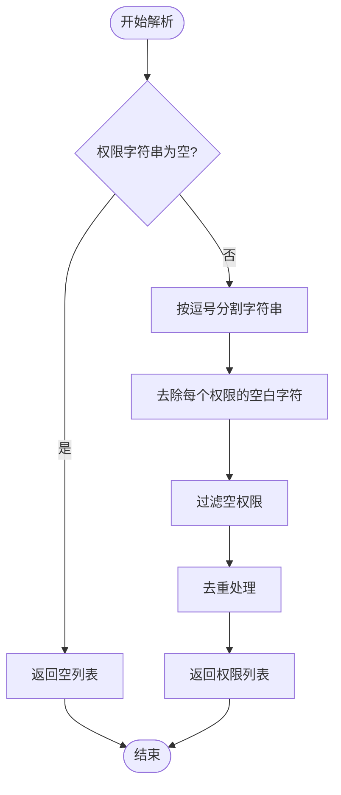
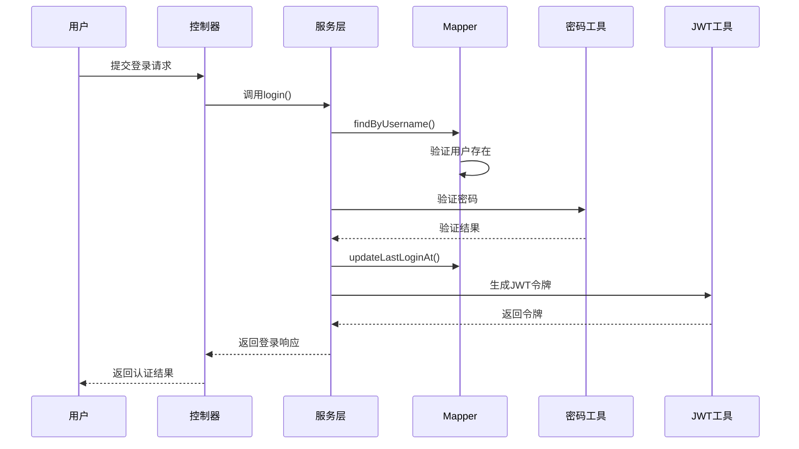
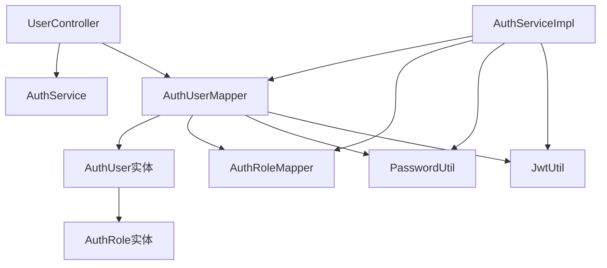

# 用户认证Mapper


**本文档引用的文件**
- [AuthUserMapper.java](file://backend-repo/src/main/java/com/zjcxph/imgapi/mapper/AuthUserMapper.java)
- [AuthUser.java](file://backend-repo/src/main/java/com/zjcxph/imgapi/entity/AuthUser.java)
- [AuthRoleMapper.java](file://backend-repo/src/main/java/com/zjcxph/imgapi/mapper/AuthRoleMapper.java)
- [AuthRole.java](file://backend-repo/src/main/java/com/zjcxph/imgapi/entity/AuthRole.java)
- [AuthServiceImpl.java](file://backend-repo/src/main/java/com/zjcxph/imgapi/service/impl/AuthServiceImpl.java)
- [AuthService.java](file://backend-repo/src/main/java/com/zjcxph/imgapi/service/AuthService.java)
- [UserController.java](file://backend-repo/src/main/java/com/zjcxph/imgapi/controller/UserController.java)
- [PasswordUtil.java](file://backend-repo/src/main/java/com/zjcxph/imgapi/utils/PasswordUtil.java)
- [JwtUtil.java](file://backend-repo/src/main/java/com/zjcxph/imgapi/utils/JwtUtil.java)
- [AuthContext.java](file://backend-repo/src/main/java/com/zjcxph/imgapi/utils/AuthContext.java)
- [schema-postgresql.sql](file://backend-repo/src/main/resources/schema-postgresql.sql)


## 目录
1. [简介](#简介)
2. [项目结构](#项目结构)
3. [核心组件](#核心组件)
4. [架构概览](#架构概览)
5. [详细组件分析](#详细组件分析)
6. [依赖关系分析](#依赖关系分析)
7. [性能考虑](#性能考虑)
8. [故障排除指南](#故障排除指南)
9. [结论](#结论)

## 简介
本文档深入分析用户认证Mapper的设计和实现，重点解释AuthUserMapper接口的数据库访问模式、用户与角色关联查询逻辑、用户状态管理和最后登录时间更新等业务逻辑。文档提供了具体的SQL查询示例和参数绑定方式，并说明了用户认证流程中的数据访问模式和性能优化策略。

## 项目结构
用户认证模块采用分层架构设计，包含数据访问层、业务服务层、控制层和实体模型层：



**图表来源**
- [UserController.java:27-95](file://backend-repo/src/main/java/com/zjcxph/imgapi/controller/UserController.java#L27-L95)
- [AuthServiceImpl.java:25-151](file://backend-repo/src/main/java/com/zjcxph/imgapi/service/impl/AuthServiceImpl.java#L25-L151)
- [AuthUserMapper.java:13-78](file://backend-repo/src/main/java/com/zjcxph/imgapi/mapper/AuthUserMapper.java#L13-L78)

**章节来源**
- [UserController.java:27-95](file://backend-repo/src/main/java/com/zjcxph/imgapi/controller/UserController.java#L27-L95)
- [AuthServiceImpl.java:25-151](file://backend-repo/src/main/java/com/zjcxph/imgapi/service/impl/AuthServiceImpl.java#L25-L151)

## 核心组件
用户认证Mapper包含以下核心组件：

### 数据库表结构
系统使用PostgreSQL数据库，包含认证相关的两个核心表：



**图表来源**
- [schema-postgresql.sql:41-59](file://backend-repo/src/main/resources/schema-postgresql.sql#L41-L59)

### 实体模型设计
用户实体包含完整的认证信息和权限管理字段：

| 字段名 | 类型 | 描述 | 是否可空 |
|--------|------|------|----------|
| id | Long | 用户唯一标识 | 否 |
| username | String | 用户名 | 否 |
| displayName | String | 显示名称 | 是 |
| passwordHash | String | 密码哈希值 | 否 |
| roleCode | String | 角色编码 | 否 |
| roleName | String | 角色名称 | 是 |
| permissionsCsv | String | 权限列表（逗号分隔） | 是 |
| status | String | 用户状态（active/disabled） | 否 |
| lastLoginAt | LocalDateTime | 最后登录时间 | 是 |
| createdAt | LocalDateTime | 创建时间 | 否 |
| updatedAt | LocalDateTime | 更新时间 | 否 |

**章节来源**
- [AuthUser.java:13-134](file://backend-repo/src/main/java/com/zjcxph/imgapi/entity/AuthUser.java#L13-L134)
- [schema-postgresql.sql:49-59](file://backend-repo/src/main/resources/schema-postgresql.sql#L49-L59)

## 架构概览
用户认证系统采用经典的三层架构模式，通过Mapper接口实现数据访问抽象：



**图表来源**
- [UserController.java:38-47](file://backend-repo/src/main/java/com/zjcxph/imgapi/controller/UserController.java#L38-L47)
- [AuthServiceImpl.java:36-62](file://backend-repo/src/main/java/com/zjcxph/imgapi/service/impl/AuthServiceImpl.java#L36-L62)
- [AuthUserMapper.java:16-29](file://backend-repo/src/main/java/com/zjcxph/imgapi/mapper/AuthUserMapper.java#L16-L29)

## 详细组件分析

### AuthUserMapper接口设计
AuthUserMapper接口定义了用户认证相关的所有数据库操作方法：

#### 查询操作
1. **按用户名查询**：支持用户登录验证
2. **按ID查询**：支持用户信息获取和更新操作
3. **查询所有用户**：支持用户列表展示

#### 更新操作
1. **更新最后登录时间**：记录用户活跃状态
2. **更新用户信息**：支持用户资料修改
3. **更新用户状态**：支持账户启用/禁用

#### 插入操作
1. **新增用户**：支持用户注册和系统初始化

**章节来源**
- [AuthUserMapper.java:14-78](file://backend-repo/src/main/java/com/zjcxph/imgapi/mapper/AuthUserMapper.java#L14-L78)

### SQL查询语义分析

#### 关联查询逻辑
AuthUserMapper使用LEFT JOIN连接用户表和角色表，确保即使用户没有分配角色也能正常查询：

```sql
SELECT 
    u.id as id,
    u.username as username,
    u.display_name as displayName,
    u.password_hash as passwordHash,
    u.role_code as roleCode,
    r.name as roleName,
    r.permissions as permissionsCsv,
    u.status as status,
    u.last_login_at as lastLoginAt
FROM mr_auth_user u
LEFT JOIN mr_auth_role r ON r.code = u.role_code
WHERE u.username = #{username}
```

**字段映射关系**：
- 用户表字段直接映射到AuthUser实体属性
- 角色表字段通过别名映射到AuthUser的roleName和permissionsCsv属性
- LEFT JOIN确保即使角色信息缺失也能返回用户基本信息

#### 参数绑定方式
- 使用MyBatis注解参数绑定
- 支持@Param注解指定SQL参数名称
- 自动处理Java类型与数据库类型的转换

**章节来源**
- [AuthUserMapper.java:16-59](file://backend-repo/src/main/java/com/zjcxph/imgapi/mapper/AuthUserMapper.java#L16-L59)

### 用户状态管理
系统实现了完整的用户状态管理机制：



**图表来源**
- [AuthUserMapper.java:71-72](file://backend-repo/src/main/java/com/zjcxph/imgapi/mapper/AuthUserMapper.java#L71-L72)
- [AuthServiceImpl.java:49-51](file://backend-repo/src/main/java/com/zjcxph/imgapi/service/impl/AuthServiceImpl.java#L49-L51)

### 权限管理系统
权限通过CSV格式存储在角色表中，用户实体提供权限解析功能：

#### 权限存储结构
- 角色表存储逗号分隔的权限列表
- 用户实体提供权限字符串解析为`List<String>`
- 支持权限存在性检查

#### 权限解析流程


**图表来源**
- [AuthUser.java:116-128](file://backend-repo/src/main/java/com/zjcxph/imgapi/entity/AuthUser.java#L116-L128)
- [AuthServiceImpl.java:136-145](file://backend-repo/src/main/java/com/zjcxph/imgapi/service/impl/AuthServiceImpl.java#L136-L145)

**章节来源**
- [AuthUser.java:116-132](file://backend-repo/src/main/java/com/zjcxph/imgapi/entity/AuthUser.java#L116-L132)
- [AuthRole.java:6-53](file://backend-repo/src/main/java/com/zjcxph/imgapi/entity/AuthRole.java#L6-L53)

### 认证流程实现

#### 登录认证流程


**图表来源**
- [AuthServiceImpl.java:36-62](file://backend-repo/src/main/java/com/zjcxph/imgapi/service/impl/AuthServiceImpl.java#L36-L62)
- [PasswordUtil.java:17-22](file://backend-repo/src/main/java/com/zjcxph/imgapi/utils/PasswordUtil.java#L17-L22)

**章节来源**
- [AuthServiceImpl.java:36-62](file://backend-repo/src/main/java/com/zjcxph/imgapi/service/impl/AuthServiceImpl.java#L36-L62)
- [PasswordUtil.java:10-22](file://backend-repo/src/main/java/com/zjcxph/imgapi/utils/PasswordUtil.java#L10-L22)

### 数据访问模式

#### 查询模式
1. **单对象查询**：findByUsername()和findById()
2. **集合查询**：findAll()
3. **关联查询**：通过LEFT JOIN获取用户角色信息

#### 更新模式
1. **条件更新**：基于用户ID的精确更新
2. **部分更新**：updateUser()支持选择性字段更新
3. **状态更新**：独立的状态管理接口

#### 插入模式
1. **完整实体插入**：insertUser()支持新用户创建
2. **默认值处理**：数据库层面设置默认状态和时间戳

**章节来源**
- [AuthUserMapper.java:16-76](file://backend-repo/src/main/java/com/zjcxph/imgapi/mapper/AuthUserMapper.java#L16-L76)

## 依赖关系分析

### 组件耦合度分析


**图表来源**
- [AuthUserMapper.java:3-11](file://backend-repo/src/main/java/com/zjcxph/imgapi/mapper/AuthUserMapper.java#L3-L11)
- [AuthServiceImpl.java:28-34](file://backend-repo/src/main/java/com/zjcxph/imgapi/service/impl/AuthServiceImpl.java#L28-L34)

### 外部依赖
- **MyBatis框架**：提供ORM映射和SQL执行
- **PostgreSQL数据库**：支持事务和索引优化
- **JWT库**：提供令牌生成和验证
- **Apache Commons Codec**：提供SHA-256加密

**章节来源**
- [AuthUserMapper.java:4-8](file://backend-repo/src/main/java/com/zjcxph/imgapi/mapper/AuthUserMapper.java#L4-L8)
- [PasswordUtil.java:3](file://backend-repo/src/main/java/com/zjcxph/imgapi/utils/PasswordUtil.java#L3)

## 性能考虑

### 数据库优化策略
1. **索引优化**
   - 用户名唯一索引：支持快速用户名查找
   - 角色代码索引：优化LEFT JOIN性能
   - 时间戳索引：支持登录时间查询

2. **查询优化**
   - 使用LEFT JOIN避免内连接的严格约束
   - 选择性字段查询，避免SELECT *
   - 参数化查询防止SQL注入

3. **缓存策略**
   - JWT令牌缓存：减少重复计算
   - 用户会话缓存：ThreadLocal存储当前用户

### 性能基准
- **查询性能**：基于索引的用户名查询接近O(log n)
- **连接性能**：LEFT JOIN在小数据集上性能优异
- **内存使用**：实体对象轻量级设计，避免不必要的字段加载

### 安全优化
- **密码安全**：SHA-256哈希存储，不可逆加密
- **令牌安全**：24小时过期时间，环境变量配置密钥
- **输入验证**：服务层进行参数验证和清理

**章节来源**
- [schema-postgresql.sql:81-82](file://backend-repo/src/main/resources/schema-postgresql.sql#L81-L82)
- [JwtUtil.java:14-17](file://backend-repo/src/main/java/com/zjcxph/imgapi/utils/JwtUtil.java#L14-L17)

## 故障排除指南

### 常见问题诊断

#### 登录失败问题
1. **用户名不存在**：检查用户名是否正确，确认用户已创建
2. **密码错误**：验证密码哈希算法一致性
3. **账户禁用**：检查用户状态字段值

#### 权限不足问题
1. **角色权限缺失**：确认角色表中权限列表完整性
2. **权限解析错误**：检查CSV格式和权限字符串处理
3. **会话过期**：验证JWT令牌有效期

#### 数据库连接问题
1. **表结构不匹配**：确认数据库迁移脚本执行情况
2. **索引缺失**：检查必要的数据库索引是否存在
3. **事务冲突**：分析并发访问时的数据一致性

### 调试建议
1. **启用SQL日志**：观察实际执行的SQL语句
2. **检查实体映射**：验证字段名称和类型映射
3. **测试边界条件**：验证空值和特殊字符处理

**章节来源**
- [AuthServiceImpl.java:41-54](file://backend-repo/src/main/java/com/zjcxph/imgapi/service/impl/AuthServiceImpl.java#L41-L54)
- [AuthUserMapper.java:61-62](file://backend-repo/src/main/java/com/zjcxph/imgapi/mapper/AuthUserMapper.java#L61-L62)

## 结论
用户认证Mapper设计合理，实现了清晰的职责分离和良好的扩展性。通过LEFT JOIN关联查询、完善的权限管理、安全的密码处理和高效的数据库访问模式，构建了一个健壮的用户认证系统。建议在生产环境中重点关注数据库索引优化、JWT密钥管理和密码策略的安全性配置。