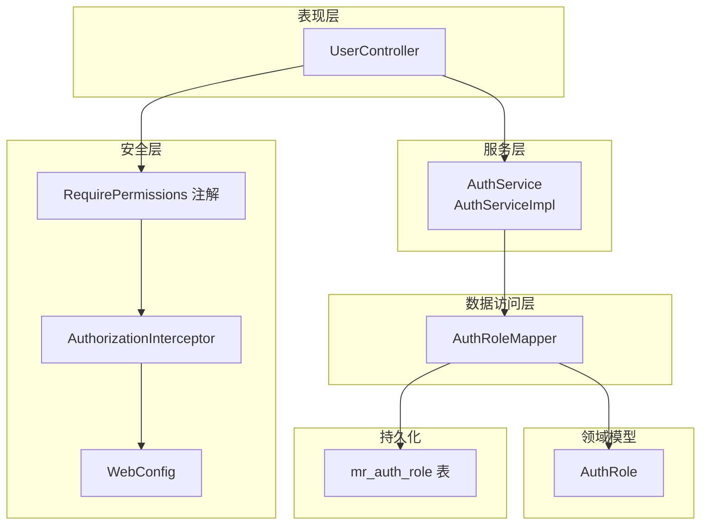
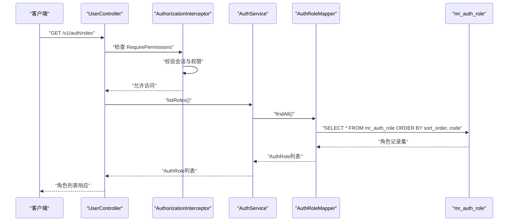
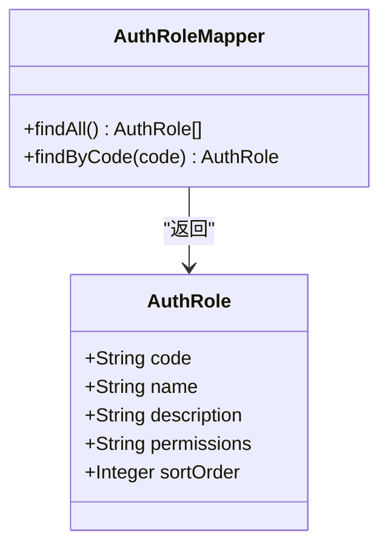
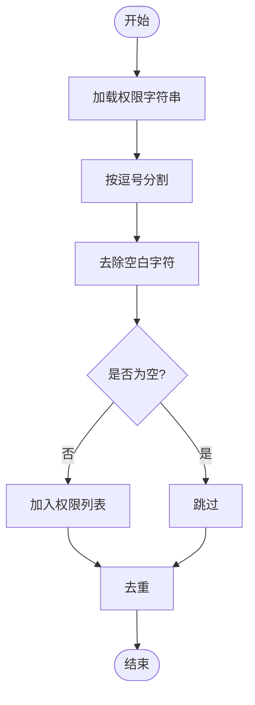
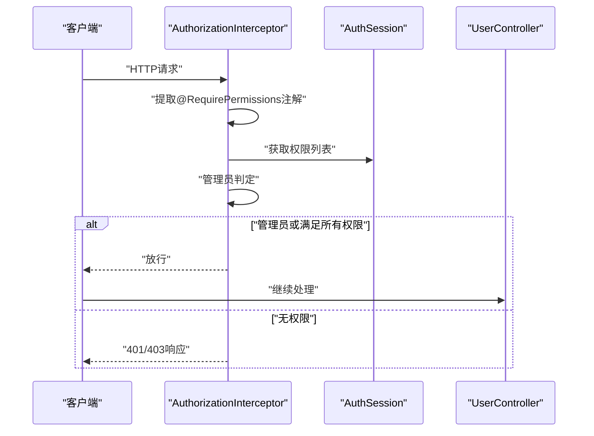
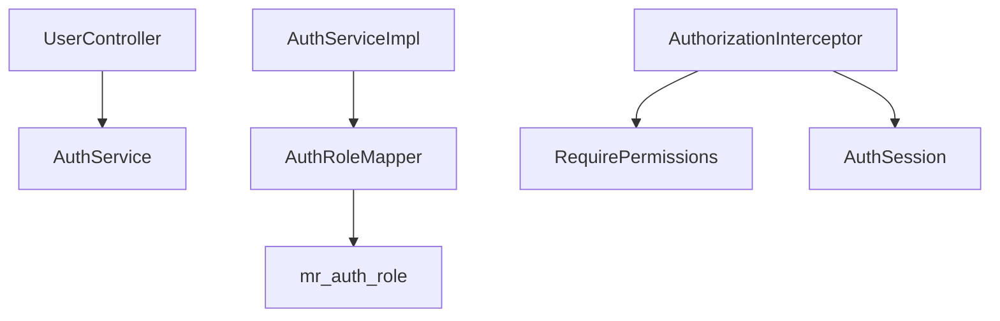

# 角色权限Mapper

**本文档引用的文件**
- [AuthRoleMapper.java](file://backend-repo/src/main/java/com/zjcxph/imgapi/mapper/AuthRoleMapper.java)
- [AuthRole.java](file://backend-repo/src/main/java/com/zjcxph/imgapi/entity/AuthRole.java)
- [AuthService.java](file://backend-repo/src/main/java/com/zjcxph/imgapi/service/AuthService.java)
- [AuthServiceImpl.java](file://backend-repo/src/main/java/com/zjcxph/imgapi/service/impl/AuthServiceImpl.java)
- [AuthUser.java](file://backend-repo/src/main/java/com/zjcxph/imgapi/entity/AuthUser.java)
- [AuthSession.java](file://backend-repo/src/main/java/com/zjcxph/imgapi/common/AuthSession.java)
- [RequirePermissions.java](file://backend-repo/src/main/java/com/zjcxph/imgapi/annotation/RequirePermissions.java)
- [AuthorizationInterceptor.java](file://backend-repo/src/main/java/com/zjcxph/imgapi/interceptors/AuthorizationInterceptor.java)
- [WebConfig.java](file://backend-repo/src/main/java/com/zjcxph/imgapi/config/WebConfig.java)
- [UserController.java](file://backend-repo/src/main/java/com/zjcxph/imgapi/controller/UserController.java)
- [schema.sql](file://mrr-db/schema.sql)

## 目录
1. [简介](#简介)
2. [项目结构](#项目结构)
3. [核心组件](#核心组件)
4. [架构概览](#架构概览)
5. [详细组件分析](#详细组件分析)
6. [依赖关系分析](#依赖关系分析)
7. [性能考量](#性能考量)
8. [故障排除指南](#故障排除指南)
9. [结论](#结论)

## 简介
本文件为角色权限Mapper的技术文档，重点阐述AuthRoleMapper接口的设计与实现，包括角色查询与权限管理的SQL操作、角色权限存储结构与权限字符串处理方式、角色状态管理与权限分配的业务逻辑，并提供角色权限查询的具体SQL示例与权限验证流程说明，以及权限控制在系统中的应用与安全考虑。

## 项目结构
后端采用分层架构，角色权限相关的核心代码位于以下层次：
- 数据访问层：AuthRoleMapper接口及对应的MyBatis注解SQL
- 领域模型层：AuthRole实体类
- 服务层：AuthService接口与AuthServiceImpl实现
- 控制器层：UserController中对权限注解的使用
- 安全拦截层：AuthorizationInterceptor基于注解进行权限校验
- 配置层：WebConfig注册拦截器
- 数据库层：schema.sql定义mr_auth_role表结构与初始数据

**图表来源**
- [AuthRoleMapper.java:10-18](file://backend-repo/src/main/java/com/zjcxph/imgapi/mapper/AuthRoleMapper.java#L10-L18)
- [AuthServiceImpl.java:25-34](file://backend-repo/src/main/java/com/zjcxph/imgapi/service/impl/AuthServiceImpl.java#L25-L34)
- [UserController.java:27-94](file://backend-repo/src/main/java/com/zjcxph/imgapi/controller/UserController.java#L27-L94)
- [AuthorizationInterceptor.java:17-77](file://backend-repo/src/main/java/com/zjcxph/imgapi/interceptors/AuthorizationInterceptor.java#L17-L77)
- [WebConfig.java:35-59](file://backend-repo/src/main/java/com/zjcxph/imgapi/config/WebConfig.java#L35-L59)
- [schema.sql:58-87](file://mrr-db/schema.sql#L58-L87)

**章节来源**
- [AuthRoleMapper.java:10-18](file://backend-repo/src/main/java/com/zjcxph/imgapi/mapper/AuthRoleMapper.java#L10-L18)
- [AuthRole.java:5-52](file://backend-repo/src/main/java/com/zjcxph/imgapi/entity/AuthRole.java#L5-L52)
- [schema.sql:58-87](file://mrr-db/schema.sql#L58-L87)

## 核心组件
- AuthRoleMapper接口：定义角色查询方法，包含查询所有角色与按角色编码查询单个角色的SQL映射。
- AuthRole实体：封装角色的code、name、description、permissions、sortOrder字段。
- AuthService与AuthServiceImpl：提供listRoles方法，调用AuthRoleMapper获取角色列表。
- 权限注解与拦截器：RequirePermissions用于声明式权限控制，AuthorizationInterceptor在请求进入控制器前进行权限校验。
- 数据库表mr_auth_role：存储角色基本信息与权限字符串，包含主键code、名称、描述、权限字符串、排序等字段。

**章节来源**
- [AuthRoleMapper.java:10-18](file://backend-repo/src/main/java/com/zjcxph/imgapi/mapper/AuthRoleMapper.java#L10-L18)
- [AuthRole.java:5-52](file://backend-repo/src/main/java/com/zjcxph/imgapi/entity/AuthRole.java#L5-L52)
- [AuthService.java:12-24](file://backend-repo/src/main/java/com/zjcxph/imgapi/service/AuthService.java#L12-L24)
- [AuthServiceImpl.java:102-105](file://backend-repo/src/main/java/com/zjcxph/imgapi/service/impl/AuthServiceImpl.java#L102-L105)
- [RequirePermissions.java:8-12](file://backend-repo/src/main/java/com/zjcxph/imgapi/annotation/RequirePermissions.java#L8-L12)
- [AuthorizationInterceptor.java:17-77](file://backend-repo/src/main/java/com/zjcxph/imgapi/interceptors/AuthorizationInterceptor.java#L17-L77)
- [schema.sql:58-87](file://mrr-db/schema.sql#L58-L87)

## 架构概览
角色权限Mapper在整体架构中的交互流程如下：
- 控制器层通过注解声明所需权限
- 拦截器在请求到达控制器前进行权限校验
- 服务层调用AuthRoleMapper查询角色信息
- 数据访问层执行SQL并返回实体对象
- 实体对象被转换为前端可展示的数据结构

**图表来源**
- [UserController.java:66-71](file://backend-repo/src/main/java/com/zjcxph/imgapi/controller/UserController.java#L66-L71)
- [AuthorizationInterceptor.java:22-56](file://backend-repo/src/main/java/com/zjcxph/imgapi/interceptors/AuthorizationInterceptor.java#L22-L56)
- [AuthServiceImpl.java:102-105](file://backend-repo/src/main/java/com/zjcxph/imgapi/service/impl/AuthServiceImpl.java#L102-L105)
- [AuthRoleMapper.java:13-14](file://backend-repo/src/main/java/com/zjcxph/imgapi/mapper/AuthRoleMapper.java#L13-L14)
- [schema.sql:58-87](file://mrr-db/schema.sql#L58-L87)

## 详细组件分析

### AuthRoleMapper接口设计与实现
- 查询所有角色：通过注解SQL从mr_auth_role表按sort_order与code升序查询，映射到AuthRole列表。
- 按角色编码查询：根据code精确匹配查询单个角色。
- SQL特点：使用别名将数据库列映射到实体属性，确保字段一致性；排序字段保证角色展示顺序稳定。

**图表来源**
- [AuthRoleMapper.java:10-18](file://backend-repo/src/main/java/com/zjcxph/imgapi/mapper/AuthRoleMapper.java#L10-L18)
- [AuthRole.java:5-52](file://backend-repo/src/main/java/com/zjcxph/imgapi/entity/AuthRole.java#L5-L52)

**章节来源**
- [AuthRoleMapper.java:10-18](file://backend-repo/src/main/java/com/zjcxph/imgapi/mapper/AuthRoleMapper.java#L10-L18)
- [AuthRole.java:5-52](file://backend-repo/src/main/java/com/zjcxph/imgapi/entity/AuthRole.java#L5-L52)

### 角色权限存储结构与权限字符串处理
- 存储结构：mr_auth_role表包含code、name、description、permissions、sort_order字段，其中permissions为权限字符串，多个权限以逗号分隔。
- 权限字符串处理：服务层在构建AuthSession时，将用户权限字符串按逗号分割并去重，最终以`List<String>`形式存储，便于快速判断权限存在性。
- 权限验证：AuthSession提供hasPermission方法，AuthorizationInterceptor在拦截请求时对注解声明的权限进行校验。

**图表来源**
- [AuthServiceImpl.java:136-145](file://backend-repo/src/main/java/com/zjcxph/imgapi/service/impl/AuthServiceImpl.java#L136-L145)
- [AuthUser.java:116-132](file://backend-repo/src/main/java/com/zjcxph/imgapi/entity/AuthUser.java#L116-L132)
- [AuthSession.java:86-88](file://backend-repo/src/main/java/com/zjcxph/imgapi/common/AuthSession.java#L86-L88)

**章节来源**
- [schema.sql:58-65](file://mrr-db/schema.sql#L58-L65)
- [AuthServiceImpl.java:136-145](file://backend-repo/src/main/java/com/zjcxph/imgapi/service/impl/AuthServiceImpl.java#L136-L145)
- [AuthUser.java:116-132](file://backend-repo/src/main/java/com/zjcxph/imgapi/entity/AuthUser.java#L116-L132)
- [AuthSession.java:86-88](file://backend-repo/src/main/java/com/zjcxph/imgapi/common/AuthSession.java#L86-L88)

### 角色状态管理与权限分配业务逻辑
- 角色状态：mr_auth_role表未直接存储状态字段，但用户状态在mr_auth_user表中以status字段表示。登录流程中会对用户状态进行校验，间接影响角色权限的有效性。
- 权限分配：角色权限通过permissions字段集中存储，用户登录后，系统将用户所属角色的权限合并为权限列表，供后续权限校验使用。
- 业务流程：登录成功后，AuthServiceImpl将用户权限字符串解析为权限列表，并设置到AuthSession中，供拦截器与业务逻辑使用。

**章节来源**
- [schema.sql:67-78](file://mrr-db/schema.sql#L67-L78)
- [AuthServiceImpl.java:107-118](file://backend-repo/src/main/java/com/zjcxph/imgapi/service/impl/AuthServiceImpl.java#L107-L118)
- [AuthorizationInterceptor.java:43-48](file://backend-repo/src/main/java/com/zjcxph/imgapi/interceptors/AuthorizationInterceptor.java#L43-L48)

### 权限验证流程与安全考虑
- 权限声明：控制器方法使用@RequirePermissions注解声明所需权限数组。
- 拦截器校验：AuthorizationInterceptor在preHandle阶段获取注解值，若会话为管理员或包含所需权限，则放行；否则返回401或403。
- 安全策略：
  - 管理员判定：角色码为ADMIN或具备user:manage/role:manage权限即视为管理员。
  - 权限集合：要求请求声明的所有权限均需存在于会话权限列表中。
  - 会话来源：从请求属性中获取AuthSession，确保权限上下文一致。

**图表来源**
- [AuthorizationInterceptor.java:22-56](file://backend-repo/src/main/java/com/zjcxph/imgapi/interceptors/AuthorizationInterceptor.java#L22-L56)
- [RequirePermissions.java:8-12](file://backend-repo/src/main/java/com/zjcxph/imgapi/annotation/RequirePermissions.java#L8-L12)
- [AuthSession.java:81-88](file://backend-repo/src/main/java/com/zjcxph/imgapi/common/AuthSession.java#L81-L88)

**章节来源**
- [AuthorizationInterceptor.java:17-77](file://backend-repo/src/main/java/com/zjcxph/imgapi/interceptors/AuthorizationInterceptor.java#L17-L77)
- [RequirePermissions.java:8-12](file://backend-repo/src/main/java/com/zjcxph/imgapi/annotation/RequirePermissions.java#L8-L12)
- [AuthSession.java:81-88](file://backend-repo/src/main/java/com/zjcxph/imgapi/common/AuthSession.java#L81-L88)

### 具体SQL示例与查询路径
- 查询所有角色（带排序）：参考AuthRoleMapper的findAll方法SQL，该SQL从mr_auth_role表按sort_order与code升序返回所有角色。
- 按角色编码查询：参考findByCode方法SQL，按code精确匹配返回单个角色。
- 数据库初始化：schema.sql包含默认角色与权限的插入语句，可作为角色权限配置的参考模板。

**章节来源**
- [AuthRoleMapper.java:13-17](file://backend-repo/src/main/java/com/zjcxph/imgapi/mapper/AuthRoleMapper.java#L13-L17)
- [schema.sql:83-87](file://mrr-db/schema.sql#L83-L87)

## 依赖关系分析
- 组件耦合：
  - UserController依赖AuthService进行角色列表查询。
  - AuthServiceImpl依赖AuthRoleMapper执行数据库查询。
  - AuthorizationInterceptor依赖RequirePermissions注解与AuthSession进行权限校验。
- 外部依赖：
  - MyBatis注解驱动的SQL执行。
  - Spring MVC拦截器机制。
  - 数据库mr_auth_role表结构。

**图表来源**
- [UserController.java:27-94](file://backend-repo/src/main/java/com/zjcxph/imgapi/controller/UserController.java#L27-L94)
- [AuthServiceImpl.java:25-34](file://backend-repo/src/main/java/com/zjcxph/imgapi/service/impl/AuthServiceImpl.java#L25-L34)
- [AuthRoleMapper.java:10-18](file://backend-repo/src/main/java/com/zjcxph/imgapi/mapper/AuthRoleMapper.java#L10-L18)
- [AuthorizationInterceptor.java:17-77](file://backend-repo/src/main/java/com/zjcxph/imgapi/interceptors/AuthorizationInterceptor.java#L17-L77)
- [RequirePermissions.java:8-12](file://backend-repo/src/main/java/com/zjcxph/imgapi/annotation/RequirePermissions.java#L8-L12)
- [schema.sql:58-87](file://mrr-db/schema.sql#L58-L87)

**章节来源**
- [UserController.java:27-94](file://backend-repo/src/main/java/com/zjcxph/imgapi/controller/UserController.java#L27-L94)
- [AuthServiceImpl.java:25-34](file://backend-repo/src/main/java/com/zjcxph/imgapi/service/impl/AuthServiceImpl.java#L25-L34)
- [AuthRoleMapper.java:10-18](file://backend-repo/src/main/java/com/zjcxph/imgapi/mapper/AuthRoleMapper.java#L10-L18)
- [AuthorizationInterceptor.java:17-77](file://backend-repo/src/main/java/com/zjcxph/imgapi/interceptors/AuthorizationInterceptor.java#L17-L77)

## 性能考量
- SQL性能：查询角色列表时使用ORDER BY sort_order, code，建议在sort_order与code上建立合适的索引以优化排序性能。
- 权限处理：权限字符串按逗号分割并去重，时间复杂度近似O(n)，在权限数量较多时应避免频繁解析，可在会话层面缓存权限列表。
- 拦截器开销：拦截器在每个请求前执行权限校验，应尽量减少权限集合的构建与查找成本，优先使用Set等高效数据结构。

## 故障排除指南
- 登录后无法访问受保护接口：
  - 检查会话中权限列表是否正确解析，确认permissions字段格式与内容。
  - 确认@RequirePermissions注解声明的权限是否与角色permissions一致。
- 角色列表为空或排序异常：
  - 检查mr_auth_role表数据完整性与排序字段值。
  - 确认AuthRoleMapper的SQL是否正确映射到实体字段。
- 权限校验失败：
  - 排查AuthorizationInterceptor是否正确从请求属性中获取AuthSession。
  - 确认管理员判定逻辑与权限集合包含关系。

**章节来源**
- [AuthorizationInterceptor.java:37-56](file://backend-repo/src/main/java/com/zjcxph/imgapi/interceptors/AuthorizationInterceptor.java#L37-L56)
- [AuthRoleMapper.java:13-17](file://backend-repo/src/main/java/com/zjcxph/imgapi/mapper/AuthRoleMapper.java#L13-L17)
- [schema.sql:58-87](file://mrr-db/schema.sql#L58-L87)

## 结论
AuthRoleMapper通过简洁的SQL映射实现了角色信息的查询，配合服务层的权限字符串解析与拦截器的权限校验，构成了系统的角色权限管理体系。通过合理的存储结构与权限处理流程，系统能够稳定地支持角色权限的查询与验证。建议在生产环境中关注SQL索引、权限集合缓存与拦截器性能，以进一步提升系统稳定性与响应速度。