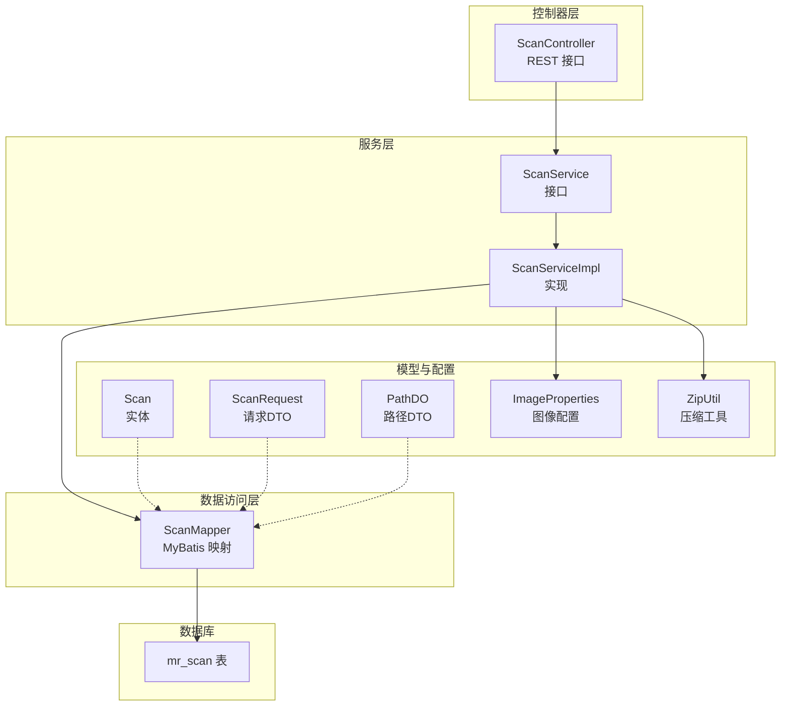
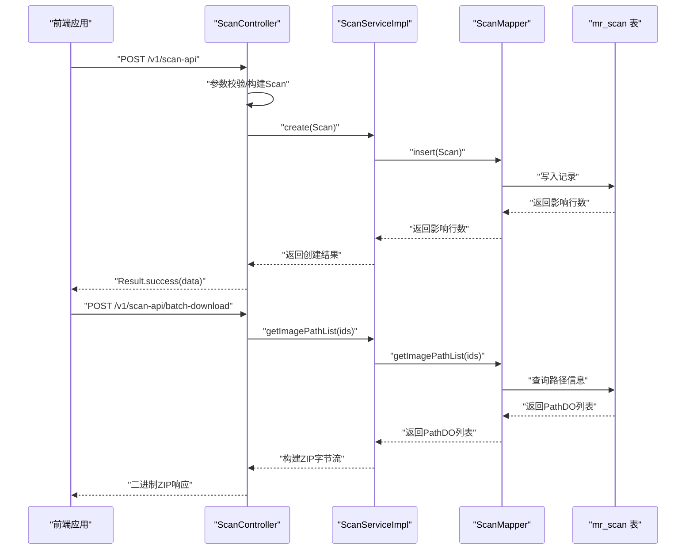
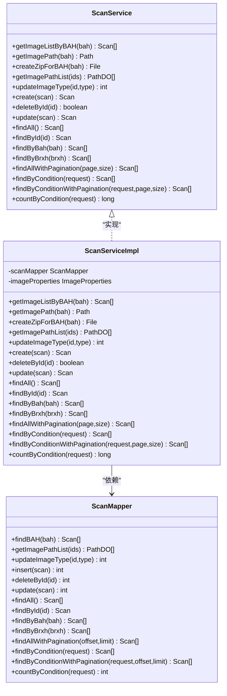
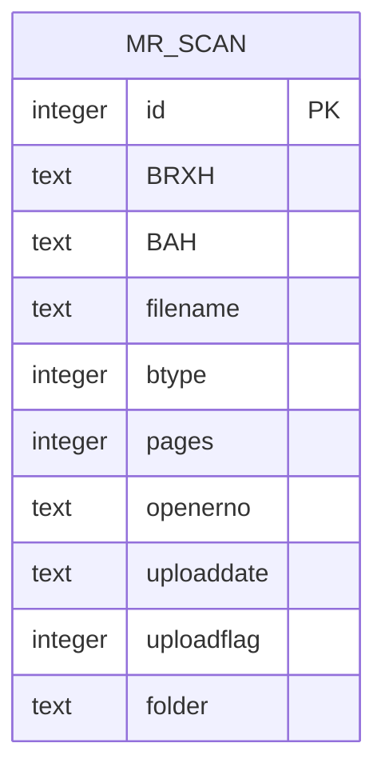
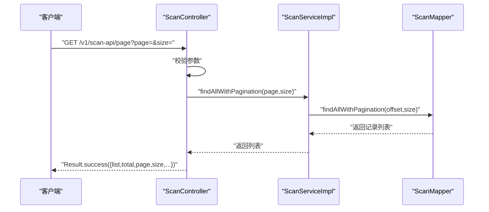
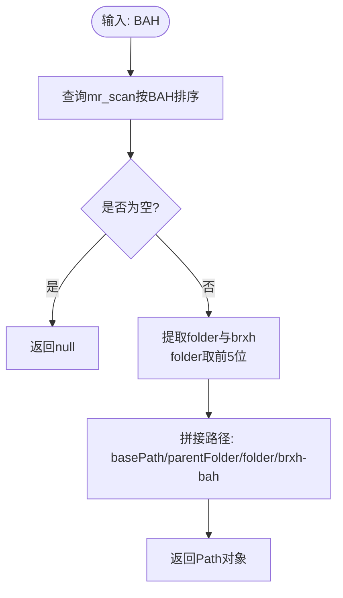
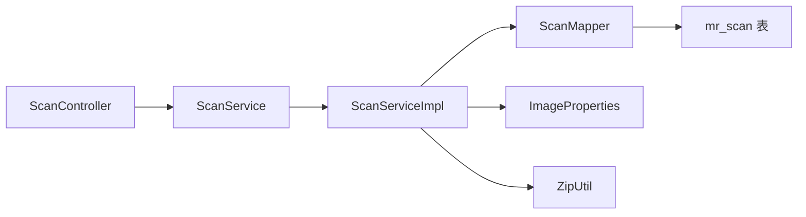

# 扫描服务

**本文引用的文件**
- [ScanService.java](file://backend-repo/src/main/java/com/zjcxph/imgapi/service/ScanService.java)
- [ScanServiceImpl.java](file://backend-repo/src/main/java/com/zjcxph/imgapi/service/impl/ScanServiceImpl.java)
- [ScanController.java](file://backend-repo/src/main/java/com/zjcxph/imgapi/controller/ScanController.java)
- [Scan.java](file://backend-repo/src/main/java/com/zjcxph/imgapi/entity/Scan.java)
- [ScanRequest.java](file://backend-repo/src/main/java/com/zjcxph/imgapi/dto/req/ScanRequest.java)
- [PathDO.java](file://backend-repo/src/main/java/com/zjcxph/imgapi/entity/PathDO.java)
- [ScanMapper.java](file://backend-repo/src/main/java/com/zjcxph/imgapi/mapper/ScanMapper.java)
- [ImageProperties.java](file://backend-repo/src/main/java/com/zjcxph/imgapi/config/ImageProperties.java)
- [ZipUtil.java](file://backend-repo/src/main/java/com/zjcxph/imgapi/utils/ZipUtil.java)
- [BusinessException.java](file://backend-repo/src/main/java/com/zjcxph/imgapi/exception/BusinessException.java)
- [schema.sql](file://mrr-db/schema.sql)
- [application.properties](file://backend-repo/src/main/resources/application.properties)
- [records.ts](file://frontend-repo/src/api/modules/records.ts)
- [ScanTest.java](file://backend-repo/src/test/java/com/zjcxph/imgapi/ScanTest.java)

## 目录
1. [简介](#简介)
2. [项目结构](#项目结构)
3. [核心组件](#核心组件)
4. [架构总览](#架构总览)
5. [详细组件分析](#详细组件分析)
6. [依赖分析](#依赖分析)
7. [性能考虑](#性能考虑)
8. [故障排查指南](#故障排查指南)
9. [结论](#结论)
10. [附录](#附录)

## 简介
本文件面向MRR项目的扫描服务，围绕ScanService接口与其实现ScanServiceImpl，系统性阐述扫描任务管理、状态跟踪与结果处理机制；深入解析扫描参数配置、扫描进度监控与扫描质量检测等核心流程；记录数据模型Scan与请求对象ScanRequest的设计；说明扫描服务与外部扫描设备的通信协议与数据传输格式；并提供异常处理策略与性能优化建议。

## 项目结构
扫描服务位于后端Java工程backend-repo中，采用典型的分层架构：
- 控制器层：ScanController对外暴露REST API，负责请求接入与响应封装
- 服务层：ScanService定义扫描领域能力，ScanServiceImpl实现具体逻辑
- 数据访问层：ScanMapper通过MyBatis映射SQL，操作mr_scan表
- 实体与DTO：Scan、ScanRequest、PathDO承载数据模型
- 配置与工具：ImageProperties提供图像存储路径配置，ZipUtil提供压缩工具
- 前端对接：records.ts提供前端调用扫描API的方法

**图表来源**
- [ScanController.java:1-333](file://backend-repo/src/main/java/com/zjcxph/imgapi/controller/ScanController.java#L1-L333)
- [ScanService.java:1-43](file://backend-repo/src/main/java/com/zjcxph/imgapi/service/ScanService.java#L1-L43)
- [ScanServiceImpl.java:1-135](file://backend-repo/src/main/java/com/zjcxph/imgapi/service/impl/ScanServiceImpl.java#L1-L135)
- [ScanMapper.java:1-131](file://backend-repo/src/main/java/com/zjcxph/imgapi/mapper/ScanMapper.java#L1-L131)
- [Scan.java:1-116](file://backend-repo/src/main/java/com/zjcxph/imgapi/entity/Scan.java#L1-L116)
- [ScanRequest.java:1-105](file://backend-repo/src/main/java/com/zjcxph/imgapi/dto/req/ScanRequest.java#L1-L105)
- [PathDO.java:1-47](file://backend-repo/src/main/java/com/zjcxph/imgapi/entity/PathDO.java#L1-L47)
- [ImageProperties.java:1-45](file://backend-repo/src/main/java/com/zjcxph/imgapi/config/ImageProperties.java#L1-L45)
- [ZipUtil.java:1-51](file://backend-repo/src/main/java/com/zjcxph/imgapi/utils/ZipUtil.java#L1-L51)
- [schema.sql:26-38](file://mrr-db/schema.sql#L26-L38)

**章节来源**
- [ScanController.java:1-333](file://backend-repo/src/main/java/com/zjcxph/imgapi/controller/ScanController.java#L1-L333)
- [ScanService.java:1-43](file://backend-repo/src/main/java/com/zjcxph/imgapi/service/ScanService.java#L1-L43)
- [ScanServiceImpl.java:1-135](file://backend-repo/src/main/java/com/zjcxph/imgapi/service/impl/ScanServiceImpl.java#L1-L135)
- [ScanMapper.java:1-131](file://backend-repo/src/main/java/com/zjcxph/imgapi/mapper/ScanMapper.java#L1-L131)
- [schema.sql:26-38](file://mrr-db/schema.sql#L26-L38)

## 核心组件
- ScanService接口：定义扫描记录的增删改查、条件查询、分页查询、批量下载路径查询、类型更新、按病案号获取图片路径与打包等能力
- ScanServiceImpl实现：承接接口，组合ScanMapper与ImageProperties，完成业务编排与数据持久化
- ScanController：REST控制器，负责参数校验、调用服务层、统一返回封装
- 数据模型：
  - Scan：mr_scan表的实体映射，包含BRXH、BAH、filename、btype、pages、openerNo、uploadDate、uploadFlag、folder等字段
  - ScanRequest：查询/筛选条件的请求DTO，字段与Scan一致，用于动态条件查询
  - PathDO：用于批量下载时返回的路径信息载体
- 配置与工具：
  - ImageProperties：读取image.basePath等配置项，提供图像根目录
  - ZipUtil：将指定目录下.jpg文件递归压缩为zip流

**章节来源**
- [ScanService.java:10-42](file://backend-repo/src/main/java/com/zjcxph/imgapi/service/ScanService.java#L10-L42)
- [ScanServiceImpl.java:16-24](file://backend-repo/src/main/java/com/zjcxph/imgapi/service/impl/ScanServiceImpl.java#L16-L24)
- [ScanController.java:41-49](file://backend-repo/src/main/java/com/zjcxph/imgapi/controller/ScanController.java#L41-L49)
- [Scan.java:10-115](file://backend-repo/src/main/java/com/zjcxph/imgapi/entity/Scan.java#L10-L115)
- [ScanRequest.java:6-31](file://backend-repo/src/main/java/com/zjcxph/imgapi/dto/req/ScanRequest.java#L6-L31)
- [PathDO.java:6-43](file://backend-repo/src/main/java/com/zjcxph/imgapi/entity/PathDO.java#L6-L43)
- [ImageProperties.java:6-43](file://backend-repo/src/main/java/com/zjcxph/imgapi/config/ImageProperties.java#L6-L43)
- [ZipUtil.java:14-49](file://backend-repo/src/main/java/com/zjcxph/imgapi/utils/ZipUtil.java#L14-L49)

## 架构总览
扫描服务遵循“控制器-服务-数据访问-数据库”的分层设计，前端通过records.ts发起HTTP请求，后端在ScanController中完成参数校验与响应封装，再委派给ScanServiceImpl执行业务逻辑，最终通过ScanMapper访问mr_scan表。

**图表来源**
- [ScanController.java:54-80](file://backend-repo/src/main/java/com/zjcxph/imgapi/controller/ScanController.java#L54-L80)
- [ScanController.java:256-281](file://backend-repo/src/main/java/com/zjcxph/imgapi/controller/ScanController.java#L256-L281)
- [ScanServiceImpl.java:73-78](file://backend-repo/src/main/java/com/zjcxph/imgapi/service/impl/ScanServiceImpl.java#L73-L78)
- [ScanMapper.java:21-27](file://backend-repo/src/main/java/com/zjcxph/imgapi/mapper/ScanMapper.java#L21-L27)
- [schema.sql:26-38](file://mrr-db/schema.sql#L26-L38)

## 详细组件分析

### 接口与实现：ScanService与ScanServiceImpl
- 能力范围
  - 基础CRUD：create、update、deleteById、findById、findAll
  - 条件查询：findByBah、findByBrxh、findByCondition、findByConditionWithPagination、countByCondition
  - 分页查询：findAllWithPagination
  - 图片路径与打包：getImagePath、createZipForBAH
  - 批量下载路径：getImagePathList
  - 类型更新：updateImageType
- 实现要点
  - 通过ScanMapper执行SQL，实现条件拼接、分页偏移计算、计数统计
  - 通过ImageProperties读取basePath，结合folder、brxh、bah生成图片目录路径
  - createZipForBAH基于ZipUtil递归压缩.jpg文件至临时zip文件
  - deleteById采用软删除策略（uploadflag置0），保持记录存在但标记失效

**图表来源**
- [ScanService.java:10-42](file://backend-repo/src/main/java/com/zjcxph/imgapi/service/ScanService.java#L10-L42)
- [ScanServiceImpl.java:16-24](file://backend-repo/src/main/java/com/zjcxph/imgapi/service/impl/ScanServiceImpl.java#L16-L24)
- [ScanMapper.java:16-129](file://backend-repo/src/main/java/com/zjcxph/imgapi/mapper/ScanMapper.java#L16-L129)

**章节来源**
- [ScanService.java:10-42](file://backend-repo/src/main/java/com/zjcxph/imgapi/service/ScanService.java#L10-L42)
- [ScanServiceImpl.java:26-134](file://backend-repo/src/main/java/com/zjcxph/imgapi/service/impl/ScanServiceImpl.java#L26-L134)
- [ScanMapper.java:17-129](file://backend-repo/src/main/java/com/zjcxph/imgapi/mapper/ScanMapper.java#L17-L129)

### 数据模型：Scan与ScanRequest
- Scan实体
  - 字段覆盖mr_scan表：id、BRXH、BAH、filename、btype、pages、openerno、uploaddate、uploadflag、folder
  - 用途：作为数据库记录的Java映射，支持全量或部分字段更新
- ScanRequest请求DTO
  - 字段与Scan一致，用于动态条件查询与分页查询
  - 用途：接收前端传入的筛选条件，经ScanMapper拼接到SQL中
- PathDO路径DTO
  - 字段：folder、filename、BRXH、BAH
  - 用途：批量下载场景下返回路径元信息，便于控制器组装ZIP

**图表来源**
- [schema.sql:26-38](file://mrr-db/schema.sql#L26-L38)
- [Scan.java:10-115](file://backend-repo/src/main/java/com/zjcxph/imgapi/entity/Scan.java#L10-L115)
- [ScanRequest.java:6-31](file://backend-repo/src/main/java/com/zjcxph/imgapi/dto/req/ScanRequest.java#L6-L31)
- [PathDO.java:6-43](file://backend-repo/src/main/java/com/zjcxph/imgapi/entity/PathDO.java#L6-L43)

**章节来源**
- [schema.sql:26-38](file://mrr-db/schema.sql#L26-L38)
- [Scan.java:10-115](file://backend-repo/src/main/java/com/zjcxph/imgapi/entity/Scan.java#L10-L115)
- [ScanRequest.java:6-31](file://backend-repo/src/main/java/com/zjcxph/imgapi/dto/req/ScanRequest.java#L6-L31)
- [PathDO.java:6-43](file://backend-repo/src/main/java/com/zjcxph/imgapi/entity/PathDO.java#L6-L43)

### 控制器：ScanController
- 主要职责
  - 统一参数校验与错误处理
  - 将请求转换为Scan或ScanRequest对象
  - 调用ScanService执行业务，并封装Result响应
  - 批量下载：根据ids查询路径，组装ZIP并以二进制流返回
- 关键流程
  - 创建/更新/删除：构造Scan对象，调用对应服务方法
  - 条件查询：接收ScanRequest，调用服务层动态查询与分页查询
  - 批量下载：调用getImagePathList获取PathDO列表，逐个读取文件并写入ZIP输出流

**图表来源**
- [ScanController.java:200-221](file://backend-repo/src/main/java/com/zjcxph/imgapi/controller/ScanController.java#L200-L221)
- [ScanServiceImpl.java:114-117](file://backend-repo/src/main/java/com/zjcxph/imgapi/service/impl/ScanServiceImpl.java#L114-L117)
- [ScanMapper.java:77-78](file://backend-repo/src/main/java/com/zjcxph/imgapi/mapper/ScanMapper.java#L77-L78)

**章节来源**
- [ScanController.java:54-80](file://backend-repo/src/main/java/com/zjcxph/imgapi/controller/ScanController.java#L54-L80)
- [ScanController.java:104-138](file://backend-repo/src/main/java/com/zjcxph/imgapi/controller/ScanController.java#L104-L138)
- [ScanController.java:223-254](file://backend-repo/src/main/java/com/zjcxph/imgapi/controller/ScanController.java#L223-L254)
- [ScanController.java:256-281](file://backend-repo/src/main/java/com/zjcxph/imgapi/controller/ScanController.java#L256-L281)

### 扫描参数配置与路径解析
- 配置项
  - image.basePath：图像文件根目录，默认值来自application.properties
  - image.url、image.username、image.password：用于外部图像服务访问（代码中存在配置类但控制器未直接使用）
- 路径解析规则
  - 输入：BAH（病案号）
  - 步骤：从mr_scan查询第一条记录，提取folder（如“YY.MM.DD”）、brxh；取folder前5位作为父目录；拼接为“{basePath}/{parentFolder}/{folder}/{brxh}-{bah}”
  - 输出：Path对象，指向该BAH对应的图片目录

**图表来源**
- [ScanServiceImpl.java:32-46](file://backend-repo/src/main/java/com/zjcxph/imgapi/service/impl/ScanServiceImpl.java#L32-L46)
- [application.properties:33](file://backend-repo/src/main/resources/application.properties#L33)
- [ImageProperties.java:37-43](file://backend-repo/src/main/java/com/zjcxph/imgapi/config/ImageProperties.java#L37-L43)

**章节来源**
- [ScanServiceImpl.java:32-46](file://backend-repo/src/main/java/com/zjcxph/imgapi/service/impl/ScanServiceImpl.java#L32-L46)
- [application.properties:33](file://backend-repo/src/main/resources/application.properties#L33)
- [ImageProperties.java:37-43](file://backend-repo/src/main/java/com/zjcxph/imgapi/config/ImageProperties.java#L37-L43)

### 扫描进度监控与质量检测
- 进度监控
  - 通过pages字段表示扫描页数，可用于估算整体进度
  - 通过uploadflag字段实现逻辑删除与状态跟踪
- 质量检测
  - 仅压缩.jpg文件，过滤非jpg文件，避免无效文件进入打包
  - 批量下载时对缺失文件进行跳过与告警，保证流程稳健

**章节来源**
- [Scan.java:16](file://backend-repo/src/main/java/com/zjcxph/imgapi/entity/Scan.java#L16)
- [ScanServiceImpl.java:50-60](file://backend-repo/src/main/java/com/zjcxph/imgapi/service/impl/ScanServiceImpl.java#L50-L60)
- [ZipUtil.java:23-49](file://backend-repo/src/main/java/com/zjcxph/imgapi/utils/ZipUtil.java#L23-L49)
- [ScanController.java:283-315](file://backend-repo/src/main/java/com/zjcxph/imgapi/controller/ScanController.java#L283-L315)

### 与外部扫描设备的通信协议与数据传输
- 后端配置
  - image.url、image.username、image.password存在于配置类中，表明存在外部图像服务访问能力
  - basePath用于本地文件系统路径拼接
- 实际使用
  - 控制器当前主要使用本地basePath进行路径拼接与ZIP打包
  - 外部图像服务访问在当前实现中未直接体现于扫描服务流程

**章节来源**
- [ImageProperties.java:6-43](file://backend-repo/src/main/java/com/zjcxph/imgapi/config/ImageProperties.java#L6-L43)
- [ScanController.java:317-331](file://backend-repo/src/main/java/com/zjcxph/imgapi/controller/ScanController.java#L317-L331)

## 依赖分析
- 组件耦合
  - ScanController依赖ScanService；ScanServiceImpl依赖ScanMapper与ImageProperties
  - ScanMapper依赖数据库mr_scan表
- 外部依赖
  - MyBatis用于SQL映射
  - Spring Boot自动装配与配置绑定
- 潜在风险
  - 路径拼接依赖folder字段格式（YY.MM.DD），若目录结构调整需同步修改
  - 批量下载依赖文件存在性，缺失文件会跳过并记录警告

**图表来源**
- [ScanController.java:45-49](file://backend-repo/src/main/java/com/zjcxph/imgapi/controller/ScanController.java#L45-L49)
- [ScanServiceImpl.java:18-24](file://backend-repo/src/main/java/com/zjcxph/imgapi/service/impl/ScanServiceImpl.java#L18-L24)
- [ScanMapper.java:16-129](file://backend-repo/src/main/java/com/zjcxph/imgapi/mapper/ScanMapper.java#L16-L129)
- [schema.sql:26-38](file://mrr-db/schema.sql#L26-L38)

**章节来源**
- [ScanController.java:45-49](file://backend-repo/src/main/java/com/zjcxph/imgapi/controller/ScanController.java#L45-L49)
- [ScanServiceImpl.java:18-24](file://backend-repo/src/main/java/com/zjcxph/imgapi/service/impl/ScanServiceImpl.java#L18-L24)
- [ScanMapper.java:16-129](file://backend-repo/src/main/java/com/zjcxph/imgapi/mapper/ScanMapper.java#L16-L129)

## 性能考虑
- SQL优化
  - 条件查询使用动态SQL拼接，建议在高频字段上建立索引（如BAH、BRXH、uploadflag）
  - 分页查询使用LIMIT/OFFSET，建议对排序字段建立索引以降低排序成本
- IO优化
  - ZIP压缩采用固定缓冲区（ZipUtil中使用固定大小缓冲），可按文件大小动态调整缓冲以提升吞吐
  - 批量下载时对缺失文件跳过，减少IO阻塞
- 缓存策略
  - 可对热点BAH的图片路径进行短期缓存，减少重复路径拼接与查询
- 并发与线程
  - 批量下载涉及大量文件读取，建议限制并发数量或采用流式写入，避免内存峰值过高

[本节为通用性能建议，不直接分析具体文件]

## 故障排查指南
- 常见问题
  - 未找到图片路径：检查BAH是否存在、folder格式是否符合预期（YY.MM.DD）
  - 批量下载失败：确认ids有效、文件存在且可读
  - 逻辑删除后状态异常：uploadflag应为0，检查删除流程
- 异常处理
  - BusinessException：用于业务异常场景，携带code与message
  - 控制器层统一返回Result封装，便于前端识别错误
- 单元测试参考
  - ScanTest涵盖创建、查询、更新、删除、分页、条件查询等关键路径

**章节来源**
- [BusinessException.java:3-19](file://backend-repo/src/main/java/com/zjcxph/imgapi/exception/BusinessException.java#L3-L19)
- [ScanController.java:78-101](file://backend-repo/src/main/java/com/zjcxph/imgapi/controller/ScanController.java#L78-L101)
- [ScanTest.java:34-56](file://backend-repo/src/test/java/com/zjcxph/imgapi/ScanTest.java#L34-L56)
- [ScanTest.java:147-179](file://backend-repo/src/test/java/com/zjcxph/imgapi/ScanTest.java#L147-L179)

## 结论
扫描服务通过清晰的分层设计与完善的接口定义，实现了对mr_scan表的全生命周期管理。ScanServiceImpl在路径解析、ZIP打包、批量下载等方面提供了稳健的实现；配合动态SQL与分页查询满足了复杂检索需求。建议后续在路径格式校验、索引优化与并发控制方面进一步增强，以提升稳定性与性能。

## 附录
- 前端API对接
  - records.ts提供分页、条件查询、按BAH/BRXH查询、创建/更新/删除、批量下载等方法
- 数据库表结构
  - mr_scan包含主键id与扫描记录关键字段，支撑扫描服务核心能力

**章节来源**
- [records.ts:4-39](file://frontend-repo/src/api/modules/records.ts#L4-L39)
- [schema.sql:26-38](file://mrr-db/schema.sql#L26-L38)