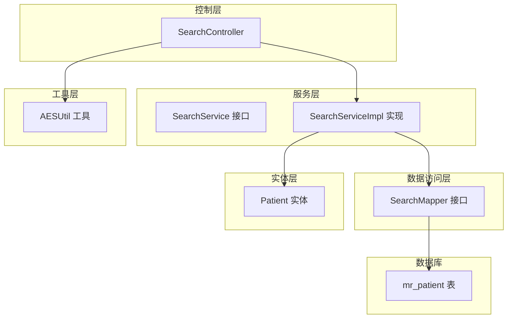
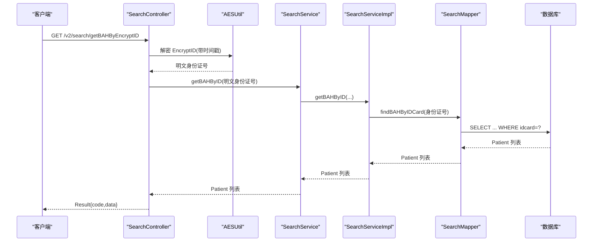
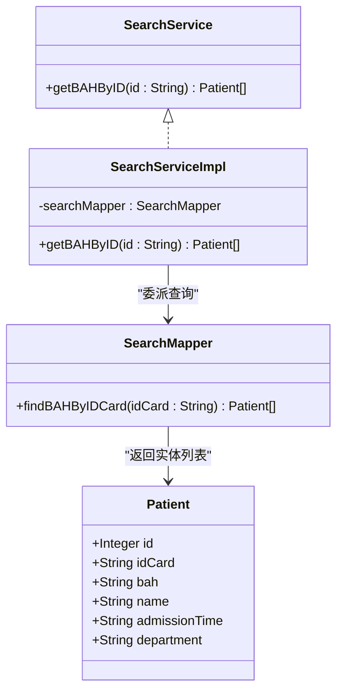
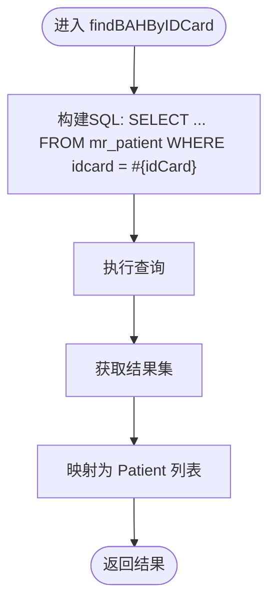
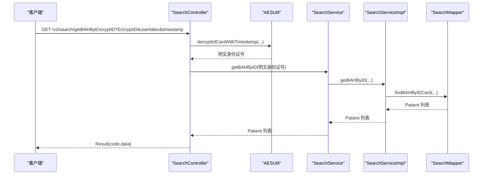
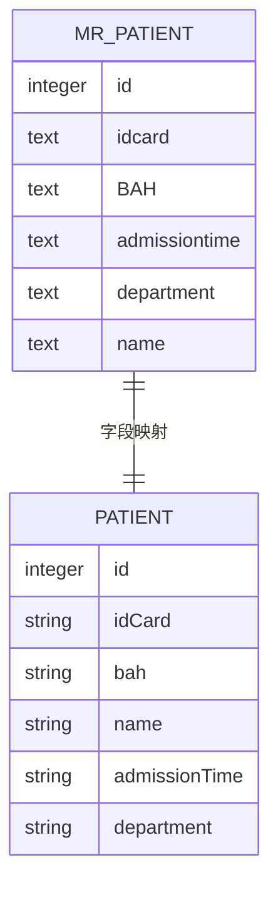
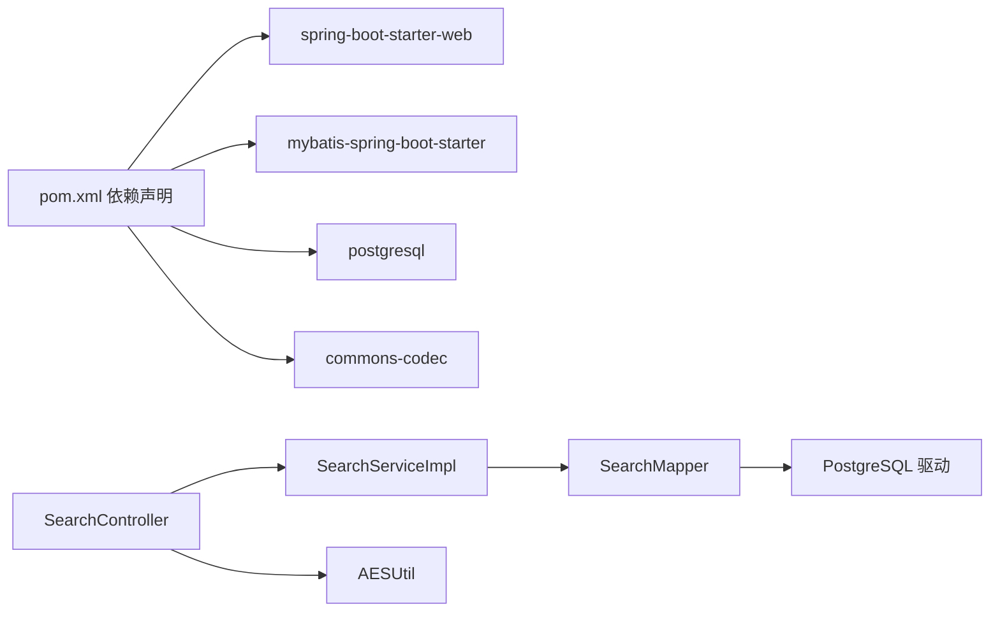

# 搜索服务

**本文引用的文件**
- [SearchService.java](file://backend-repo/src/main/java/com/zjcxph/imgapi/service/SearchService.java)
- [SearchServiceImpl.java](file://backend-repo/src/main/java/com/zjcxph/imgapi/service/impl/SearchServiceImpl.java)
- [SearchMapper.java](file://backend-repo/src/main/java/com/zjcxph/imgapi/mapper/SearchMapper.java)
- [SearchController.java](file://backend-repo/src/main/java/com/zjcxph/imgapi/controller/SearchController.java)
- [AESUtil.java](file://backend-repo/src/main/java/com/zjcxph/imgapi/utils/AESUtil.java)
- [Patient.java](file://backend-repo/src/main/java/com/zjcxph/imgapi/entity/Patient.java)
- [schema.sql](file://mrr-db/schema.sql)
- [SearchControllerTest.java](file://backend-repo/src/test/java/com/zjcxph/imgapi/SearchControllerTest.java)
- [pom.xml](file://backend-repo/pom.xml)

## 目录
1. [简介](#简介)
2. [项目结构](#项目结构)
3. [核心组件](#核心组件)
4. [架构总览](#架构总览)
5. [详细组件分析](#详细组件分析)
6. [依赖关系分析](#依赖关系分析)
7. [性能考量](#性能考量)
8. [故障排查指南](#故障排查指南)
9. [结论](#结论)

## 简介
本文件面向MRR项目的搜索服务，聚焦SearchService接口及其实现SearchServiceImpl，详细阐述其在后端的职责边界、数据访问路径、安全解密流程与数据库交互方式。当前搜索服务仅支持基于身份证号的精确匹配查询，返回对应病案号及相关患者信息；未实现全文检索、条件过滤与结果排序等高级搜索能力。本文将从代码结构、控制流、数据模型、依赖关系、错误处理与性能优化等方面进行系统化梳理，并给出可操作的优化建议与排障指引。

## 项目结构
搜索服务位于后端Java模块中，采用典型的分层架构：
- 控制层：SearchController 提供REST接口，负责参数接收、调用服务层、返回统一响应体。
- 服务层：SearchService定义接口，SearchServiceImpl实现具体业务逻辑。
- 数据访问层：SearchMapper通过MyBatis注解映射SQL，执行数据库查询。
- 实体层：Patient封装mr_patient表的字段，作为查询结果载体。
- 工具层：AESUtil提供基于用户ID与时间戳的AES解密工具，保障敏感参数传输安全。
- 数据库：schema.sql定义mr_patient表结构及索引。

图表来源
- [SearchController.java:19-92](file://backend-repo/src/main/java/com/zjcxph/imgapi/controller/SearchController.java#L19-L92)
- [SearchService.java:7-10](file://backend-repo/src/main/java/com/zjcxph/imgapi/service/SearchService.java#L7-L10)
- [SearchServiceImpl.java:11-25](file://backend-repo/src/main/java/com/zjcxph/imgapi/service/impl/SearchServiceImpl.java#L11-L25)
- [SearchMapper.java:9-16](file://backend-repo/src/main/java/com/zjcxph/imgapi/mapper/SearchMapper.java#L9-L16)
- [Patient.java:5-103](file://backend-repo/src/main/java/com/zjcxph/imgapi/entity/Patient.java#L5-L103)
- [AESUtil.java:19-233](file://backend-repo/src/main/java/com/zjcxph/imgapi/utils/AESUtil.java#L19-L233)
- [schema.sql:16-24](file://mrr-db/schema.sql#L16-L24)

章节来源
- [SearchController.java:19-92](file://backend-repo/src/main/java/com/zjcxph/imgapi/controller/SearchController.java#L19-L92)
- [SearchService.java:7-10](file://backend-repo/src/main/java/com/zjcxph/imgapi/service/SearchService.java#L7-L10)
- [SearchServiceImpl.java:11-25](file://backend-repo/src/main/java/com/zjcxph/imgapi/service/impl/SearchServiceImpl.java#L11-L25)
- [SearchMapper.java:9-16](file://backend-repo/src/main/java/com/zjcxph/imgapi/mapper/SearchMapper.java#L9-L16)
- [Patient.java:5-103](file://backend-repo/src/main/java/com/zjcxph/imgapi/entity/Patient.java#L5-L103)
- [AESUtil.java:19-233](file://backend-repo/src/main/java/com/zjcxph/imgapi/utils/AESUtil.java#L19-L233)
- [schema.sql:16-24](file://mrr-db/schema.sql#L16-L24)

## 核心组件
- SearchService接口：定义对外提供的搜索能力，当前为按身份证号查询病案号列表。
- SearchServiceImpl实现：委派给SearchMapper执行数据库查询。
- SearchMapper：通过@Select注解映射SQL，执行精确匹配查询。
- SearchController：暴露三个接口，分别支持明文ID、带时间戳的加密ID与传统加密ID解密后查询。
- AESUtil：提供基于用户ID与时间戳的AES解密方法，确保敏感参数在传输过程中的安全性。
- Patient实体：承载查询结果字段，包括id、idCard、bah、name、admissionTime、department。

章节来源
- [SearchService.java:7-10](file://backend-repo/src/main/java/com/zjcxph/imgapi/service/SearchService.java#L7-L10)
- [SearchServiceImpl.java:11-25](file://backend-repo/src/main/java/com/zjcxph/imgapi/service/impl/SearchServiceImpl.java#L11-L25)
- [SearchMapper.java:9-16](file://backend-repo/src/main/java/com/zjcxph/imgapi/mapper/SearchMapper.java#L9-L16)
- [SearchController.java:39-79](file://backend-repo/src/main/java/com/zjcxph/imgapi/controller/SearchController.java#L39-L79)
- [AESUtil.java:70-162](file://backend-repo/src/main/java/com/zjcxph/imgapi/utils/AESUtil.java#L70-L162)
- [Patient.java:6-19](file://backend-repo/src/main/java/com/zjcxph/imgapi/entity/Patient.java#L6-L19)

## 架构总览
搜索服务的调用链路如下：
- 客户端发起请求至SearchController。
- 控制器根据请求参数选择解密方案（带时间戳或传统），调用AESUtil完成解密。
- 控制器调用SearchService执行查询。
- SearchServiceImpl委托SearchMapper执行SQL查询。
- SearchMapper返回Patient列表，控制器封装Result响应。

图表来源
- [SearchController.java:39-55](file://backend-repo/src/main/java/com/zjcxph/imgapi/controller/SearchController.java#L39-L55)
- [AESUtil.java:121-162](file://backend-repo/src/main/java/com/zjcxph/imgapi/utils/AESUtil.java#L121-L162)
- [SearchServiceImpl.java:21-24](file://backend-repo/src/main/java/com/zjcxph/imgapi/service/impl/SearchServiceImpl.java#L21-L24)
- [SearchMapper.java:14-15](file://backend-repo/src/main/java/com/zjcxph/imgapi/mapper/SearchMapper.java#L14-L15)

## 详细组件分析

### SearchService接口与实现
- SearchService定义了按身份证号查询病案号列表的方法，当前实现为精确匹配。
- SearchServiceImpl仅做委派，保持低耦合与高内聚，便于后续扩展。

图表来源
- [SearchService.java:7-10](file://backend-repo/src/main/java/com/zjcxph/imgapi/service/SearchService.java#L7-L10)
- [SearchServiceImpl.java:11-25](file://backend-repo/src/main/java/com/zjcxph/imgapi/service/impl/SearchServiceImpl.java#L11-L25)
- [SearchMapper.java:9-16](file://backend-repo/src/main/java/com/zjcxph/imgapi/mapper/SearchMapper.java#L9-L16)
- [Patient.java:6-19](file://backend-repo/src/main/java/com/zjcxph/imgapi/entity/Patient.java#L6-L19)

章节来源
- [SearchService.java:7-10](file://backend-repo/src/main/java/com/zjcxph/imgapi/service/SearchService.java#L7-L10)
- [SearchServiceImpl.java:11-25](file://backend-repo/src/main/java/com/zjcxph/imgapi/service/impl/SearchServiceImpl.java#L11-L25)

### SearchMapper与数据库交互
- SearchMapper通过@Select注解直接映射SQL，查询mr_patient表中idcard等于传入参数的记录。
- SQL未包含排序与分页逻辑，查询结果顺序由数据库存储顺序决定。
- 当前未见针对idcard字段的索引定义，可能影响大表上的精确匹配性能。

图表来源
- [SearchMapper.java:14-15](file://backend-repo/src/main/java/com/zjcxph/imgapi/mapper/SearchMapper.java#L14-L15)
- [schema.sql:16-24](file://mrr-db/schema.sql#L16-L24)

章节来源
- [SearchMapper.java:9-16](file://backend-repo/src/main/java/com/zjcxph/imgapi/mapper/SearchMapper.java#L9-L16)
- [schema.sql:16-24](file://mrr-db/schema.sql#L16-L24)

### SearchController与安全解密
- SearchController提供三个接口：
  - /hello：用于连通性测试与IP识别。
  - /getBAHByEncryptID：使用带时间戳的解密方案。
  - /getBAHByEncryptIDLegacy：使用传统解密方案。
  - /getBAHByID/{idCard}：直接使用明文身份证号查询。
- 控制器在调用服务前先进行解密，异常时记录错误并返回统一错误响应。
- IP获取逻辑支持X-Forwarded-For与X-Real-IP头部，兼容代理场景。

图表来源
- [SearchController.java:39-55](file://backend-repo/src/main/java/com/zjcxph/imgapi/controller/SearchController.java#L39-L55)
- [AESUtil.java:121-162](file://backend-repo/src/main/java/com/zjcxph/imgapi/utils/AESUtil.java#L121-L162)
- [SearchServiceImpl.java:21-24](file://backend-repo/src/main/java/com/zjcxph/imgapi/service/impl/SearchServiceImpl.java#L21-L24)
- [SearchMapper.java:14-15](file://backend-repo/src/main/java/com/zjcxph/imgapi/mapper/SearchMapper.java#L14-L15)

章节来源
- [SearchController.java:39-79](file://backend-repo/src/main/java/com/zjcxph/imgapi/controller/SearchController.java#L39-L79)
- [AESUtil.java:70-162](file://backend-repo/src/main/java/com/zjcxph/imgapi/utils/AESUtil.java#L70-L162)

### 数据模型与字段映射
- Patient实体映射mr_patient表的关键字段：id、idcard、bah、name、admissiontime、department。
- 查询返回的字段集合由SQL显式指定，避免不必要的列加载。

图表来源
- [schema.sql:16-24](file://mrr-db/schema.sql#L16-L24)
- [Patient.java:6-19](file://backend-repo/src/main/java/com/zjcxph/imgapi/entity/Patient.java#L6-L19)

章节来源
- [schema.sql:16-24](file://mrr-db/schema.sql#L16-L24)
- [Patient.java:6-19](file://backend-repo/src/main/java/com/zjcxph/imgapi/entity/Patient.java#L6-L19)

### 错误处理与日志
- 控制器在解密失败或查询异常时记录错误日志并返回统一错误响应。
- 日志记录包含用户标识、时间戳等上下文信息，便于问题定位。
- 单元测试覆盖了IP解析逻辑的多种场景，验证控制器行为。

章节来源
- [SearchController.java:45-54](file://backend-repo/src/main/java/com/zjcxph/imgapi/controller/SearchController.java#L45-L54)
- [SearchControllerTest.java:33-70](file://backend-repo/src/test/java/com/zjcxph/imgapi/SearchControllerTest.java#L33-L70)

## 依赖关系分析
- 技术栈：Spring Boot + MyBatis + PostgreSQL。
- 关键依赖：spring-boot-starter-web、mybatis-spring-boot-starter、postgresql、commons-codec。
- 组件耦合：SearchController依赖SearchService；SearchServiceImpl依赖SearchMapper；SearchController依赖AESUtil；SearchMapper依赖数据库驱动。

图表来源
- [pom.xml:27-114](file://backend-repo/pom.xml#L27-L114)
- [SearchController.java:19-92](file://backend-repo/src/main/java/com/zjcxph/imgapi/controller/SearchController.java#L19-L92)
- [SearchServiceImpl.java:11-25](file://backend-repo/src/main/java/com/zjcxph/imgapi/service/impl/SearchServiceImpl.java#L11-L25)
- [SearchMapper.java:9-16](file://backend-repo/src/main/java/com/zjcxph/imgapi/mapper/SearchMapper.java#L9-L16)
- [AESUtil.java:19-233](file://backend-repo/src/main/java/com/zjcxph/imgapi/utils/AESUtil.java#L19-L233)

章节来源
- [pom.xml:27-114](file://backend-repo/pom.xml#L27-L114)

## 性能考量
当前实现的性能瓶颈与优化点：
- 精确匹配查询：SQL未使用索引，大表上查询可能较慢。建议为idcard字段建立唯一索引以提升命中率与查询效率。
- 解密开销：AES解密在控制器层执行，CPU消耗与密钥生成有关。建议缓存用户特定密钥或减少重复计算。
- 结果集大小：当前未限制返回字段数量，建议在SQL中明确选择必要字段，降低网络与序列化开销。
- 分页缺失：未实现分页，大量结果可能导致内存压力与响应延迟。建议引入分页参数与游标/偏移量策略。
- 排序缺失：未实现排序，结果顺序不确定。建议增加排序参数与索引支持。
- 全文检索：当前未实现全文检索，如需支持可考虑引入全文索引或搜索引擎（如PostgreSQL全文检索）。

章节来源
- [SearchMapper.java:14-15](file://backend-repo/src/main/java/com/zjcxph/imgapi/mapper/SearchMapper.java#L14-L15)
- [schema.sql:16-24](file://mrr-db/schema.sql#L16-L24)
- [AESUtil.java:70-162](file://backend-repo/src/main/java/com/zjcxph/imgapi/utils/AESUtil.java#L70-L162)

## 故障排查指南
- 解密失败
  - 现象：返回“decrypt failed”错误。
  - 排查：确认EncryptID格式、iv与userId是否正确；检查时间戳是否过期；核对secretKey配置。
  - 参考：[SearchController.java:45-54](file://backend-repo/src/main/java/com/zjcxph/imgapi/controller/SearchController.java#L45-L54)、[AESUtil.java:121-162](file://backend-repo/src/main/java/com/zjcxph/imgapi/utils/AESUtil.java#L121-L162)
- 查询无结果
  - 现象：返回空列表。
  - 排查：确认身份证号是否正确；检查数据库中是否存在对应记录；确认idcard字段大小写与格式。
  - 参考：[SearchMapper.java:14-15](file://backend-repo/src/main/java/com/zjcxph/imgapi/mapper/SearchMapper.java#L14-L15)、[schema.sql:16-24](file://mrr-db/schema.sql#L16-L24)
- IP识别异常
  - 现象：日志中显示的客户端IP不符合预期。
  - 排查：确认代理链路中X-Forwarded-For与X-Real-IP是否正确设置；验证客户端请求头。
  - 参考：[SearchController.java:81-90](file://backend-repo/src/main/java/com/zjcxph/imgapi/controller/SearchController.java#L81-L90)、[SearchControllerTest.java:33-70](file://backend-repo/src/test/java/com/zjcxph/imgapi/SearchControllerTest.java#L33-L70)

章节来源
- [SearchController.java:45-54](file://backend-repo/src/main/java/com/zjcxph/imgapi/controller/SearchController.java#L45-L54)
- [SearchMapper.java:14-15](file://backend-repo/src/main/java/com/zjcxph/imgapi/mapper/SearchMapper.java#L14-L15)
- [AESUtil.java:121-162](file://backend-repo/src/main/java/com/zjcxph/imgapi/utils/AESUtil.java#L121-L162)
- [schema.sql:16-24](file://mrr-db/schema.sql#L16-L24)
- [SearchControllerTest.java:33-70](file://backend-repo/src/test/java/com/zjcxph/imgapi/SearchControllerTest.java#L33-L70)

## 结论
当前搜索服务实现了基于身份证号的精确查询，具备基本的安全解密流程与清晰的分层架构。为进一步提升用户体验与系统性能，建议：
- 为idcard字段添加索引，优化查询性能。
- 引入分页与排序机制，支持大规模数据检索。
- 在SQL层面限定返回字段，减少网络与序列化开销。
- 考虑引入全文检索能力，满足更复杂的搜索需求。
- 增强参数校验与限流策略，提升系统稳定性与安全性。