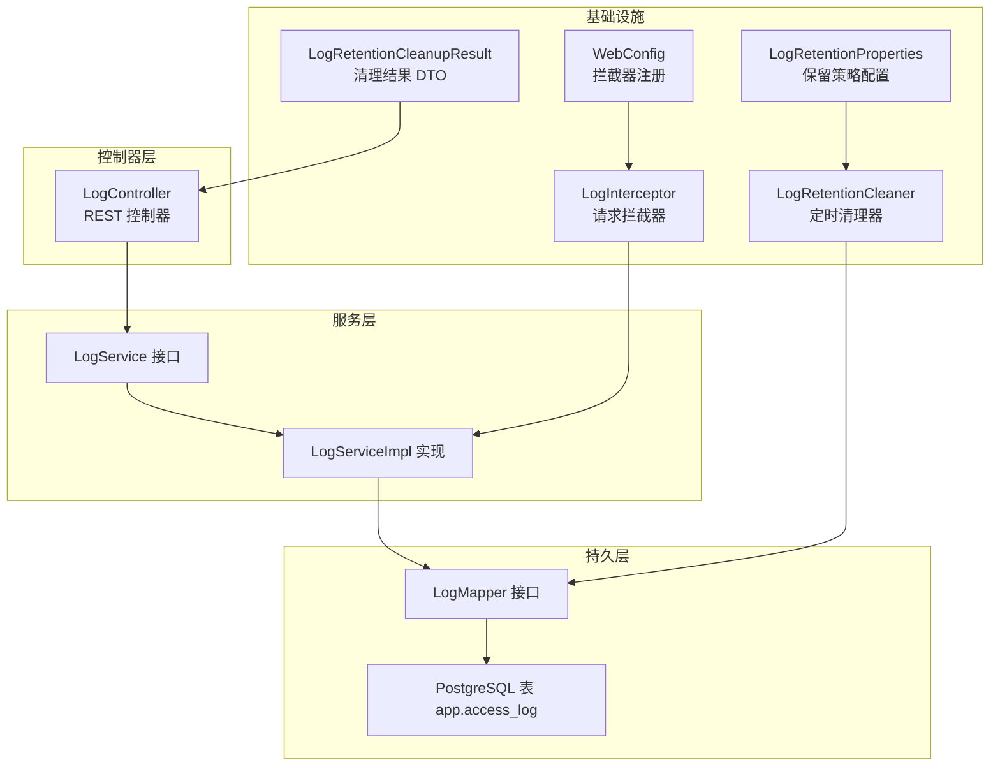
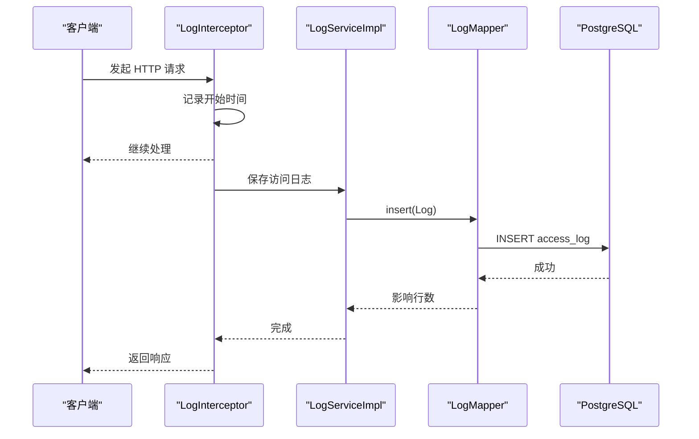
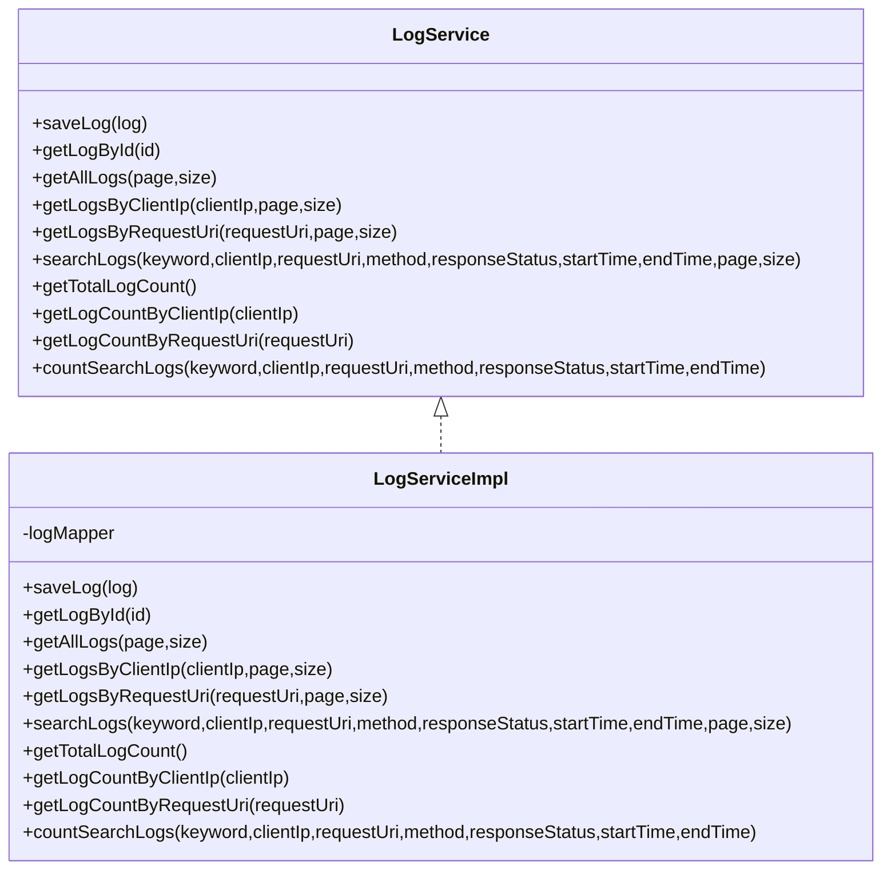
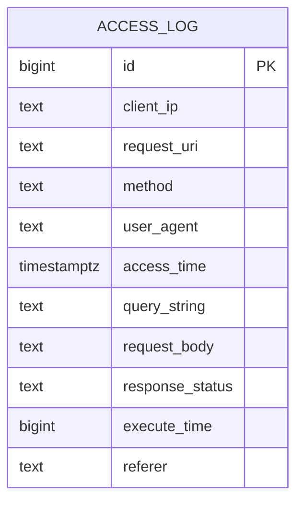
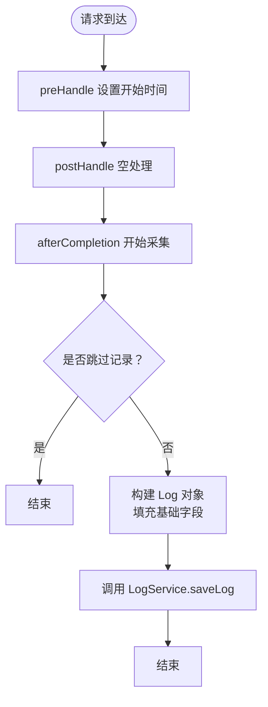
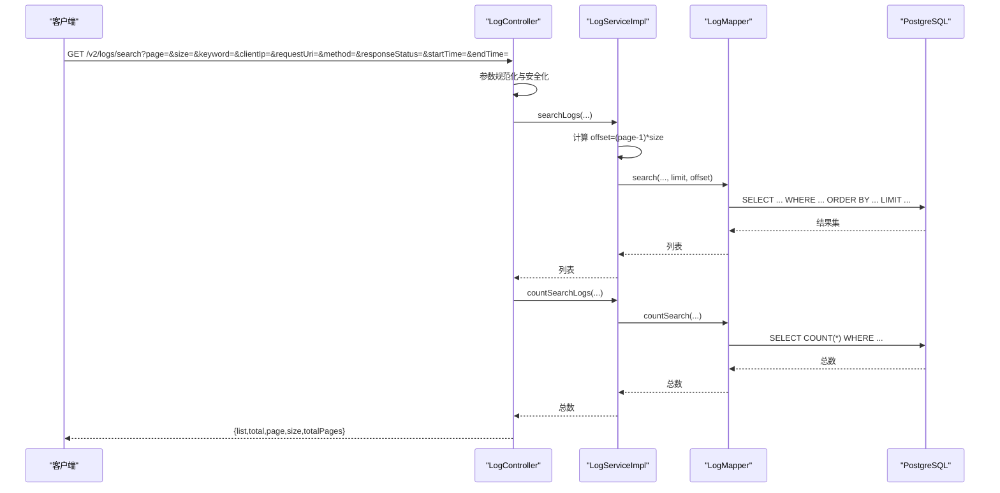
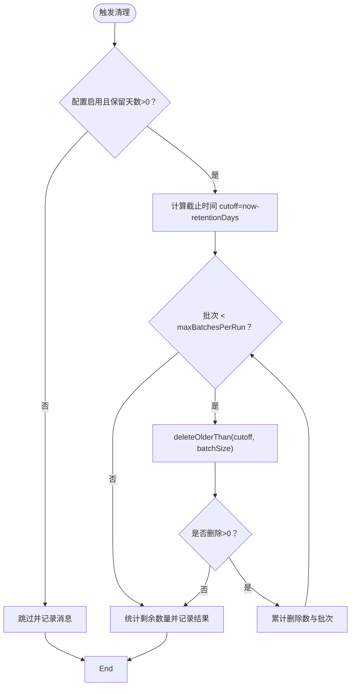
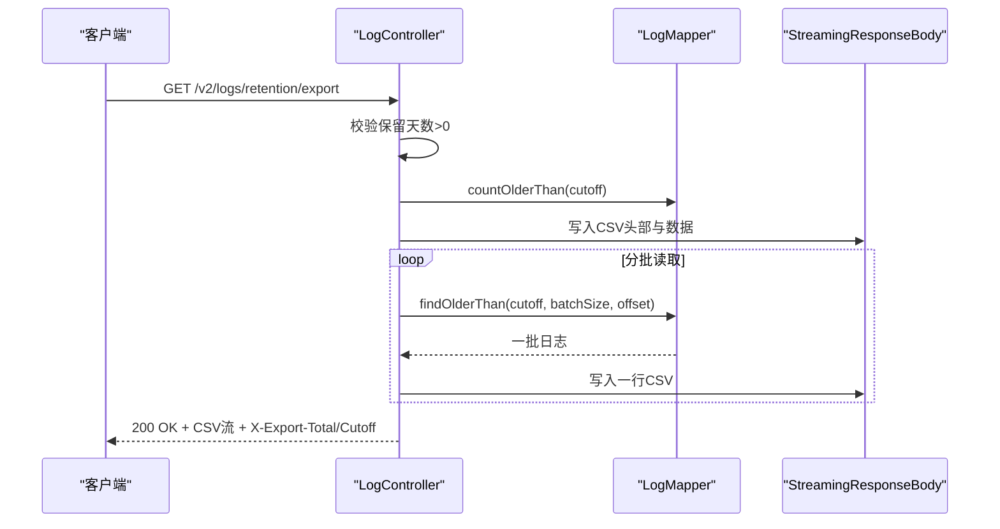
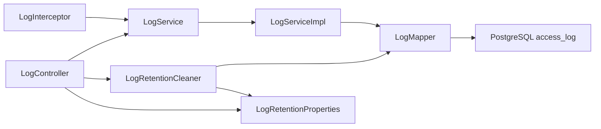

# 日志服务

**本文引用的文件**
- [LogService.java](file://backend-repo/src/main/java/com/zjcxph/imgapi/service/LogService.java)
- [LogServiceImpl.java](file://backend-repo/src/main/java/com/zjcxph/imgapi/service/impl/LogServiceImpl.java)
- [Log.java](file://backend-repo/src/main/java/com/zjcxph/imgapi/entity/Log.java)
- [LogMapper.java](file://backend-repo/src/main/java/com/zjcxph/imgapi/mapper/LogMapper.java)
- [LogController.java](file://backend-repo/src/main/java/com/zjcxph/imgapi/controller/LogController.java)
- [LogInterceptor.java](file://backend-repo/src/main/java/com/zjcxph/imgapi/interceptors/LogInterceptor.java)
- [WebConfig.java](file://backend-repo/src/main/java/com/zjcxph/imgapi/config/WebConfig.java)
- [LogRetentionCleaner.java](file://backend-repo/src/main/java/com/zjcxph/imgapi/scheduler/LogRetentionCleaner.java)
- [LogRetentionProperties.java](file://backend-repo/src/main/java/com/zjcxph/imgapi/config/LogRetentionProperties.java)
- [LogRetentionCleanupResult.java](file://backend-repo/src/main/java/com/zjcxph/imgapi/dto/resp/LogRetentionCleanupResult.java)
- [schema-postgresql.sql](file://backend-repo/src/main/resources/schema-postgresql.sql)
- [application.properties](file://backend-repo/src/main/resources/application.properties)

## 目录
1. [简介](#简介)
2. [项目结构](#项目结构)
3. [核心组件](#核心组件)
4. [架构总览](#架构总览)
5. [详细组件分析](#详细组件分析)
6. [依赖分析](#依赖分析)
7. [性能考虑](#性能考虑)
8. [故障排查指南](#故障排查指南)
9. [结论](#结论)
10. [附录](#附录)

## 简介
本文件为 MRR 项目“日志服务”的全面技术文档，聚焦于以下目标：
- 解释 LogService 接口的日志记录、查询与清理能力
- 深入分析 LogServiceImpl 的实现细节，包括日志级别分类、日志格式标准化、日志存储策略
- 记录日志服务的数据模型 Log 实体字段定义与业务含义
- 说明日志保留策略的实现（自动清理机制与清理结果统计）
- 提供日志服务的性能优化建议与日志查询最佳实践

## 项目结构
日志服务位于后端 Java 工程 backend-repo 中，采用分层架构：控制器层负责对外 API；服务层封装业务逻辑；持久层通过 MyBatis Mapper 访问数据库；拦截器负责统一采集访问日志；定时任务负责按保留策略清理过期日志。

图表来源
- [LogController.java:32-54](file://backend-repo/src/main/java/com/zjcxph/imgapi/controller/LogController.java#L32-L54)
- [LogService.java:7-18](file://backend-repo/src/main/java/com/zjcxph/imgapi/service/LogService.java#L7-L18)
- [LogServiceImpl.java:11-70](file://backend-repo/src/main/java/com/zjcxph/imgapi/service/impl/LogServiceImpl.java#L11-L70)
- [LogMapper.java:9-165](file://backend-repo/src/main/java/com/zjcxph/imgapi/mapper/LogMapper.java#L9-L165)
- [LogInterceptor.java:15-89](file://backend-repo/src/main/java/com/zjcxph/imgapi/interceptors/LogInterceptor.java#L15-L89)
- [WebConfig.java:11-59](file://backend-repo/src/main/java/com/zjcxph/imgapi/config/WebConfig.java#L11-L59)
- [LogRetentionCleaner.java:13-118](file://backend-repo/src/main/java/com/zjcxph/imgapi/scheduler/LogRetentionCleaner.java#L13-L118)
- [LogRetentionProperties.java:5-53](file://backend-repo/src/main/java/com/zjcxph/imgapi/config/LogRetentionProperties.java#L5-L53)
- [LogRetentionCleanupResult.java:7-118](file://backend-repo/src/main/java/com/zjcxph/imgapi/dto/resp/LogRetentionCleanupResult.java#L7-L118)

章节来源
- [LogController.java:32-54](file://backend-repo/src/main/java/com/zjcxph/imgapi/controller/LogController.java#L32-L54)
- [LogService.java:7-18](file://backend-repo/src/main/java/com/zjcxph/imgapi/service/LogService.java#L7-L18)
- [LogServiceImpl.java:11-70](file://backend-repo/src/main/java/com/zjcxph/imgapi/service/impl/LogServiceImpl.java#L11-L70)
- [LogMapper.java:9-165](file://backend-repo/src/main/java/com/zjcxph/imgapi/mapper/LogMapper.java#L9-L165)
- [LogInterceptor.java:15-89](file://backend-repo/src/main/java/com/zjcxph/imgapi/interceptors/LogInterceptor.java#L15-L89)
- [WebConfig.java:11-59](file://backend-repo/src/main/java/com/zjcxph/imgapi/config/WebConfig.java#L11-L59)
- [LogRetentionCleaner.java:13-118](file://backend-repo/src/main/java/com/zjcxph/imgapi/scheduler/LogRetentionCleaner.java#L13-L118)
- [LogRetentionProperties.java:5-53](file://backend-repo/src/main/java/com/zjcxph/imgapi/config/LogRetentionProperties.java#L5-L53)
- [LogRetentionCleanupResult.java:7-118](file://backend-repo/src/main/java/com/zjcxph/imgapi/dto/resp/LogRetentionCleanupResult.java#L7-L118)

## 核心组件
- LogService 接口：定义日志的保存、查询与计数方法，支持按 ID、客户端 IP、请求 URI 查询，以及全文/条件组合搜索。
- LogServiceImpl 实现：将分页参数转换为 SQL 的 limit/offset，并委托 LogMapper 完成数据访问。
- Log 实体：承载一次 HTTP 请求访问的所有关键信息，用于入库与返回。
- LogMapper：提供插入、分页查询、条件搜索、计数、过期删除与导出等 SQL 映射。
- LogController：对外暴露 REST API，包含日志列表、按条件搜索、按 IP/URI 查询、保留策略清理与导出。
- LogInterceptor：在请求完成后采集访问日志并调用 LogService 保存。
- LogRetentionCleaner：基于配置的保留天数与批大小，周期性或手动执行过期日志清理。
- 配置与结果对象：LogRetentionProperties 定义保留策略参数；LogRetentionCleanupResult 返回清理过程与统计结果。

章节来源
- [LogService.java:7-18](file://backend-repo/src/main/java/com/zjcxph/imgapi/service/LogService.java#L7-L18)
- [LogServiceImpl.java:11-70](file://backend-repo/src/main/java/com/zjcxph/imgapi/service/impl/LogServiceImpl.java#L11-L70)
- [Log.java:8-138](file://backend-repo/src/main/java/com/zjcxph/imgapi/entity/Log.java#L8-L138)
- [LogMapper.java:9-165](file://backend-repo/src/main/java/com/zjcxph/imgapi/mapper/LogMapper.java#L9-L165)
- [LogController.java:32-244](file://backend-repo/src/main/java/com/zjcxph/imgapi/controller/LogController.java#L32-L244)
- [LogInterceptor.java:15-89](file://backend-repo/src/main/java/com/zjcxph/imgapi/interceptors/LogInterceptor.java#L15-L89)
- [LogRetentionCleaner.java:13-118](file://backend-repo/src/main/java/com/zjcxph/imgapi/scheduler/LogRetentionCleaner.java#L13-L118)
- [LogRetentionProperties.java:5-53](file://backend-repo/src/main/java/com/zjcxph/imgapi/config/LogRetentionProperties.java#L5-L53)
- [LogRetentionCleanupResult.java:7-118](file://backend-repo/src/main/java/com/zjcxph/imgapi/dto/resp/LogRetentionCleanupResult.java#L7-L118)

## 架构总览
日志服务整体流程如下：
- 请求进入时，LogInterceptor 在 afterCompletion 阶段采集访问日志并保存到数据库
- LogController 提供查询、搜索、清理与导出接口
- LogServiceImpl 将分页参数转换为 SQL limit/offset 并调用 LogMapper
- LogRetentionCleaner 周期性或手动执行过期日志删除，并返回清理结果

图表来源
- [LogInterceptor.java:36-58](file://backend-repo/src/main/java/com/zjcxph/imgapi/interceptors/LogInterceptor.java#L36-L58)
- [LogServiceImpl.java:17-20](file://backend-repo/src/main/java/com/zjcxph/imgapi/service/impl/LogServiceImpl.java#L17-L20)
- [LogMapper.java:24-27](file://backend-repo/src/main/java/com/zjcxph/imgapi/mapper/LogMapper.java#L24-L27)
- [schema-postgresql.sql:61-73](file://backend-repo/src/main/resources/schema-postgresql.sql#L61-L73)

## 详细组件分析

### LogService 接口与实现
- 职责边界清晰：保存、查询、计数三类操作分离，便于扩展与测试
- 分页策略：所有查询均通过 page/size 参数换算为 limit/offset，避免一次性加载大量数据
- 统一计数：提供独立的 count 方法，便于前端分页控件计算总页数

图表来源
- [LogService.java:7-18](file://backend-repo/src/main/java/com/zjcxph/imgapi/service/LogService.java#L7-L18)
- [LogServiceImpl.java:11-70](file://backend-repo/src/main/java/com/zjcxph/imgapi/service/impl/LogServiceImpl.java#L11-L70)

章节来源
- [LogService.java:7-18](file://backend-repo/src/main/java/com/zjcxph/imgapi/service/LogService.java#L7-L18)
- [LogServiceImpl.java:11-70](file://backend-repo/src/main/java/com/zjcxph/imgapi/service/impl/LogServiceImpl.java#L11-L70)

### Log 实体与数据模型
Log 实体字段定义与业务含义：
- id：自增主键
- clientIp：客户端真实 IP（优先从代理头解析）
- requestUri：请求路径
- method：HTTP 方法
- userAgent：浏览器标识
- accessTime：访问时间戳
- queryString：查询参数
- requestBody：请求体（当前拦截器中为空字符串）
- responseStatus：响应状态码
- executeTime：请求耗时（毫秒）
- referer：来源页面

图表来源
- [schema-postgresql.sql:61-73](file://backend-repo/src/main/resources/schema-postgresql.sql#L61-L73)
- [Log.java:8-138](file://backend-repo/src/main/java/com/zjcxph/imgapi/entity/Log.java#L8-L138)

章节来源
- [Log.java:8-138](file://backend-repo/src/main/java/com/zjcxph/imgapi/entity/Log.java#L8-L138)
- [schema-postgresql.sql:61-73](file://backend-repo/src/main/resources/schema-postgresql.sql#L61-L73)

### 日志记录流程（拦截器）
- 触发时机：afterCompletion，在请求完成且异常可捕获时执行
- 过滤规则：跳过 OPTIONS 预检、静态资源、Swagger/Docs/Actuator 等非业务请求
- 字段采集：IP、URI、Method、UA、QS、请求体占位、响应状态、耗时、Referer
- 保存调用：通过 LogService.saveLog 写入数据库

图表来源
- [LogInterceptor.java:21-58](file://backend-repo/src/main/java/com/zjcxph/imgapi/interceptors/LogInterceptor.java#L21-L58)
- [LogServiceImpl.java:17-20](file://backend-repo/src/main/java/com/zjcxph/imgapi/service/impl/LogServiceImpl.java#L17-L20)

章节来源
- [LogInterceptor.java:15-89](file://backend-repo/src/main/java/com/zjcxph/imgapi/interceptors/LogInterceptor.java#L15-L89)
- [LogServiceImpl.java:11-20](file://backend-repo/src/main/java/com/zjcxph/imgapi/service/impl/LogServiceImpl.java#L11-L20)

### 日志查询与搜索
- 列表查询：支持按页返回，按访问时间倒序
- 条件查询：按 clientIp 或 requestUri 过滤
- 组合搜索：支持关键字（多字段模糊）+ clientIp + requestUri + method + responseStatus + 时间范围
- 分页安全：对 page/size 做最小值与最大值约束，防止过大请求

图表来源
- [LogController.java:150-202](file://backend-repo/src/main/java/com/zjcxph/imgapi/controller/LogController.java#L150-L202)
- [LogServiceImpl.java:27-69](file://backend-repo/src/main/java/com/zjcxph/imgapi/service/impl/LogServiceImpl.java#L27-L69)
- [LogMapper.java:70-154](file://backend-repo/src/main/java/com/zjcxph/imgapi/mapper/LogMapper.java#L70-L154)

章节来源
- [LogController.java:150-202](file://backend-repo/src/main/java/com/zjcxph/imgapi/controller/LogController.java#L150-L202)
- [LogServiceImpl.java:27-69](file://backend-repo/src/main/java/com/zjcxph/imgapi/service/impl/LogServiceImpl.java#L27-L69)
- [LogMapper.java:70-154](file://backend-repo/src/main/java/com/zjcxph/imgapi/mapper/LogMapper.java#L70-L154)

### 日志保留策略与清理
- 配置项：启用开关、Cron 表达式、保留天数、单批删除条数、每轮最大批次数
- 自动清理：@Scheduled 周期触发；手动清理：POST /v2/logs/retention/cleanup
- 清理算法：按 access_time 升序、id 升序取旧数据，限制每批数量，循环直到无更多或达到最大批次数
- 统计结果：返回已删除总数、剩余未删数量、执行批次、截止时间、执行时间等

图表来源
- [LogRetentionCleaner.java:26-117](file://backend-repo/src/main/java/com/zjcxph/imgapi/scheduler/LogRetentionCleaner.java#L26-L117)
- [LogRetentionProperties.java:5-53](file://backend-repo/src/main/java/com/zjcxph/imgapi/config/LogRetentionProperties.java#L5-L53)
- [LogRetentionCleanupResult.java:7-118](file://backend-repo/src/main/java/com/zjcxph/imgapi/dto/resp/LogRetentionCleanupResult.java#L7-L118)
- [LogMapper.java:41-56](file://backend-repo/src/main/java/com/zjcxph/imgapi/mapper/LogMapper.java#L41-L56)

章节来源
- [LogRetentionCleaner.java:13-118](file://backend-repo/src/main/java/com/zjcxph/imgapi/scheduler/LogRetentionCleaner.java#L13-L118)
- [LogRetentionProperties.java:5-53](file://backend-repo/src/main/java/com/zjcxph/imgapi/config/LogRetentionProperties.java#L5-L53)
- [LogRetentionCleanupResult.java:7-118](file://backend-repo/src/main/java/com/zjcxph/imgapi/dto/resp/LogRetentionCleanupResult.java#L7-L118)
- [LogMapper.java:41-56](file://backend-repo/src/main/java/com/zjcxph/imgapi/mapper/LogMapper.java#L41-L56)

### 日志导出
- 导出条件：仅当保留天数大于 0 时允许导出
- 导出策略：按批读取旧日志，写入 UTF-8 BOM 的 CSV 文件流
- 响应头：包含导出总量与截止时间，便于前端展示进度与统计

图表来源
- [LogController.java:108-148](file://backend-repo/src/main/java/com/zjcxph/imgapi/controller/LogController.java#L108-L148)
- [LogMapper.java:58-68](file://backend-repo/src/main/java/com/zjcxph/imgapi/mapper/LogMapper.java#L58-L68)

章节来源
- [LogController.java:108-148](file://backend-repo/src/main/java/com/zjcxph/imgapi/controller/LogController.java#L108-L148)
- [LogMapper.java:58-68](file://backend-repo/src/main/java/com/zjcxph/imgapi/mapper/LogMapper.java#L58-L68)

## 依赖分析
- 控制器依赖服务与清理器：LogController 注入 LogService、LogRetentionCleaner、LogMapper、LogRetentionProperties
- 服务依赖映射：LogServiceImpl 依赖 LogMapper
- 拦截器依赖服务：LogInterceptor 依赖 LogService
- 清理器依赖映射与配置：LogRetentionCleaner 依赖 LogMapper 与 LogRetentionProperties
- 数据库索引：access_log 表针对 access_time、client_ip、request_uri、method、response_status 等建立索引，支撑高频查询与清理

图表来源
- [LogController.java:39-53](file://backend-repo/src/main/java/com/zjcxph/imgapi/controller/LogController.java#L39-L53)
- [LogServiceImpl.java:14-15](file://backend-repo/src/main/java/com/zjcxph/imgapi/service/impl/LogServiceImpl.java#L14-L15)
- [LogInterceptor.java:18-19](file://backend-repo/src/main/java/com/zjcxph/imgapi/interceptors/LogInterceptor.java#L18-L19)
- [LogRetentionCleaner.java:21-23](file://backend-repo/src/main/java/com/zjcxph/imgapi/scheduler/LogRetentionCleaner.java#L21-L23)
- [LogRetentionProperties.java:5-53](file://backend-repo/src/main/java/com/zjcxph/imgapi/config/LogRetentionProperties.java#L5-L53)
- [schema-postgresql.sql:83-88](file://backend-repo/src/main/resources/schema-postgresql.sql#L83-L88)

章节来源
- [LogController.java:39-53](file://backend-repo/src/main/java/com/zjcxph/imgapi/controller/LogController.java#L39-L53)
- [LogServiceImpl.java:14-15](file://backend-repo/src/main/java/com/zjcxph/imgapi/service/impl/LogServiceImpl.java#L14-L15)
- [LogInterceptor.java:18-19](file://backend-repo/src/main/java/com/zjcxph/imgapi/interceptors/LogInterceptor.java#L18-L19)
- [LogRetentionCleaner.java:21-23](file://backend-repo/src/main/java/com/zjcxph/imgapi/scheduler/LogRetentionCleaner.java#L21-L23)
- [LogRetentionProperties.java:5-53](file://backend-repo/src/main/java/com/zjcxph/imgapi/config/LogRetentionProperties.java#L5-L53)
- [schema-postgresql.sql:83-88](file://backend-repo/src/main/resources/schema-postgresql.sql#L83-L88)

## 性能考虑
- 分页与排序
  - 使用 limit/offset 分页，避免全表扫描；确保 access_time、(access_time,id) 复合索引有效
  - 查询按 access_time 倒序，符合日志浏览习惯
- 查询优化
  - 搜索条件使用 LIKE 模糊匹配，建议在高频过滤字段上建立索引（如 client_ip、request_uri、method、response_status）
  - 关键字搜索对多字段进行 OR 匹配，注意 SQL 片段中的连接符与转义
- 清理策略
  - 采用分批删除，避免长事务锁表；通过 maxBatchesPerRun 限制单次工作量
  - 删除按 access_time 升序、id 升序，保证删除顺序稳定
- 导出性能
  - 流式输出 CSV，避免内存峰值；设置合理的 batchSize
- 其他
  - 拦截器仅在 afterCompletion 采集，避免阻塞请求处理
  - 配置文件中开启 SQL 日志级别以便问题定位（生产环境谨慎开启）

[本节为通用性能建议，不直接分析具体文件，故无章节来源]

## 故障排查指南
- 清理未执行
  - 检查 app.log-retention.enabled 是否为 true；检查 Cron 表达式是否正确
  - 若保留天数<=0，清理会被跳过并记录告警
- 清理失败
  - 查看清理器日志中的错误消息；确认数据库连接与权限
- 查询缓慢
  - 确认 access_time、client_ip、request_uri、method、response_status 等索引是否存在
  - 减少模糊匹配范围，尽量提供更精确的过滤条件
- 导出异常
  - 确认保留天数>0；检查网络中断导致的流中断；关注响应头中的导出统计信息

章节来源
- [LogRetentionCleaner.java:51-64](file://backend-repo/src/main/java/com/zjcxph/imgapi/scheduler/LogRetentionCleaner.java#L51-L64)
- [LogRetentionCleaner.java:110-114](file://backend-repo/src/main/java/com/zjcxph/imgapi/scheduler/LogRetentionCleaner.java#L110-L114)
- [LogController.java:108-148](file://backend-repo/src/main/java/com/zjcxph/imgapi/controller/LogController.java#L108-L148)
- [application.properties:40-45](file://backend-repo/src/main/resources/application.properties#L40-L45)

## 结论
日志服务通过拦截器自动采集、服务层统一处理、持久层高效查询与清理，形成了完整的访问日志闭环。其设计具备良好的扩展性与可维护性：分页与搜索能力满足日常运维与审计需求；保留策略支持灵活配置与批量清理；导出能力便于离线归档与分析。建议在生产环境中结合业务流量规模调整保留天数与批大小，并持续监控清理结果与查询性能。

[本节为总结性内容，不直接分析具体文件，故无章节来源]

## 附录

### API 定义概览
- 获取单条日志
  - GET /v2/logs/{id}
- 获取全部日志
  - GET /v2/logs/?page=&size=
- 按客户端 IP 查询
  - GET /v2/logs/ip/{ip}?page=&size=
- 按请求 URI 查询
  - GET /v2/logs/uri?uri=&page=&size=
- 搜索日志
  - GET /v2/logs/search?page=&size=&keyword=&clientIp=&requestUri=&method=&responseStatus=&startTime=&endTime=
- 保留策略清理（手动）
  - POST /v2/logs/retention/cleanup?cutoff=
- 保留策略日志导出
  - GET /v2/logs/retention/export

章节来源
- [LogController.java:56-202](file://backend-repo/src/main/java/com/zjcxph/imgapi/controller/LogController.java#L56-L202)

### 配置项说明
- app.log-retention.enabled：是否启用保留清理
- app.log-retention.cron：Cron 表达式
- app.log-retention.retention-days：保留天数
- app.log-retention.batch-size：单批删除条数
- app.log-retention.max-batches-per-run：每轮最大批次数

章节来源
- [application.properties:40-45](file://backend-repo/src/main/resources/application.properties#L40-L45)
- [LogRetentionProperties.java:5-53](file://backend-repo/src/main/java/com/zjcxph/imgapi/config/LogRetentionProperties.java#L5-L53)