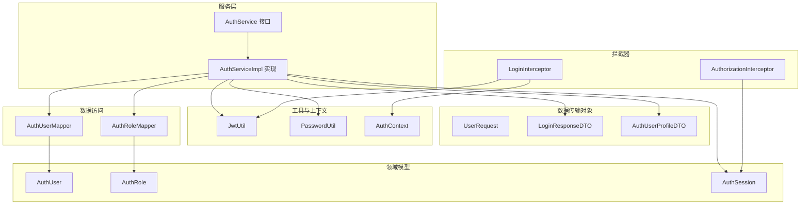
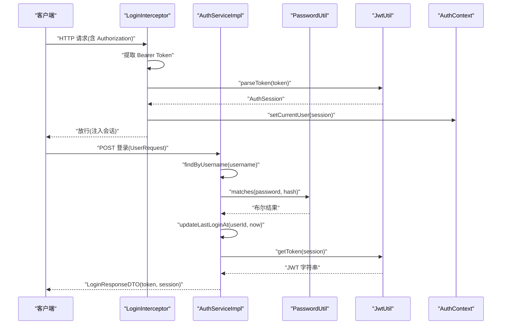
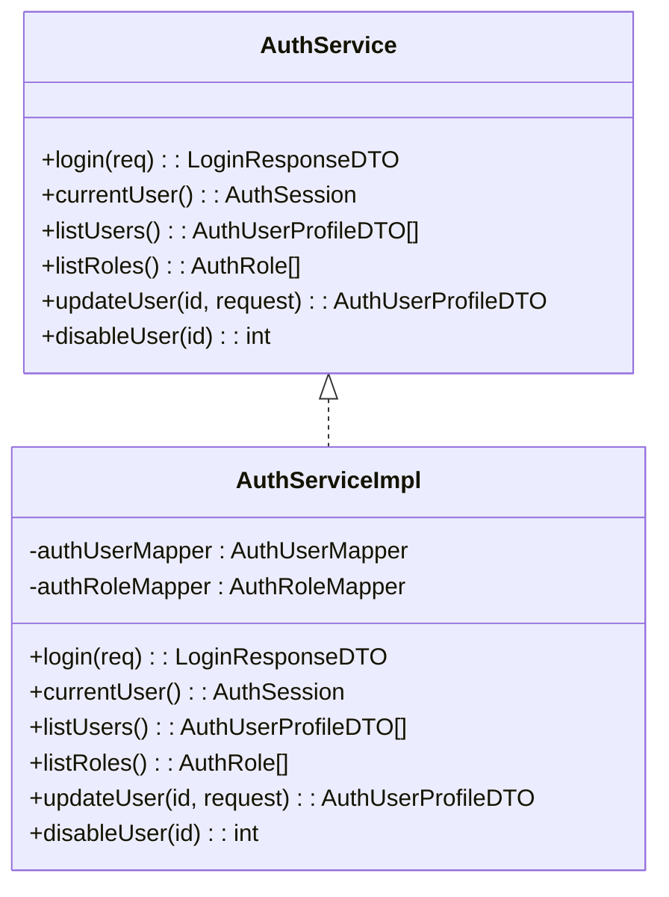
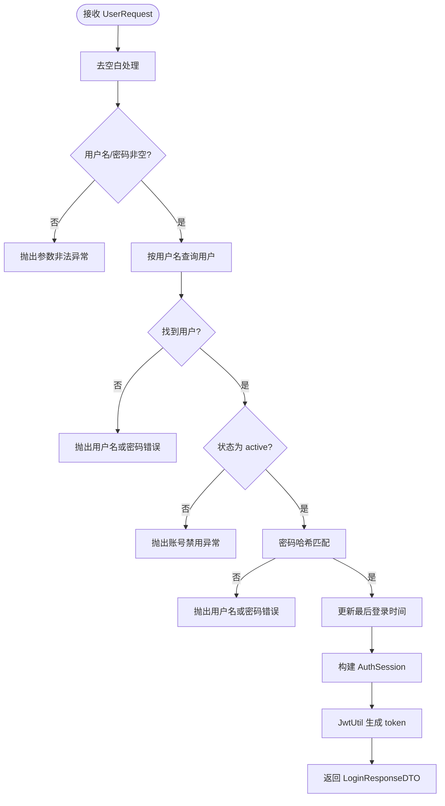
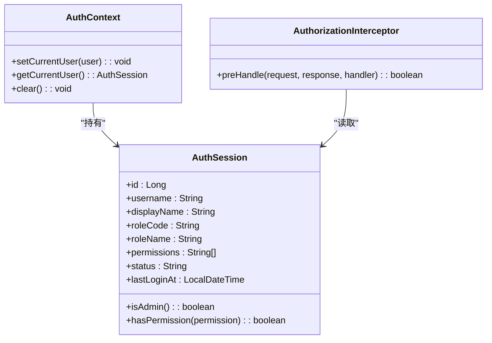
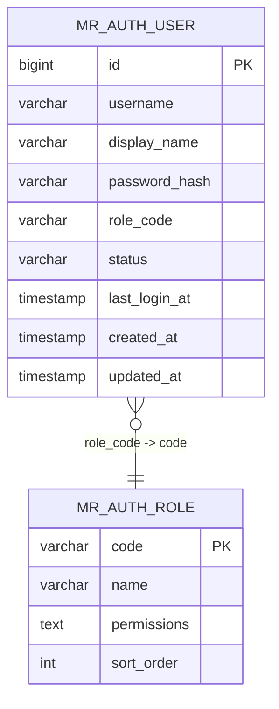
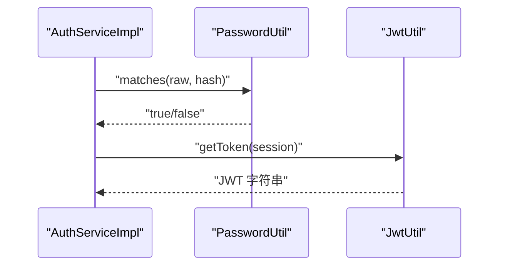
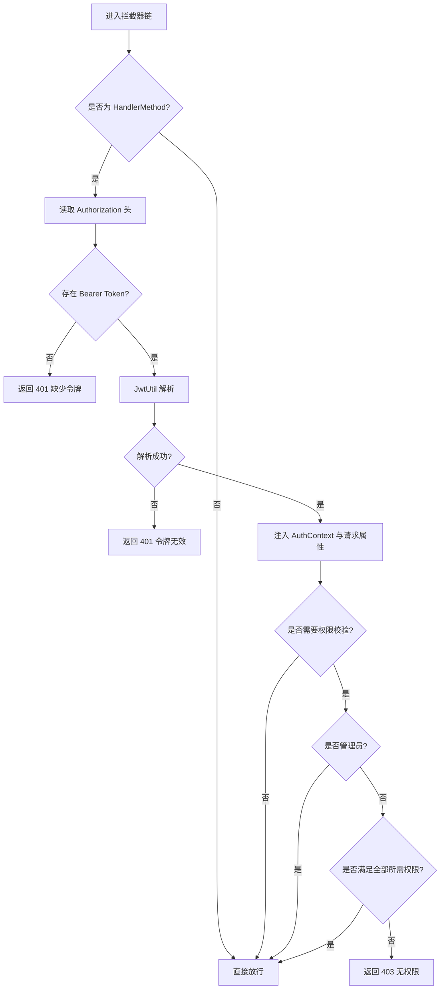
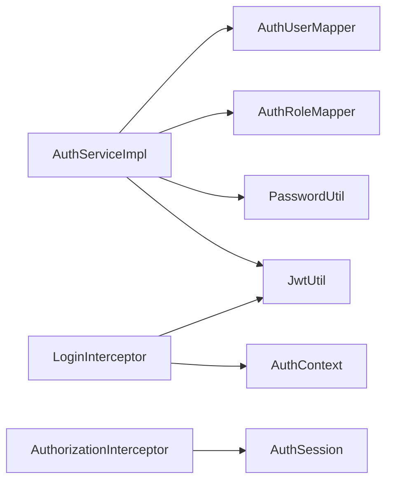

# 认证服务

**本文引用的文件**
- [AuthService.java](file://backend-repo/src/main/java/com/zjcxph/imgapi/service/AuthService.java)
- [AuthServiceImpl.java](file://backend-repo/src/main/java/com/zjcxph/imgapi/service/impl/AuthServiceImpl.java)
- [UserRequest.java](file://backend-repo/src/main/java/com/zjcxph/imgapi/dto/req/UserRequest.java)
- [LoginResponseDTO.java](file://backend-repo/src/main/java/com/zjcxph/imgapi/dto/resp/LoginResponseDTO.java)
- [AuthUserProfileDTO.java](file://backend-repo/src/main/java/com/zjcxph/imgapi/dto/resp/AuthUserProfileDTO.java)
- [AuthUser.java](file://backend-repo/src/main/java/com/zjcxph/imgapi/entity/AuthUser.java)
- [AuthRole.java](file://backend-repo/src/main/java/com/zjcxph/imgapi/entity/AuthRole.java)
- [AuthSession.java](file://backend-repo/src/main/java/com/zjcxph/imgapi/common/AuthSession.java)
- [JwtUtil.java](file://backend-repo/src/main/java/com/zjcxph/imgapi/utils/JwtUtil.java)
- [PasswordUtil.java](file://backend-repo/src/main/java/com/zjcxph/imgapi/utils/PasswordUtil.java)
- [AuthUserMapper.java](file://backend-repo/src/main/java/com/zjcxph/imgapi/mapper/AuthUserMapper.java)
- [AuthRoleMapper.java](file://backend-repo/src/main/java/com/zjcxph/imgapi/mapper/AuthRoleMapper.java)
- [AuthContext.java](file://backend-repo/src/main/java/com/zjcxph/imgapi/utils/AuthContext.java)
- [AuthorizationInterceptor.java](file://backend-repo/src/main/java/com/zjcxph/imgapi/interceptors/AuthorizationInterceptor.java)
- [LoginInterceptor.java](file://backend-repo/src/main/java/com/zjcxph/imgapi/interceptors/LoginInterceptor.java)

## 目录
1. [简介](#简介)
2. [项目结构](#项目结构)
3. [核心组件](#核心组件)
4. [架构总览](#架构总览)
5. [详细组件分析](#详细组件分析)
6. [依赖分析](#依赖分析)
7. [性能考虑](#性能考虑)
8. [故障排查指南](#故障排查指南)
9. [结论](#结论)
10. [附录](#附录)

## 简介
本文件面向MRR项目的认证服务，围绕AuthService接口及其实现AuthServiceImpl展开，系统性阐述登录验证、用户会话管理、权限控制机制；解析数据传输对象（DTO）设计与用途；梳理认证服务与数据库层的交互模式；并总结异常处理策略与安全最佳实践。

## 项目结构
认证相关代码主要位于后端模块的service、dto、entity、common、utils、mapper、interceptors包中，采用分层组织：接口定义在service，实现位于impl，数据传输对象位于dto，领域模型位于entity，通用会话模型与工具类位于common与utils，数据库访问通过MyBatis Mapper完成，拦截器负责鉴权与会话注入。

图表来源
- [AuthService.java:12-24](file://backend-repo/src/main/java/com/zjcxph/imgapi/service/AuthService.java#L12-L24)
- [AuthServiceImpl.java:26-34](file://backend-repo/src/main/java/com/zjcxph/imgapi/service/impl/AuthServiceImpl.java#L26-L34)
- [UserRequest.java:8-13](file://backend-repo/src/main/java/com/zjcxph/imgapi/dto/req/UserRequest.java#L8-L13)
- [LoginResponseDTO.java:7-16](file://backend-repo/src/main/java/com/zjcxph/imgapi/dto/resp/LoginResponseDTO.java#L7-L16)
- [AuthUserProfileDTO.java:10-18](file://backend-repo/src/main/java/com/zjcxph/imgapi/dto/resp/AuthUserProfileDTO.java#L10-L18)
- [AuthUser.java:13-24](file://backend-repo/src/main/java/com/zjcxph/imgapi/entity/AuthUser.java#L13-L24)
- [AuthRole.java:6-11](file://backend-repo/src/main/java/com/zjcxph/imgapi/entity/AuthRole.java#L6-L11)
- [AuthSession.java:7-15](file://backend-repo/src/main/java/com/zjcxph/imgapi/common/AuthSession.java#L7-L15)
- [JwtUtil.java:12-17](file://backend-repo/src/main/java/com/zjcxph/imgapi/utils/JwtUtil.java#L12-L17)
- [PasswordUtil.java:5-22](file://backend-repo/src/main/java/com/zjcxph/imgapi/utils/PasswordUtil.java#L5-L22)
- [AuthUserMapper.java:14-77](file://backend-repo/src/main/java/com/zjcxph/imgapi/mapper/AuthUserMapper.java#L14-L77)
- [AuthRoleMapper.java:11-18](file://backend-repo/src/main/java/com/zjcxph/imgapi/mapper/AuthRoleMapper.java#L11-L18)
- [LoginInterceptor.java:17-57](file://backend-repo/src/main/java/com/zjcxph/imgapi/interceptors/LoginInterceptor.java#L17-L57)
- [AuthorizationInterceptor.java:18-56](file://backend-repo/src/main/java/com/zjcxph/imgapi/interceptors/AuthorizationInterceptor.java#L18-L56)

章节来源
- [AuthService.java:12-24](file://backend-repo/src/main/java/com/zjcxph/imgapi/service/AuthService.java#L12-L24)
- [AuthServiceImpl.java:26-34](file://backend-repo/src/main/java/com/zjcxph/imgapi/service/impl/AuthServiceImpl.java#L26-L34)

## 核心组件
- AuthService接口：定义登录、当前用户、用户列表、角色列表、更新用户、禁用用户的对外契约。
- AuthServiceImpl实现：承载登录校验、会话构建、用户资料映射、权限拆分、角色权限查询等核心逻辑。
- DTO与实体：UserRequest用于登录请求参数校验；LoginResponseDTO封装登录响应；AuthUserProfileDTO用于用户资料展示；AuthUser与AuthRole映射数据库表字段。
- 工具与上下文：JwtUtil负责令牌签发与解析；PasswordUtil负责密码哈希与匹配；AuthContext提供线程本地的会话存储。
- 拦截器：LoginInterceptor从请求头提取并校验JWT，注入AuthSession到请求属性与线程上下文；AuthorizationInterceptor基于注解进行权限判定。

章节来源
- [AuthService.java:12-24](file://backend-repo/src/main/java/com/zjcxph/imgapi/service/AuthService.java#L12-L24)
- [AuthServiceImpl.java:26-151](file://backend-repo/src/main/java/com/zjcxph/imgapi/service/impl/AuthServiceImpl.java#L26-L151)
- [UserRequest.java:8-13](file://backend-repo/src/main/java/com/zjcxph/imgapi/dto/req/UserRequest.java#L8-L13)
- [LoginResponseDTO.java:7-16](file://backend-repo/src/main/java/com/zjcxph/imgapi/dto/resp/LoginResponseDTO.java#L7-L16)
- [AuthUserProfileDTO.java:10-18](file://backend-repo/src/main/java/com/zjcxph/imgapi/dto/resp/AuthUserProfileDTO.java#L10-L18)
- [AuthUser.java:13-24](file://backend-repo/src/main/java/com/zjcxph/imgapi/entity/AuthUser.java#L13-L24)
- [AuthRole.java:6-11](file://backend-repo/src/main/java/com/zjcxph/imgapi/entity/AuthRole.java#L6-L11)
- [JwtUtil.java:12-77](file://backend-repo/src/main/java/com/zjcxph/imgapi/utils/JwtUtil.java#L12-L77)
- [PasswordUtil.java:5-24](file://backend-repo/src/main/java/com/zjcxph/imgapi/utils/PasswordUtil.java#L5-L24)
- [AuthContext.java:5-27](file://backend-repo/src/main/java/com/zjcxph/imgapi/utils/AuthContext.java#L5-L27)
- [LoginInterceptor.java:17-68](file://backend-repo/src/main/java/com/zjcxph/imgapi/interceptors/LoginInterceptor.java#L17-L68)
- [AuthorizationInterceptor.java:18-77](file://backend-repo/src/main/java/com/zjcxph/imgapi/interceptors/AuthorizationInterceptor.java#L18-L77)

## 架构总览
认证服务采用“拦截器注入会话 + 服务层登录校验 + 工具类令牌与密码处理 + Mapper数据库访问”的分层架构。登录时序从拦截器开始，经服务层完成用户校验与会话构建，最终返回JWT与会话信息；后续请求由拦截器解析JWT并注入会话，控制器方法通过注解进行权限校验。

图表来源
- [LoginInterceptor.java:29-52](file://backend-repo/src/main/java/com/zjcxph/imgapi/interceptors/LoginInterceptor.java#L29-L52)
- [AuthServiceImpl.java:36-62](file://backend-repo/src/main/java/com/zjcxph/imgapi/service/impl/AuthServiceImpl.java#L36-L62)
- [PasswordUtil.java:17-22](file://backend-repo/src/main/java/com/zjcxph/imgapi/utils/PasswordUtil.java#L17-L22)
- [JwtUtil.java:61-75](file://backend-repo/src/main/java/com/zjcxph/imgapi/utils/JwtUtil.java#L61-L75)
- [AuthContext.java:12-22](file://backend-repo/src/main/java/com/zjcxph/imgapi/utils/AuthContext.java#L12-L22)

## 详细组件分析

### AuthService 接口与实现
- 职责边界清晰：登录、当前用户、用户与角色列表、用户更新、禁用用户。
- 实现要点：登录流程严格校验用户名与密码非空；按用户名查询用户并校验状态；使用密码工具进行哈希比对；更新最后登录时间；构建AuthSession并通过JwtUtil生成token；用户资料映射与权限拆分；角色列表查询。

图表来源
- [AuthService.java:12-24](file://backend-repo/src/main/java/com/zjcxph/imgapi/service/AuthService.java#L12-L24)
- [AuthServiceImpl.java:26-105](file://backend-repo/src/main/java/com/zjcxph/imgapi/service/impl/AuthServiceImpl.java#L26-L105)

章节来源
- [AuthService.java:12-24](file://backend-repo/src/main/java/com/zjcxph/imgapi/service/AuthService.java#L12-L24)
- [AuthServiceImpl.java:36-105](file://backend-repo/src/main/java/com/zjcxph/imgapi/service/impl/AuthServiceImpl.java#L36-L105)

### 登录流程与数据传输对象
- UserRequest：携带用户名与密码，配合Bean Validation注解确保非空。
- LoginResponseDTO：包含token与AuthSession，作为登录成功后的响应载体。
- AuthUserProfileDTO：用于用户列表与更新后的用户资料展示，包含角色、权限、状态与最近登录时间。

图表来源
- [AuthServiceImpl.java:36-62](file://backend-repo/src/main/java/com/zjcxph/imgapi/service/impl/AuthServiceImpl.java#L36-L62)
- [UserRequest.java:8-13](file://backend-repo/src/main/java/com/zjcxph/imgapi/dto/req/UserRequest.java#L8-L13)
- [LoginResponseDTO.java:7-16](file://backend-repo/src/main/java/com/zjcxph/imgapi/dto/resp/LoginResponseDTO.java#L7-L16)
- [AuthUserProfileDTO.java:10-18](file://backend-repo/src/main/java/com/zjcxph/imgapi/dto/resp/AuthUserProfileDTO.java#L10-L18)

章节来源
- [UserRequest.java:8-13](file://backend-repo/src/main/java/com/zjcxph/imgapi/dto/req/UserRequest.java#L8-L13)
- [LoginResponseDTO.java:7-16](file://backend-repo/src/main/java/com/zjcxph/imgapi/dto/resp/LoginResponseDTO.java#L7-L16)
- [AuthUserProfileDTO.java:10-18](file://backend-repo/src/main/java/com/zjcxph/imgapi/dto/resp/AuthUserProfileDTO.java#L10-L18)
- [AuthServiceImpl.java:36-62](file://backend-repo/src/main/java/com/zjcxph/imgapi/service/impl/AuthServiceImpl.java#L36-L62)

### 会话管理与权限控制
- AuthSession：保存用户标识、显示名、角色、权限集合、状态与最近登录时间，并提供isAdmin与hasPermission便捷判断。
- AuthContext：线程本地存储当前用户会话，贯穿一次请求生命周期。
- AuthorizationInterceptor：读取请求中的AUTH_SESSION属性，结合@RequirePermissions注解进行权限判定；管理员角色或具备特定管理权限的用户可免检通过。

图表来源
- [AuthSession.java:7-89](file://backend-repo/src/main/java/com/zjcxph/imgapi/common/AuthSession.java#L7-L89)
- [AuthContext.java:5-27](file://backend-repo/src/main/java/com/zjcxph/imgapi/utils/AuthContext.java#L5-L27)
- [AuthorizationInterceptor.java:18-77](file://backend-repo/src/main/java/com/zjcxph/imgapi/interceptors/AuthorizationInterceptor.java#L18-L77)

章节来源
- [AuthSession.java:7-89](file://backend-repo/src/main/java/com/zjcxph/imgapi/common/AuthSession.java#L7-L89)
- [AuthContext.java:5-27](file://backend-repo/src/main/java/com/zjcxph/imgapi/utils/AuthContext.java#L5-L27)
- [AuthorizationInterceptor.java:18-77](file://backend-repo/src/main/java/com/zjcxph/imgapi/interceptors/AuthorizationInterceptor.java#L18-L77)

### 数据库交互模式
- AuthUserMapper：按用户名、ID查询用户详情（同时联结角色名称与角色权限CSV），批量查询所有用户，更新最后登录时间、用户信息与状态，插入新用户。
- AuthRoleMapper：查询所有角色与按编码查询单个角色。
- 查询SQL将角色名称与角色权限以CSV形式回填至AuthUser，便于后续权限拆分与会话构建。

图表来源
- [AuthUserMapper.java:16-59](file://backend-repo/src/main/java/com/zjcxph/imgapi/mapper/AuthUserMapper.java#L16-L59)
- [AuthRoleMapper.java:13-17](file://backend-repo/src/main/java/com/zjcxph/imgapi/mapper/AuthRoleMapper.java#L13-L17)

章节来源
- [AuthUserMapper.java:14-77](file://backend-repo/src/main/java/com/zjcxph/imgapi/mapper/AuthUserMapper.java#L14-L77)
- [AuthRoleMapper.java:11-18](file://backend-repo/src/main/java/com/zjcxph/imgapi/mapper/AuthRoleMapper.java#L11-L18)

### 密码加密与JWT令牌
- PasswordUtil：提供SHA-256哈希与匹配能力，登录时将明文密码与数据库存储的哈希进行比较。
- JwtUtil：支持从AuthSession生成签名令牌与从令牌解析回AuthSession；默认过期时间为24小时；令牌中包含用户关键信息与权限数组。

图表来源
- [AuthServiceImpl.java:52-61](file://backend-repo/src/main/java/com/zjcxph/imgapi/service/impl/AuthServiceImpl.java#L52-L61)
- [PasswordUtil.java:17-22](file://backend-repo/src/main/java/com/zjcxph/imgapi/utils/PasswordUtil.java#L17-L22)
- [JwtUtil.java:28-59](file://backend-repo/src/main/java/com/zjcxph/imgapi/utils/JwtUtil.java#L28-L59)

章节来源
- [PasswordUtil.java:5-24](file://backend-repo/src/main/java/com/zjcxph/imgapi/utils/PasswordUtil.java#L5-L24)
- [JwtUtil.java:12-77](file://backend-repo/src/main/java/com/zjcxph/imgapi/utils/JwtUtil.java#L12-L77)

### 拦截器链路与异常处理
- LoginInterceptor：从Authorization头提取Bearer token，调用JwtUtil解析；成功则设置AuthContext与请求属性，失败返回401并清理上下文。
- AuthorizationInterceptor：若目标方法或类标注@RequirePermissions且非空，则要求请求已注入会话；管理员或满足全部所需权限则放行，否则返回403。
- 异常处理策略：参数为空、用户名不存在、密码错误、账号禁用、token无效等均通过抛出异常或返回标准JSON错误响应，避免泄露敏感信息。

图表来源
- [LoginInterceptor.java:29-57](file://backend-repo/src/main/java/com/zjcxph/imgapi/interceptors/LoginInterceptor.java#L29-L57)
- [AuthorizationInterceptor.java:22-56](file://backend-repo/src/main/java/com/zjcxph/imgapi/interceptors/AuthorizationInterceptor.java#L22-L56)

章节来源
- [LoginInterceptor.java:17-68](file://backend-repo/src/main/java/com/zjcxph/imgapi/interceptors/LoginInterceptor.java#L17-L68)
- [AuthorizationInterceptor.java:18-77](file://backend-repo/src/main/java/com/zjcxph/imgapi/interceptors/AuthorizationInterceptor.java#L18-L77)

## 依赖分析
- 组件内聚：AuthServiceImpl内部聚合了Mapper、工具类与DTO转换逻辑，职责明确。
- 组件耦合：服务层依赖Mapper接口，不直接依赖具体实现；拦截器依赖工具类与上下文；DTO与实体相互独立，仅在服务层进行映射。
- 外部依赖：JWT库用于令牌生成与解析；Apache Commons Codec用于密码哈希；MyBatis用于数据库访问；Spring MVC拦截器框架。

图表来源
- [AuthServiceImpl.java:28-34](file://backend-repo/src/main/java/com/zjcxph/imgapi/service/impl/AuthServiceImpl.java#L28-L34)
- [LoginInterceptor.java:17-57](file://backend-repo/src/main/java/com/zjcxph/imgapi/interceptors/LoginInterceptor.java#L17-L57)
- [AuthorizationInterceptor.java:18-56](file://backend-repo/src/main/java/com/zjcxph/imgapi/interceptors/AuthorizationInterceptor.java#L18-L56)

章节来源
- [AuthServiceImpl.java:26-34](file://backend-repo/src/main/java/com/zjcxph/imgapi/service/impl/AuthServiceImpl.java#L26-L34)
- [LoginInterceptor.java:17-57](file://backend-repo/src/main/java/com/zjcxph/imgapi/interceptors/LoginInterceptor.java#L17-L57)
- [AuthorizationInterceptor.java:18-56](file://backend-repo/src/main/java/com/zjcxph/imgapi/interceptors/AuthorizationInterceptor.java#L18-L56)

## 性能考虑
- 登录查询：按用户名查询用户时建议在username上建立唯一索引，减少查询成本。
- 权限拆分：权限CSV拆分为集合在内存中进行contains判断，建议控制权限数量或引入缓存。
- 令牌有效期：默认24小时，可根据业务调整；短令牌需配合刷新机制或更频繁登录。
- 线程上下文：AuthContext使用ThreadLocal，请求结束后务必清理，避免内存泄漏。

## 故障排查指南
- 登录失败
  - 参数为空：检查UserRequest的用户名与密码非空约束。
  - 用户不存在或密码错误：确认数据库中是否存在该用户名及密码哈希一致。
  - 账号禁用：检查用户状态字段是否为active。
- 令牌无效
  - 检查Authorization头格式是否为Bearer Token。
  - 校验JWT_SECRET_KEY环境变量配置正确。
  - 核对令牌过期时间与服务器时间同步。
- 权限不足
  - 确认@RequirePermissions注解值与用户权限集合一致。
  - 检查角色权限CSV是否正确回填至AuthUser。
- 上下文未注入
  - 确认LoginInterceptor已注册并生效。
  - 检查afterCompletion是否执行清理。

章节来源
- [AuthServiceImpl.java:36-62](file://backend-repo/src/main/java/com/zjcxph/imgapi/service/impl/AuthServiceImpl.java#L36-L62)
- [LoginInterceptor.java:29-57](file://backend-repo/src/main/java/com/zjcxph/imgapi/interceptors/LoginInterceptor.java#L29-L57)
- [AuthorizationInterceptor.java:22-56](file://backend-repo/src/main/java/com/zjcxph/imgapi/interceptors/AuthorizationInterceptor.java#L22-L56)
- [JwtUtil.java:14-17](file://backend-repo/src/main/java/com/zjcxph/imgapi/utils/JwtUtil.java#L14-L17)

## 结论
认证服务通过清晰的接口与实现分离、严谨的登录校验流程、完善的会话与权限模型、以及拦截器驱动的统一鉴权机制，实现了MRR项目的用户认证与授权需求。配合合理的数据库设计与工具类封装，整体具备良好的可维护性与扩展性。

## 附录
- 安全最佳实践
  - 使用HTTPS传输，避免明文泄露。
  - 严格管理JWT_SECRET_KEY，定期轮换。
  - 控制权限粒度，最小化授予。
  - 对登录失败与异常访问进行审计与告警。
  - 定期清理过期令牌与会话，防止滥用。