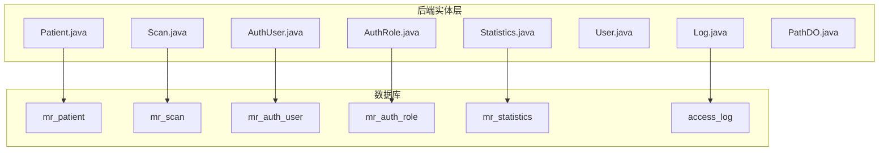
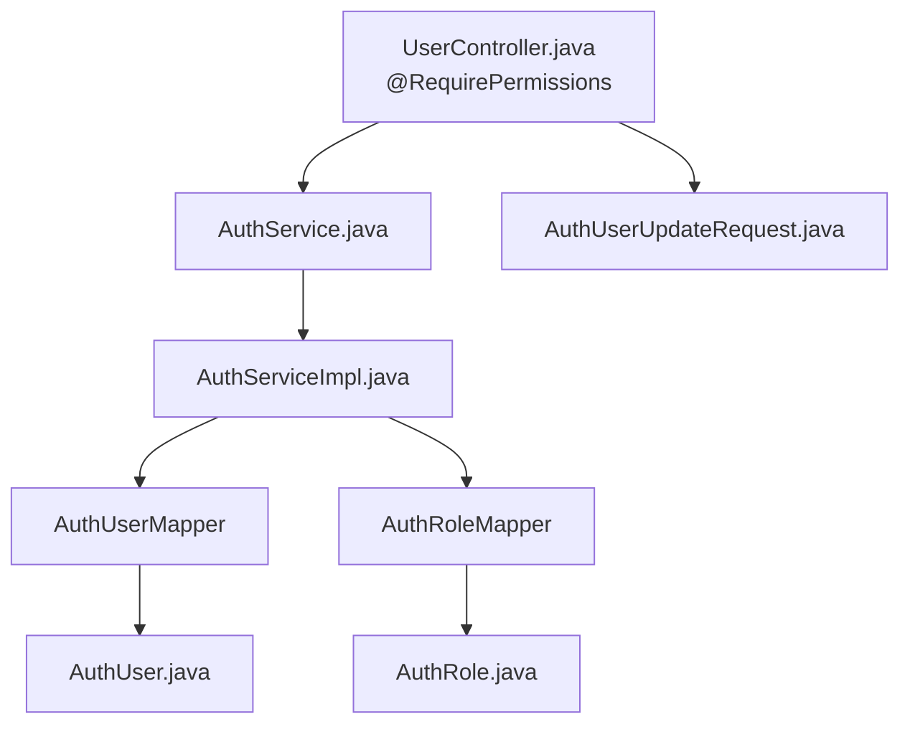
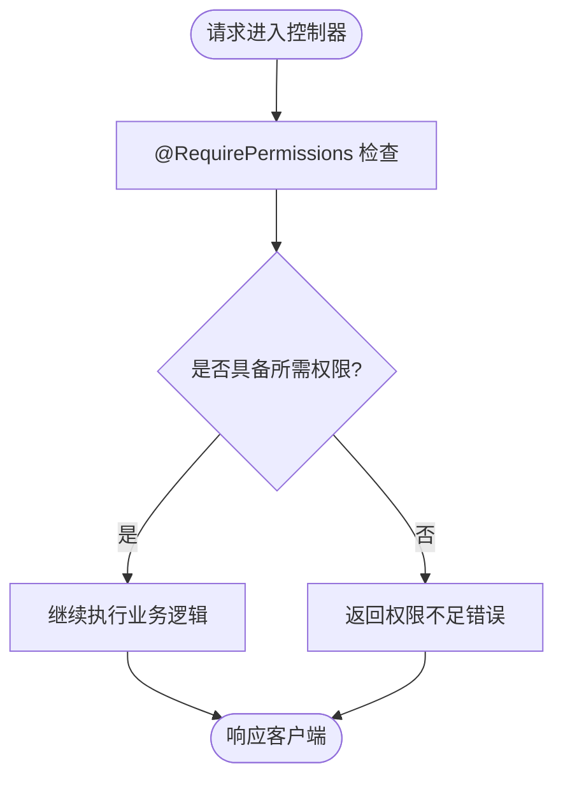
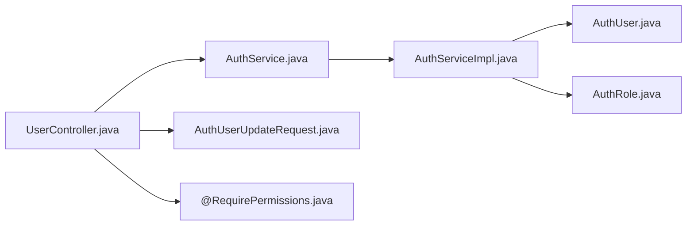

# 实体模型设计


**本文引用的文件**
- [Patient.java](file://backend-repo/src/main/java/com/zjcxph/imgapi/entity/Patient.java)
- [Scan.java](file://backend-repo/src/main/java/com/zjcxph/imgapi/entity/Scan.java)
- [AuthUser.java](file://backend-repo/src/main/java/com/zjcxph/imgapi/entity/AuthUser.java)
- [AuthRole.java](file://backend-repo/src/main/java/com/zjcxph/imgapi/entity/AuthRole.java)
- [Statistics.java](file://backend-repo/src/main/java/com/zjcxph/imgapi/entity/Statistics.java)
- [User.java](file://backend-repo/src/main/java/com/zjcxph/imgapi/entity/User.java)
- [Log.java](file://backend-repo/src/main/java/com/zjcxph/imgapi/entity/Log.java)
- [PathDO.java](file://backend-repo/src/main/java/com/zjcxph/imgapi/entity/PathDO.java)
- [schema.sql](file://mrr-db/schema.sql)
- [AuthUserUpdateRequest.java](file://backend-repo/src/main/java/com/zjcxph/imgapi/dto/req/AuthUserUpdateRequest.java)
- [RequirePermissions.java](file://backend-repo/src/main/java/com/zjcxph/imgapi/annotation/RequirePermissions.java)
- [AuthService.java](file://backend-repo/src/main/java/com/zjcxph/imgapi/service/AuthService.java)
- [AuthServiceImpl.java](file://backend-repo/src/main/java/com/zjcxph/imgapi/service/impl/AuthServiceImpl.java)
- [UserController.java](file://backend-repo/src/main/java/com/zjcxph/imgapi/controller/UserController.java)


## 目录
1. [引言](#引言)
2. [项目结构](#项目结构)
3. [核心组件](#核心组件)
4. [架构总览](#架构总览)
5. [详细组件分析](#详细组件分析)
6. [依赖分析](#依赖分析)
7. [性能考虑](#性能考虑)
8. [故障排查指南](#故障排查指南)
9. [结论](#结论)
10. [附录](#附录)

## 引言
本设计文档聚焦于MRR系统的Java实体模型，系统性阐述实体类与数据库表之间的映射关系、字段对应、数据类型转换、业务规则验证、实体间关联与组合模式、序列化与JSON转换规则、实体生命周期与状态转换，以及最佳实践与使用示例。重点覆盖以下核心实体：Patient（患者）、Scan（扫描记录）、AuthUser（用户）、AuthRole（角色）、Statistics（统计数据），并结合数据库schema与后端服务层实现进行说明。

## 项目结构
后端采用分层架构，实体位于entity包中，配合mapper、service、controller完成数据访问与业务处理；数据库schema位于mrr-db目录，定义了各核心表及索引。



图表来源
- [schema.sql:16-48](file://mrr-db/schema.sql#L16-L48)
- [Patient.java:1-103](file://backend-repo/src/main/java/com/zjcxph/imgapi/entity/Patient.java#L1-L103)
- [Scan.java:1-116](file://backend-repo/src/main/java/com/zjcxph/imgapi/entity/Scan.java#L1-L116)
- [AuthUser.java:1-134](file://backend-repo/src/main/java/com/zjcxph/imgapi/entity/AuthUser.java#L1-L134)
- [AuthRole.java:1-53](file://backend-repo/src/main/java/com/zjcxph/imgapi/entity/AuthRole.java#L1-L53)
- [Statistics.java:1-74](file://backend-repo/src/main/java/com/zjcxph/imgapi/entity/Statistics.java#L1-L74)
- [Log.java:1-138](file://backend-repo/src/main/java/com/zjcxph/imgapi/entity/Log.java#L1-L138)

章节来源
- [schema.sql:1-95](file://mrr-db/schema.sql#L1-L95)

## 核心组件
本节对五个核心实体进行属性定义、业务含义、字段映射、数据类型转换、验证规则与序列化配置的系统梳理，并给出使用示例与最佳实践。

- 患者实体（Patient）
  - 字段映射：id → 主键；idcard → 身份证号；BAH → 病案号；name → 姓名；admissiontime → 入院时间；department → 住院科室
  - 数据类型：整型主键、文本字段、日期字符串
  - 业务规则：唯一性约束由数据库主键保证；入院时间与科室用于统计与检索
  - 验证与序列化：未见显式校验注解；默认JSON序列化遵循字段命名
  - 使用示例：通过检索条件（如BAH或身份证号）查询患者信息，用于扫描记录关联
  - 最佳实践：在DAO层按BAH与身份证号建立索引以提升查询性能

- 扫描记录实体（Scan）
  - 字段映射：id → 主键；BRXH → 病人序号；BAH → 病案号；filename → 文件名；btype → 病案类型；pages → 页数；openerno → 开户员编号；uploaddate → 上传时间；uploadflag → 上传标志；folder → 存储目录
  - 数据类型：整型主键、整型btype/pages/uploadflag、文本字段、日期字符串
  - 业务规则：与Patient通过BAH关联；pages用于统计；uploadflag用于上传状态管理
  - 验证与序列化：未见显式校验注解；默认JSON序列化遵循字段命名
  - 使用示例：新增扫描记录时设置BAH与BRXH，上传完成后更新uploadflag与uploaddate
  - 最佳实践：在BAH与BRXH上建立索引；uploadflag作为状态字段需统一枚举值

- 用户实体（AuthUser）
  - 字段映射：id → 主键（自增）；username → 登录名（唯一）；display_name → 显示名；password_hash → 密码哈希；role_code → 角色编码；status → 状态；last_login_at → 最后登录时间；created_at/updated_at → 创建与更新时间
  - 数据类型：长整型id；文本字段；时间字段（LocalDateTime）
  - 业务规则：状态仅允许“active”或“disabled”；密码哈希用于登录认证；权限来源于角色与CSV字符串
  - 验证与序列化：密码哈希与权限CSV标注忽略序列化；提供getPermissions()/hasPermission()方法进行权限解析
  - 使用示例：登录流程中校验用户名与密码哈希，成功后更新最后登录时间
  - 最佳实践：避免在响应体中返回password_hash与permissionsCsv；权限解析应缓存或延迟加载

- 角色实体（AuthRole）
  - 字段映射：code → 角色编码（主键）；name → 角色名称；description → 描述；permissions → 权限集合；sort_order → 排序
  - 数据类型：文本主键、文本描述、整型排序
  - 业务规则：code唯一；permissions为逗号分隔的权限列表；排序决定角色优先级
  - 验证与序列化：未见显式校验注解；默认JSON序列化遵循字段命名
  - 使用示例：用户绑定role_code后，系统从AuthRole读取permissions并注入会话
  - 最佳实践：权限字符串格式标准化；排序字段用于UI展示与权限继承

- 统计数据实体（Statistics）
  - 字段映射：bah → 病案号；cid → 客户标识；openerno → 开户员编号；date → 日期；type → 类型；pages → 页数
  - 数据类型：文本字段、整型页数
  - 业务规则：按日期与类型聚合统计；pages累加用于报表
  - 验证与序列化：未见显式校验注解；默认JSON序列化遵循字段命名
  - 使用示例：每日定时任务汇总扫描记录生成统计数据
  - 最佳实践：建立复合索引(bah,date,type)以优化统计查询

章节来源
- [Patient.java:1-103](file://backend-repo/src/main/java/com/zjcxph/imgapi/entity/Patient.java#L1-L103)
- [Scan.java:1-116](file://backend-repo/src/main/java/com/zjcxph/imgapi/entity/Scan.java#L1-L116)
- [AuthUser.java:1-134](file://backend-repo/src/main/java/com/zjcxph/imgapi/entity/AuthUser.java#L1-L134)
- [AuthRole.java:1-53](file://backend-repo/src/main/java/com/zjcxph/imgapi/entity/AuthRole.java#L1-L53)
- [Statistics.java:1-74](file://backend-repo/src/main/java/com/zjcxph/imgapi/entity/Statistics.java#L1-L74)

## 架构总览
下图展示了实体与数据库表的映射关系、控制器到服务层的调用链路，以及权限注解在控制器中的应用。



图表来源
- [UserController.java:1-95](file://backend-repo/src/main/java/com/zjcxph/imgapi/controller/UserController.java#L1-L95)
- [AuthService.java:1-25](file://backend-repo/src/main/java/com/zjcxph/imgapi/service/AuthService.java#L1-L25)
- [AuthServiceImpl.java:1-151](file://backend-repo/src/main/java/com/zjcxph/imgapi/service/impl/AuthServiceImpl.java#L1-L151)
- [AuthUser.java:1-134](file://backend-repo/src/main/java/com/zjcxph/imgapi/entity/AuthUser.java#L1-L134)
- [AuthRole.java:1-53](file://backend-repo/src/main/java/com/zjcxph/imgapi/entity/AuthRole.java#L1-L53)
- [AuthUserUpdateRequest.java:1-41](file://backend-repo/src/main/java/com/zjcxph/imgapi/dto/req/AuthUserUpdateRequest.java#L1-L41)

章节来源
- [RequirePermissions.java:1-13](file://backend-repo/src/main/java/com/zjcxph/imgapi/annotation/RequirePermissions.java#L1-L13)
- [UserController.java:1-95](file://backend-repo/src/main/java/com/zjcxph/imgapi/controller/UserController.java#L1-L95)
- [AuthServiceImpl.java:1-151](file://backend-repo/src/main/java/com/zjcxph/imgapi/service/impl/AuthServiceImpl.java#L1-L151)

## 详细组件分析

### 患者实体（Patient）与数据库映射
- 表结构要点：主键id；idcard、BAH、name、admissiontime、department
- 字段映射：id → id；idcard → idCard；BAH → bah；name → name；admissiontime → admissionTime；department → department
- 数据类型：id为整型；其余为文本；admissiontime为字符串表示日期
- 业务含义：承载患者基本信息，用于扫描记录与统计的关联
- 关联关系：Scan通过BAH与Patient关联；Statistics通过bah关联
- 验证与序列化：未见显式校验注解；默认JSON序列化遵循字段命名
- 使用示例：根据BAH查询患者信息，再查询其扫描记录
- 最佳实践：在BAH与idcard上建立索引；admissiontime建议统一格式存储

章节来源
- [schema.sql:16-24](file://mrr-db/schema.sql#L16-L24)
- [Patient.java:1-103](file://backend-repo/src/main/java/com/zjcxph/imgapi/entity/Patient.java#L1-L103)

### 扫描记录实体（Scan）与数据库映射
- 表结构要点：主键id；BRXH、BAH、filename、btype、pages、openerno、uploaddate、uploadflag、folder
- 字段映射：id → id；BRXH → brxh；BAH → bah；filename → filename；btype → btype；pages → pages；openerno → openerNo；uploaddate → uploadDate；uploadflag → uploadFlag；folder → folder
- 数据类型：id为主键整型；btype/pages/uploadflag为整型；uploaddate为字符串表示日期
- 业务含义：记录扫描文件元数据与状态，支持统计与归档
- 关联关系：与Patient通过BAH关联；与Statistics通过bah/openerNo/date/type关联
- 验证与序列化：未见显式校验注解；默认JSON序列化遵循字段命名
- 使用示例：新增扫描记录时设置BAH与BRXH，上传完成后更新uploadflag与uploaddate
- 最佳实践：uploadflag统一为枚举值；在BAH与BRXH上建立索引

章节来源
- [schema.sql:26-38](file://mrr-db/schema.sql#L26-L38)
- [Scan.java:1-116](file://backend-repo/src/main/java/com/zjcxph/imgapi/entity/Scan.java#L1-L116)

### 用户实体（AuthUser）与数据库映射
- 表结构要点：主键id（自增）；username（唯一）、display_name、password_hash、role_code、status（默认active）、last_login_at、created_at、updated_at
- 字段映射：id → id；username → username；display_name → displayName；password_hash → passwordHash；role_code → roleCode；status → status；last_login_at → lastLoginAt；created_at → createdAt；updated_at → updatedAt
- 数据类型：id为长整型；文本字段；时间字段（LocalDateTime）
- 业务含义：承载用户认证与授权信息，包含权限CSV解析与序列化忽略
- 关联关系：与AuthRole通过role_code关联；通过权限CSV与权限系统集成
- 验证与序列化：passwordHash与permissionsCsv标注忽略序列化；提供getPermissions()/hasPermission()方法
- 使用示例：登录时校验用户名与密码哈希，成功后更新last_login_at
- 最佳实践：避免在响应体中返回passwordHash与permissionsCsv；权限解析应缓存或延迟加载

章节来源
- [schema.sql:67-78](file://mrr-db/schema.sql#L67-L78)
- [AuthUser.java:1-134](file://backend-repo/src/main/java/com/zjcxph/imgapi/entity/AuthUser.java#L1-L134)

### 角色实体（AuthRole）与数据库映射
- 表结构要点：主键code；name、description、permissions、sort_order（默认0）
- 字段映射：code → code；name → name；description → description；permissions → permissions；sort_order → sortOrder
- 数据类型：code为主键文本；permissions为必填文本；sort_order为整型
- 业务含义：定义角色与权限集合，支持权限继承与排序
- 关联关系：AuthUser通过role_code关联AuthRole
- 验证与序列化：未见显式校验注解；默认JSON序列化遵循字段命名
- 使用示例：用户绑定role_code后，系统从AuthRole读取permissions并注入会话
- 最佳实践：permissions字符串格式标准化；sort_order用于UI展示与权限继承

章节来源
- [schema.sql:58-65](file://mrr-db/schema.sql#L58-L65)
- [AuthRole.java:1-53](file://backend-repo/src/main/java/com/zjcxph/imgapi/entity/AuthRole.java#L1-L53)

### 统计数据实体（Statistics）与数据库映射
- 表结构要点：bah、cid、openerno、date、type、pages
- 字段映射：bah → bah；cid → cid；openerno → openerNo；date → date；type → type；pages → pages
- 数据类型：文本字段、整型pages
- 业务含义：按日期与类型聚合扫描记录，支持报表与归档统计
- 关联关系：与Scan通过bah/openerNo/date/type关联；与Patient通过bah关联
- 验证与序列化：未见显式校验注解；默认JSON序列化遵循字段命名
- 使用示例：每日定时任务汇总扫描记录生成统计数据
- 最佳实践：建立复合索引(bah,date,type)以优化统计查询

章节来源
- [schema.sql:40-48](file://mrr-db/schema.sql#L40-L48)
- [Statistics.java:1-74](file://backend-repo/src/main/java/com/zjcxph/imgapi/entity/Statistics.java#L1-L74)

### 登录与权限控制流程（序列图）
该序列图展示登录请求从控制器到服务层再到数据访问层的完整流程，以及权限注解的应用。

```mermaid
sequenceDiagram
participant Client as "客户端"
participant Ctrl as "UserController"
participant Svc as "AuthService"
participant Impl as "AuthServiceImpl"
participant UMap as "AuthUserMapper"
participant RMap as "AuthRoleMapper"
Client->>Ctrl : POST "/login"
Ctrl->>Svc : login(UserRequest)
Svc->>Impl : login(UserRequest)
Impl->>UMap : findByUsername(username)
UMap-->>Impl : AuthUser
Impl->>Impl : 校验状态与密码
Impl->>UMap : updateLastLoginAt(userId, now)
Impl-->>Svc : LoginResponseDTO
Svc-->>Ctrl : LoginResponseDTO
Ctrl-->>Client : Result&lt;LoginResponseDTO&gt;
```

图表来源
- [UserController.java:38-47](file://backend-repo/src/main/java/com/zjcxph/imgapi/controller/UserController.java#L38-L47)
- [AuthService.java:12-13](file://backend-repo/src/main/java/com/zjcxph/imgapi/service/AuthService.java#L12-L13)
- [AuthServiceImpl.java:36-62](file://backend-repo/src/main/java/com/zjcxph/imgapi/service/impl/AuthServiceImpl.java#L36-L62)
- [AuthUser.java:1-134](file://backend-repo/src/main/java/com/zjcxph/imgapi/entity/AuthUser.java#L1-L134)

章节来源
- [UserController.java:1-95](file://backend-repo/src/main/java/com/zjcxph/imgapi/controller/UserController.java#L1-L95)
- [AuthServiceImpl.java:1-151](file://backend-repo/src/main/java/com/zjcxph/imgapi/service/impl/AuthServiceImpl.java#L1-L151)

### 权限注解与控制器保护（流程图）
该流程图展示控制器方法上的权限注解如何在拦截器中生效，确保只有具备相应权限的用户才能访问。



图表来源
- [RequirePermissions.java:8-12](file://backend-repo/src/main/java/com/zjcxph/imgapi/annotation/RequirePermissions.java#L8-L12)
- [UserController.java:60-71](file://backend-repo/src/main/java/com/zjcxph/imgapi/controller/UserController.java#L60-L71)

章节来源
- [RequirePermissions.java:1-13](file://backend-repo/src/main/java/com/zjcxph/imgapi/annotation/RequirePermissions.java#L1-L13)
- [UserController.java:1-95](file://backend-repo/src/main/java/com/zjcxph/imgapi/controller/UserController.java#L1-L95)

## 依赖分析
- 实体与数据库表的依赖：每个实体均与对应表存在一一映射关系，字段命名与类型基本一致
- 控制器与服务层的依赖：UserController依赖AuthService接口，AuthServiceImpl实现具体业务逻辑
- 权限注解与拦截器：@RequirePermissions用于控制器方法，结合拦截器实现权限校验
- DTO与实体的依赖：AuthUserUpdateRequest用于更新用户信息，与AuthUser实体字段对应



图表来源
- [UserController.java:1-95](file://backend-repo/src/main/java/com/zjcxph/imgapi/controller/UserController.java#L1-L95)
- [AuthService.java:1-25](file://backend-repo/src/main/java/com/zjcxph/imgapi/service/AuthService.java#L1-L25)
- [AuthServiceImpl.java:1-151](file://backend-repo/src/main/java/com/zjcxph/imgapi/service/impl/AuthServiceImpl.java#L1-L151)
- [AuthUser.java:1-134](file://backend-repo/src/main/java/com/zjcxph/imgapi/entity/AuthUser.java#L1-L134)
- [AuthRole.java:1-53](file://backend-repo/src/main/java/com/zjcxph/imgapi/entity/AuthRole.java#L1-L53)
- [AuthUserUpdateRequest.java:1-41](file://backend-repo/src/main/java/com/zjcxph/imgapi/dto/req/AuthUserUpdateRequest.java#L1-L41)
- [RequirePermissions.java:1-13](file://backend-repo/src/main/java/com/zjcxph/imgapi/annotation/RequirePermissions.java#L1-L13)

章节来源
- [UserController.java:1-95](file://backend-repo/src/main/java/com/zjcxph/imgapi/controller/UserController.java#L1-L95)
- [AuthServiceImpl.java:1-151](file://backend-repo/src/main/java/com/zjcxph/imgapi/service/impl/AuthServiceImpl.java#L1-L151)

## 性能考虑
- 索引策略：在BAH、BRXH、username、role_code等高频查询字段上建立索引，提升查询与关联效率
- 时间字段：统一使用字符串表示日期（如admissiontime、uploaddate），便于跨数据库兼容；若需要范围查询，建议在数据库层面建立索引
- 权限解析：权限CSV解析应在服务层进行缓存或延迟加载，避免重复解析
- 序列化：避免在响应体中返回敏感字段（如passwordHash、permissionsCsv），减少网络传输与安全风险

## 故障排查指南
- 登录失败：检查用户名是否存在、状态是否为active、密码哈希是否匹配
- 权限不足：确认@RequirePermissions注解配置与用户角色权限是否一致
- 查询缓慢：检查相关字段是否建立索引，特别是BAH、BRXH、username、role_code
- JSON异常：确认实体字段命名与序列化规则，避免敏感字段泄露

章节来源
- [AuthServiceImpl.java:36-62](file://backend-repo/src/main/java/com/zjcxph/imgapi/service/impl/AuthServiceImpl.java#L36-L62)
- [UserController.java:60-71](file://backend-repo/src/main/java/com/zjcxph/imgapi/controller/UserController.java#L60-L71)

## 结论
MRR实体模型围绕患者、扫描记录、用户、角色与统计数据构建，实现了清晰的领域建模与数据库映射。通过权限注解与服务层实现，系统在认证与授权方面具备良好的可扩展性。建议在索引、时间字段格式、权限解析与序列化方面持续优化，以提升整体性能与安全性。

## 附录
- 数据库初始化脚本包含角色与用户的初始数据，便于快速启动与测试
- 实体类均采用Lombok简化getter/setter/toString，保持代码简洁
- DTO与实体分离，职责清晰，便于扩展与维护

章节来源
- [schema.sql:83-94](file://mrr-db/schema.sql#L83-L94)
- [AuthUser.java:50-57](file://backend-repo/src/main/java/com/zjcxph/imgapi/entity/AuthUser.java#L50-L57)
- [AuthUser.java:75-82](file://backend-repo/src/main/java/com/zjcxph/imgapi/entity/AuthUser.java#L75-L82)