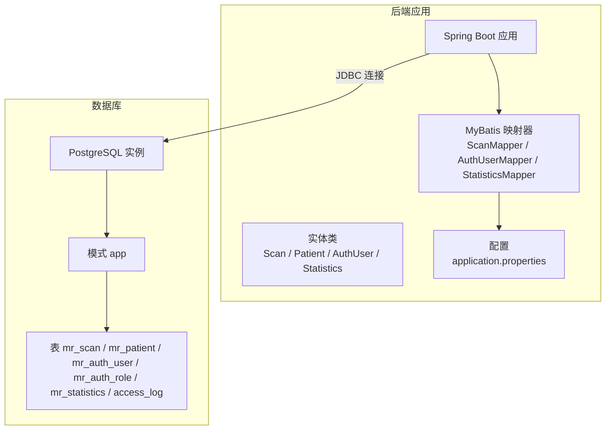
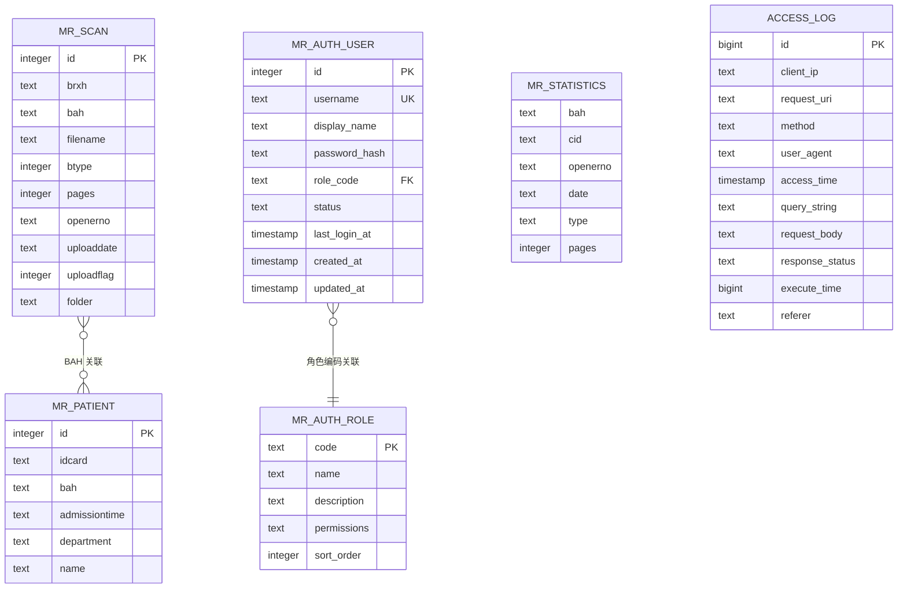
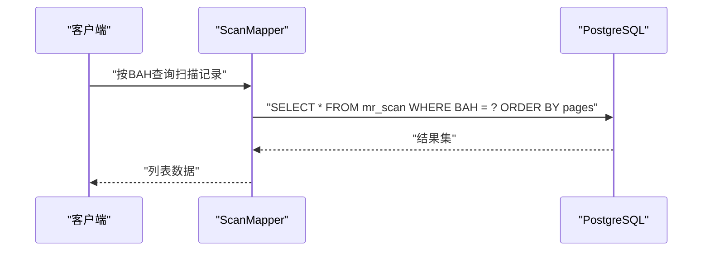
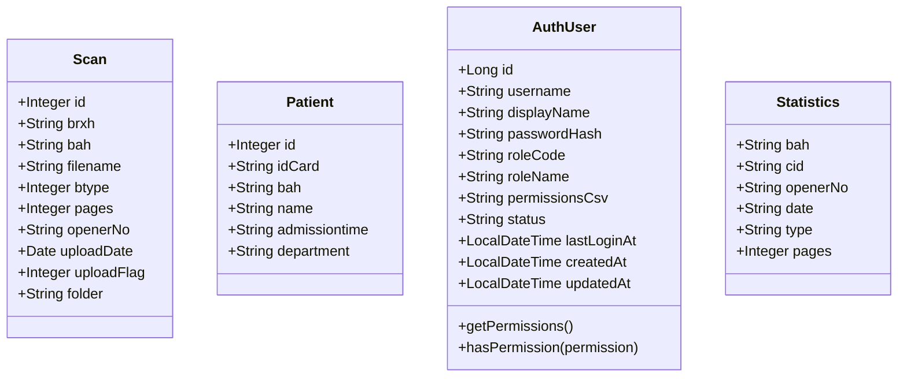
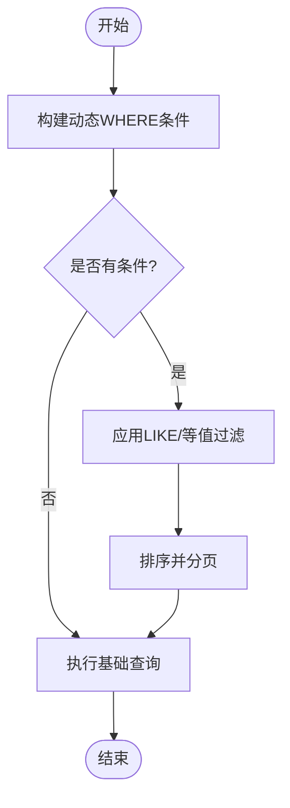
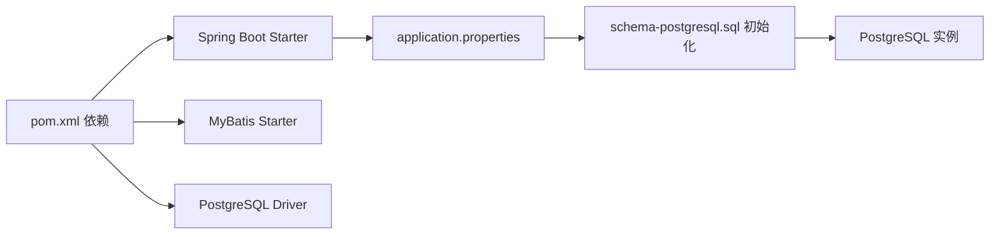

# 数据架构

**本文引用的文件**
- [schema-postgresql.sql](file://backend-repo/src/main/resources/schema-postgresql.sql)
- [schema.sql](file://mrr-db/schema.sql)
- [application.properties](file://backend-repo/src/main/resources/application.properties)
- [docker-compose.yml](file://docker-compose.yml)
- [Scan.java](file://backend-repo/src/main/java/com/zjcxph/imgapi/entity/Scan.java)
- [Patient.java](file://backend-repo/src/main/java/com/zjcxph/imgapi/entity/Patient.java)
- [AuthUser.java](file://backend-repo/src/main/java/com/zjcxph/imgapi/entity/AuthUser.java)
- [Statistics.java](file://backend-repo/src/main/java/com/zjcxph/imgapi/entity/Statistics.java)
- [ScanMapper.java](file://backend-repo/src/main/java/com/zjcxph/imgapi/mapper/ScanMapper.java)
- [AuthUserMapper.java](file://backend-repo/src/main/java/com/zjcxph/imgapi/mapper/AuthUserMapper.java)
- [StatisticsMapper.java](file://backend-repo/src/main/java/com/zjcxph/imgapi/mapper/StatisticsMapper.java)
- [reset-br-admin-password.sql](file://backend-repo/src/main/resources/reset-br-admin-password.sql)
- [pom.xml](file://backend-repo/pom.xml)

## 目录
1. [简介](#简介)
2. [项目结构](#项目结构)
3. [核心组件](#核心组件)
4. [架构总览](#架构总览)
5. [详细组件分析](#详细组件分析)
6. [依赖分析](#依赖分析)
7. [性能考虑](#性能考虑)
8. [故障排查指南](#故障排查指南)
9. [结论](#结论)
10. [附录](#附录)

## 简介
本设计文档面向MRR（医学记录归档）系统的数据架构，聚焦PostgreSQL数据库的整体设计与表结构关系，系统性阐述以下主题：
- 核心业务实体：扫描记录、患者信息、用户权限、统计数据的字段定义与业务规则
- 索引策略、约束条件与外键关系
- 数据访问层设计模式、MyBatis映射配置与SQL查询优化
- 数据一致性保证、事务管理与并发控制机制
- 数据迁移策略、版本升级方案与备份恢复计划
- 数据安全、隐私保护与访问控制的技术实现

## 项目结构
后端采用Spring Boot + MyBatis集成PostgreSQL，数据库初始化脚本位于资源目录，容器化部署通过Compose编排PostgreSQL与应用服务。

图表来源
- [application.properties:10-22](file://backend-repo/src/main/resources/application.properties#L10-L22)
- [schema-postgresql.sql:1-109](file://backend-repo/src/main/resources/schema-postgresql.sql#L1-L109)

章节来源
- [application.properties:10-22](file://backend-repo/src/main/resources/application.properties#L10-L22)
- [docker-compose.yml:1-47](file://docker-compose.yml#L1-L47)

## 核心组件
本节从“实体-映射-查询”的维度梳理核心业务对象与数据访问接口。

- 扫描记录（Scan）
  - 字段：主键自增、病案号BAH、病人序号BRXH、文件名、类型、页数、操作员编号、上传时间、上传标志、存储目录
  - 业务规则：上传标志用于软删除；按页数排序展示；支持按BAH/BRXH/条件过滤与分页查询
- 患者信息（Patient）
  - 字段：主键自增、身份证号、病案号、姓名、入院时间、住院科室
  - 业务规则：作为扫描记录关联的患者元数据，支持按身份证号检索
- 用户权限（AuthUser + AuthRole）
  - 字段：用户主键自增、用户名唯一、显示名、密码哈希、角色编码、状态、最近登录时间、创建/更新时间
  - 角色字段：角色编码为主键，包含权限字符串与排序
  - 业务规则：用户与角色通过角色编码关联；权限以逗点分隔的字符串表达
- 统计数据（Statistics）
  - 字段：病案号、人员编号、操作员编号、日期、类型、页数
  - 业务规则：用于统计分析，支持按关键字、类型、日期范围筛选与聚合统计

章节来源
- [Scan.java:1-116](file://backend-repo/src/main/java/com/zjcxph/imgapi/entity/Scan.java#L1-L116)
- [Patient.java:1-103](file://backend-repo/src/main/java/com/zjcxph/imgapi/entity/Patient.java#L1-L103)
- [AuthUser.java:1-134](file://backend-repo/src/main/java/com/zjcxph/imgapi/entity/AuthUser.java#L1-L134)
- [Statistics.java:1-74](file://backend-repo/src/main/java/com/zjcxph/imgapi/entity/Statistics.java#L1-L74)

## 架构总览
下图展示数据库层的表结构、索引与约束，以及典型查询路径。

图表来源
- [schema-postgresql.sql:3-59](file://backend-repo/src/main/resources/schema-postgresql.sql#L3-L59)
- [schema-postgresql.sql:61-73](file://backend-repo/src/main/resources/schema-postgresql.sql#L61-L73)

章节来源
- [schema-postgresql.sql:1-109](file://backend-repo/src/main/resources/schema-postgresql.sql#L1-L109)

## 详细组件分析

### 表结构与约束
- app.mr_scan
  - 主键：id（自增）
  - 约束：无显式NOT NULL约束（除主键）
  - 索引：基于BAH、BRXH的常用查询列
- app.mr_patient
  - 主键：id（自增）
  - 索引：基于idcard的常用查询列
- app.mr_auth_role
  - 主键：code
  - 约束：name、permissions必填，sort_order默认0
- app.mr_auth_user
  - 主键：id（自增）
  - 唯一：username
  - 外键：role_code → app.mr_auth_role(code)，级联更新
  - 默认值：status默认active，created_at/updated_at默认当前时间
  - 索引：username、role_code
- app.mr_statistics
  - 主键：无（多字段组合非PK），但具备聚合与统计用途
  - 索引：bah、date、type
- app.access_log
  - 主键：id（自增）
  - 索引：access_time（降序）、access_time+id（升序）、client_ip、request_uri、method、response_status、method+response_status

章节来源
- [schema-postgresql.sql:3-73](file://backend-repo/src/main/resources/schema-postgresql.sql#L3-L73)

### 数据访问层设计模式与MyBatis映射
- 设计模式
  - Mapper接口 + 注解SQL：集中声明CRUD与复杂查询
  - 动态SQL：根据请求参数拼接查询条件，支持分页与排序
  - DTO分离：统计查询返回DTO对象，避免实体类字段冗余
- 关键映射器
  - ScanMapper
    - 支持按BAH/BRXH查询、批量ID取路径、动态更新、分页查询、条件过滤与计数
  - AuthUserMapper
    - 左连接角色表查询用户完整信息（含角色名与权限CSV）
    - 提供登录时间更新、用户信息更新、状态变更、新增用户
  - StatisticsMapper
    - 支持关键字、类型、日期范围过滤，按多字段排序与分页
    - 提供聚合统计：按BAH、按日期、按类型统计记录数与总页数
- SQL优化要点
  - 使用索引覆盖查询（如bah/date/type）
  - 动态SQL中对空值进行判空，避免全表扫描
  - 分页查询使用LIMIT/OFFSET，结合ORDER BY主键或索引列

图表来源
- [ScanMapper.java:17-18](file://backend-repo/src/main/java/com/zjcxph/imgapi/mapper/ScanMapper.java#L17-L18)
- [schema-postgresql.sql:75-76](file://backend-repo/src/main/resources/schema-postgresql.sql#L75-L76)

章节来源
- [ScanMapper.java:1-131](file://backend-repo/src/main/java/com/zjcxph/imgapi/mapper/ScanMapper.java#L1-L131)
- [AuthUserMapper.java:1-78](file://backend-repo/src/main/java/com/zjcxph/imgapi/mapper/AuthUserMapper.java#L1-L78)
- [StatisticsMapper.java:1-168](file://backend-repo/src/main/java/com/zjcxph/imgapi/mapper/StatisticsMapper.java#L1-L168)

### 业务实体类与字段映射
- Scan
  - 字段映射：id、brxh、bah、filename、btype、pages、openerNo、uploadDate、uploadFlag、folder
  - 业务规则：上传标志用于软删除；按页数排序
- Patient
  - 字段映射：id、idCard、bah、name、admissiontime、department
  - 业务规则：支持按身份证号检索
- AuthUser
  - 字段映射：id、username、displayName、passwordHash、roleCode、roleName、permissionsCsv、status、lastLoginAt、createdAt、updatedAt
  - 权限解析：permissionsCsv拆分为集合，提供hasPermission判断
- Statistics
  - 字段映射：bah、cid、openerNo、date、type、pages
  - 业务规则：用于统计分析与报表

图表来源
- [Scan.java:1-116](file://backend-repo/src/main/java/com/zjcxph/imgapi/entity/Scan.java#L1-L116)
- [Patient.java:1-103](file://backend-repo/src/main/java/com/zjcxph/imgapi/entity/Patient.java#L1-L103)
- [AuthUser.java:1-134](file://backend-repo/src/main/java/com/zjcxph/imgapi/entity/AuthUser.java#L1-L134)
- [Statistics.java:1-74](file://backend-repo/src/main/java/com/zjcxph/imgapi/entity/Statistics.java#L1-L74)

章节来源
- [Scan.java:1-116](file://backend-repo/src/main/java/com/zjcxph/imgapi/entity/Scan.java#L1-L116)
- [Patient.java:1-103](file://backend-repo/src/main/java/com/zjcxph/imgapi/entity/Patient.java#L1-L103)
- [AuthUser.java:1-134](file://backend-repo/src/main/java/com/zjcxph/imgapi/entity/AuthUser.java#L1-L134)
- [Statistics.java:1-74](file://backend-repo/src/main/java/com/zjcxph/imgapi/entity/Statistics.java#L1-L74)

### 查询流程与优化
- 按BAH查询扫描记录
  - SQL：基于BAH与pages排序
  - 索引：idx_mr_scan_bah
- 动态条件查询与分页
  - SQL：根据请求参数拼接WHERE子句，支持多字段模糊匹配与等值过滤
  - 索引：idx_mr_scan_bah、idx_mr_scan_brxh
- 统计查询
  - SQL：按日期/类型/BAH分组聚合，支持日期替换函数与排序
  - 索引：idx_mr_statistics_date、idx_mr_statistics_type、idx_mr_statistics_bah

图表来源
- [ScanMapper.java:80-113](file://backend-repo/src/main/java/com/zjcxph/imgapi/mapper/ScanMapper.java#L80-L113)
- [StatisticsMapper.java:24-72](file://backend-repo/src/main/java/com/zjcxph/imgapi/mapper/StatisticsMapper.java#L24-L72)

章节来源
- [ScanMapper.java:80-130](file://backend-repo/src/main/java/com/zjcxph/imgapi/mapper/ScanMapper.java#L80-L130)
- [StatisticsMapper.java:24-167](file://backend-repo/src/main/java/com/zjcxph/imgapi/mapper/StatisticsMapper.java#L24-L167)

## 依赖分析
- 数据库初始化
  - Spring Boot在启动时加载PostgreSQL初始化脚本，创建模式与表，并建立索引
- 连接配置
  - JDBC URL指向PostgreSQL，设置当前Schema为app
- 容器化部署
  - Compose编排PostgreSQL与后端服务，后端通过环境变量注入数据库连接参数

图表来源
- [pom.xml:27-114](file://backend-repo/pom.xml#L27-L114)
- [application.properties:10-22](file://backend-repo/src/main/resources/application.properties#L10-L22)
- [schema-postgresql.sql:1-109](file://backend-repo/src/main/resources/schema-postgresql.sql#L1-L109)

章节来源
- [pom.xml:27-114](file://backend-repo/pom.xml#L27-L114)
- [application.properties:10-22](file://backend-repo/src/main/resources/application.properties#L10-L22)
- [docker-compose.yml:19-34](file://docker-compose.yml#L19-L34)

## 性能考虑
- 索引策略
  - 扫描记录：BAH、BRXH、日期、类型、页数等高频过滤与排序字段建立索引
  - 用户与日志：username、role_code、access_time、client_ip、request_uri、method、response_status等建立复合与单列索引
- 查询优化
  - 使用动态SQL时注意判空，避免全表扫描
  - 分页查询优先使用主键或索引列排序，减少排序开销
- 并发控制
  - 使用PostgreSQL默认隔离级别与行级锁；对高并发写入场景建议引入连接池参数调优（最大池大小、空闲超时、最大生命周期）
- 缓存与压缩
  - 后端启用响应压缩与静态资源缓存，降低网络传输与数据库压力

## 故障排查指南
- 初始化失败
  - 检查application.properties中的数据库URL、用户名、密码是否正确
  - 确认PostgreSQL实例健康且Schema已创建
- 登录异常
  - 校验mr_auth_user表中是否存在对应用户名
  - 如需重置管理员密码，可执行reset-br-admin-password.sql
- 访问日志清理
  - 若开启日志保留清理，检查定时任务配置与批处理参数

章节来源
- [application.properties:40-45](file://backend-repo/src/main/resources/application.properties#L40-L45)
- [reset-br-admin-password.sql:1-16](file://backend-repo/src/main/resources/reset-br-admin-password.sql#L1-L16)

## 结论
本数据架构围绕PostgreSQL构建，采用MyBatis映射器实现清晰的数据访问层，配合合理的索引与查询优化策略满足扫描记录、患者信息、用户权限与统计数据的业务需求。通过容器化部署与初始化脚本确保环境一致性，同时提供权限模型与访问日志以支撑安全与审计要求。后续可在大表场景引入并发索引与分页优化，并制定标准化迁移与备份恢复流程以保障生产稳定性。

## 附录

### 数据一致性与事务管理
- 事务边界
  - MyBatis与Spring事务管理由框架统一处理，建议在Service层明确事务边界，确保读写一致性
- 并发控制
  - 使用PostgreSQL默认隔离级别；对关键写操作使用SELECT ... FOR UPDATE或适当的行级锁
- 幂等性
  - 对重复请求（如上传标志更新）应进行前置校验，避免重复修改

### 数据迁移策略与版本升级
- 迁移原则
  - 所有变更必须通过迁移脚本；禁止直接在生产库上手工修改
  - DDL与DML分离，先结构后数据
- 零停机策略
  - 采用“扩展-迁移-收缩”模式：新增列/表后双写，回填数据，再切换读取逻辑，最后删除旧结构
- 索引与大表
  - 使用CONCURRENTLY创建索引；对大表回填采用批次更新并提交

### 备份恢复计划
- 备份策略
  - 建议每日全量备份+增量日志备份，保留至少90天历史
- 恢复演练
  - 定期进行恢复演练，验证备份完整性与恢复时间目标
- 灾备
  - 建议异地容灾，结合PostgreSQL流复制或逻辑复制

### 数据安全与隐私保护
- 访问控制
  - 用户权限通过角色编码与权限字符串控制；登录成功后更新最近登录时间
- 密码安全
  - 密码以哈希形式存储；不暴露明文或哈希值到前端
- 日志与审计
  - access_log记录请求URI、方法、状态、耗时、IP等，便于审计与问题追踪
- 加密与传输
  - 生产环境建议启用TLS传输；敏感配置通过环境变量注入