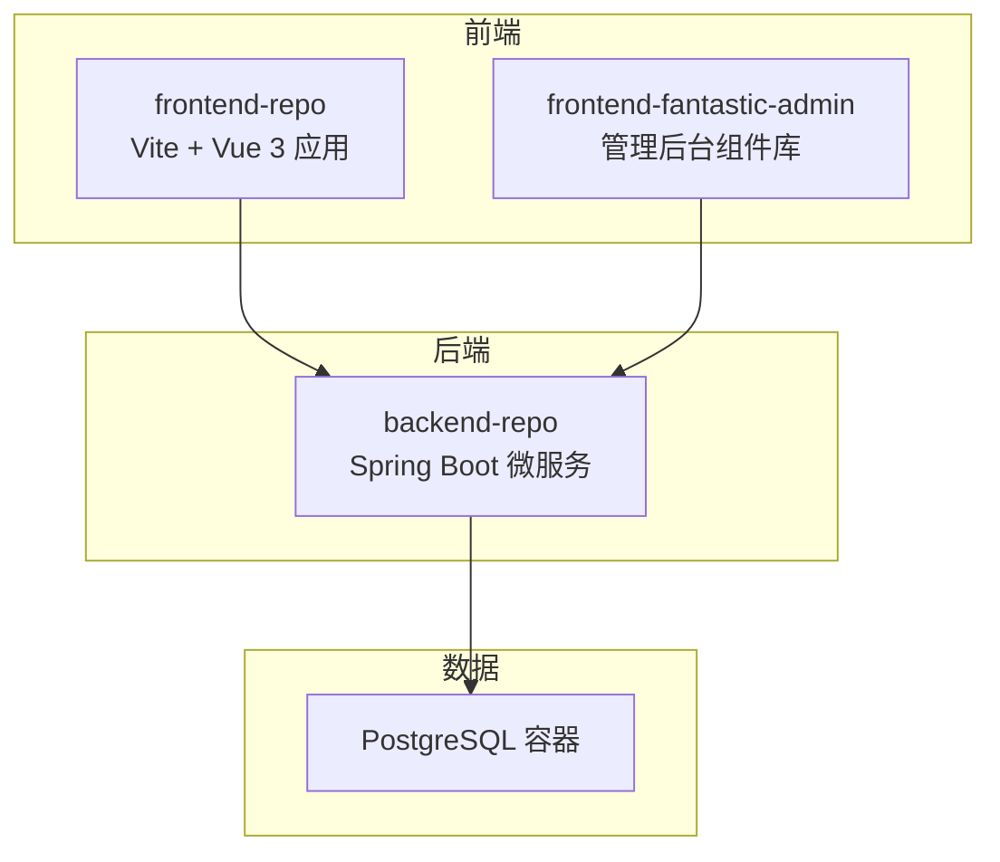
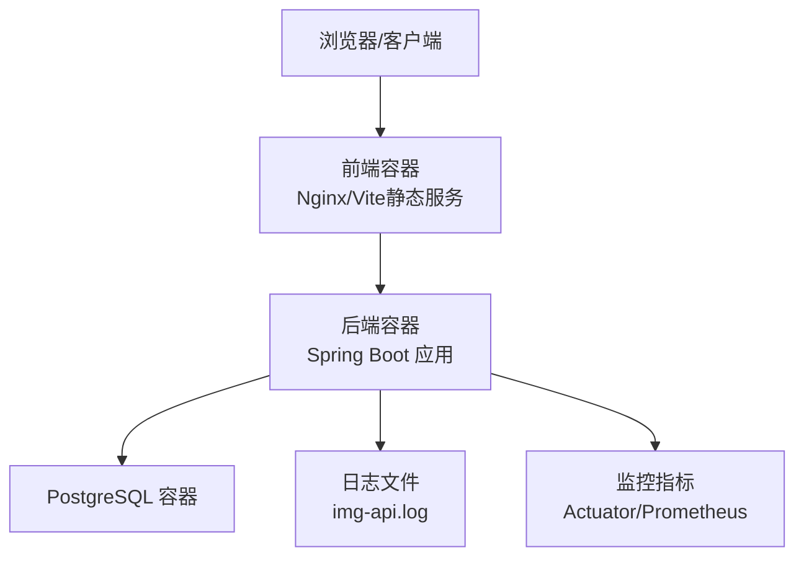
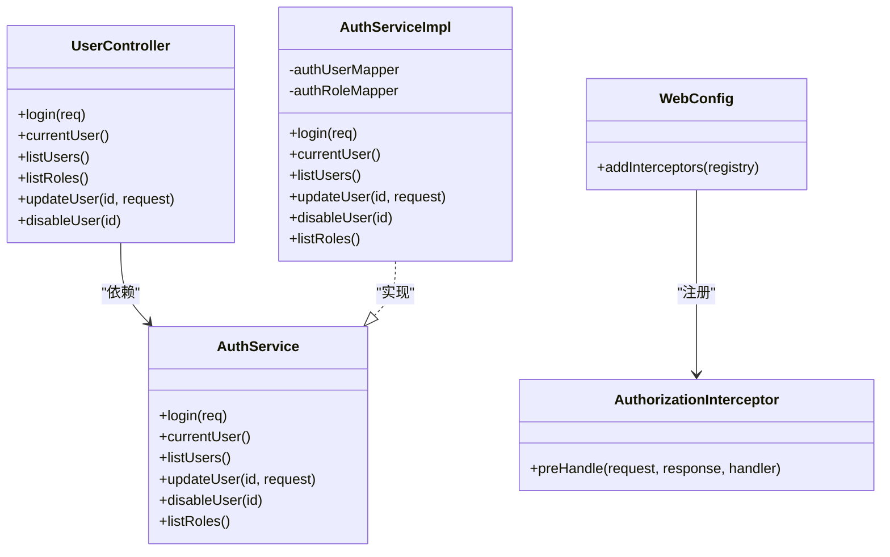
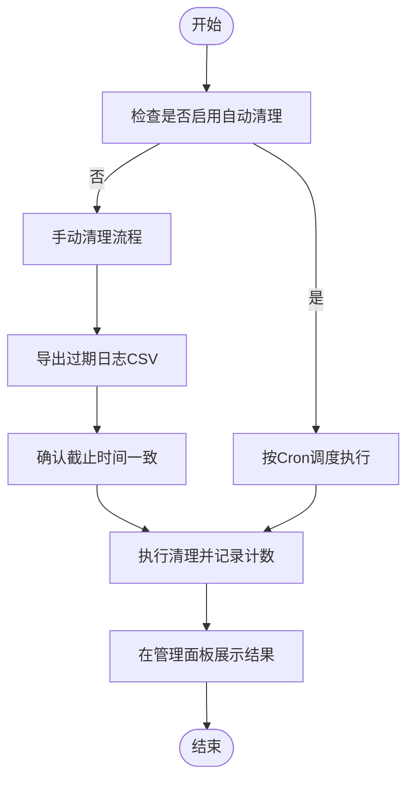
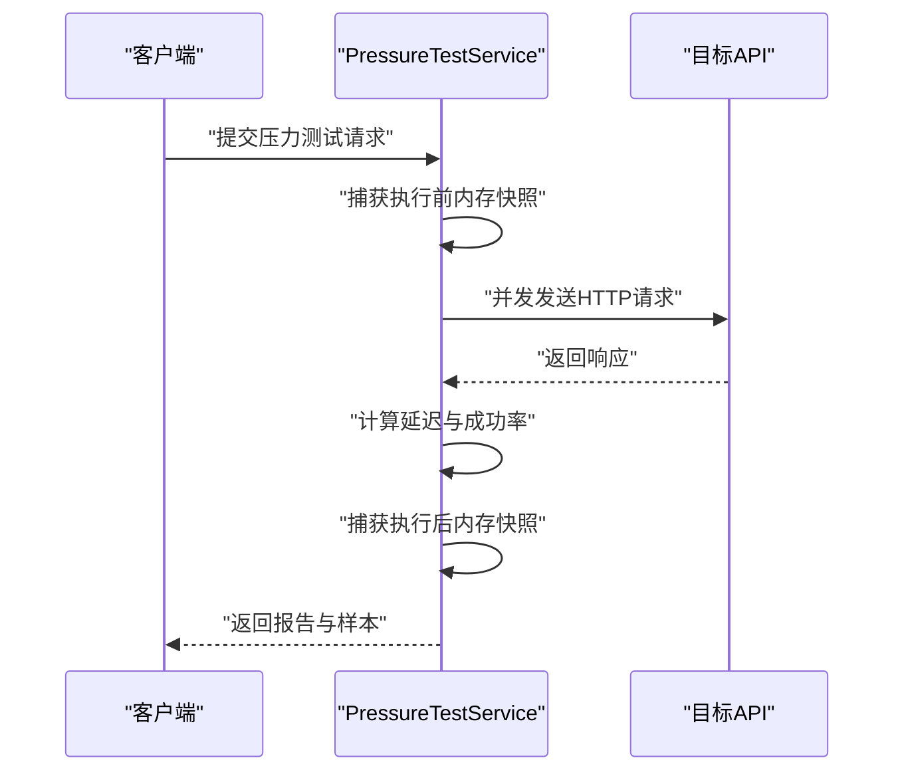
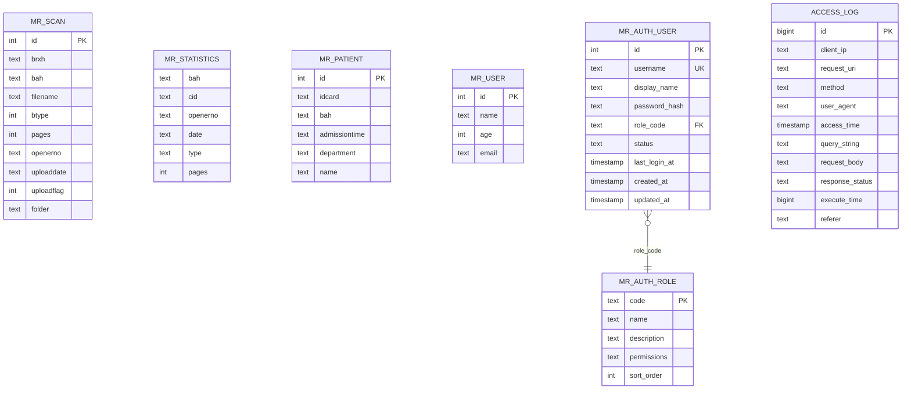
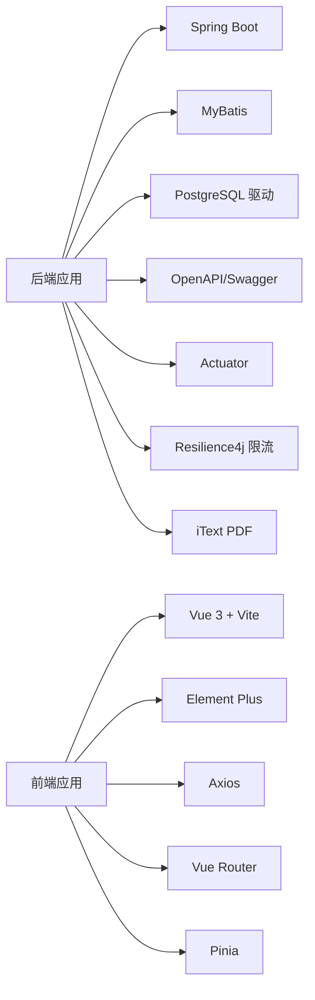

# 系统架构

**本文引用的文件**
- [SYSTEM_ARCHITECTURE.md](file://SYSTEM_ARCHITECTURE.md)
- [docker-compose.yml](file://docker-compose.yml)
- [pom.xml](file://backend-repo/pom.xml)
- [package.json（前端仓库）](file://frontend-repo/package.json)
- [package.json（前端fantastic-admin）](file://frontend-fantastic-admin/package.json)
- [ImageApiApplication.java](file://backend-repo/src/main/java/com/zjcxph/imgapi/ImageApiApplication.java)
- [application.properties](file://backend-repo/src/main/resources/application.properties)
- [schema-postgresql.sql](file://backend-repo/src/main/resources/schema-postgresql.sql)
- [schema.sql（mrr-db）](file://mrr-db/schema.sql)
- [API_CONTRACT.md](file://backend-repo/API_CONTRACT.md)
- [UserController.java](file://backend-repo/src/main/java/com/zjcxph/imgapi/controller/UserController.java)
- [AuthServiceImpl.java](file://backend-repo/src/main/java/com/zjcxph/imgapi/service/impl/AuthServiceImpl.java)
- [WebConfig.java](file://backend-repo/src/main/java/com/zjcxph/imgapi/config/WebConfig.java)
- [AuthorizationInterceptor.java](file://backend-repo/src/main/java/com/zjcxph/imgapi/interceptors/AuthorizationInterceptor.java)
- [PressureTestService.java](file://backend-repo/src/main/java/com/zjcxph/imgapi/monitoring/PressureTestService.java)

## 目录
1. [引言](#引言)
2. [项目结构](#项目结构)
3. [核心组件](#核心组件)
4. [架构总览](#架构总览)
5. [详细组件分析](#详细组件分析)
6. [依赖关系分析](#依赖关系分析)
7. [性能考量](#性能考量)
8. [故障排查指南](#故障排查指南)
9. [结论](#结论)
10. [附录](#附录)

## 引言
本架构文档面向MRR（Medical Record Repository）系统，目标是提供从高层设计到落地实现的完整视图。系统采用前后端分离架构：前端由Vue 3 + Vite + Element Plus构成，后端基于Spring Boot微服务，数据层采用PostgreSQL。系统强调模块化、可测试性与可部署性；运营层面强调日志保留策略的安全默认与可追溯性；监控方面内置压力测试模块用于评估吞吐与延迟。

## 项目结构
系统采用多仓库组织方式：
- 后端仓库（backend-repo）：Spring Boot应用、MyBatis映射、拦截器与调度任务、监控与压力测试模块。
- 前端仓库（frontend-repo）：基于Vite的单页应用，提供文档站点与运行时构建产物。
- 另一套前端工程（frontend-fantastic-admin）：包含大量UI组件与示例页面，作为管理后台的组件库与示例。
- 数据库脚本（mrr-db）：包含SQLite历史表结构，供参考或迁移对照。
- 部署编排（docker-compose.yml）：定义PostgreSQL、后端与前端容器及其依赖关系。

图表来源
- [docker-compose.yml:1-47](file://docker-compose.yml#L1-L47)
- [ImageApiApplication.java:1-20](file://backend-repo/src/main/java/com/zjcxph/imgapi/ImageApiApplication.java#L1-L20)

章节来源
- [docker-compose.yml:1-47](file://docker-compose.yml#L1-L47)
- [SYSTEM_ARCHITECTURE.md:1-72](file://SYSTEM_ARCHITECTURE.md#L1-L72)

## 核心组件
- 前端层
  - 使用Vue 3 + Vite + Element Plus，提供管理后台（AdminDashboard）与文档站点。
  - 通过代理将API请求转发至后端，统一跨域与安全边界。
- 后端层
  - Spring Boot应用，启用定时任务、配置属性扫描与MyBatis Mapper扫描。
  - 控制器保持薄逻辑，业务逻辑集中在服务层；拦截器负责登录态与权限校验。
  - 提供认证、搜索、扫描、统计、日志与监控等模块。
- 数据层
  - PostgreSQL作为主存储，包含扫描记录、患者信息、用户与角色、访问审计等表。
  - 初始化脚本定义Schema与索引，并预置角色与用户数据。

章节来源
- [SYSTEM_ARCHITECTURE.md:10-31](file://SYSTEM_ARCHITECTURE.md#L10-L31)
- [ImageApiApplication.java:1-20](file://backend-repo/src/main/java/com/zjcxph/imgapi/ImageApiApplication.java#L1-L20)
- [schema-postgresql.sql:1-109](file://backend-repo/src/main/resources/schema-postgresql.sql#L1-L109)

## 架构总览
系统采用“前端容器 + 后端容器 + 数据库容器”的三容器拓扑。前端容器负责静态资源与反向代理，后端容器承载业务与数据访问，数据库容器持久化数据。系统边界清晰：前端仅通过受控API路径与后端交互，后端通过JDBC访问PostgreSQL。

图表来源
- [docker-compose.yml:1-47](file://docker-compose.yml#L1-L47)
- [application.properties:1-49](file://backend-repo/src/main/resources/application.properties#L1-L49)

章节来源
- [docker-compose.yml:1-47](file://docker-compose.yml#L1-L47)
- [SYSTEM_ARCHITECTURE.md:49-56](file://SYSTEM_ARCHITECTURE.md#L49-L56)

## 详细组件分析

### 认证与授权组件
- 控制器层：提供登录、获取当前用户、用户与角色列表、更新用户与禁用用户的接口。
- 服务层：实现登录校验、会话生成、用户列表与更新、状态变更与权限拆分。
- 拦截器链：登录拦截器与权限拦截器分别在进入控制器前进行登录态与权限校验；日志拦截器记录访问审计。
- 权限模型：基于角色代码与权限字符串集合，支持管理员与特定管理权限豁免。

图表来源
- [UserController.java:1-95](file://backend-repo/src/main/java/com/zjcxph/imgapi/controller/UserController.java#L1-L95)
- [AuthServiceImpl.java:1-151](file://backend-repo/src/main/java/com/zjcxph/imgapi/service/impl/AuthServiceImpl.java#L1-L151)
- [AuthorizationInterceptor.java:1-78](file://backend-repo/src/main/java/com/zjcxph/imgapi/interceptors/AuthorizationInterceptor.java#L1-L78)
- [WebConfig.java:1-61](file://backend-repo/src/main/java/com/zjcxph/imgapi/config/WebConfig.java#L1-L61)

章节来源
- [UserController.java:1-95](file://backend-repo/src/main/java/com/zjcxph/imgapi/controller/UserController.java#L1-L95)
- [AuthServiceImpl.java:1-151](file://backend-repo/src/main/java/com/zjcxph/imgapi/service/impl/AuthServiceImpl.java#L1-L151)
- [AuthorizationInterceptor.java:1-78](file://backend-repo/src/main/java/com/zjcxph/imgapi/interceptors/AuthorizationInterceptor.java#L1-L78)
- [WebConfig.java:1-61](file://backend-repo/src/main/java/com/zjcxph/imgapi/config/WebConfig.java#L1-L61)

### 日志保留与清理流程
- 默认保留窗口：3年；自动清理默认关闭。
- 手动清理流程：先导出过期日志，再以相同截止时间执行清理，清理结果在管理面板展示。
- 清理参数：批大小、每轮最大批次数、Cron表达式等通过环境变量配置。

图表来源
- [SYSTEM_ARCHITECTURE.md:34-42](file://SYSTEM_ARCHITECTURE.md#L34-L42)
- [application.properties:40-46](file://backend-repo/src/main/resources/application.properties#L40-L46)

章节来源
- [SYSTEM_ARCHITECTURE.md:34-42](file://SYSTEM_ARCHITECTURE.md#L34-L42)
- [application.properties:40-46](file://backend-repo/src/main/resources/application.properties#L40-L46)

### 压力测试与监控
- 压力测试服务：支持并发请求、统计成功率、最小/平均/95分位/最大延迟、吞吐量与内存快照。
- 历史保留：内存中保留最近若干次报告，便于快速回溯。
- API路径：保留于/v1/monitoring-api下，便于隔离与保护。

图表来源
- [PressureTestService.java:1-293](file://backend-repo/src/main/java/com/zjcxph/imgapi/monitoring/PressureTestService.java#L1-L293)
- [SYSTEM_ARCHITECTURE.md:43-47](file://SYSTEM_ARCHITECTURE.md#L43-L47)

章节来源
- [PressureTestService.java:1-293](file://backend-repo/src/main/java/com/zjcxph/imgapi/monitoring/PressureTestService.java#L1-L293)
- [SYSTEM_ARCHITECTURE.md:43-47](file://SYSTEM_ARCHITECTURE.md#L43-L47)

### 数据模型与索引
- 主要实体：扫描记录、统计、患者、用户、角色、访问日志。
- 关键索引：对常用查询字段建立索引，如BAH、BRXH、日期、类型、身份证、用户名、IP、URI、方法、状态等。
- 初始化：启动时初始化Schema与默认角色/用户数据。

图表来源
- [schema-postgresql.sql:3-109](file://backend-repo/src/main/resources/schema-postgresql.sql#L3-L109)

章节来源
- [schema-postgresql.sql:1-109](file://backend-repo/src/main/resources/schema-postgresql.sql#L1-L109)
- [schema.sql（mrr-db）:1-95](file://mrr-db/schema.sql#L1-L95)

## 依赖关系分析
- 技术栈与版本
  - 后端：Spring Boot 4.0.3、Java 21、MyBatis Starter、PostgreSQL驱动、OpenAPI/Swagger、Actuator、Resilience4j限流、iText PDF处理、commons-codec、Lombok。
  - 前端：Vue 3、Element Plus、Axios、Pinia、Vue Router、Vite、TypeScript、ESLint/Stylelint等。
- 第三方依赖与兼容性
  - 后端依赖通过Maven集中管理，Actuator暴露健康/指标，Swagger提供接口文档。
  - 前端依赖通过pnpm管理，Node引擎要求较高版本，确保与Vite/TypeScript生态兼容。
- 运行时配置
  - 数据源、压缩、缓存、日志、图像源、开发工具、日志保留策略、AES密钥等均通过环境变量或配置文件注入。

图表来源
- [pom.xml:27-114](file://backend-repo/pom.xml#L27-L114)
- [package.json（前端仓库）:25-40](file://frontend-repo/package.json#L25-L40)
- [package.json（前端fantastic-admin）:27-61](file://frontend-fantastic-admin/package.json#L27-L61)

章节来源
- [pom.xml:1-136](file://backend-repo/pom.xml#L1-L136)
- [package.json（前端仓库）:1-63](file://frontend-repo/package.json#L1-L63)
- [package.json（前端fantastic-admin）:1-131](file://frontend-fantastic-admin/package.json#L1-L131)

## 性能考量
- 数据库连接池：HikariCP参数可调，建议根据峰值并发与查询复杂度调整最大池大小与空闲超时。
- 缓存与压缩：开启响应压缩与静态资源缓存，降低带宽与首屏加载时间。
- 索引优化：针对高频查询字段建立索引，避免全表扫描；定期评估执行计划。
- 压力测试：内置压力测试模块可用于评估接口延迟、吞吐与内存占用，建议在发布前执行基准测试。
- 前端构建：生产构建开启Tree-shaking与压缩，减少包体积与加载时间。

## 故障排查指南
- 登录失败
  - 检查用户名/密码是否为空、用户状态是否为激活、密码哈希是否匹配。
  - 查看登录拦截器与权限拦截器是否正确注入会话。
- 权限不足
  - 确认用户角色与权限字符串是否包含所需权限；管理员角色与特定管理权限可豁免。
- 接口无响应或超时
  - 检查数据库连接池参数、PostgreSQL健康状态与索引是否合理。
  - 使用压力测试模块定位瓶颈，观察内存快照与延迟分布。
- 日志保留异常
  - 确认保留策略开关、Cron表达式、批大小与每轮最大批次数配置是否一致。
  - 导出CSV后再执行清理，确保可追溯。

章节来源
- [AuthServiceImpl.java:36-62](file://backend-repo/src/main/java/com/zjcxph/imgapi/service/impl/AuthServiceImpl.java#L36-L62)
- [AuthorizationInterceptor.java:18-78](file://backend-repo/src/main/java/com/zjcxph/imgapi/interceptors/AuthorizationInterceptor.java#L18-L78)
- [application.properties:40-46](file://backend-repo/src/main/resources/application.properties#L40-L46)
- [PressureTestService.java:138-188](file://backend-repo/src/main/java/com/zjcxph/imgapi/monitoring/PressureTestService.java#L138-L188)

## 结论
MRR系统通过清晰的前后端分层、安全的权限模型与可追溯的日志保留策略，实现了模块化、可测试与可部署的目标。数据库层以PostgreSQL为核心，配合索引与初始化脚本保障查询效率与一致性。运维上通过容器编排与监控指标实现可观测性，压力测试模块为性能评估提供依据。后续可在设置持久化、领域拆分、导出归档与对象存储等方面持续演进。

## 附录

### API契约与网关映射
- 网关/代理映射
  - /api/* → 后端 /v1/*
  - /searchApi/* → 后端 /v2/*
  - /loginApi → 后端 /login
- 认证
  - POST /login：请求体包含用户名与密码；响应封装在通用Result中。
- 图像
  - GET /v1/img-api/{bah}
  - GET /v1/img-api/download/{BAH}
  - GET /v1/img-api/image/{BAH}/{BRXH}/{FOLDER}/{FILENAME}
  - PUT /v1/img-api/updateImageType/{id}
- 搜索
  - GET /v2/search/getBAHByID/{idCard}（默认）
  - GET /v2/search/getBAHByEncryptID（兼容）
  - GET /v2/search/getBAHByEncryptIDLegacy（兼容）
- 扫描
  - GET /v1/scan-api/page?page={page}&size={size}
  - GET /v1/scan-api/{id}
  - PUT /v1/scan-api/{id}
  - DELETE /v1/scan-api/{id}
  - POST /v1/scan-api/batch-download：批量下载返回zip流

章节来源
- [API_CONTRACT.md:1-44](file://backend-repo/API_CONTRACT.md#L1-L44)

### 部署拓扑与基础设施要求
- 容器编排
  - PostgreSQL：16-alpine，健康检查，持久卷。
  - 后端：Spring Boot应用，依赖数据库健康，暴露端口与环境变量。
  - 前端：静态服务，映射80端口，代理API、Swagger与Actuator。
- 基础设施
  - CPU/内存：根据并发与PDF处理需求预留资源。
  - 存储：数据库持久卷与日志文件目录。
  - 网络：允许前端容器访问后端容器，后端容器访问数据库容器。

章节来源
- [docker-compose.yml:1-47](file://docker-compose.yml#L1-L47)
- [application.properties:1-49](file://backend-repo/src/main/resources/application.properties#L1-L49)