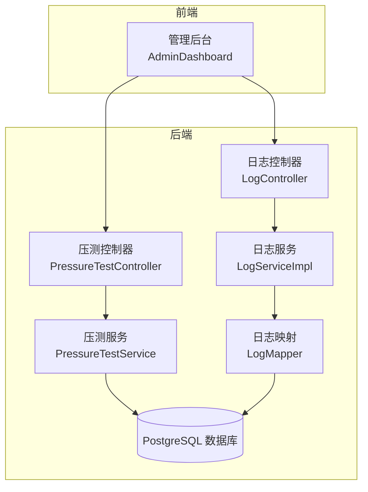
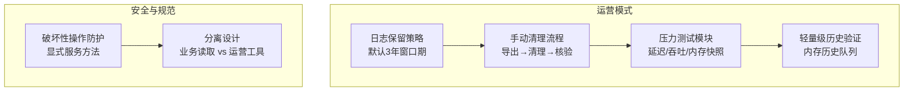
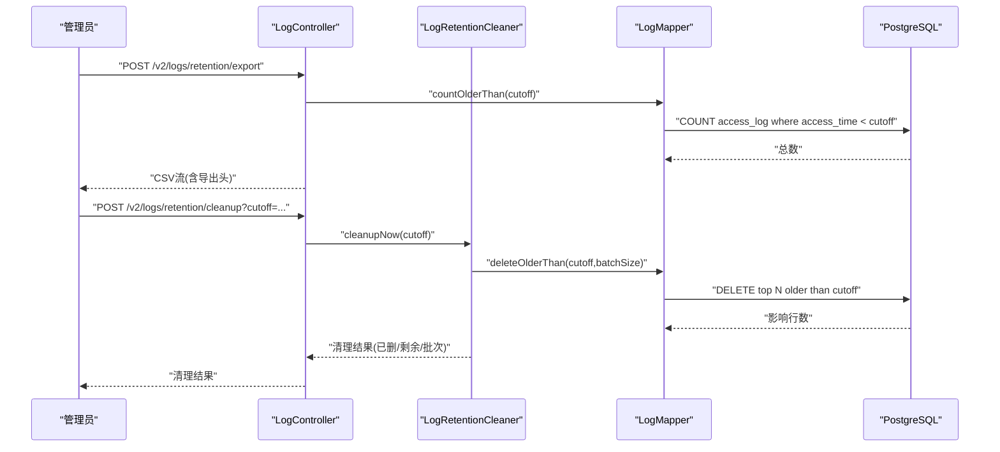
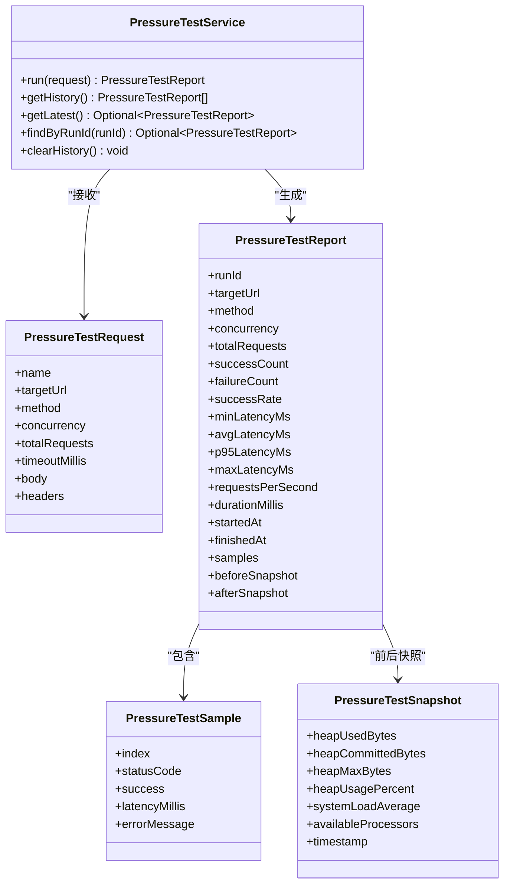
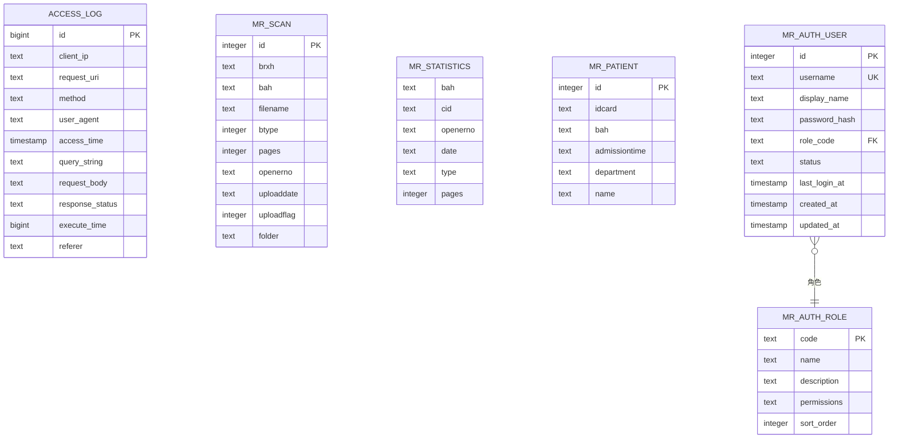
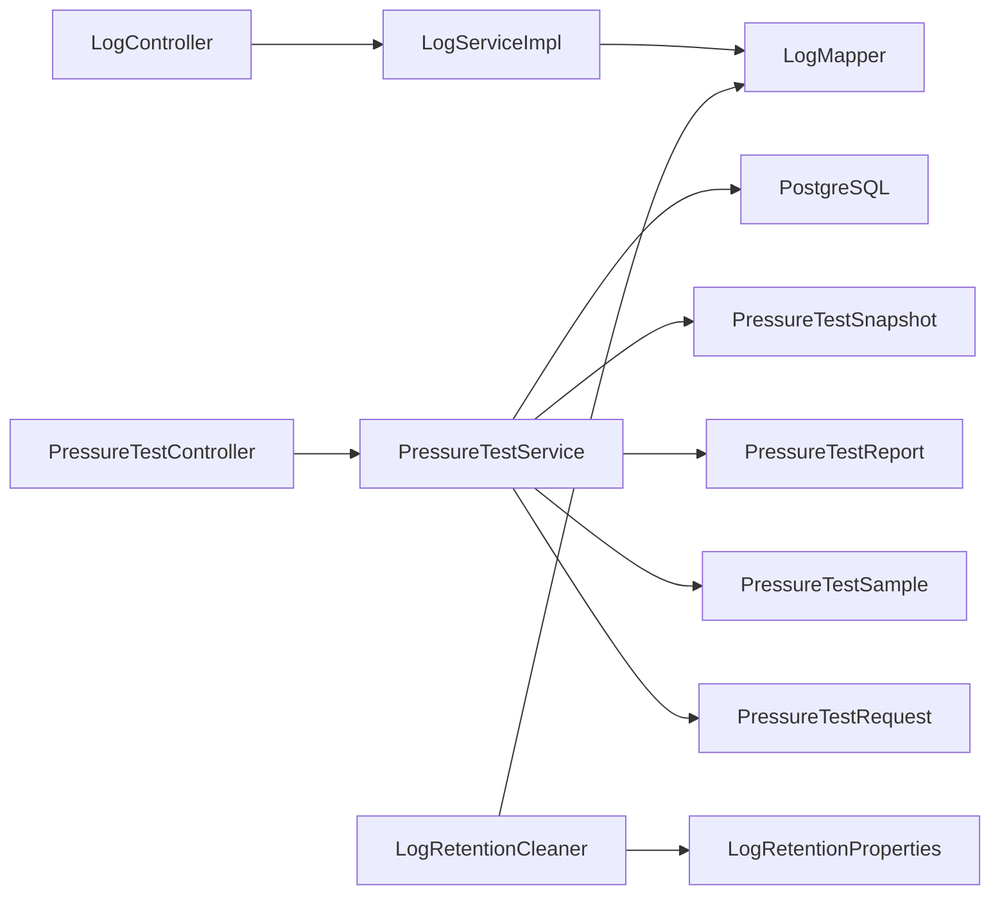

# 运营模式

**本文引用的文件**
- [LogRetentionCleaner.java](file://backend-repo/src/main/java/com/zjcxph/imgapi/scheduler/LogRetentionCleaner.java)
- [LogRetentionProperties.java](file://backend-repo/src/main/java/com/zjcxph/imgapi/config/LogRetentionProperties.java)
- [LogController.java](file://backend-repo/src/main/java/com/zjcxph/imgapi/controller/LogController.java)
- [LogServiceImpl.java](file://backend-repo/src/main/java/com/zjcxph/imgapi/service/impl/LogServiceImpl.java)
- [LogMapper.java](file://backend-repo/src/main/java/com/zjcxph/imgapi/mapper/LogMapper.java)
- [Log.java](file://backend-repo/src/main/java/com/zjcxph/imgapi/entity/Log.java)
- [PressureTestService.java](file://backend-repo/src/main/java/com/zjcxph/imgapi/monitoring/PressureTestService.java)
- [PressureTestController.java](file://backend-repo/src/main/java/com/zjcxph/imgapi/controller/PressureTestController.java)
- [PressureTestReport.java](file://backend-repo/src/main/java/com/zjcxph/imgapi/monitoring/PressureTestReport.java)
- [PressureTestRequest.java](file://backend-repo/src/main/java/com/zjcxph/imgapi/monitoring/PressureTestRequest.java)
- [PressureTestSample.java](file://backend-repo/src/main/java/com/zjcxph/imgapi/monitoring/PressureTestSample.java)
- [PressureTestSnapshot.java](file://backend-repo/src/main/java/com/zjcxph/imgapi/monitoring/PressureTestSnapshot.java)
- [application.properties](file://backend-repo/src/main/resources/application.properties)
- [schema-postgresql.sql](file://backend-repo/src/main/resources/schema-postgresql.sql)
- [SYSTEM_ARCHITECTURE.md](file://SYSTEM_ARCHITECTURE.md)

## 目录
1. [引言](#引言)
2. [项目结构](#项目结构)
3. [核心组件](#核心组件)
4. [架构总览](#架构总览)
5. [详细组件分析](#详细组件分析)
6. [依赖分析](#依赖分析)
7. [性能考虑](#性能考虑)
8. [故障排查指南](#故障排查指南)
9. [结论](#结论)
10. [附录](#附录)

## 引言
本文件面向MRR（电子病历）运营模式，系统化阐述后端在“日志保留策略”“压力测试模块”“系统监控与历史数据存储”“操作性工具分离与职责划分”“安全运营与破坏性操作防护”等方面的业务设计与最佳实践。文档同时给出运维手册、故障处理流程与性能优化建议，帮助团队在保障生产稳定性的前提下，高效开展日常运营与容量规划。

## 项目结构
后端采用Spring Boot + MyBatis架构，按“控制器-服务-持久层-配置”的分层组织；数据库为PostgreSQL，核心表包括访问审计日志表与若干业务主数据表。运营相关能力集中在日志保留与压力测试两个模块，并通过独立的控制器与调度器实现与业务读取的解耦。

图示来源
- [LogController.java:32-54](file://backend-repo/src/main/java/com/zjcxph/imgapi/controller/LogController.java#L32-L54)
- [PressureTestController.java:22-33](file://backend-repo/src/main/java/com/zjcxph/imgapi/controller/PressureTestController.java#L22-L33)
- [LogServiceImpl.java:11-15](file://backend-repo/src/main/java/com/zjcxph/imgapi/service/impl/LogServiceImpl.java#L11-L15)
- [PressureTestService.java:32-42](file://backend-repo/src/main/java/com/zjcxph/imgapi/monitoring/PressureTestService.java#L32-L42)
- [LogMapper.java:9-27](file://backend-repo/src/main/java/com/zjcxph/imgapi/mapper/LogMapper.java#L9-L27)
- [schema-postgresql.sql:61-88](file://backend-repo/src/main/resources/schema-postgresql.sql#L61-L88)

章节来源
- [SYSTEM_ARCHITECTURE.md:10-31](file://SYSTEM_ARCHITECTURE.md#L10-L31)

## 核心组件
- 日志保留与导出：通过配置驱动的保留策略、定时清理与手动导出CSV，确保可追溯与合规。
- 压力测试：内置HTTP压测执行器，采集延迟、吞吐、成功率与内存快照，支持历史保留与查询。
- 控制器与服务：控制器保持薄逻辑，服务封装业务与跨领域行为，便于测试与演进。
- 配置与索引：集中配置保留参数，数据库建立访问日志索引以支撑检索与清理。

章节来源
- [LogRetentionCleaner.java:13-24](file://backend-repo/src/main/java/com/zjcxph/imgapi/scheduler/LogRetentionCleaner.java#L13-L24)
- [LogRetentionProperties.java:5-12](file://backend-repo/src/main/java/com/zjcxph/imgapi/config/LogRetentionProperties.java#L5-L12)
- [LogController.java:32-54](file://backend-repo/src/main/java/com/zjcxph/imgapi/controller/LogController.java#L32-L54)
- [PressureTestService.java:32-42](file://backend-repo/src/main/java/com/zjcxph/imgapi/monitoring/PressureTestService.java#L32-L42)
- [application.properties:40-45](file://backend-repo/src/main/resources/application.properties#L40-L45)
- [schema-postgresql.sql:83-88](file://backend-repo/src/main/resources/schema-postgresql.sql#L83-L88)

## 架构总览
运营模式遵循“业务读取与运营工具分离”的原则：业务侧仅暴露只读接口，运营侧通过专门的控制器与服务进行清理、导出与压测等破坏性或高负载操作。默认保留窗口为3年，自动清理默认关闭，必须先导出再清理，保证可追溯与可审计。

图示来源
- [SYSTEM_ARCHITECTURE.md:32-47](file://SYSTEM_ARCHITECTURE.md#L32-L47)
- [LogRetentionCleaner.java:26-37](file://backend-repo/src/main/java/com/zjcxph/imgapi/scheduler/LogRetentionCleaner.java#L26-L37)
- [LogController.java:94-148](file://backend-repo/src/main/java/com/zjcxph/imgapi/controller/LogController.java#L94-L148)
- [PressureTestService.java:114-136](file://backend-repo/src/main/java/com/zjcxph/imgapi/monitoring/PressureTestService.java#L114-L136)

## 详细组件分析

### 日志保留策略与手动清理流程
- 默认保留窗口：3年（1095天），可通过配置覆盖。
- 自动清理默认关闭，需显式启用；定时任务按cron表达式执行。
- 手动清理流程：
  1) 导出过期日志为CSV（包含总数与截止时间头信息）。
  2) 按相同截止时间执行清理，批量删除并返回批次统计。
  3) 在管理面板展示清理结果与剩余条目，便于核验。
- 导出验证机制：响应头携带导出总量与截止时间，客户端可据此校验导出完整性与一致性。

图示来源
- [LogController.java:94-148](file://backend-repo/src/main/java/com/zjcxph/imgapi/controller/LogController.java#L94-L148)
- [LogRetentionCleaner.java:39-117](file://backend-repo/src/main/java/com/zjcxph/imgapi/scheduler/LogRetentionCleaner.java#L39-L117)
- [LogMapper.java:41-68](file://backend-repo/src/main/java/com/zjcxph/imgapi/mapper/LogMapper.java#L41-L68)

章节来源
- [LogRetentionProperties.java:8-12](file://backend-repo/src/main/java/com/zjcxph/imgapi/config/LogRetentionProperties.java#L8-L12)
- [application.properties:40-45](file://backend-repo/src/main/resources/application.properties#L40-L45)
- [schema-postgresql.sql:61-88](file://backend-repo/src/main/resources/schema-postgresql.sql#L61-L88)

### 压力测试模块设计与监控指标
- 设计原理：固定并发线程池，基于游标自增的请求分发，统一构建HTTP请求（自动补全Content-Type），捕获每个样本的延迟与状态码，计算成功率、最小/平均/p95/最大延迟与吞吐。
- 监控指标：
  - 延迟分布：min/avg/p95/max
  - 成功率：success rate
  - 吞吐：requests/sec
  - 内存快照：heap used/committed/max、heap usage%、load average、CPU核数
- 性能分析方法：
  - 使用p95延迟评估尾部延迟风险。
  - 对比before/after内存快照，识别内存泄漏或GC压力。
  - 结合历史报告对比不同并发/请求量下的稳定性。

图示来源
- [PressureTestRequest.java:12-65](file://backend-repo/src/main/java/com/zjcxph/imgapi/monitoring/PressureTestRequest.java#L12-L65)
- [PressureTestSample.java:3-20](file://backend-repo/src/main/java/com/zjcxph/imgapi/monitoring/PressureTestSample.java#L3-L20)
- [PressureTestSnapshot.java:3-32](file://backend-repo/src/main/java/com/zjcxph/imgapi/monitoring/PressureTestSnapshot.java#L3-L32)
- [PressureTestReport.java:6-75](file://backend-repo/src/main/java/com/zjcxph/imgapi/monitoring/PressureTestReport.java#L6-L75)
- [PressureTestService.java:32-112](file://backend-repo/src/main/java/com/zjcxph/imgapi/monitoring/PressureTestService.java#L32-L112)

章节来源
- [PressureTestController.java:22-71](file://backend-repo/src/main/java/com/zjcxph/imgapi/controller/PressureTestController.java#L22-L71)
- [PressureTestService.java:114-136](file://backend-repo/src/main/java/com/zjcxph/imgapi/monitoring/PressureTestService.java#L114-L136)

### 日志实体与数据模型
- 实体字段覆盖IP、URI、方法、UA、时间、查询串、请求体、状态码、耗时、Referer等，满足审计与检索需求。
- 数据库表包含访问日志与多类业务表，访问日志建立多维索引以支撑高频查询与清理。

图示来源
- [schema-postgresql.sql:61-88](file://backend-repo/src/main/resources/schema-postgresql.sql#L61-L88)
- [Log.java:8-32](file://backend-repo/src/main/java/com/zjcxph/imgapi/entity/Log.java#L8-L32)

章节来源
- [Log.java:8-32](file://backend-repo/src/main/java/com/zjcxph/imgapi/entity/Log.java#L8-L32)
- [schema-postgresql.sql:61-88](file://backend-repo/src/main/resources/schema-postgresql.sql#L61-L88)

### 操作性工具分离与职责划分
- 业务读取：通过只读接口查询日志与统计数据，不涉及删除或导出。
- 运营工具：专门的控制器与服务负责清理、导出与压测，避免在业务浏览界面暴露破坏性操作。
- 显式服务方法：所有副作用操作均通过显式服务方法触发，便于审计与限流。

章节来源
- [SYSTEM_ARCHITECTURE.md:57-64](file://SYSTEM_ARCHITECTURE.md#L57-L64)
- [LogController.java:94-148](file://backend-repo/src/main/java/com/zjcxph/imgapi/controller/LogController.java#L94-L148)
- [PressureTestController.java:35-71](file://backend-repo/src/main/java/com/zjcxph/imgapi/controller/PressureTestController.java#L35-L71)

## 依赖分析
- 控制器依赖服务与配置，服务依赖映射器，映射器直接访问数据库。
- 日志保留清理依赖配置属性与映射器，清理过程通过批处理与分页扫描实现。
- 压测服务依赖JDK HTTP客户端与运行时快照，历史保存在内存队列中。

图示来源
- [LogController.java:39-53](file://backend-repo/src/main/java/com/zjcxph/imgapi/controller/LogController.java#L39-L53)
- [PressureTestController.java:29-32](file://backend-repo/src/main/java/com/zjcxph/imgapi/controller/PressureTestController.java#L29-L32)
- [LogServiceImpl.java:14-15](file://backend-repo/src/main/java/com/zjcxph/imgapi/service/impl/LogServiceImpl.java#L14-L15)
- [PressureTestService.java:38-42](file://backend-repo/src/main/java/com/zjcxph/imgapi/monitoring/PressureTestService.java#L38-L42)
- [LogRetentionCleaner.java:18-24](file://backend-repo/src/main/java/com/zjcxph/imgapi/scheduler/LogRetentionCleaner.java#L18-L24)
- [LogRetentionProperties.java:5-12](file://backend-repo/src/main/java/com/zjcxph/imgapi/config/LogRetentionProperties.java#L5-L12)

章节来源
- [LogMapper.java:9-27](file://backend-repo/src/main/java/com/zjcxph/imgapi/mapper/LogMapper.java#L9-L27)
- [LogRetentionCleaner.java:39-117](file://backend-repo/src/main/java/com/zjcxph/imgapi/scheduler/LogRetentionCleaner.java#L39-L117)

## 性能考虑
- 清理批大小与批次上限：通过配置控制单次删除数量与最大批次，避免长事务与锁竞争。
- 导出分页：按批次拉取并流式写出，降低内存峰值与网络阻塞。
- 压测并发与超时：限制并发上限与请求超时，防止对目标服务造成过大冲击。
- 索引优化：访问日志按时间、方法、状态等维度建立索引，提升查询与清理效率。
- 历史保留：压测历史仅保留在内存队列中，避免持久化开销。

章节来源
- [LogRetentionProperties.java:8-12](file://backend-repo/src/main/java/com/zjcxph/imgapi/config/LogRetentionProperties.java#L8-L12)
- [LogController.java:126-137](file://backend-repo/src/main/java/com/zjcxph/imgapi/controller/LogController.java#L126-L137)
- [PressureTestService.java:138-170](file://backend-repo/src/main/java/com/zjcxph/imgapi/monitoring/PressureTestService.java#L138-L170)
- [schema-postgresql.sql:83-88](file://backend-repo/src/main/resources/schema-postgresql.sql#L83-L88)

## 故障排查指南
- 日志保留清理失败
  - 现象：清理结果标记失败，日志输出异常堆栈。
  - 排查：检查数据库连接、权限与索引是否存在；确认保留天数是否有效；查看清理批次与剩余条目。
  - 参考路径：[清理执行与异常处理:110-114](file://backend-repo/src/main/java/com/zjcxph/imgapi/scheduler/LogRetentionCleaner.java#L110-L114)
- 导出为空或不完整
  - 现象：导出CSV为空或行数少于预期。
  - 排查：确认保留天数是否为正；检查截止时间与数据库中的最早记录；确认分页偏移是否正确。
  - 参考路径：[导出实现与分页:126-137](file://backend-repo/src/main/java/com/zjcxph/imgapi/controller/LogController.java#L126-L137)
- 压测结果异常
  - 现象：成功率低、延迟异常高或内存快照异常。
  - 排查：调整并发与总请求数；检查目标URL可达性与超时设置；对比before/after快照定位资源瓶颈。
  - 参考路径：[压测执行与采样:138-188](file://backend-repo/src/main/java/com/zjcxph/imgapi/monitoring/PressureTestService.java#L138-L188)
- 权限与安全
  - 原则：破坏性操作必须通过显式服务方法触发；不在业务浏览界面暴露删除/导出按钮。
  - 参考路径：[分离设计与显式方法:57-64](file://SYSTEM_ARCHITECTURE.md#L57-L64)

章节来源
- [LogRetentionCleaner.java:110-114](file://backend-repo/src/main/java/com/zjcxph/imgapi/scheduler/LogRetentionCleaner.java#L110-L114)
- [LogController.java:126-137](file://backend-repo/src/main/java/com/zjcxph/imgapi/controller/LogController.java#L126-L137)
- [PressureTestService.java:138-188](file://backend-repo/src/main/java/com/zjcxph/imgapi/monitoring/PressureTestService.java#L138-L188)
- [SYSTEM_ARCHITECTURE.md:57-64](file://SYSTEM_ARCHITECTURE.md#L57-L64)

## 结论
本运营模式以“安全默认、手动可追溯、分离职责、显式方法”为核心原则，结合3年默认保留窗口与严格的导出-清理流程，确保日志审计与合规；通过压测模块的指标采集与历史保留，支撑容量规划与性能优化。建议在后续阶段进一步完善配置持久化、模块拆分与归档存储方案，持续提升可运维性与扩展性。

## 附录

### 运维手册（操作步骤）
- 启用日志保留清理
  - 设置启用开关与保留天数、批大小、每轮最大批次。
  - 参考路径：[配置项定义:8-12](file://backend-repo/src/main/java/com/zjcxph/imgapi/config/LogRetentionProperties.java#L8-L12)，[应用配置:40-45](file://backend-repo/src/main/resources/application.properties#L40-L45)
- 执行手动清理
  - 步骤1：导出过期日志（CSV），记录导出总量与截止时间。
    - 参考路径：[导出接口:108-148](file://backend-repo/src/main/java/com/zjcxph/imgapi/controller/LogController.java#L108-L148)
  - 步骤2：按相同截止时间执行清理，核对删除数量与剩余条目。
    - 参考路径：[清理接口:94-106](file://backend-repo/src/main/java/com/zjcxph/imgapi/controller/LogController.java#L94-L106)，[清理实现:39-117](file://backend-repo/src/main/java/com/zjcxph/imgapi/scheduler/LogRetentionCleaner.java#L39-L117)
- 触发压力测试
  - 调用压测接口，获取报告与历史列表，必要时清理历史。
  - 参考路径：[压测接口:35-71](file://backend-repo/src/main/java/com/zjcxph/imgapi/controller/PressureTestController.java#L35-L71)，[服务实现:44-112](file://backend-repo/src/main/java/com/zjcxph/imgapi/monitoring/PressureTestService.java#L44-L112)

### 安全运营原则
- 破坏性操作必须通过显式服务方法触发，不在只读浏览界面暴露删除/导出按钮。
- 默认关闭自动清理，强制“先导出、后清理”的双保险流程。
- 对外接口严格参数校验与范围限制，防止滥用。

章节来源
- [SYSTEM_ARCHITECTURE.md:32-47](file://SYSTEM_ARCHITECTURE.md#L32-L47)
- [LogRetentionCleaner.java:51-64](file://backend-repo/src/main/java/com/zjcxph/imgapi/scheduler/LogRetentionCleaner.java#L51-L64)
- [PressureTestRequest.java:23-33](file://backend-repo/src/main/java/com/zjcxph/imgapi/monitoring/PressureTestRequest.java#L23-L33)