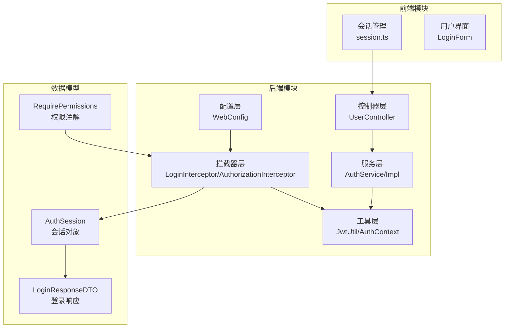
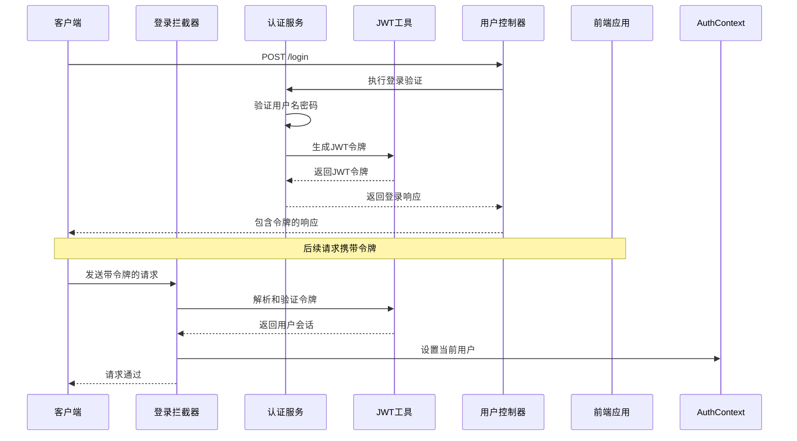
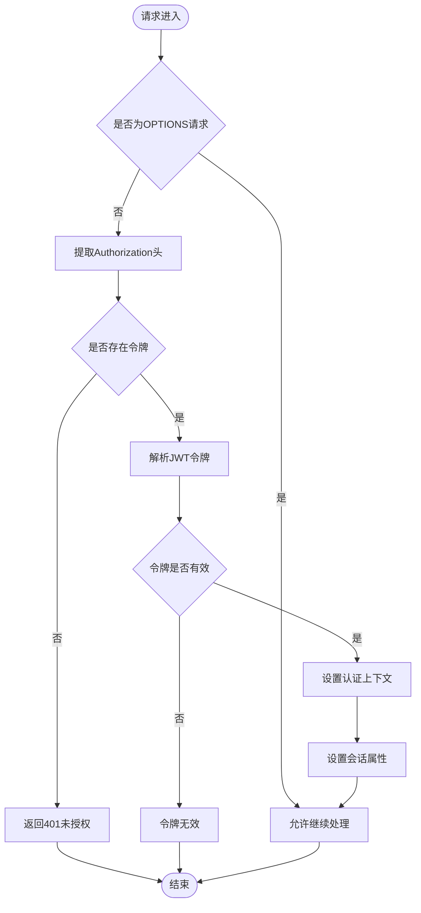
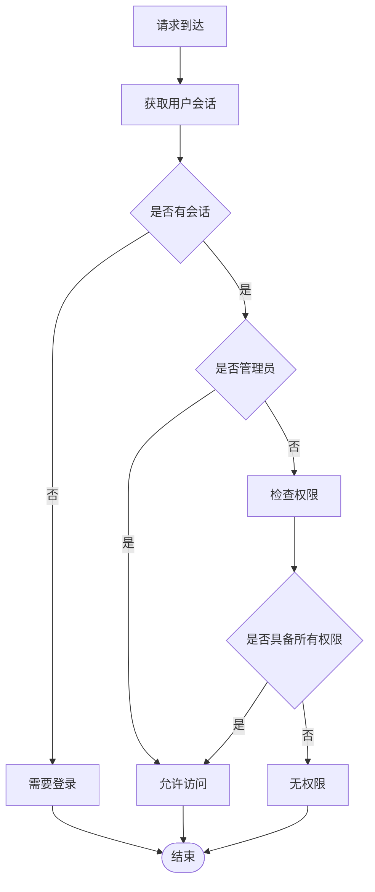
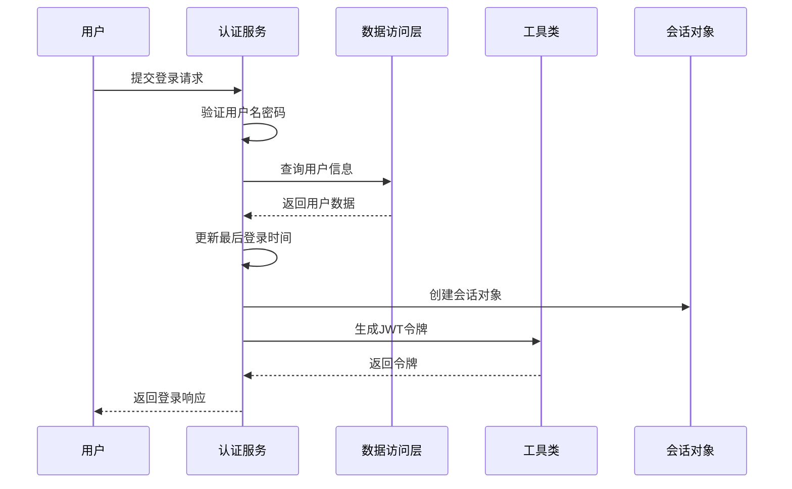
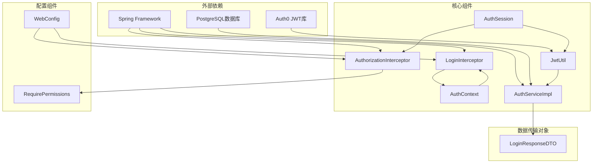

# JWT认证机制


**本文档引用的文件**
- [JwtUtil.java](file://backend-repo/src/main/java/com/zjcxph/imgapi/utils/JwtUtil.java)
- [AuthSession.java](file://backend-repo/src/main/java/com/zjcxph/imgapi/common/AuthSession.java)
- [AuthContext.java](file://backend-repo/src/main/java/com/zjcxph/imgapi/utils/AuthContext.java)
- [AuthService.java](file://backend-repo/src/main/java/com/zjcxph/imgapi/service/AuthService.java)
- [AuthServiceImpl.java](file://backend-repo/src/main/java/com/zjcxph/imgapi/service/impl/AuthServiceImpl.java)
- [UserController.java](file://backend-repo/src/main/java/com/zjcxph/imgapi/controller/UserController.java)
- [LoginInterceptor.java](file://backend-repo/src/main/java/com/zjcxph/imgapi/interceptors/LoginInterceptor.java)
- [AuthorizationInterceptor.java](file://backend-repo/src/main/java/com/zjcxph/imgapi/interceptors/AuthorizationInterceptor.java)
- [WebConfig.java](file://backend-repo/src/main/java/com/zjcxph/imgapi/config/WebConfig.java)
- [RequirePermissions.java](file://backend-repo/src/main/java/com/zjcxph/imgapi/annotation/RequirePermissions.java)
- [LoginResponseDTO.java](file://backend-repo/src/main/java/com/zjcxph/imgapi/dto/resp/LoginResponseDTO.java)
- [application.properties](file://backend-repo/src/main/resources/application.properties)
- [session.ts](file://frontend-repo/src/utils/session.ts)


## 目录
1. [简介](#简介)
2. [项目结构](#项目结构)
3. [核心组件](#核心组件)
4. [架构概览](#架构概览)
5. [详细组件分析](#详细组件分析)
6. [依赖关系分析](#依赖关系分析)
7. [性能考虑](#性能考虑)
8. [故障排除指南](#故障排除指南)
9. [结论](#结论)
10. [附录](#附录)

## 简介

MRR系统的JWT认证机制是一个基于Java Spring Boot后端和Vue.js前端的完整身份认证解决方案。该系统实现了基于JWT（JSON Web Token）的无状态认证，支持用户登录、权限验证、会话管理和令牌生命周期控制。

JWT认证机制的核心特点包括：
- 使用HMAC SHA-256算法进行令牌签名
- 24小时过期时间设置
- 基于角色和权限的细粒度访问控制
- 完整的前后端集成方案
- 安全的令牌传输和存储策略

## 项目结构

MRR系统的JWT认证机制分布在以下关键模块中：



**图表来源**
- [UserController.java:28-36](file://backend-repo/src/main/java/com/zjcxph/imgapi/controller/UserController.java#L28-L36)
- [AuthService.java:12-25](file://backend-repo/src/main/java/com/zjcxph/imgapi/service/AuthService.java#L12-L25)
- [JwtUtil.java:12-20](file://backend-repo/src/main/java/com/zjcxph/imgapi/utils/JwtUtil.java#L12-L20)

**章节来源**
- [UserController.java:1-95](file://backend-repo/src/main/java/com/zjcxph/imgapi/controller/UserController.java#L1-L95)
- [AuthService.java:1-25](file://backend-repo/src/main/java/com/zjcxph/imgapi/service/AuthService.java#L1-L25)
- [JwtUtil.java:1-77](file://backend-repo/src/main/java/com/zjcxph/imgapi/utils/JwtUtil.java#L1-L77)

## 核心组件

### JWT工具类 (JwtUtil)

JWT工具类是整个认证系统的核心，负责令牌的生成、解析和验证。

**主要功能：**
- 令牌生成：使用HMAC SHA-256算法对JWT进行签名
- 令牌解析：验证JWT的有效性并提取用户信息
- 密钥管理：支持环境变量配置和默认密钥设置
- 过期时间：设置24小时有效期

**密钥配置：**
- 环境变量：`JWT_SECRET_KEY`
- 默认值：`sbkedbkvuirkhkpwzetralhtaenrqlhio`
- 配置位置：系统环境变量

**过期时间：**
- 默认设置：24小时（86400000毫秒）
- 设置位置：常量EXPIRE_MILLIS

**章节来源**
- [JwtUtil.java:14-17](file://backend-repo/src/main/java/com/zjcxph/imgapi/utils/JwtUtil.java#L14-L17)
- [JwtUtil.java:22-59](file://backend-repo/src/main/java/com/zjcxph/imgapi/utils/JwtUtil.java#L22-L59)
- [JwtUtil.java:61-75](file://backend-repo/src/main/java/com/zjcxph/imgapi/utils/JwtUtil.java#L61-L75)

### 认证会话对象 (AuthSession)

AuthSession是JWT认证系统中的核心数据结构，用于封装用户的身份信息和权限数据。

**字段定义：**
- `id`: 用户唯一标识符
- `username`: 用户名
- `displayName`: 显示名称
- `roleCode`: 角色代码
- `roleName`: 角色名称
- `permissions`: 权限列表
- `status`: 用户状态
- `lastLoginAt`: 最后登录时间

**权限检查方法：**
- `isAdmin()`: 检查是否为管理员
- `hasPermission(permission)`: 检查特定权限

**章节来源**
- [AuthSession.java:7-89](file://backend-repo/src/main/java/com/zjcxph/imgapi/common/AuthSession.java#L7-L89)

### 认证上下文 (AuthContext)

AuthContext提供线程本地存储机制，用于在请求处理过程中维护当前用户的认证状态。

**功能特性：**
- 线程安全的用户会话存储
- 自动清理机制
- 支持空值处理

**章节来源**
- [AuthContext.java:5-27](file://backend-repo/src/main/java/com/zjcxph/imgapi/utils/AuthContext.java#L5-L27)

## 架构概览

MRR系统的JWT认证架构采用分层设计，确保了良好的可维护性和扩展性。



**图表来源**
- [UserController.java:38-47](file://backend-repo/src/main/java/com/zjcxph/imgapi/controller/UserController.java#L38-L47)
- [AuthServiceImpl.java:36-62](file://backend-repo/src/main/java/com/zjcxph/imgapi/service/impl/AuthServiceImpl.java#L36-L62)
- [LoginInterceptor.java:29-52](file://backend-repo/src/main/java/com/zjcxph/imgapi/interceptors/LoginInterceptor.java#L29-L52)

## 详细组件分析

### 登录拦截器 (LoginInterceptor)

登录拦截器负责处理所有HTTP请求的JWT令牌验证。



**图表来源**
- [LoginInterceptor.java:22-52](file://backend-repo/src/main/java/com/zjcxph/imgapi/interceptors/LoginInterceptor.java#L22-L52)

**处理流程：**
1. **预过滤**：跳过OPTIONS预检请求
2. **令牌提取**：从Authorization头中提取Bearer令牌
3. **令牌验证**：使用JwtUtil解析和验证令牌
4. **上下文设置**：将用户会话存入ThreadLocal
5. **属性注入**：将会话对象注入到请求属性中

**错误处理：**
- 缺少令牌：返回401状态码
- 令牌无效：记录错误并返回401状态码
- 异常处理：清理认证上下文并返回错误响应

**章节来源**
- [LoginInterceptor.java:16-68](file://backend-repo/src/main/java/com/zjcxph/imgapi/interceptors/LoginInterceptor.java#L16-L68)

### 授权拦截器 (AuthorizationInterceptor)

授权拦截器负责基于权限注解的访问控制。

**权限检查逻辑：**


**图表来源**
- [AuthorizationInterceptor.java:22-56](file://backend-repo/src/main/java/com/zjcxph/imgapi/interceptors/AuthorizationInterceptor.java#L22-L56)

**权限验证规则：**
1. **管理员特权**：角色代码为ADMIN的用户拥有完全访问权限
2. **权限匹配**：要求用户具备注解中声明的所有权限
3. **权限组合**：支持多个权限的AND逻辑组合

**章节来源**
- [AuthorizationInterceptor.java:17-77](file://backend-repo/src/main/java/com/zjcxph/imgapi/interceptors/AuthorizationInterceptor.java#L17-L77)

### 认证服务 (AuthServiceImpl)

认证服务实现了完整的用户认证流程。

**登录流程：**


**图表来源**
- [AuthServiceImpl.java:36-62](file://backend-repo/src/main/java/com/zjcxph/imgapi/service/impl/AuthServiceImpl.java#L36-L62)

**核心功能：**
1. **用户验证**：验证用户名和密码的正确性
2. **状态检查**：确认用户账户处于激活状态
3. **会话创建**：将用户信息转换为AuthSession对象
4. **令牌生成**：使用JwtUtil生成JWT令牌
5. **响应构建**：返回包含令牌和用户信息的LoginResponseDTO

**章节来源**
- [AuthServiceImpl.java:25-151](file://backend-repo/src/main/java/com/zjcxph/imgapi/service/impl/AuthServiceImpl.java#L25-L151)

### 权限注解 (RequirePermissions)

RequirePermissions注解提供了声明式的权限控制机制。

**注解特性：**
- **作用范围**：支持方法级别和类型级别
- **权限数组**：支持多个权限的组合声明
- **运行时生效**：在请求处理时动态验证权限

**使用示例：**
```java
@RequirePermissions({"user:manage", "role:read"})
@GetMapping("/users")
public List&lt;User&gt; getUsers() {
    // 只有具备user:manage和role:read权限的用户才能访问
}
```

**章节来源**
- [RequirePermissions.java:8-12](file://backend-repo/src/main/java/com/zjcxph/imgapi/annotation/RequirePermissions.java#L8-L12)

## 依赖关系分析

MRR系统的JWT认证机制具有清晰的依赖层次结构：



**图表来源**
- [JwtUtil.java:3-6](file://backend-repo/src/main/java/com/zjcxph/imgapi/utils/JwtUtil.java#L3-L6)
- [WebConfig.java:3-22](file://backend-repo/src/main/java/com/zjcxph/imgapi/config/WebConfig.java#L3-L22)

**依赖关系特点：**
- **低耦合高内聚**：各组件职责明确，相互独立
- **单向依赖**：遵循依赖倒置原则，上层组件不依赖下层组件
- **接口隔离**：通过接口定义契约，便于测试和替换

**章节来源**
- [WebConfig.java:11-60](file://backend-repo/src/main/java/com/zjcxph/imgapi/config/WebConfig.java#L11-L60)

## 性能考虑

### 令牌大小优化

JWT令牌包含以下信息：
- 用户标识：Long类型，约8字节
- 用户名：字符串，长度可变
- 显示名称：字符串，长度可变
- 角色信息：字符串，长度可变
- 权限列表：字符串数组，长度可变

**优化建议：**
1. **精简权限列表**：避免包含冗余权限
2. **压缩字符串**：使用较短的用户名和角色代码
3. **缓存策略**：对于频繁访问的用户信息进行缓存

### 内存管理

**线程本地存储：**
- 使用ThreadLocal存储用户会话，避免线程间数据污染
- 在请求完成后自动清理，防止内存泄漏
- 支持null值处理，优雅处理匿名用户

**连接池配置：**
- 数据库连接池最大连接数：20
- 连接超时时间：30秒
- 空闲连接超时：300秒

### 缓存策略

**会话缓存：**
- 建议在Redis中缓存活跃用户的会话信息
- 设置合理的过期时间（与JWT过期时间保持一致）
- 实现分布式锁防止并发更新问题

## 故障排除指南

### 常见问题及解决方案

**问题1：令牌验证失败**
- **症状**：返回401未授权错误
- **原因**：令牌格式错误、签名不匹配、已过期
- **解决**：检查Authorization头格式，确认JWT_SECRET_KEY配置

**问题2：用户会话为空**
- **症状**：调用currentUser()返回null
- **原因**：令牌缺失、解析失败、请求未经过拦截器
- **解决**：确认前端正确存储和发送令牌

**问题3：权限拒绝访问**
- **症状**：返回403禁止访问错误
- **原因**：用户不具备所需权限
- **解决**：检查用户角色和权限配置

**问题4：跨域问题**
- **症状**：浏览器阻止跨域请求
- **原因**：CORS配置缺失
- **解决**：检查WebConfig中的跨域配置

### 调试技巧

**后端调试：**
1. 启用详细日志：设置日志级别为DEBUG
2. 检查拦截器链：确认LoginInterceptor和AuthorizationInterceptor正常工作
3. 验证数据库连接：确保用户数据正确存储

**前端调试：**
1. 检查localStorage：确认令牌正确存储
2. 验证请求头：确认Authorization头格式正确
3. 浏览器开发者工具：监控网络请求和响应

**章节来源**
- [LoginInterceptor.java:58-68](file://backend-repo/src/main/java/com/zjcxph/imgapi/interceptors/LoginInterceptor.java#L58-L68)
- [AuthorizationInterceptor.java:58-68](file://backend-repo/src/main/java/com/zjcxph/imgapi/interceptors/AuthorizationInterceptor.java#L58-L68)

## 结论

MRR系统的JWT认证机制提供了一个完整、安全且易于使用的身份认证解决方案。通过合理的架构设计和严格的权限控制，该系统能够满足现代Web应用的安全需求。

**主要优势：**
1. **安全性**：使用标准的JWT协议和强加密算法
2. **可扩展性**：模块化设计支持功能扩展
3. **易用性**：简洁的API和完善的错误处理
4. **性能**：无状态设计支持水平扩展

**改进建议：**
1. **令牌刷新**：实现短期访问令牌和长期刷新令牌机制
2. **审计日志**：添加详细的认证和授权审计日志
3. **多因子认证**：支持额外的安全验证步骤
4. **令牌撤销**：实现令牌黑名单机制

## 附录

### JWT令牌结构

**头部 (Header)**
- `alg`: HS256（HMAC SHA-256算法）
- `typ`: JWT（令牌类型）

**载荷 (Payload)**
- `exp`: 过期时间戳
- `id`: 用户ID
- `username`: 用户名
- `displayName`: 显示名称
- `roleCode`: 角色代码
- `roleName`: 角色名称
- `status`: 用户状态
- `permissions`: 权限数组

**签名 (Signature)**
- 使用HMAC SHA-256算法对头部和载荷进行签名

### 前端集成示例

**令牌存储策略：**
1. **内存存储**：使用Vuex Store临时存储
2. **持久化存储**：使用localStorage长期存储
3. **安全考虑**：避免在localStorage中存储敏感信息

**请求头设置：**
```javascript
// 设置Authorization头
const headers = {
    'Authorization': `Bearer ${getToken()}`
};
```

**章节来源**
- [session.ts:137-160](file://frontend-repo/src/utils/session.ts#L137-L160)

### 环境变量配置

**必需配置：**
- `JWT_SECRET_KEY`: JWT密钥（生产环境必须设置）
- `SPRING_DATASOURCE_URL`: 数据库连接URL
- `SPRING_DATASOURCE_USERNAME`: 数据库用户名
- `SPRING_DATASOURCE_PASSWORD`: 数据库密码

**可选配置：**
- `AES_SECRET_KEY`: AES加密密钥
- `SERVER_PORT`: 服务器端口
- `IMAGE_USERNAME`: 图像服务用户名
- `IMAGE_PASSWORD`: 图像服务密码

**章节来源**
- [application.properties:11-13](file://backend-repo/src/main/resources/application.properties#L11-L13)
- [application.properties:47-49](file://backend-repo/src/main/resources/application.properties#L47-L49)