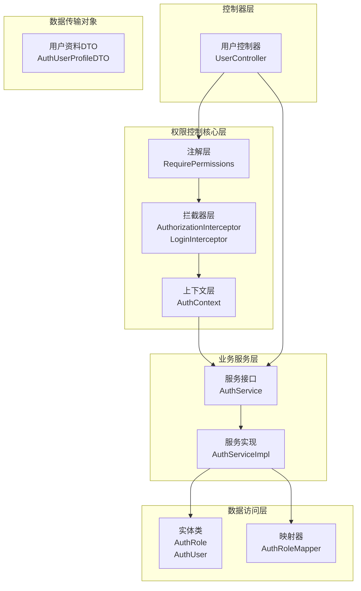
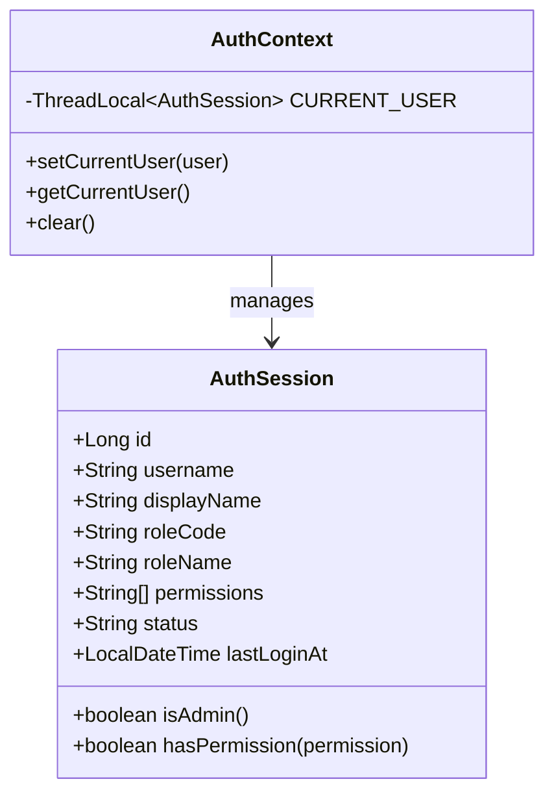
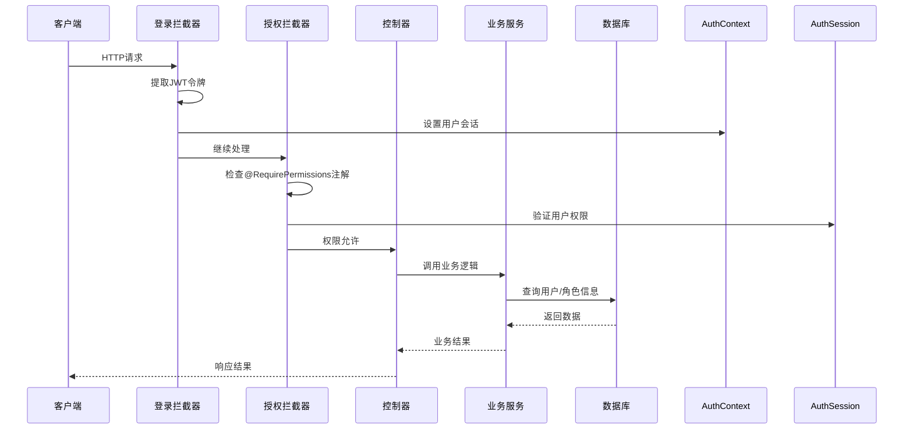
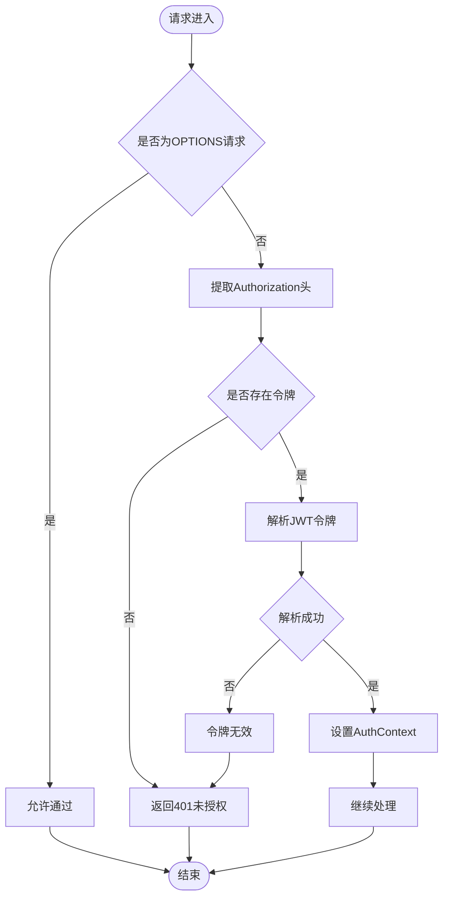
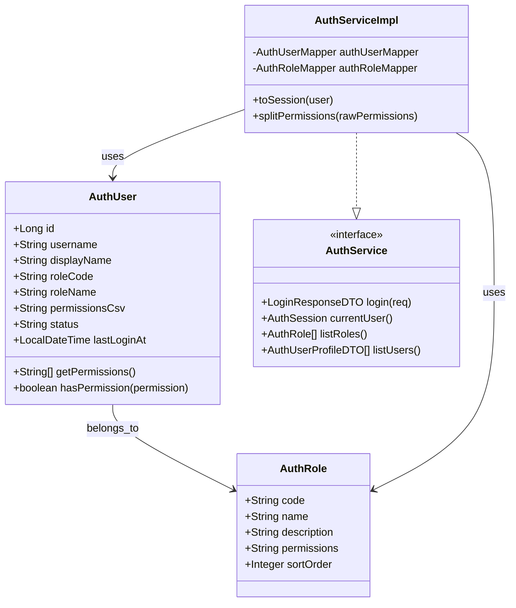
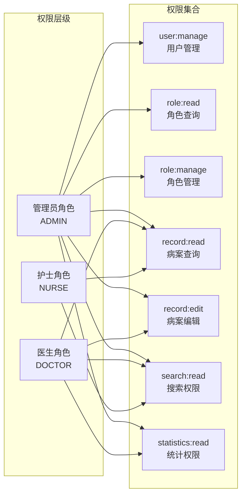
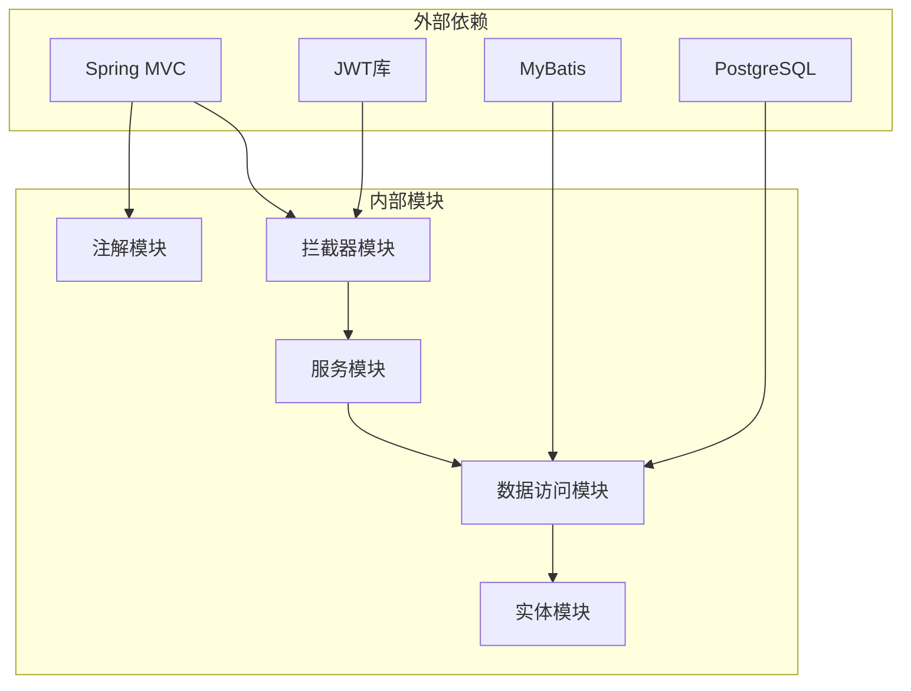
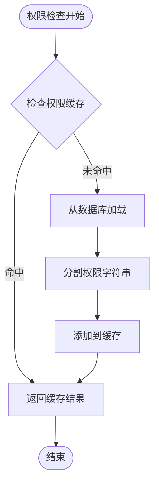

# 权限控制系统


**本文档引用的文件**
- [RequirePermissions.java](file://backend-repo/src/main/java/com/zjcxph/imgapi/annotation/RequirePermissions.java)
- [AuthorizationInterceptor.java](file://backend-repo/src/main/java/com/zjcxph/imgapi/interceptors/AuthorizationInterceptor.java)
- [LoginInterceptor.java](file://backend-repo/src/main/java/com/zjcxph/imgapi/interceptors/LoginInterceptor.java)
- [AuthSession.java](file://backend-repo/src/main/java/com/zjcxph/imgapi/common/AuthSession.java)
- [AuthContext.java](file://backend-repo/src/main/java/com/zjcxph/imgapi/utils/AuthContext.java)
- [AuthService.java](file://backend-repo/src/main/java/com/zjcxph/imgapi/service/AuthService.java)
- [AuthServiceImpl.java](file://backend-repo/src/main/java/com/zjcxph/imgapi/service/impl/AuthServiceImpl.java)
- [AuthRole.java](file://backend-repo/src/main/java/com/zjcxph/imgapi/entity/AuthRole.java)
- [AuthUser.java](file://backend-repo/src/main/java/com/zjcxph/imgapi/entity/AuthUser.java)
- [AuthRoleMapper.java](file://backend-repo/src/main/java/com/zjcxph/imgapi/mapper/AuthRoleMapper.java)
- [UserController.java](file://backend-repo/src/main/java/com/zjcxph/imgapi/controller/UserController.java)
- [AuthUserProfileDTO.java](file://backend-repo/src/main/java/com/zjcxph/imgapi/dto/resp/AuthUserProfileDTO.java)
- [schema.sql](file://mrr-db/schema.sql)
- [application.properties](file://backend-repo/src/main/resources/application.properties)


## 目录
1. [简介](#简介)
2. [项目结构](#项目结构)
3. [核心组件](#核心组件)
4. [架构概览](#架构概览)
5. [详细组件分析](#详细组件分析)
6. [依赖关系分析](#依赖关系分析)
7. [性能考虑](#性能考虑)
8. [故障排除指南](#故障排除指南)
9. [结论](#结论)

## 简介

MRR系统的权限控制系统采用基于注解的权限控制机制，通过Spring MVC拦截器实现请求级别的权限验证。该系统实现了完整的角色-权限模型，支持用户角色分配、权限继承和动态权限检查。

系统的核心特性包括：
- 基于注解的声明式权限控制
- 角色驱动的权限模型
- JWT令牌认证与会话管理
- 运行时权限验证和拦截
- 完整的权限继承机制

## 项目结构

权限控制系统在后端Java代码中的组织结构如下：



**图表来源**
- [RequirePermissions.java:1-13](file://backend-repo/src/main/java/com/zjcxph/imgapi/annotation/RequirePermissions.java#L1-L13)
- [AuthorizationInterceptor.java:1-78](file://backend-repo/src/main/java/com/zjcxph/imgapi/interceptors/AuthorizationInterceptor.java#L1-L78)
- [AuthServiceImpl.java:1-151](file://backend-repo/src/main/java/com/zjcxph/imgapi/service/impl/AuthServiceImpl.java#L1-L151)

**章节来源**
- [RequirePermissions.java:1-13](file://backend-repo/src/main/java/com/zjcxph/imgapi/annotation/RequirePermissions.java#L1-L13)
- [AuthorizationInterceptor.java:1-78](file://backend-repo/src/main/java/com/zjcxph/imgapi/interceptors/AuthorizationInterceptor.java#L1-L78)
- [AuthServiceImpl.java:1-151](file://backend-repo/src/main/java/com/zjcxph/imgapi/service/impl/AuthServiceImpl.java#L1-L151)

## 核心组件

### 注解系统

系统使用`@RequirePermissions`注解实现声明式权限控制：

```mermaid
classDiagram
class RequirePermissions {
<<annotation>>
+String[] value
+default {}
}
class AnnotationTarget {
<<interface>>
METHOD
TYPE
}
class AnnotationRetention {
<<interface>>
RUNTIME
}
RequirePermissions ..|> AnnotationTarget
RequirePermissions ..|> AnnotationRetention
```

**图表来源**
- [RequirePermissions.java:8-12](file://backend-repo/src/main/java/com/zjcxph/imgapi/annotation/RequirePermissions.java#L8-L12)

### 会话管理系统



**图表来源**
- [AuthSession.java:7-89](file://backend-repo/src/main/java/com/zjcxph/imgapi/common/AuthSession.java#L7-L89)
- [AuthContext.java:5-27](file://backend-repo/src/main/java/com/zjcxph/imgapi/utils/AuthContext.java#L5-L27)

**章节来源**
- [RequirePermissions.java:1-13](file://backend-repo/src/main/java/com/zjcxph/imgapi/annotation/RequirePermissions.java#L1-L13)
- [AuthSession.java:1-90](file://backend-repo/src/main/java/com/zjcxph/imgapi/common/AuthSession.java#L1-L90)
- [AuthContext.java:1-28](file://backend-repo/src/main/java/com/zjcxph/imgapi/utils/AuthContext.java#L1-L28)

## 架构概览

权限控制系统的整体架构采用拦截器链模式：



**图表来源**
- [LoginInterceptor.java:29-52](file://backend-repo/src/main/java/com/zjcxph/imgapi/interceptors/LoginInterceptor.java#L29-L52)
- [AuthorizationInterceptor.java:22-56](file://backend-repo/src/main/java/com/zjcxph/imgapi/interceptors/AuthorizationInterceptor.java#L22-L56)

## 详细组件分析

### 登录拦截器

登录拦截器负责JWT令牌解析和用户会话设置：



**图表来源**
- [LoginInterceptor.java:29-52](file://backend-repo/src/main/java/com/zjcxph/imgapi/interceptors/LoginInterceptor.java#L29-L52)

### 授权拦截器

授权拦截器实现核心的权限验证逻辑：

```mermaid
flowchart TD
Request([请求到达]) --> IsHandlerMethod{"是否为HandlerMethod"}
IsHandlerMethod --> |否| PassThrough[直接通过]
IsHandlerMethod --> |是| GetAnnotation[获取@RequirePermissions注解]
GetAnnotation --> HasAnnotation{"是否有注解且权限不为空"}
HasAnnotation --> |否| PassThrough
HasAnnotation --> |是| GetSession[获取AuthSession]
GetSession --> HasSession{"会话是否存在"}
HasSession --> |否| Return401[返回401]
HasSession --> |是| CheckAdmin{"是否为管理员"}
CheckAdmin --> |是| AllowAccess[允许访问]
CheckAdmin --> |否| CheckPermissions[检查权限列表]
CheckPermissions --> AllMatch{"所有权限都满足"}
AllMatch --> |否| Return403[返回403]
AllMatch --> |是| AllowAccess
PassThrough --> End([结束])
Return401 --> End
Return403 --> End
AllowAccess --> End
```

**图表来源**
- [AuthorizationInterceptor.java:22-56](file://backend-repo/src/main/java/com/zjcxph/imgapi/interceptors/AuthorizationInterceptor.java#L22-L56)

### 角色-权限模型

系统采用基于角色的权限模型（RBAC），角色实体定义如下：



**图表来源**
- [AuthRole.java:6-52](file://backend-repo/src/main/java/com/zjcxph/imgapi/entity/AuthRole.java#L6-L52)
- [AuthUser.java:13-133](file://backend-repo/src/main/java/com/zjcxph/imgapi/entity/AuthUser.java#L13-L133)
- [AuthService.java:12-24](file://backend-repo/src/main/java/com/zjcxph/imgapi/service/AuthService.java#L12-L24)

### 权限继承机制

系统实现了多层次的权限继承：

1. **角色级权限**：从`mr_auth_role`表中加载角色的权限字符串
2. **用户级权限**：从`mr_auth_user`表中加载用户的直接权限
3. **管理员特权**：特殊角色和权限组合获得超级权限



**图表来源**
- [schema.sql:83-87](file://mrr-db/schema.sql#L83-L87)
- [AuthServiceImpl.java:107-118](file://backend-repo/src/main/java/com/zjcxph/imgapi/service/impl/AuthServiceImpl.java#L107-L118)

**章节来源**
- [AuthorizationInterceptor.java:1-78](file://backend-repo/src/main/java/com/zjcxph/imgapi/interceptors/AuthorizationInterceptor.java#L1-L78)
- [AuthRole.java:1-53](file://backend-repo/src/main/java/com/zjcxph/imgapi/entity/AuthRole.java#L1-L53)
- [AuthUser.java:1-134](file://backend-repo/src/main/java/com/zjcxph/imgapi/entity/AuthUser.java#L1-L134)
- [AuthServiceImpl.java:1-151](file://backend-repo/src/main/java/com/zjcxph/imgapi/service/impl/AuthServiceImpl.java#L1-L151)

## 依赖关系分析



**图表来源**
- [LoginInterceptor.java:1-69](file://backend-repo/src/main/java/com/zjcxph/imgapi/interceptors/LoginInterceptor.java#L1-L69)
- [AuthServiceImpl.java:1-151](file://backend-repo/src/main/java/com/zjcxph/imgapi/service/impl/AuthServiceImpl.java#L1-L151)

**章节来源**
- [LoginInterceptor.java:1-69](file://backend-repo/src/main/java/com/zjcxph/imgapi/interceptors/LoginInterceptor.java#L1-L69)
- [AuthServiceImpl.java:1-151](file://backend-repo/src/main/java/com/zjcxph/imgapi/service/impl/AuthServiceImpl.java#L1-L151)

## 性能考虑

### 缓存策略

系统可以通过以下方式优化权限检查性能：

1. **会话缓存**：利用`AuthContext`的线程本地存储避免重复查询
2. **权限预加载**：在用户登录时一次性加载所有权限信息
3. **角色缓存**：缓存角色权限映射关系减少数据库查询

### 权限检查优化



### 批量权限操作

系统支持批量权限操作，通过注解数组实现：

```java
@RequirePermissions({
    "user:manage",
    "role:read", 
    "record:manage"
})
@PostMapping("/batch-operation")
public ResponseEntity<?> batchOperation() {
    // 批量权限检查已自动完成
    return ResponseEntity.ok().build();
}
```

## 故障排除指南

### 常见权限问题

1. **401 未授权错误**
   - 检查JWT令牌是否正确传递
   - 验证令牌格式是否符合"Bearer "前缀要求
   - 确认令牌未过期

2. **403 禁止访问错误**
   - 检查用户是否具有所需的权限
   - 验证角色权限配置是否正确
   - 确认权限字符串格式正确

### 调试建议

1. 启用调试日志查看权限验证过程
2. 检查数据库中的角色权限配置
3. 验证用户角色分配是否正确

**章节来源**
- [AuthorizationInterceptor.java:58-68](file://backend-repo/src/main/java/com/zjcxph/imgapi/interceptors/AuthorizationInterceptor.java#L58-L68)
- [LoginInterceptor.java:59-67](file://backend-repo/src/main/java/com/zjcxph/imgapi/interceptors/LoginInterceptor.java#L59-L67)

## 结论

MRR系统的权限控制系统提供了完整的企业级权限管理解决方案。通过基于注解的声明式权限控制、灵活的角色-权限模型和高效的拦截器机制，系统能够满足复杂的权限管理需求。

关键优势包括：
- **声明式权限控制**：简洁易用的注解语法
- **灵活的角色模型**：支持多层级权限继承
- **高效的安全机制**：基于JWT的无状态认证
- **可扩展的设计**：易于添加新的权限类型和检查规则

该系统为开发者提供了清晰的权限配置示例和扩展指南，可以作为企业级应用权限控制的参考实现。