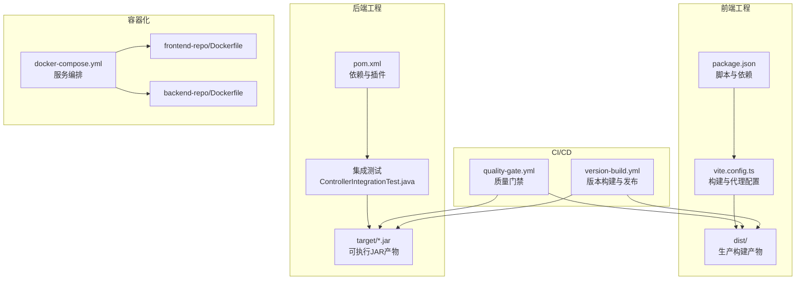
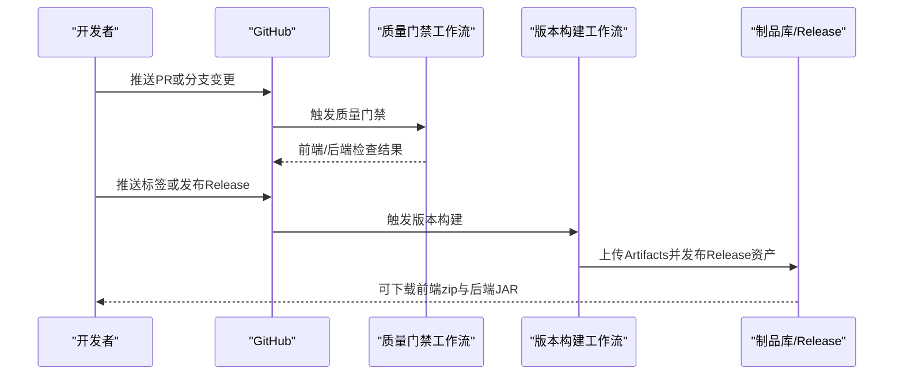
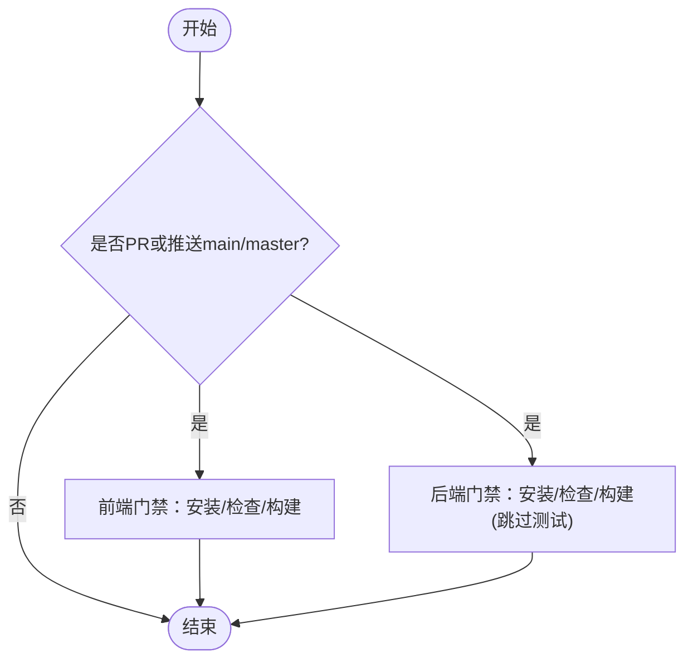
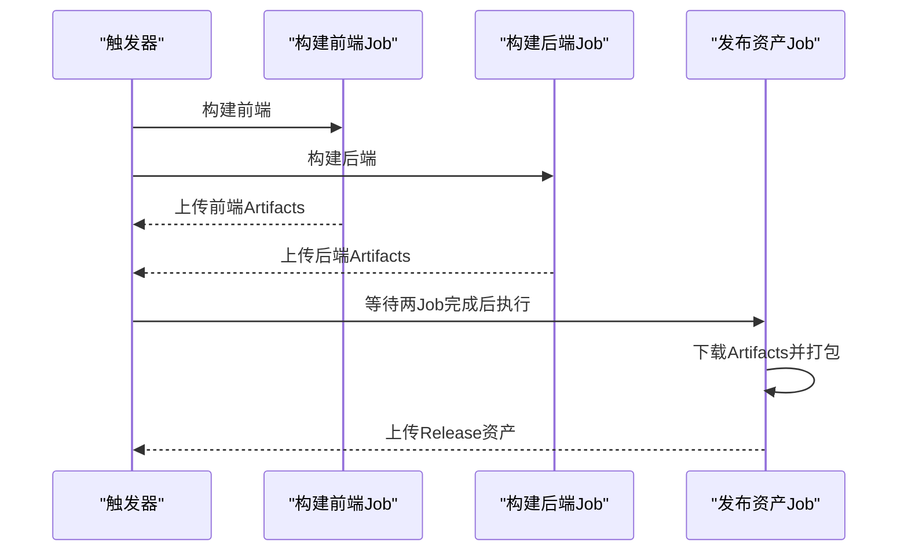
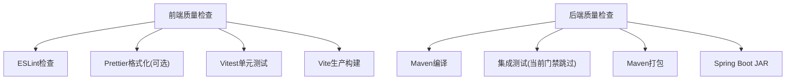
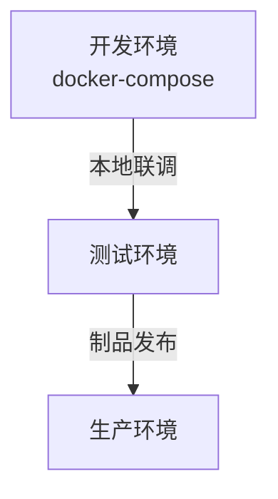
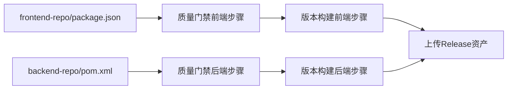

# CI/CD流水线

**本文档引用的文件**
- [.github/workflows/quality-gate.yml](file://.github/workflows/quality-gate.yml)
- [.github/workflows/version-build.yml](file://.github/workflows/version-build.yml)
- [QUALITY_GATE.md](file://QUALITY_GATE.md)
- [SYSTEM_ARCHITECTURE.md](file://SYSTEM_ARCHITECTURE.md)
- [backend-repo/pom.xml](file://backend-repo/pom.xml)
- [backend-repo/Dockerfile](file://backend-repo/Dockerfile)
- [backend-repo/src/test/java/com/zjcxph/imgapi/ControllerIntegrationTest.java](file://backend-repo/src/test/java/com/zjcxph/imgapi/ControllerIntegrationTest.java)
- [backend-repo/src/test/java/com/zjcxph/imgapi/ImageApiApplicationTests.java](file://backend-repo/src/test/java/com/zjcxph/imgapi/ImageApiApplicationTests.java)
- [frontend-repo/package.json](file://frontend-repo/package.json)
- [frontend-repo/vite.config.ts](file://frontend-repo/vite.config.ts)
- [frontend-repo/Dockerfile](file://frontend-repo/Dockerfile)
- [docker-compose.yml](file://docker-compose.yml)

## 目录
1. [简介](#简介)
2. [项目结构](#项目结构)
3. [核心组件](#核心组件)
4. [架构总览](#架构总览)
5. [详细组件分析](#详细组件分析)
6. [依赖关系分析](#依赖关系分析)
7. [性能考虑](#性能考虑)
8. [故障排除指南](#故障排除指南)
9. [结论](#结论)
10. [附录](#附录)

## 简介
本文件为MRR系统提供完整的CI/CD流水线操作指南，覆盖质量门禁检查、版本构建与发布、代码质量与安全扫描、测试自动化、构建产物管理与制品库配置、环境变量与密钥管理、以及多环境（开发、测试、生产）的自动化部署策略。文档基于仓库中现有的GitHub Actions工作流、构建配置与容器化部署脚本进行梳理，并提供可操作的流程图与最佳实践建议。

## 项目结构
MRR系统采用前后端分离架构，包含：
- 前端工程：Vue 3 + Vite，使用Vitest进行单元测试，打包产物输出至dist目录
- 后端工程：Spring Boot + Maven，使用JUnit进行集成测试，打包生成可执行JAR
- 容器化：前后端分别提供Dockerfile，配合docker-compose进行本地联调
- CI/CD：通过GitHub Actions实现质量门禁与版本构建发布

**图表来源**
- [.github/workflows/quality-gate.yml:1-54](file://.github/workflows/quality-gate.yml#L1-L54)
- [.github/workflows/version-build.yml:1-102](file://.github/workflows/version-build.yml#L1-L102)
- [frontend-repo/package.json:1-63](file://frontend-repo/package.json#L1-L63)
- [frontend-repo/vite.config.ts:1-90](file://frontend-repo/vite.config.ts#L1-L90)
- [backend-repo/pom.xml:1-136](file://backend-repo/pom.xml#L1-L136)
- [backend-repo/src/test/java/com/zjcxph/imgapi/ControllerIntegrationTest.java:1-245](file://backend-repo/src/test/java/com/zjcxph/imgapi/ControllerIntegrationTest.java#L1-L245)
- [docker-compose.yml:1-47](file://docker-compose.yml#L1-L47)
- [frontend-repo/Dockerfile:1-18](file://frontend-repo/Dockerfile#L1-L18)
- [backend-repo/Dockerfile:1-16](file://backend-repo/Dockerfile#L1-L16)

**章节来源**
- [.github/workflows/quality-gate.yml:1-54](file://.github/workflows/quality-gate.yml#L1-L54)
- [.github/workflows/version-build.yml:1-102](file://.github/workflows/version-build.yml#L1-L102)
- [SYSTEM_ARCHITECTURE.md:1-72](file://SYSTEM_ARCHITECTURE.md#L1-L72)

## 核心组件
- 质量门禁工作流（quality-gate.yml）
  - 针对前端与后端分别执行：安装依赖、代码检查、构建
  - 后端当前跳过测试，后续可升级为执行完整测试集
- 版本构建与发布工作流（version-build.yml）
  - 支持按标签触发与GitHub Release发布事件
  - 构建前端dist与后端JAR，上传为Artifacts并打包发布到Release
- 构建与测试配置
  - 前端：Vite生产构建、ESLint检查、可选格式化；Vitest用于单元测试
  - 后端：Maven编译打包；集成测试覆盖系统信息、健康检查、统计API等关键接口
- 容器化与本地联调
  - 提供独立Dockerfile与docker-compose，便于本地快速验证

**章节来源**
- [.github/workflows/quality-gate.yml:10-54](file://.github/workflows/quality-gate.yml#L10-L54)
- [.github/workflows/version-build.yml:15-102](file://.github/workflows/version-build.yml#L15-L102)
- [frontend-repo/package.json:6-24](file://frontend-repo/package.json#L6-L24)
- [frontend-repo/vite.config.ts:58-63](file://frontend-repo/vite.config.ts#L58-L63)
- [backend-repo/pom.xml:116-134](file://backend-repo/pom.xml#L116-L134)
- [backend-repo/src/test/java/com/zjcxph/imgapi/ControllerIntegrationTest.java:17-245](file://backend-repo/src/test/java/com/zjcxph/imgapi/ControllerIntegrationTest.java#L17-L245)

## 架构总览
CI/CD流水线围绕“质量门禁”和“版本构建发布”两大目标展开，结合容器化部署与本地联调，形成从代码提交到制品发布的闭环。

**图表来源**
- [.github/workflows/quality-gate.yml:3-9](file://.github/workflows/quality-gate.yml#L3-L9)
- [.github/workflows/version-build.yml:3-13](file://.github/workflows/version-build.yml#L3-L13)
- [.github/workflows/version-build.yml:70-102](file://.github/workflows/version-build.yml#L70-L102)

## 详细组件分析

### 质量门禁工作流（quality-gate.yml）
- 触发条件
  - 对于拉取请求（pull_request）
  - 对于main/master分支的推送（push）
- 前端门禁步骤
  - 检出代码、设置Node 20、缓存npm依赖
  - 安装依赖、ESLint检查、Vite生产构建
- 后端门禁步骤
  - 检出代码、设置Java 25、缓存Maven依赖
  - Maven编译打包（跳过测试）

**图表来源**
- [.github/workflows/quality-gate.yml:3-54](file://.github/workflows/quality-gate.yml#L3-L54)

**章节来源**
- [.github/workflows/quality-gate.yml:1-54](file://.github/workflows/quality-gate.yml#L1-L54)
- [QUALITY_GATE.md:28-34](file://QUALITY_GATE.md#L28-L34)

### 版本构建与发布工作流（version-build.yml）
- 触发条件
  - 推送以“v”开头的标签或语义化版本标签
  - 发布类型为published
- 权限要求
  - 具备contents: write权限以上传Release资产
- 步骤概览
  - 前端：Node 20、npm ci、Vite构建、上传dist为Artifacts
  - 后端：Maven构建、上传JAR为Artifacts
  - 发布阶段：下载Artifacts、前端打包zip、上传到GitHub Release

**图表来源**
- [.github/workflows/version-build.yml:15-102](file://.github/workflows/version-build.yml#L15-L102)

**章节来源**
- [.github/workflows/version-build.yml:1-102](file://.github/workflows/version-build.yml#L1-L102)

### 代码质量检查与测试
- 前端
  - ESLint检查：通过脚本执行
  - Prettier格式化：提供格式化与检查脚本
  - 单元测试：Vitest运行，测试配置位于vite.config.ts
- 后端
  - Maven生命周期：编译、测试（当前门禁跳过）、打包
  - 集成测试：覆盖系统信息、健康检查、统计API等关键接口

**图表来源**
- [frontend-repo/package.json:17-20](file://frontend-repo/package.json#L17-L20)
- [frontend-repo/vite.config.ts:58-63](file://frontend-repo/vite.config.ts#L58-L63)
- [backend-repo/pom.xml:116-134](file://backend-repo/pom.xml#L116-L134)
- [backend-repo/src/test/java/com/zjcxph/imgapi/ControllerIntegrationTest.java:17-245](file://backend-repo/src/test/java/com/zjcxph/imgapi/ControllerIntegrationTest.java#L17-L245)

**章节来源**
- [frontend-repo/package.json:6-24](file://frontend-repo/package.json#L6-L24)
- [frontend-repo/vite.config.ts:58-63](file://frontend-repo/vite.config.ts#L58-L63)
- [backend-repo/pom.xml:116-134](file://backend-repo/pom.xml#L116-L134)
- [backend-repo/src/test/java/com/zjcxph/imgapi/ControllerIntegrationTest.java:17-245](file://backend-repo/src/test/java/com/zjcxph/imgapi/ControllerIntegrationTest.java#L17-L245)

### 构建触发条件、分支策略与版本标签管理
- 触发条件
  - 质量门禁：PR与main/master推送
  - 版本构建：标签推送（v*与*.*.*）与GitHub Release发布
- 分支策略
  - main/master作为受保护分支，质量门禁确保合并质量
- 版本标签
  - 使用语义化版本标签（如vX.Y.Z），触发版本构建与发布

**章节来源**
- [.github/workflows/quality-gate.yml:3-9](file://.github/workflows/quality-gate.yml#L3-L9)
- [.github/workflows/version-build.yml:3-9](file://.github/workflows/version-build.yml#L3-L9)

### 代码扫描、安全检测与依赖漏洞检查
- 建议在现有质量门禁基础上扩展以下能力（概念性建议，非现有实现）
  - 前端：ESLint规则加固、Prettier检查纳入门禁
  - 后端：引入SpotBugs/Checkstyle、SonarQube扫描
  - 依赖漏洞：使用OWASP Dependency-Check或类似工具扫描Maven依赖
  - 容器镜像：使用Trivy扫描基础镜像与应用层漏洞
- 以上为通用最佳实践，具体集成需在工作流中新增相应步骤

**章节来源**
- [.github/workflows/quality-gate.yml:30-34](file://.github/workflows/quality-gate.yml#L30-L34)
- [backend-repo/pom.xml:27-114](file://backend-repo/pom.xml#L27-L114)

### 自动化部署到不同环境（开发、测试、生产）
- 开发环境
  - 使用docker-compose快速启动PostgreSQL、后端、前端服务
  - 前端通过代理转发API请求至后端，便于本地联调
- 测试与生产环境
  - 建议在CI/CD中新增部署作业，将Artifacts或JAR/Docker镜像部署到对应环境
  - 生产环境建议使用Kubernetes或容器编排平台，并启用滚动更新与回滚策略

**图表来源**
- [docker-compose.yml:1-47](file://docker-compose.yml#L1-L47)
- [frontend-repo/vite.config.ts:69-87](file://frontend-repo/vite.config.ts#L69-L87)

**章节来源**
- [docker-compose.yml:1-47](file://docker-compose.yml#L1-L47)
- [SYSTEM_ARCHITECTURE.md:49-56](file://SYSTEM_ARCHITECTURE.md#L49-L56)

### 构建产物管理、制品库配置与回滚策略
- 构建产物
  - 前端：dist目录，打包为zip上传至Release
  - 后端：target/*.jar，直接上传至Release
- 制品库
  - 当前使用GitHub Release作为制品库；可替换为专业制品库（如Artifactory/Nexus）
- 回滚策略
  - 建议在生产环境采用基于标签的回滚：通过版本标签锁定特定构建
  - 容器化场景下，可通过镜像标签回滚至历史版本

**章节来源**
- [.github/workflows/version-build.yml:38-67](file://.github/workflows/version-build.yml#L38-L67)
- [.github/workflows/version-build.yml:93-99](file://.github/workflows/version-build.yml#L93-L99)

### 环境变量管理与密钥轮换机制
- 环境变量
  - 前端：通过Vite加载环境变量，支持代理API目标地址等配置
  - 后端：通过docker-compose注入数据库连接、日志保留等环境变量
- 密钥轮换
  - 建议在GitHub Secrets中管理敏感信息（如发布令牌），并在需要时定期轮换
  - 容器环境中的密钥应通过Secret管理，避免硬编码

**章节来源**
- [frontend-repo/vite.config.ts:11-13](file://frontend-repo/vite.config.ts#L11-L13)
- [docker-compose.yml:26-32](file://docker-compose.yml#L26-L32)
- [.github/workflows/version-build.yml:100-101](file://.github/workflows/version-build.yml#L100-L101)

## 依赖关系分析
- 组件耦合
  - 质量门禁与版本构建均依赖前端与后端各自的工作目录与构建脚本
  - 发布阶段依赖Artifacts下载与GitHub Release上传动作
- 外部依赖
  - GitHub Actions Runner、Node/Maven缓存、GitHub Release API
- 潜在循环依赖
  - 当前无循环依赖；发布阶段通过needs显式声明依赖顺序

**图表来源**
- [frontend-repo/package.json:1-63](file://frontend-repo/package.json#L1-L63)
- [backend-repo/pom.xml:1-136](file://backend-repo/pom.xml#L1-L136)
- [.github/workflows/quality-gate.yml:10-54](file://.github/workflows/quality-gate.yml#L10-L54)
- [.github/workflows/version-build.yml:15-102](file://.github/workflows/version-build.yml#L15-L102)

**章节来源**
- [.github/workflows/quality-gate.yml:10-54](file://.github/workflows/quality-gate.yml#L10-L54)
- [.github/workflows/version-build.yml:15-102](file://.github/workflows/version-build.yml#L15-L102)

## 性能考虑
- 缓存优化
  - Node与Maven缓存已启用，减少重复安装时间
- 并行构建
  - 前后端构建并行执行，缩短整体流水线时间
- 产物精简
  - 前端dist按模块拆分chunk，提升加载性能
- 测试范围
  - 当前门禁跳过后端测试，建议在稳定后逐步引入完整测试以提升质量门禁强度

**章节来源**
- [.github/workflows/quality-gate.yml:22-25](file://.github/workflows/quality-gate.yml#L22-L25)
- [.github/workflows/quality-gate.yml:48-50](file://.github/workflows/quality-gate.yml#L48-L50)
- [frontend-repo/vite.config.ts:44-56](file://frontend-repo/vite.config.ts#L44-L56)

## 故障排除指南
- 质量门禁失败
  - 前端：检查ESLint规则与构建命令；确认Node版本与依赖缓存
  - 后端：检查Maven依赖与Java版本；确认跳过测试策略是否符合预期
- 版本构建失败
  - 确认触发标签格式正确；检查Artifacts上传与下载步骤
  - Release上传失败时，检查GITHUB_TOKEN权限与Release状态
- 本地联调问题
  - 检查docker-compose服务依赖与端口映射；确认前端代理配置指向正确的后端端口

**章节来源**
- [.github/workflows/quality-gate.yml:17-34](file://.github/workflows/quality-gate.yml#L17-L34)
- [.github/workflows/version-build.yml:77-99](file://.github/workflows/version-build.yml#L77-L99)
- [docker-compose.yml:19-43](file://docker-compose.yml#L19-L43)

## 结论
本CI/CD流水线以质量门禁与版本构建为核心，结合容器化部署与本地联调，形成了从代码提交到制品发布的高效闭环。建议在现有基础上逐步引入更严格的代码扫描与安全检测、完善测试覆盖率，并在生产环境实施基于标签的回滚与容器化部署策略，以进一步提升交付质量与运维稳定性。

## 附录
- 关键配置参考路径
  - 质量门禁：[quality-gate.yml:1-54](file://.github/workflows/quality-gate.yml#L1-L54)
  - 版本构建：[version-build.yml:1-102](file://.github/workflows/version-build.yml#L1-L102)
  - 前端构建脚本：[package.json:6-24](file://frontend-repo/package.json#L6-L24)
  - 前端测试配置：[vite.config.ts:58-63](file://frontend-repo/vite.config.ts#L58-L63)
  - 后端构建配置：[pom.xml:116-134](file://backend-repo/pom.xml#L116-L134)
  - 后端集成测试：[ControllerIntegrationTest.java:17-245](file://backend-repo/src/test/java/com/zjcxph/imgapi/ControllerIntegrationTest.java#L17-L245)
  - 容器化配置：[docker-compose.yml:1-47](file://docker-compose.yml#L1-L47)
  - 前端Dockerfile：[frontend-repo/Dockerfile:1-18](file://frontend-repo/Dockerfile#L1-L18)
  - 后端Dockerfile：[backend-repo/Dockerfile:1-16](file://backend-repo/Dockerfile#L1-L16)