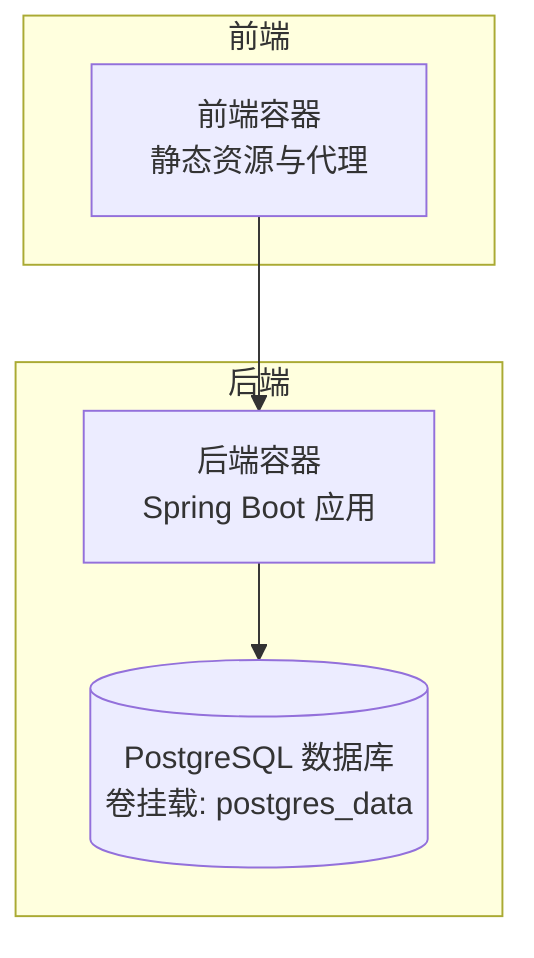
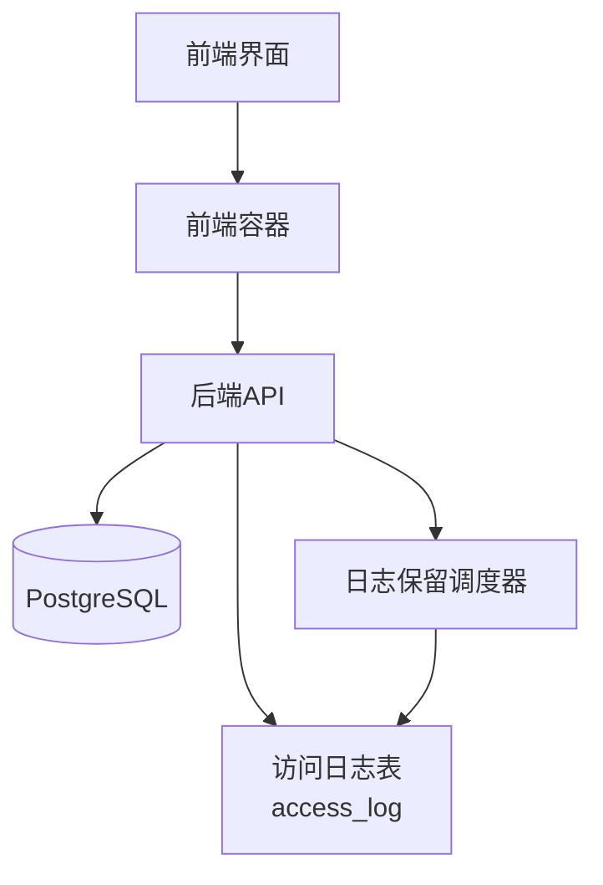
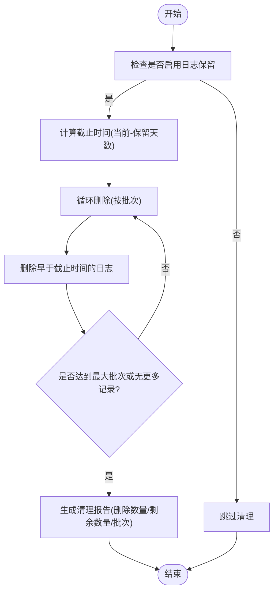
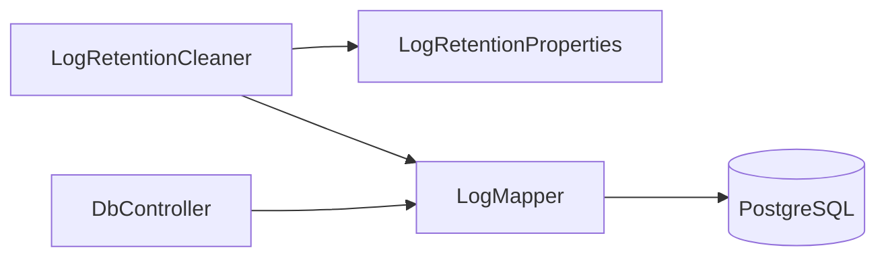

# 备份恢复

**本文引用的文件**
- [application.properties](file://backend-repo/src/main/resources/application.properties)
- [schema-postgresql.sql](file://backend-repo/src/main/resources/schema-postgresql.sql)
- [schema.sql](file://mrr-db/schema.sql)
- [LogRetentionCleaner.java](file://backend-repo/src/main/java/com/zjcxph/imgapi/scheduler/LogRetentionCleaner.java)
- [LogRetentionProperties.java](file://backend-repo/src/main/java/com/zjcxph/imgapi/config/LogRetentionProperties.java)
- [LogMapper.java](file://backend-repo/src/main/java/com/zjcxph/imgapi/mapper/LogMapper.java)
- [LogServiceImpl.java](file://backend-repo/src/main/java/com/zjcxph/imgapi/service/impl/LogServiceImpl.java)
- [DbController.java](file://backend-repo/src/main/java/com/zjcxph/imgapi/controller/DbController.java)
- [SYSTEM_ARCHITECTURE.md](file://SYSTEM_ARCHITECTURE.md)
- [docker-compose.yml](file://docker-compose.yml)
- [AESUtil.java](file://backend-repo/src/main/java/com/zjcxph/imgapi/utils/AESUtil.java)
- [decrypt.ts](file://frontend-repo/src/utils/decrypt.ts)
- [database-migrations SKILL.md](file://.trae/skills/database-migrations/SKILL.md)

## 目录
1. [简介](#简介)
2. [项目结构](#项目结构)
3. [核心组件](#核心组件)
4. [架构总览](#架构总览)
5. [详细组件分析](#详细组件分析)
6. [依赖分析](#依赖分析)
7. [性能考虑](#性能考虑)
8. [故障排查指南](#故障排查指南)
9. [结论](#结论)
10. [附录](#附录)

## 简介
本文件面向运维人员，提供MRR系统在生产环境下的完整备份与恢复操作指南。内容覆盖数据库备份策略（全量/增量/时间点恢复）、数据导出导入流程、备份验证与恢复测试、日志归档与保留策略、灾难恢复计划与业务连续性方案、数据迁移工具与版本升级兼容性及回滚机制、备份存储位置与加密传输、访问控制、RTO/RPO目标设定、备份脚本自动化与定期检查机制等。

## 项目结构
- 后端采用Spring Boot + MyBatis，使用PostgreSQL作为主数据存储，当前Schema位于PostgreSQL脚本中；同时存在一个SQLite风格的schema.sql文件，用于本地或历史用途。
- 日志保留通过定时任务清理过期访问日志，并支持手动导出与清理的审计流程。
- 前后端容器化部署，数据库持久化卷挂载，便于备份与恢复。

图表来源
- [docker-compose.yml:1-47](file://docker-compose.yml#L1-L47)

章节来源
- [docker-compose.yml:1-47](file://docker-compose.yml#L1-L47)
- [SYSTEM_ARCHITECTURE.md:1-72](file://SYSTEM_ARCHITECTURE.md#L1-L72)

## 核心组件
- 数据库层：PostgreSQL，应用通过JDBC连接池访问，初始化脚本定义了业务表与索引。
- 日志保留：基于配置的定时清理器，按保留天数分批删除过期访问日志，支持手动触发与结果报告。
- 配置与属性：日志保留开关、批大小、最大批次、Cron表达式等集中于配置类。
- 访问日志映射：MyBatis Mapper提供插入、查询、搜索、计数与删除等SQL操作。
- 数据导出：日志服务提供分页查询与搜索能力，可用于导出CSV。
- 安全与加密：后端提供AES工具类，前端提供ID卡加解密示例，密钥需在生产环境重写。

章节来源
- [application.properties:10-22](file://backend-repo/src/main/resources/application.properties#L10-L22)
- [schema-postgresql.sql:1-109](file://backend-repo/src/main/resources/schema-postgresql.sql#L1-L109)
- [LogRetentionCleaner.java:1-119](file://backend-repo/src/main/java/com/zjcxph/imgapi/scheduler/LogRetentionCleaner.java#L1-L119)
- [LogRetentionProperties.java:1-54](file://backend-repo/src/main/java/com/zjcxph/imgapi/config/LogRetentionProperties.java#L1-L54)
- [LogMapper.java:1-166](file://backend-repo/src/main/java/com/zjcxph/imgapi/mapper/LogMapper.java#L1-L166)
- [LogServiceImpl.java:1-71](file://backend-repo/src/main/java/com/zjcxph/imgapi/service/impl/LogServiceImpl.java#L1-L71)
- [AESUtil.java:1-233](file://backend-repo/src/main/java/com/zjcxph/imgapi/utils/AESUtil.java#L1-L233)
- [decrypt.ts:1-81](file://frontend-repo/src/utils/decrypt.ts#L1-L81)

## 架构总览
- 数据流：前端请求经由前端容器代理到后端，后端通过MyBatis访问PostgreSQL；访问日志写入access_log表，定期清理器按配置清理。
- 运维关注点：数据库备份与恢复、日志保留与导出、密钥与敏感数据保护、容器化部署与持久化卷。

图表来源
- [SYSTEM_ARCHITECTURE.md:18-31](file://SYSTEM_ARCHITECTURE.md#L18-L31)
- [LogRetentionCleaner.java:26-29](file://backend-repo/src/main/java/com/zjcxph/imgapi/scheduler/LogRetentionCleaner.java#L26-L29)
- [schema-postgresql.sql:61-73](file://backend-repo/src/main/resources/schema-postgresql.sql#L61-L73)

## 详细组件分析

### 数据库备份策略
- 全量备份
  - 使用PostgreSQL原生命令进行逻辑备份（推荐使用逻辑格式以便跨版本升级）与物理备份（针对数据目录）。
  - 建议在业务低峰时段执行，确保一致性快照。
  - 备份产物应包含所有业务Schema（如app）与系统表空间。
- 增量备份
  - 利用WAL归档与时间点恢复（PITR），结合全量备份进行恢复验证。
  - 生产环境建议启用归档日志并配置可靠归档存储。
- 时间点恢复（PITR）
  - 基于全量备份与WAL归档，在指定时间窗口内恢复至某一秒级时间点。
  - 恢复前需进行预恢复演练，确保数据一致性与应用可用性。

章节来源
- [schema-postgresql.sql:1-109](file://backend-repo/src/main/resources/schema-postgresql.sql#L1-L109)
- [docker-compose.yml:11-12](file://docker-compose.yml#L11-L12)

### 数据导出导入流程
- 导出
  - 使用日志服务提供的分页查询与搜索接口，按条件导出CSV，确保包含关键字段（客户端IP、URI、方法、状态码、耗时、时间等）。
  - 建议导出前设置合理的分页大小与并发，避免阻塞。
- 导入
  - 仅在严格控制的维护窗口内进行，导入前进行数据校验与备份。
  - 导入过程遵循“先结构后数据”的原则，确保索引与约束满足导入数据。

章节来源
- [LogServiceImpl.java:46-69](file://backend-repo/src/main/java/com/zjcxph/imgapi/service/impl/LogServiceImpl.java#L46-L69)
- [LogMapper.java:29-113](file://backend-repo/src/main/java/com/zjcxph/imgapi/mapper/LogMapper.java#L29-L113)

### 备份验证与恢复测试
- 验证
  - 对备份文件进行完整性校验与解压验证，确认可读性与版本兼容性。
  - 在隔离环境中执行恢复测试，验证业务表与索引重建、数据一致性。
- 恢复测试
  - 制定恢复测试计划，明确参与角色、步骤、时间窗与回退预案。
  - 测试完成后清理测试数据，恢复生产环境状态。

章节来源
- [SYSTEM_ARCHITECTURE.md:32-42](file://SYSTEM_ARCHITECTURE.md#L32-L42)

### 日志文件管理与归档策略
- 日志保留
  - 默认保留3年，自动清理默认关闭，需显式开启。
  - 清理器按批次删除过期日志，支持手动触发与结果报告。
- 归档
  - 建议将过期日志导出为CSV并归档至安全存储，保留至少3年以满足合规要求。
  - 归档介质需具备长期保存能力与访问控制。

图表来源
- [LogRetentionCleaner.java:39-117](file://backend-repo/src/main/java/com/zjcxph/imgapi/scheduler/LogRetentionCleaner.java#L39-L117)
- [LogRetentionProperties.java:8-12](file://backend-repo/src/main/java/com/zjcxph/imgapi/config/LogRetentionProperties.java#L8-L12)

章节来源
- [LogRetentionCleaner.java:26-29](file://backend-repo/src/main/java/com/zjcxph/imgapi/scheduler/LogRetentionCleaner.java#L26-L29)
- [LogRetentionProperties.java:1-54](file://backend-repo/src/main/java/com/zjcxph/imgapi/config/LogRetentionProperties.java#L1-L54)
- [application.properties:40-45](file://backend-repo/src/main/resources/application.properties#L40-L45)

### 灾难恢复计划与业务连续性
- DR目标
  - RTO：根据业务影响评估确定，建议在数小时内完成恢复。
  - RPO：建议小于等于15分钟，结合WAL归档与增量备份实现。
- 方案
  - 多地容灾：至少准备两个可用区的数据库实例与备份存储。
  - 快速切换：制定一键切换脚本与回退流程，确保DNS/负载均衡变更可逆。
  - 业务连续性：通过容器编排实现快速拉起，配合健康检查与自动重启。

章节来源
- [SYSTEM_ARCHITECTURE.md:49-72](file://SYSTEM_ARCHITECTURE.md#L49-L72)

### 数据迁移工具、版本升级与回滚
- 迁移工具
  - 推荐使用成熟的迁移工具（如golang-migrate、Django migrations等），确保迁移可追踪、可回滚。
- 升级兼容性
  - 严格区分DDL与DML，避免在大表上执行长事务锁。
  - 使用并发索引与零停机策略，必要时采用扩展-迁移-收缩模式。
- 回滚机制
  - 为每个DDL迁移配套DOWN脚本，确保可逆。
  - 回滚前进行数据一致性校验与备份。

章节来源
- [database-migrations SKILL.md:1-418](file://.trae/skills/database-migrations/SKILL.md#L1-L418)

### 备份存储位置、加密传输与访问控制
- 存储位置
  - 数据库数据目录持久化卷挂载于宿主机，建议将备份文件同步至对象存储或NAS，实现异地备份。
- 加密传输
  - 备份传输通道使用TLS/HTTPS，备份文件在存储端启用加密。
- 访问控制
  - 限制备份文件访问权限，仅授权运维账号可读取与恢复。
  - 密钥管理：后端AES工具类使用的密钥需在生产环境重写，密钥轮换与审计。

章节来源
- [docker-compose.yml:45-47](file://docker-compose.yml#L45-L47)
- [AESUtil.java:25](file://backend-repo/src/main/java/com/zjcxph/imgapi/utils/AESUtil.java#L25-L25)

### 恢复时间目标（RTO）与恢复点目标（RPO）
- RTO：建议≤4小时，结合自动化恢复脚本与容器编排。
- RPO：建议≤15分钟，结合WAL归档与增量备份。

章节来源
- [SYSTEM_ARCHITECTURE.md:66-72](file://SYSTEM_ARCHITECTURE.md#L66-L72)

### 备份脚本自动化与定期检查
- 自动化
  - 编写定时备份脚本，调用PostgreSQL备份命令，上传至安全存储。
  - 集成健康检查与告警，失败自动通知。
- 定期检查
  - 每月执行一次恢复演练，验证备份可用性与恢复流程。

章节来源
- [application.properties:40-45](file://backend-repo/src/main/resources/application.properties#L40-L45)

## 依赖分析
- 组件耦合
  - 日志保留调度器依赖配置类与Mapper，清理流程清晰且可测试。
  - 数据访问通过Mapper抽象，便于替换与扩展。
- 外部依赖
  - PostgreSQL驱动与连接池、MyBatis ORM、Spring调度框架。

图表来源
- [LogRetentionCleaner.java:18-24](file://backend-repo/src/main/java/com/zjcxph/imgapi/scheduler/LogRetentionCleaner.java#L18-L24)
- [LogRetentionProperties.java:1-54](file://backend-repo/src/main/java/com/zjcxph/imgapi/config/LogRetentionProperties.java#L1-L54)
- [LogMapper.java:1-166](file://backend-repo/src/main/java/com/zjcxph/imgapi/mapper/LogMapper.java#L1-L166)
- [DbController.java:12-16](file://backend-repo/src/main/java/com/zjcxph/imgapi/controller/DbController.java#L12-L16)

章节来源
- [LogRetentionCleaner.java:1-119](file://backend-repo/src/main/java/com/zjcxph/imgapi/scheduler/LogRetentionCleaner.java#L1-L119)
- [LogRetentionProperties.java:1-54](file://backend-repo/src/main/java/com/zjcxph/imgapi/config/LogRetentionProperties.java#L1-L54)
- [LogMapper.java:1-166](file://backend-repo/src/main/java/com/zjcxph/imgapi/mapper/LogMapper.java#L1-L166)
- [DbController.java:1-40](file://backend-repo/src/main/java/com/zjcxph/imgapi/controller/DbController.java#L1-L40)

## 性能考虑
- 大表清理
  - 分批删除与计数，避免长时间锁表。
- 查询优化
  - 利用索引（如access_time、client_ip、request_uri等）提升查询与清理效率。
- 并发与批大小
  - 合理设置批大小与最大批次，平衡吞吐与资源占用。

章节来源
- [LogRetentionCleaner.java:72-79](file://backend-repo/src/main/java/com/zjcxph/imgapi/scheduler/LogRetentionCleaner.java#L72-L79)
- [schema-postgresql.sql:83-89](file://backend-repo/src/main/resources/schema-postgresql.sql#L83-L89)

## 故障排查指南
- 备份失败
  - 检查数据库连接参数、磁盘空间与权限、网络连通性。
- 恢复异常
  - 核对备份版本与目标数据库版本兼容性，确认WAL归档路径有效。
- 日志保留未生效
  - 确认配置项已正确设置，Cron表达式与保留天数符合预期。
- 导出数据缺失
  - 检查分页参数与过滤条件，确认导出范围与时间窗口。

章节来源
- [application.properties:40-45](file://backend-repo/src/main/resources/application.properties#L40-L45)
- [LogRetentionCleaner.java:51-64](file://backend-repo/src/main/java/com/zjcxph/imgapi/scheduler/LogRetentionCleaner.java#L51-L64)

## 结论
通过完善的备份策略、严格的日志保留与导出流程、可验证的恢复测试以及安全的密钥与访问控制，MRR系统可在生产环境中实现高可靠的数据保护与快速的灾难恢复。建议持续优化自动化脚本与演练频率，确保RTO/RPO目标达成。

## 附录
- 关键配置项
  - 日志保留开关、Cron、保留天数、批大小、最大批次
- 数据库Schema
  - app.mr_scan、app.mr_statistics、app.mr_patient、app.mr_user、app.mr_auth_role、app.mr_auth_user、app.access_log
- 容器与卷
  - postgres_data卷用于持久化PostgreSQL数据

章节来源
- [application.properties:40-45](file://backend-repo/src/main/resources/application.properties#L40-L45)
- [schema-postgresql.sql:1-109](file://backend-repo/src/main/resources/schema-postgresql.sql#L1-L109)
- [docker-compose.yml:45-47](file://docker-compose.yml#L45-L47)