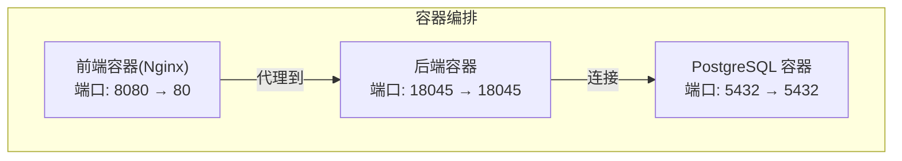
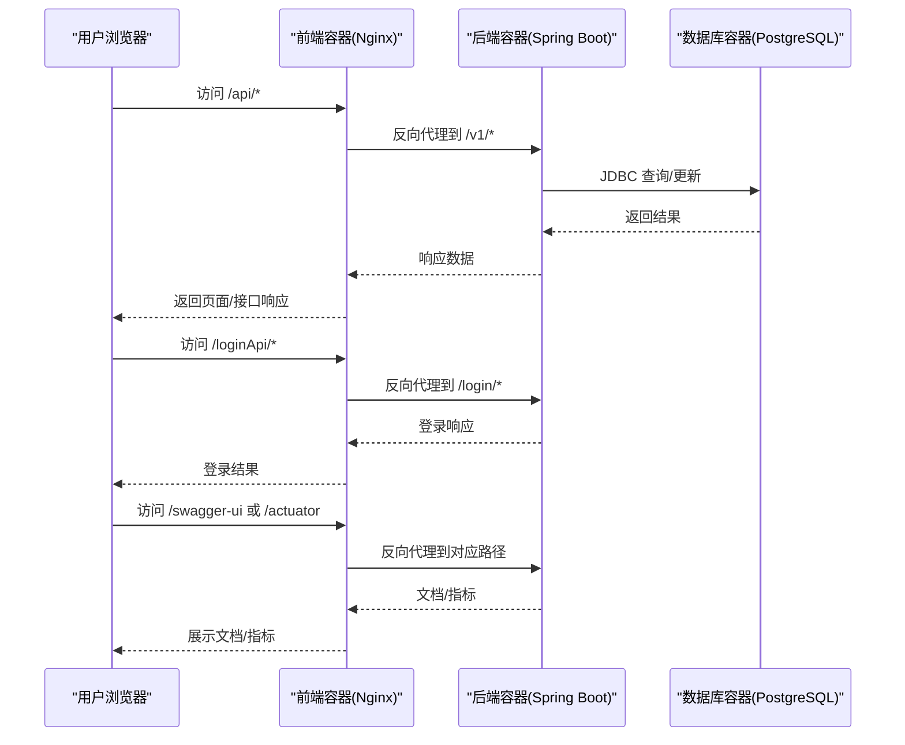
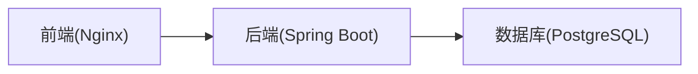

# 容器化部署

**本文引用的文件**
- [docker-compose.yml](file://docker-compose.yml)
- [backend/Dockerfile](file://backend-repo/Dockerfile)
- [frontend/Dockerfile](file://frontend-repo/Dockerfile)
- [后端应用配置(application.properties)](file://backend-repo/src/main/resources/application.properties)
- [后端初始化脚本(schema-postgresql.sql)](file://backend-repo/src/main/resources/schema-postgresql.sql)
- [前端 Nginx 配置(nginx.conf)](file://frontend-repo/nginx.conf)
- [前端包管理(package.json)](file://frontend-repo/package.json)
- [后端 Maven 构建(pom.xml)](file://backend-repo/pom.xml)
- [后端示例本地配置(application-local.example.properties)](file://backend-repo/src/main/resources/application-local.example.properties)
- [前端 Vite 配置(vite.config.ts)](file://frontend-fantastic-admin/vite.config.ts)
- [系统架构(SYSTEM_ARCHITECTURE.md)](file://SYSTEM_ARCHITECTURE.md)

## 目录
1. [简介](#简介)
2. [项目结构](#项目结构)
3. [核心组件](#核心组件)
4. [架构总览](#架构总览)
5. [详细组件分析](#详细组件分析)
6. [依赖关系分析](#依赖关系分析)
7. [性能考虑](#性能考虑)
8. [故障排查指南](#故障排查指南)
9. [结论](#结论)
10. [附录](#附录)

## 简介
本文件为 MRR（医学记录归档）系统的容器化部署指南，面向 DevOps 工程师与运维团队。内容涵盖：
- 使用 Docker Compose 编排 PostgreSQL 数据库、后端服务与前端应用
- 各服务的环境变量、端口映射与数据卷配置
- 服务依赖关系与健康检查机制
- 本地开发与生产环境的差异化配置思路
- 容器镜像构建流程、Dockerfile 优化与多阶段构建策略
- 网络配置、存储持久化与容器间通信
- 容器启动顺序控制与故障恢复建议

## 项目结构
MRR 采用三模块分层：前端、后端、数据库。Compose 将三个服务编排在同一默认网络中，实现服务发现与隔离。

图表来源
- [docker-compose.yml:1-47](file://docker-compose.yml#L1-L47)

章节来源
- [docker-compose.yml:1-47](file://docker-compose.yml#L1-L47)
- [SYSTEM_ARCHITECTURE.md:49-55](file://SYSTEM_ARCHITECTURE.md#L49-L55)

## 核心组件
- PostgreSQL 数据库
  - 镜像: postgres:16-alpine
  - 环境变量: 数据库名、用户名、密码
  - 持久化: 命名卷 postgres_data
  - 健康检查: 使用 pg_isready
- 后端服务
  - 基于 Spring Boot 的 Java 应用
  - 运行端口: 18045
  - 数据源: PostgreSQL，支持 schema 初始化
  - 环境变量: 数据源 URL、用户名、密码、日志保留策略、端口等
- 前端应用
  - 基于 Nginx 提供静态资源与反向代理
  - 端口: 80（容器内），宿主机映射至 8080
  - 反向代理: 将 /api、/loginApi、/searchApi、/swagger-ui、/actuator 等路径转发至后端

章节来源
- [docker-compose.yml:2-17](file://docker-compose.yml#L2-L17)
- [docker-compose.yml:19-34](file://docker-compose.yml#L19-L34)
- [docker-compose.yml:36-43](file://docker-compose.yml#L36-L43)
- [后端应用配置(application.properties):1-49](file://backend-repo/src/main/resources/application.properties#L1-L49)
- [前端 Nginx 配置(nginx.conf):1-101](file://frontend-repo/nginx.conf#L1-L101)

## 架构总览
下图展示容器间通信与数据流：浏览器通过前端容器访问 API；前端容器将特定路径代理到后端；后端连接数据库完成数据读写。

图表来源
- [docker-compose.yml:36-43](file://docker-compose.yml#L36-L43)
- [前端 Nginx 配置(nginx.conf):7-95](file://frontend-repo/nginx.conf#L7-L95)
- [后端应用配置(application.properties):1-49](file://backend-repo/src/main/resources/application.properties#L1-L49)

## 详细组件分析

### PostgreSQL 数据库
- 镜像与版本: postgres:16-alpine
- 环境变量
  - POSTGRES_DB: imgapi
  - POSTGRES_USER: postgres
  - POSTGRES_PASSWORD: weepwood
- 端口映射: 5432 → 5432
- 存储: 命名卷 postgres_data，持久化数据目录
- 健康检查: 使用 pg_isready，间隔 5s，超时 5s，最多重试 20 次
- 初始化: 通过 spring.sql.init.* 在首次启动时执行 schema 初始化脚本

章节来源
- [docker-compose.yml:2-17](file://docker-compose.yml#L2-L17)
- [后端应用配置(application.properties):20-22](file://backend-repo/src/main/resources/application.properties#L20-L22)
- [后端初始化脚本(schema-postgresql.sql):1-109](file://backend-repo/src/main/resources/schema-postgresql.sql#L1-L109)

### 后端服务（Spring Boot）
- 构建方式: 多阶段 Dockerfile
  - 构建阶段: maven:3.9.9-eclipse-temurin-21，复制 pom.xml 与源码，跳过测试打包
  - 运行阶段: eclipse-temurin:21-jre，仅拷贝生成的 jar，暴露 18045 端口
- 运行参数
  - 端口: 18045（由环境变量 SERVER_PORT 控制）
  - 数据源: 通过 SPRING_DATASOURCE_URL/USERNAME/PASSWORD 注入
  - 日志保留: APP_LOG_RETENTION_ENABLED、APP_LOG_RETENTION_RETENTION_DAYS 等
- 依赖关系
  - 依赖数据库健康状态（service_healthy）
  - 通过 currentSchema=app 指定模式
- 初始化脚本
  - spring.sql.init.schema-locations 指向 schema-postgresql.sql
  - 包含表结构、索引与初始角色/用户数据

章节来源
- [backend/Dockerfile:1-16](file://backend-repo/Dockerfile#L1-L16)
- [docker-compose.yml:19-34](file://docker-compose.yml#L19-L34)
- [后端应用配置(application.properties):1-49](file://backend-repo/src/main/resources/application.properties#L1-L49)
- [后端初始化脚本(schema-postgresql.sql):1-109](file://backend-repo/src/main/resources/schema-postgresql.sql#L1-L109)

### 前端应用（Nginx）
- 构建方式: 多阶段 Dockerfile
  - 构建阶段: node:22-alpine，安装依赖并构建产物
  - 运行阶段: nginx:1.27-alpine，拷贝构建产物与自定义配置
- 端口: 容器内 80，宿主机映射 8080
- 反向代理规则
  - /api 与 /api/ → 后端 /v1
  - /loginApi 与 /loginApi/ → 后端 /login
  - /searchApi 与 /searchApi/ → 后端 /v2
  - /swagger-ui → 后端 /swagger-ui
  - /actuator → 后端 /actuator
  - 其他静态资源走 Nginx 默认回退
- 本地开发参考
  - 前端工程使用 Vite，开发服务器默认端口 9000，并提供代理配置

章节来源
- [frontend/Dockerfile:1-18](file://frontend-repo/Dockerfile#L1-L18)
- [docker-compose.yml:36-43](file://docker-compose.yml#L36-L43)
- [前端 Nginx 配置(nginx.conf):1-101](file://frontend-repo/nginx.conf#L1-L101)
- [前端包管理(package.json):1-131](file://frontend-repo/package.json#L1-L131)
- [前端 Vite 配置(vite.config.ts):21-32](file://frontend-fantastic-admin/vite.config.ts#L21-L32)

### 镜像构建与多阶段优化
- 后端镜像
  - 构建阶段: 使用 maven:3.9.9-eclipse-temurin-21，避免在运行镜像中携带 Maven
  - 运行阶段: eclipse-temurin:21-jre，最小化运行时依赖
  - 优点: 减少镜像体积、降低攻击面
- 前端镜像
  - 构建阶段: node:22-alpine，安装依赖并构建
  - 运行阶段: nginx:1.27-alpine，仅承载静态资源与反向代理
  - 优点: 快速启动、资源占用低
- 建议优化
  - 使用 .dockerignore 排除不必要的构建上下文文件
  - 在构建阶段缓存依赖以提升重复构建速度
  - 对运行阶段进行非 root 用户与只读根文件系统加固（可结合 Compose 安全选项）

章节来源
- [backend/Dockerfile:1-16](file://backend-repo/Dockerfile#L1-L16)
- [frontend/Dockerfile:1-18](file://frontend-repo/Dockerfile#L1-L18)

### 网络与存储
- 网络
  - 默认网络: Compose 自动创建并连接所有服务
  - 服务发现: 后端通过服务名 postgres 访问数据库
- 存储
  - 数据库持久化: 命名卷 postgres_data
  - 建议: 生产环境使用独立卷或外部存储，确保备份与快照策略
- 通信
  - 前端仅对外暴露 8080，内部通过服务名与端口通信
  - 后端与数据库之间无外网暴露，仅容器内可达

章节来源
- [docker-compose.yml:45-47](file://docker-compose.yml#L45-L47)
- [docker-compose.yml:23-25](file://docker-compose.yml#L23-L25)

### 健康检查与启动顺序
- 健康检查
  - 数据库: pg_isready，快速验证连接可用性
  - 前端: 可在生产环境增加对后端 /actuator/health 的探测
- 启动顺序
  - 后端 depends_on: postgres，condition: service_healthy
  - 前端 depends_on: backend
  - 建议: 在生产环境配合重启策略与探针，确保服务自愈

章节来源
- [docker-compose.yml:13-17](file://docker-compose.yml#L13-L17)
- [docker-compose.yml:23-25](file://docker-compose.yml#L23-L25)
- [docker-compose.yml:40-41](file://docker-compose.yml#L40-L41)

## 依赖关系分析
- 组件耦合
  - 后端强依赖数据库 schema 初始化脚本
  - 前端依赖后端 API 路径约定（/v1、/login、/v2 等）
- 外部依赖
  - Java 运行时: Eclipse Temurin 21 JRE
  - 数据库驱动: PostgreSQL JDBC
  - 前端运行时: Nginx
- 循环依赖
  - 无循环依赖，遵循“前端 → 后端 → 数据库”的单向依赖

图表来源
- [docker-compose.yml:19-34](file://docker-compose.yml#L19-L34)
- [前端 Nginx 配置(nginx.conf):7-95](file://frontend-repo/nginx.conf#L7-L95)

章节来源
- [后端应用配置(application.properties):10-22](file://backend-repo/src/main/resources/application.properties#L10-L22)
- [后端初始化脚本(schema-postgresql.sql):1-109](file://backend-repo/src/main/resources/schema-postgresql.sql#L1-L109)

## 性能考虑
- 后端连接池
  - HikariCP 最大池大小、空闲、超时等参数可通过环境变量覆盖
- 前端静态资源
  - Nginx 提供压缩与缓存头，减少带宽与延迟
- 数据库
  - 建议在生产环境启用只读副本与连接池调优
- 镜像体积
  - 多阶段构建已有效减小镜像体积，建议配合只读文件系统与非 root 用户进一步加固

章节来源
- [后端应用配置(application.properties):15-19](file://backend-repo/src/main/resources/application.properties#L15-L19)
- [前端 Nginx 配置(nginx.conf):1-101](file://frontend-repo/nginx.conf#L1-L101)
- [backend/Dockerfile:1-16](file://backend-repo/Dockerfile#L1-L16)
- [frontend/Dockerfile:1-18](file://frontend-repo/Dockerfile#L1-L18)

## 故障排查指南
- 数据库未就绪
  - 现象: 后端启动失败或连接超时
  - 排查: 查看数据库健康检查输出，确认初始化脚本执行成功
- 前端无法访问后端
  - 现象: 页面空白或 502/504
  - 排查: 检查 Nginx 代理规则是否匹配；确认后端 /actuator/health 可达
- 端口冲突
  - 现象: 容器启动失败或端口占用
  - 处理: 修改宿主机映射端口或释放冲突端口
- 配置覆盖
  - 建议: 使用环境变量覆盖 application.properties 中的关键参数，避免硬编码

章节来源
- [docker-compose.yml:13-17](file://docker-compose.yml#L13-L17)
- [docker-compose.yml:36-43](file://docker-compose.yml#L36-L43)
- [后端应用配置(application.properties):1-49](file://backend-repo/src/main/resources/application.properties#L1-L49)

## 结论
本容器化方案以 Compose 实现三模块编排，通过多阶段构建与健康检查保障稳定性与安全性。建议在生产环境中补充安全加固、资源限制、备份策略与可观测性（如日志聚合与指标采集），并根据业务流量调整连接池与缓存策略。

## 附录

### 环境变量与端口对照表
- 数据库
  - POSTGRES_DB: imgapi
  - POSTGRES_USER: postgres
  - POSTGRES_PASSWORD: weepwood
  - 端口: 5432
- 后端
  - SPRING_DATASOURCE_URL: jdbc:postgresql://postgres:5432/imgapi?currentSchema=app
  - SPRING_DATASOURCE_USERNAME: postgres
  - SPRING_DATASOURCE_PASSWORD: weepwood
  - SERVER_PORT: 18045
  - APP_LOG_RETENTION_ENABLED: false
  - APP_LOG_RETENTION_RETENTION_DAYS: 1095
- 前端
  - 宿主机映射: 8080 → 80

章节来源
- [docker-compose.yml:5-34](file://docker-compose.yml#L5-L34)
- [后端应用配置(application.properties):1-49](file://backend-repo/src/main/resources/application.properties#L1-L49)
- [前端 Nginx 配置(nginx.conf):1-101](file://frontend-repo/nginx.conf#L1-L101)

### 本地开发与生产差异建议
- 本地开发
  - 使用 Compose 默认配置，前端映射 8080，便于本地调试
  - 后端可挂载源码目录（按需）以便热更新（注意 Spring Boot DevTools）
- 生产环境
  - 移除不必要的端口映射，仅暴露前端 8080
  - 启用重启策略与健康检查，设置资源上限
  - 使用独立网络与命名卷，开启只读文件系统与非 root 用户（可结合安全选项）

章节来源
- [docker-compose.yml:1-47](file://docker-compose.yml#L1-L47)
- [后端示例本地配置(application-local.example.properties):1-22](file://backend-repo/src/main/resources/application-local.example.properties#L1-L22)