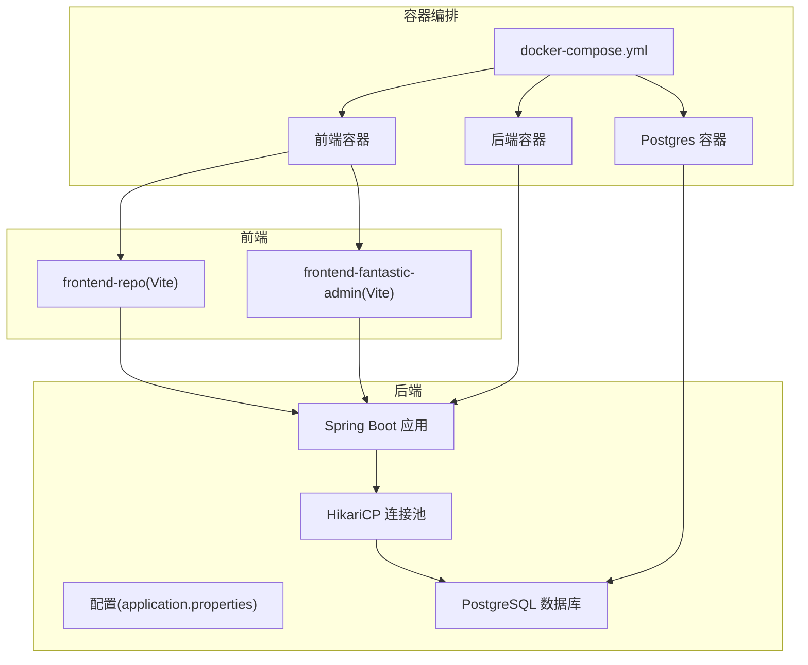
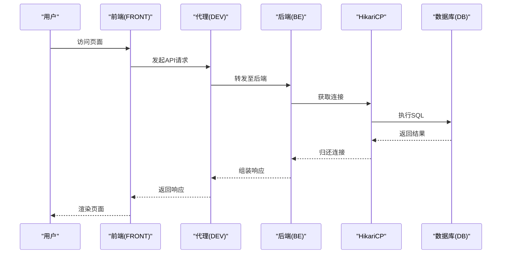
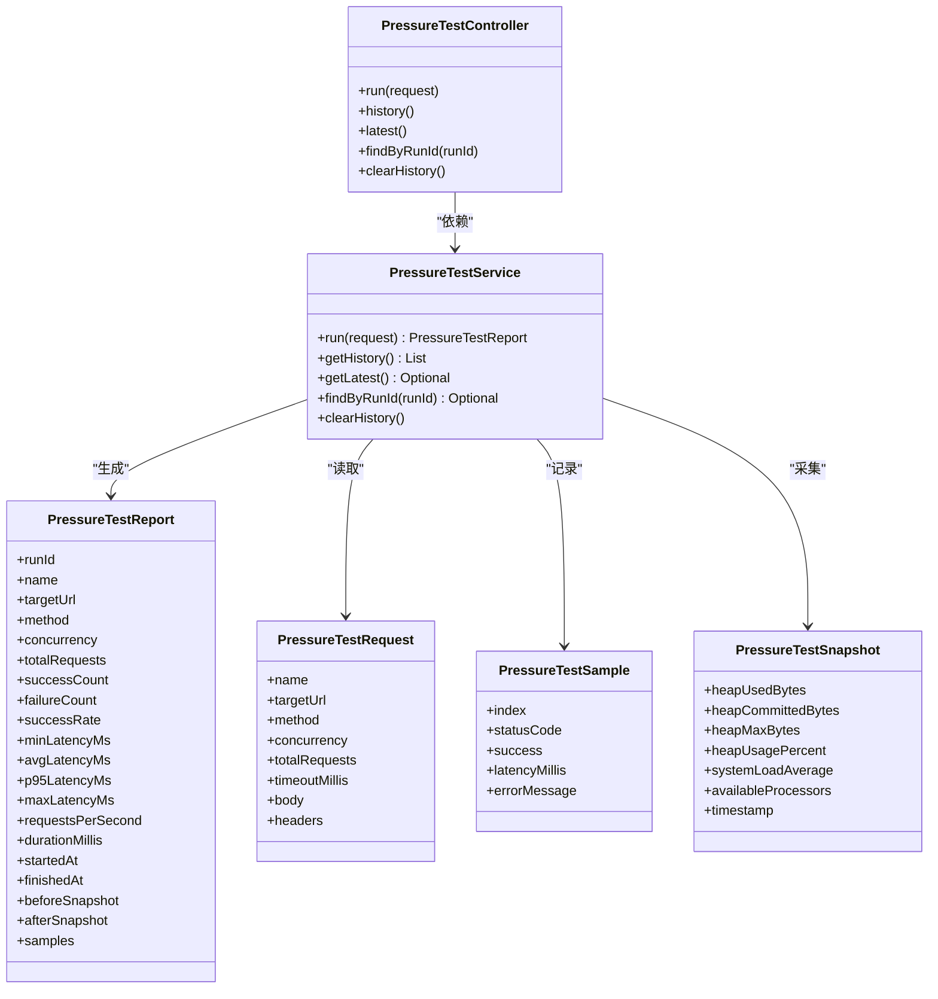
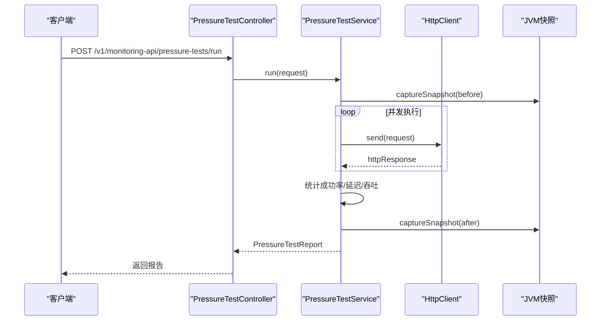
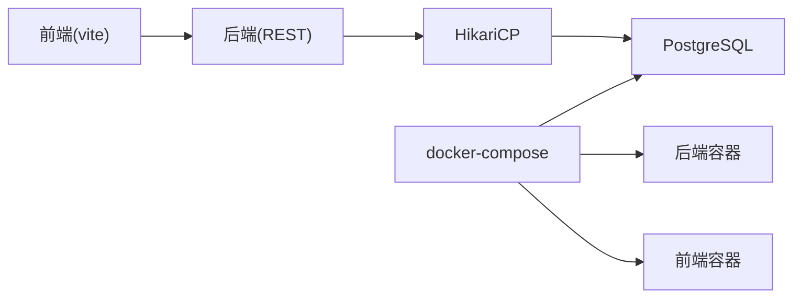

# 性能调优

**本文引用的文件**
- [application.properties](file://backend-repo/src/main/resources/application.properties)
- [Dockerfile（后端）](file://backend-repo/Dockerfile)
- [docker-compose.yml](file://docker-compose.yml)
- [schema-postgresql.sql](file://backend-repo/src/main/resources/schema-postgresql.sql)
- [schema.sql（旧版）](file://mrr-db/schema.sql)
- [vite.config.ts（前端仓库）](file://frontend-repo/vite.config.ts)
- [vite.config.ts（前端fantastic-admin）](file://frontend-fantastic-admin/vite.config.ts)
- [PressureTestService.java](file://backend-repo/src/main/java/com/zjcxph/imgapi/monitoring/PressureTestService.java)
- [PressureTestController.java](file://backend-repo/src/main/java/com/zjcxph/imgapi/controller/PressureTestController.java)
- [PressureTestReport.java](file://backend-repo/src/main/java/com/zjcxph/imgapi/monitoring/PressureTestReport.java)
- [PressureTestRequest.java](file://backend-repo/src/main/java/com/zjcxph/imgapi/monitoring/PressureTestRequest.java)
- [PressureTestSample.java](file://backend-repo/src/main/java/com/zjcxph/imgapi/monitoring/PressureTestSample.java)
- [PressureTestSnapshot.java](file://backend-repo/src/main/java/com/zjcxph/imgapi/monitoring/PressureTestSnapshot.java)
- [SystemInfoController.java](file://backend-repo/src/main/java/com/zjcxph/imgapi/controller/SystemInfoController.java)

## 目录
1. [简介](#简介)
2. [项目结构](#项目结构)
3. [核心组件](#核心组件)
4. [架构总览](#架构总览)
5. [详细组件分析](#详细组件分析)
6. [依赖分析](#依赖分析)
7. [性能考虑](#性能考虑)
8. [故障排查指南](#故障排查指南)
9. [结论](#结论)
10. [附录](#附录)

## 简介
本文件面向系统管理员与运维工程师，提供MRR系统的性能调优实践指南。内容覆盖后端基准测试与压力测试、数据库连接池与索引优化、缓存与静态资源优化、容器资源与并发控制、网络与负载均衡、性能监控与瓶颈定位、以及性能测试工具与对比分析方法。所有建议均基于仓库中现有实现与配置进行提炼与扩展。

## 项目结构
MRR系统由后端Spring Boot应用、PostgreSQL数据库、两个前端工程（frontend-repo与frontend-fantastic-admin）及容器编排组成。后端通过HikariCP连接池访问数据库；前端通过Vite构建并支持代理与分包策略；容器编排使用Compose统一启动后端、数据库与前端服务。

图表来源
- [docker-compose.yml:1-47](file://docker-compose.yml#L1-L47)
- [application.properties:10-22](file://backend-repo/src/main/resources/application.properties#L10-L22)
- [vite.config.ts（前端仓库）:1-90](file://frontend-repo/vite.config.ts#L1-L90)
- [vite.config.ts（前端fantastic-admin）:1-64](file://frontend-fantastic-admin/vite.config.ts#L1-L64)

章节来源
- [docker-compose.yml:1-47](file://docker-compose.yml#L1-L47)
- [application.properties:1-49](file://backend-repo/src/main/resources/application.properties#L1-L49)
- [vite.config.ts（前端仓库）:1-90](file://frontend-repo/vite.config.ts#L1-L90)
- [vite.config.ts（前端fantastic-admin）:1-64](file://frontend-fantastic-admin/vite.config.ts#L1-L64)

## 核心组件
- 后端配置与连接池：通过application.properties设置端口、压缩、静态资源缓存、PostgreSQL连接参数与HikariCP池大小、超时等。
- 压力测试子系统：PressureTestController提供REST接口，PressureTestService执行并发HTTP请求并生成报告，包含成功率、延迟分位、吞吐量与JVM快照。
- 数据库模式与索引：schema-postgresql.sql定义表结构与常用查询字段索引，支撑检索性能。
- 前端构建与代理：frontend-repo与frontend-fantastic-admin的vite.config.ts分别配置代理、分包、目标浏览器与构建输出。
- 容器化与暴露端口：Dockerfile与docker-compose定义镜像构建、JAR运行、端口映射与服务依赖。

章节来源
- [application.properties:1-49](file://backend-repo/src/main/resources/application.properties#L1-L49)
- [PressureTestController.java:1-73](file://backend-repo/src/main/java/com/zjcxph/imgapi/controller/PressureTestController.java#L1-L73)
- [PressureTestService.java:1-293](file://backend-repo/src/main/java/com/zjcxph/imgapi/monitoring/PressureTestService.java#L1-L293)
- [schema-postgresql.sql:1-109](file://backend-repo/src/main/resources/schema-postgresql.sql#L1-L109)
- [vite.config.ts（前端仓库）:1-90](file://frontend-repo/vite.config.ts#L1-L90)
- [vite.config.ts（前端fantastic-admin）:1-64](file://frontend-fantastic-admin/vite.config.ts#L1-L64)
- [Dockerfile（后端）:1-16](file://backend-repo/Dockerfile#L1-L16)
- [docker-compose.yml:1-47](file://docker-compose.yml#L1-L47)

## 架构总览
后端作为API与业务中心，前端通过代理转发到后端；数据库独立部署并通过连接池复用连接。容器编排确保服务健康与依赖顺序。

图表来源
- [application.properties:10-22](file://backend-repo/src/main/resources/application.properties#L10-L22)
- [vite.config.ts（前端仓库）:69-87](file://frontend-repo/vite.config.ts#L69-L87)
- [docker-compose.yml:19-43](file://docker-compose.yml#L19-L43)

## 详细组件分析

### 压力测试子系统
- 接口层：PressureTestController提供运行、历史、最新、按ID查询与清空历史等REST接口。
- 服务层：PressureTestService基于固定线程池并发执行HTTP请求，计算成功率、延迟分位、吞吐量，并采集JVM堆与系统负载快照。
- 报告与样本：PressureTestReport聚合统计指标；PressureTestSample记录单次请求状态；PressureTestSnapshot记录JVM与系统状态。
- 请求参数校验：PressureTestRequest对并发度、请求数、超时与方法进行范围约束。

图表来源
- [PressureTestController.java:1-73](file://backend-repo/src/main/java/com/zjcxph/imgapi/controller/PressureTestController.java#L1-L73)
- [PressureTestService.java:1-293](file://backend-repo/src/main/java/com/zjcxph/imgapi/monitoring/PressureTestService.java#L1-L293)
- [PressureTestReport.java:1-317](file://backend-repo/src/main/java/com/zjcxph/imgapi/monitoring/PressureTestReport.java#L1-L317)
- [PressureTestRequest.java:1-180](file://backend-repo/src/main/java/com/zjcxph/imgapi/monitoring/PressureTestRequest.java#L1-L180)
- [PressureTestSample.java:1-82](file://backend-repo/src/main/java/com/zjcxph/imgapi/monitoring/PressureTestSample.java#L1-L82)
- [PressureTestSnapshot.java:1-118](file://backend-repo/src/main/java/com/zjcxph/imgapi/monitoring/PressureTestSnapshot.java#L1-L118)

章节来源
- [PressureTestController.java:1-73](file://backend-repo/src/main/java/com/zjcxph/imgapi/controller/PressureTestController.java#L1-L73)
- [PressureTestService.java:1-293](file://backend-repo/src/main/java/com/zjcxph/imgapi/monitoring/PressureTestService.java#L1-L293)
- [PressureTestReport.java:1-317](file://backend-repo/src/main/java/com/zjcxph/imgapi/monitoring/PressureTestReport.java#L1-L317)
- [PressureTestRequest.java:1-180](file://backend-repo/src/main/java/com/zjcxph/imgapi/monitoring/PressureTestRequest.java#L1-L180)
- [PressureTestSample.java:1-82](file://backend-repo/src/main/java/com/zjcxph/imgapi/monitoring/PressureTestSample.java#L1-L82)
- [PressureTestSnapshot.java:1-118](file://backend-repo/src/main/java/com/zjcxph/imgapi/monitoring/PressureTestSnapshot.java#L1-L118)

### 压力测试流程（序列图）

图表来源
- [PressureTestController.java:35-41](file://backend-repo/src/main/java/com/zjcxph/imgapi/controller/PressureTestController.java#L35-L41)
- [PressureTestService.java:44-112](file://backend-repo/src/main/java/com/zjcxph/imgapi/monitoring/PressureTestService.java#L44-L112)

章节来源
- [PressureTestController.java:1-73](file://backend-repo/src/main/java/com/zjcxph/imgapi/controller/PressureTestController.java#L1-L73)
- [PressureTestService.java:1-293](file://backend-repo/src/main/java/com/zjcxph/imgapi/monitoring/PressureTestService.java#L1-L293)

### 数据库连接池与索引策略
- 连接池参数：maximum-pool-size、minimum-idle、connection-timeout、idle-timeout、max-lifetime等在application.properties中集中配置，便于按环境调整。
- 索引策略：schema-postgresql.sql为高频查询字段建立索引，如mr_scan、mr_statistics、mr_patient、mr_auth_user、access_log等表的关键列，有助于提升查询性能与排序效率。
- 建议：结合实际查询模式，定期审查慢查询日志与执行计划，针对性补充复合索引或调整现有索引选择性。

章节来源
- [application.properties:15-19](file://backend-repo/src/main/resources/application.properties#L15-L19)
- [schema-postgresql.sql:75-89](file://backend-repo/src/main/resources/schema-postgresql.sql#L75-L89)

### 缓存与静态资源优化
- 后端静态资源缓存：通过spring.web.resources.cache.cachecontrol.max-age与cache-public开启长期缓存，减少带宽消耗。
- 压缩：server.compression.enabled与mime-types启用响应压缩，降低传输体积。
- 前端分包：frontend-repo的vite.config.ts通过manualChunks将第三方库拆分为独立chunk，提升缓存命中率。
- 前端代理：前后端联调时，frontend-repo与frontend-fantastic-admin的vite.config.ts提供开发期代理，避免跨域与本地联调复杂度。

章节来源
- [application.properties:4-8](file://backend-repo/src/main/resources/application.properties#L4-L8)
- [vite.config.ts（前端仓库）:39-56](file://frontend-repo/vite.config.ts#L39-L56)
- [vite.config.ts（前端fantastic-admin）:20-32](file://frontend-fantastic-admin/vite.config.ts#L20-L32)

### 容器资源限制与并发控制
- 端口暴露：后端容器暴露18045，前端容器在80端口对外提供静态资源。
- 依赖健康检查：compose中postgres设置了健康检查，后端依赖数据库健康后再启动。
- 资源限制：当前未在compose中设置CPU/内存配额，建议在生产环境中根据JVM堆大小与并发需求添加limits以避免资源争用。

章节来源
- [Dockerfile（后端）:14-15](file://backend-repo/Dockerfile#L14-L15)
- [docker-compose.yml:9-17](file://docker-compose.yml#L9-L17)
- [docker-compose.yml:33-34](file://docker-compose.yml#L33-L34)
- [docker-compose.yml:42-43](file://docker-compose.yml#L42-L43)

### 网络与负载均衡
- 代理与重写：前端vite配置了/api、/loginApi、/searchApi等路径代理，便于开发期直连后端。
- 生产建议：若采用反向代理或负载均衡，建议开启连接复用、长连接与合理的超时设置；对静态资源启用CDN可显著降低后端压力。

章节来源
- [vite.config.ts（前端仓库）:69-87](file://frontend-repo/vite.config.ts#L69-L87)

## 依赖分析
- 后端对数据库的依赖：通过HikariCP连接池与PostgreSQL驱动交互，连接参数集中于application.properties。
- 前端对后端的依赖：通过代理将不同API前缀路由到后端对应路径。
- 容器编排依赖：后端等待数据库健康后再启动，保证初始化脚本与业务可用性。

图表来源
- [application.properties:10-22](file://backend-repo/src/main/resources/application.properties#L10-L22)
- [vite.config.ts（前端仓库）:69-87](file://frontend-repo/vite.config.ts#L69-L87)
- [docker-compose.yml:19-43](file://docker-compose.yml#L19-L43)

章节来源
- [application.properties:10-22](file://backend-repo/src/main/resources/application.properties#L10-L22)
- [vite.config.ts（前端仓库）:1-90](file://frontend-repo/vite.config.ts#L1-L90)
- [docker-compose.yml:1-47](file://docker-compose.yml#L1-L47)

## 性能考虑

### 数据库连接池优化
- 参数建议
  - maximum-pool-size：根据并发请求峰值与数据库最大连接数上限设定，避免过高导致数据库过载。
  - minimum-idle：维持一定空闲连接以降低突发请求的连接创建开销。
  - connection-timeout：控制客户端等待连接的最长等待时间，避免排队过久。
  - idle-timeout/max-lifetime：平衡连接复用与资源回收，防止连接泄漏。
- 监控：结合数据库慢查询日志与连接数指标，动态调整池大小与超时阈值。

章节来源
- [application.properties:15-19](file://backend-repo/src/main/resources/application.properties#L15-L19)

### 查询性能与索引策略
- 建议
  - 针对高频过滤/排序字段建立单列或复合索引，关注选择性与存储成本。
  - 使用EXPLAIN/ANALYZE评估执行计划，避免全表扫描与不必要的排序。
  - 对热点表进行分区或物化视图优化（视场景而定）。
- 参考索引
  - mr_scan：bah、brxh
  - mr_statistics：bah、date、type
  - mr_patient：idcard
  - mr_auth_user：username、role_code
  - access_log：access_time、client_ip、request_uri、method、response_status等

章节来源
- [schema-postgresql.sql:75-89](file://backend-repo/src/main/resources/schema-postgresql.sql#L75-L89)

### 缓存策略与内存优化
- 后端缓存
  - 业务层缓存：对稳定数据（如字典、权限配置）进行短期缓存，降低数据库压力。
  - HTTP缓存：静态资源长期缓存与ETag配合，减少重复传输。
- 内存优化
  - JVM堆大小：结合容器内存限制与实际负载压测结果，设置合适的-Xmx/-Xms。
  - GC调优：优先优化对象分配与晋升策略，减少Full GC频率；必要时引入G1/ParallelGC并行组合。
- 建议
  - 使用SystemInfoController提供的健康检查与内存使用百分比阈值，作为预警依据。

章节来源
- [application.properties:4-8](file://backend-repo/src/main/resources/application.properties#L4-L8)
- [SystemInfoController.java:120-142](file://backend-repo/src/main/java/com/zjcxph/imgapi/controller/SystemInfoController.java#L120-L142)

### 前端资源压缩与CDN
- 压缩
  - 启用gzip/br压缩（后端server.compression）与前端打包产物压缩。
- CDN
  - 将静态资源（JS/CSS/图片）接入CDN，结合长缓存与版本化命名，提升首屏与二次加载速度。
- 分包与懒加载
  - 利用vite的manualChunks策略拆分第三方库，配合路由懒加载减少初始包体。

章节来源
- [application.properties:4-6](file://backend-repo/src/main/resources/application.properties#L4-L6)
- [vite.config.ts（前端仓库）:39-56](file://frontend-repo/vite.config.ts#L39-L56)

### 容器资源限制与并发
- CPU/内存配额
  - 在docker-compose中为后端容器设置cpus与memory限制，避免“饿死”其他服务。
- 并发与线程
  - 压力测试线程池大小与数据库连接池需协同，避免同时达到上限导致级联阻塞。

章节来源
- [docker-compose.yml:26-34](file://docker-compose.yml#L26-L34)
- [PressureTestService.java:140-142](file://backend-repo/src/main/java/com/zjcxph/imgapi/monitoring/PressureTestService.java#L140-L142)

### 网络优化与负载均衡
- 连接复用：启用keep-alive与连接池复用，减少握手开销。
- 负载均衡：多实例部署时，合理设置健康检查与权重，避免单点过载。
- 超时与重试：区分连接超时、读取超时与业务超时，避免雪崩效应。

[本节为通用指导，无需特定文件引用]

### 性能监控与瓶颈识别
- 指标
  - 后端：Prometheus/Micrometer暴露指标（management.endpoints.web.exposure.include含metrics/prometheus），结合JVM堆、线程、GC与系统load。
  - 前端：Lighthouse、Web Vitals、CDN回源指标。
- 工具
  - 压力测试：内置PressureTestService可直接运行；也可结合JMeter/K6等工具进行更复杂的场景。
- 方法
  - 逐步加压，观察吞吐、延迟分位、错误率与JVM指标变化，定位瓶颈（CPU/IO/网络/锁）。

章节来源
- [application.properties:37-38](file://backend-repo/src/main/resources/application.properties#L37-L38)
- [PressureTestService.java:232-251](file://backend-repo/src/main/java/com/zjcxph/imgapi/monitoring/PressureTestService.java#L232-L251)

### 基准测试与对比分析
- 流程
  - 明确目标：吞吐、P95延迟、错误率、资源占用。
  - 设定基线：在稳定环境运行一次压力测试，记录报告与JVM快照。
  - 变更验证：每次优化后重新运行，对比报告中的成功率、延迟分位与吞吐差异。
- 输出
  - 压力测试报告包含runId、并发、请求数、成功率、最小/平均/P95/最大延迟、吞吐与JVM快照，便于横向对比。

章节来源
- [PressureTestReport.java:1-317](file://backend-repo/src/main/java/com/zjcxph/imgapi/monitoring/PressureTestReport.java#L1-L317)
- [PressureTestController.java:35-41](file://backend-repo/src/main/java/com/zjcxph/imgapi/controller/PressureTestController.java#L35-L41)

## 故障排查指南
- 压力测试失败
  - 检查请求参数合法性（并发、请求数、超时）与目标URL可达性。
  - 关注异常栈与错误消息，定位网络或目标服务问题。
- 数据库连接不足
  - 观察连接池使用率与等待队列长度，适当增大maximum-pool-size或优化SQL。
- 前端代理异常
  - 校验vite代理规则与目标地址，确认rewrite逻辑正确。
- 容器资源紧张
  - 查看容器CPU/内存配额与使用率，必要时增加限制或扩容实例。

章节来源
- [PressureTestRequest.java:23-33](file://backend-repo/src/main/java/com/zjcxph/imgapi/monitoring/PressureTestRequest.java#L23-L33)
- [vite.config.ts（前端仓库）:69-87](file://frontend-repo/vite.config.ts#L69-L87)
- [docker-compose.yml:26-34](file://docker-compose.yml#L26-L34)

## 结论
通过合理的数据库连接池与索引策略、静态资源与缓存优化、容器资源限制与并发控制、以及完善的性能监控与压力测试体系，MRR系统可在生产环境中获得稳定且可预期的性能表现。建议以压力测试报告为依据持续迭代优化，并结合监控指标建立预警与回归机制。

## 附录

### 快速对照表
- 连接池参数位置：[application.properties:15-19](file://backend-repo/src/main/resources/application.properties#L15-L19)
- 压力测试接口：[PressureTestController.java:35-41](file://backend-repo/src/main/java/com/zjcxph/imgapi/controller/PressureTestController.java#L35-L41)
- 压力测试报告模型：[PressureTestReport.java:1-317](file://backend-repo/src/main/java/com/zjcxph/imgapi/monitoring/PressureTestReport.java#L1-L317)
- 索引清单参考：[schema-postgresql.sql:75-89](file://backend-repo/src/main/resources/schema-postgresql.sql#L75-L89)
- 前端代理与分包：[vite.config.ts（前端仓库）:69-87](file://frontend-repo/vite.config.ts#L69-L87)
- 容器端口与依赖：[docker-compose.yml:19-43](file://docker-compose.yml#L19-L43)