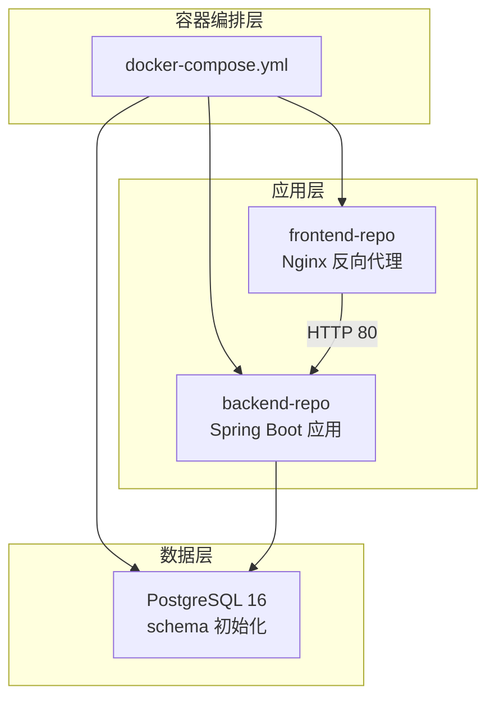
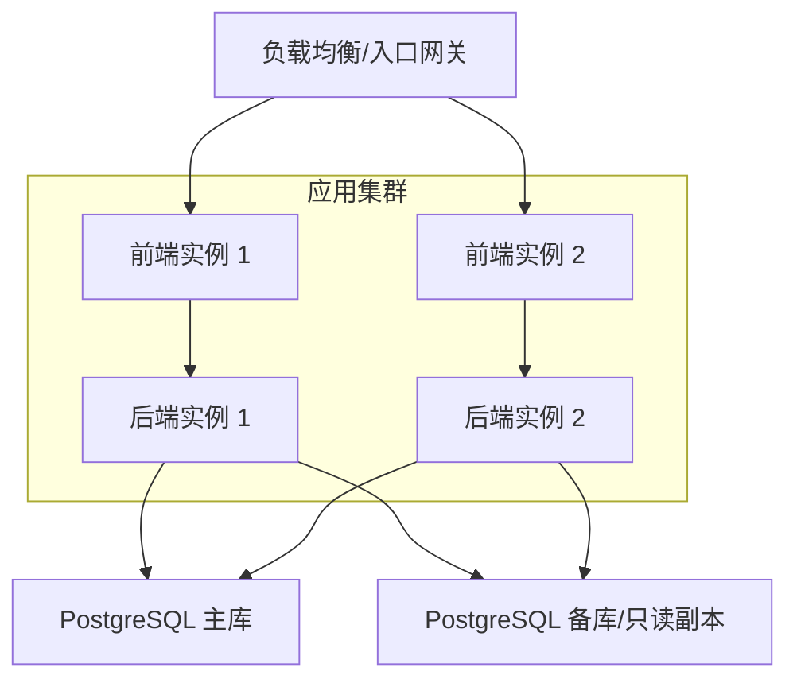
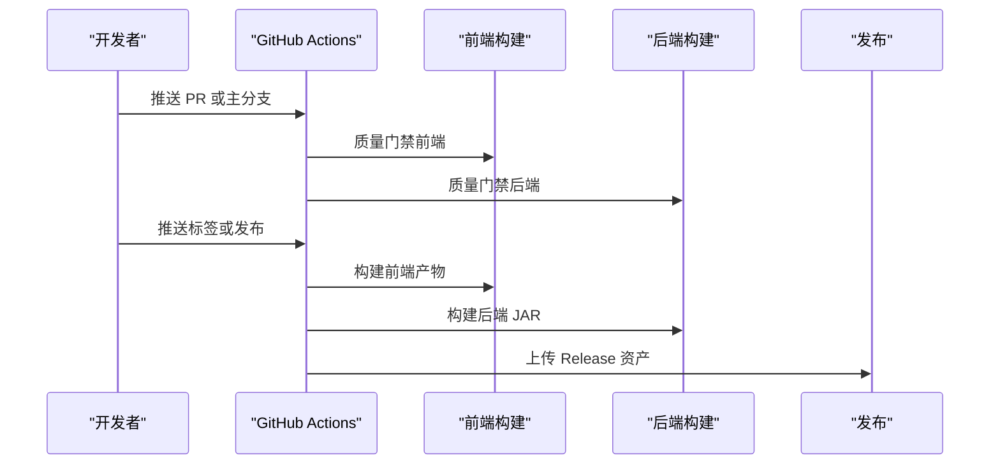
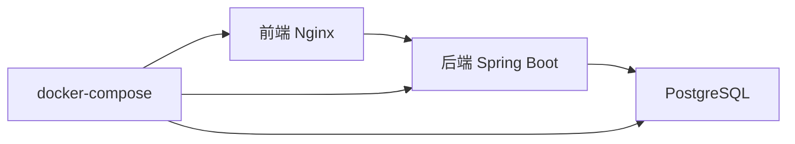

# 部署运维

> **当前项目约束**：正式部署不使用 Docker；仓库中的 Dockerfile 和 Docker Compose 仅用于本地开发、测试或演示。GitHub Actions 当前免费额度已用尽，CI 失败可能仅由额度限制导致，请结合本地验证结果判断。

**本文引用的文件**
- [docker-compose.yml](file://docker-compose.yml)
- [backend/Dockerfile](file://backend-repo/Dockerfile)
- [frontend/Dockerfile](file://frontend-repo/Dockerfile)
- [后端应用配置](file://backend-repo/src/main/resources/application.properties)
- [前端 Nginx 配置](file://frontend-repo/nginx.conf)
- [后端构建配置](file://backend-repo/pom.xml)
- [前端包管理配置](file://frontend-repo/package.json)
- [后端数据库初始化脚本](file://backend-repo/src/main/resources/schema-postgresql.sql)
- [质量门禁工作流](file://.github/workflows/quality-gate.yml)
- [版本构建与发布工作流](file://.github/workflows/version-build.yml)

## 目录
1. [简介](#简介)
2. [项目结构](#项目结构)
3. [核心组件](#核心组件)
4. [架构总览](#架构总览)
5. [详细组件分析](#详细组件分析)
6. [依赖关系分析](#依赖关系分析)
7. [性能考虑](#性能考虑)
8. [故障排查指南](#故障排查指南)
9. [结论](#结论)
10. [附录](#附录)

## 简介
本文件为 MRR（Medical Record Repository）系统的部署运维指南，覆盖容器化部署、环境配置、容器编排、生产部署、负载均衡与高可用、CI/CD 流水线、监控告警与日志聚合、备份恢复与灾难预案、性能调优与扩展策略、运维脚本与健康检查等运维全生命周期内容。文档面向运维工程师与平台工程团队，既提供高层架构视图，也给出可操作的落地步骤与排障指引。

## 项目结构
MRR 采用前后端分离的微服务式容器化架构：
- 后端服务：基于 Spring Boot 的 Java 应用，通过 Hikari 连接池访问 PostgreSQL 数据库，内置 Actuator 指标与健康检查。
- 前端服务：基于 Vue 的单页应用，构建产物由 Nginx 提供静态托管，并通过反向代理转发 API 请求至后端。
- 数据库：PostgreSQL 16，使用 schema 初始化脚本进行表结构与基础数据准备。
- 编排：使用 docker-compose 进行本地开发与演示环境编排；生产建议结合 Kubernetes 或云原生编排平台。

图表来源
- [docker-compose.yml:1-47](file://docker-compose.yml#L1-L47)
- [后端应用配置:1-49](file://backend-repo/src/main/resources/application.properties#L1-L49)
- [前端 Nginx 配置:1-101](file://frontend-repo/nginx.conf#L1-L101)

章节来源
- [docker-compose.yml:1-47](file://docker-compose.yml#L1-L47)

## 核心组件
- 容器镜像构建
  - 后端镜像：基于 Maven 构建 JAR，运行于 Eclipse Temurin 21 JRE。
  - 前端镜像：基于 Node 22 构建静态资源，运行于 Nginx 1.27。
- 服务暴露与网络
  - 后端：容器内 18045 端口映射至宿主机 18045。
  - 前端：容器内 80 端口映射至宿主机 8080；Nginx 监听 8005 用于内部 API 转发。
  - 数据库：容器内 5432 端口映射至宿主机 5432。
- 健康检查
  - 数据库：使用 pg_isready 健康探针，重试次数与间隔已配置。
  - 应用：Spring Boot Actuator 暴露健康、指标等端点，便于外部监控系统拉取。
- 配置管理
  - 环境变量驱动：数据库连接、日志保留、AES 密钥、服务器端口等均通过环境变量注入。
  - 默认值：application.properties 中提供默认值，生产环境务必覆盖。

章节来源
- [backend/Dockerfile:1-16](file://backend-repo/Dockerfile#L1-L16)
- [frontend/Dockerfile:1-18](file://frontend-repo/Dockerfile#L1-L18)
- [后端应用配置:1-49](file://backend-repo/src/main/resources/application.properties#L1-L49)
- [docker-compose.yml:1-47](file://docker-compose.yml#L1-L47)

## 架构总览
MRR 的典型部署拓扑如下：

说明
- 前端与后端均支持横向扩展，通过负载均衡分发请求。
- 数据库建议采用主从复制或托管数据库服务，后端可配置只读副本以降低查询压力。
- 建议在生产环境引入 Ingress/NLB、服务网格与自动扩缩容策略。

## 详细组件分析

### 数据库服务（PostgreSQL）
- 镜像与持久化
  - 使用 postgres:16-alpine，数据卷挂载至 postgres_data。
- 健康检查
  - 使用 pg_isready，超时与重试参数已配置，确保容器启动顺序与依赖满足。
- 初始化
  - 通过 schema-postgresql.sql 初始化 schema 与基础表，包含索引与初始角色/用户数据。
- 生产建议
  - 使用托管数据库或自建主从复制，开启 WAL 归档与 PITR。
  - 设置只读副本用于报表与离线分析，避免影响主库写入。

章节来源
- [docker-compose.yml:2-17](file://docker-compose.yml#L2-L17)
- [后端数据库初始化脚本:1-109](file://backend-repo/src/main/resources/schema-postgresql.sql#L1-L109)

### 后端服务（Spring Boot）
- 镜像与运行
  - 多阶段构建：Maven 构建 JAR，运行时基于 Eclipse Temurin 21 JRE。
  - 暴露端口 18045，默认端口可通过环境变量覆盖。
- 数据源与连接池
  - HikariCP 连接池参数可调，包括最大池大小、最小空闲、连接超时、空闲与最大生存时间。
- Actuator 与健康检查
  - 暴露 health、info、metrics、prometheus 等端点，便于 Prometheus/Grafana 监控。
- 日志与清理
  - 支持访问日志保留清理任务，可按天数与批大小控制清理节奏。
- 安全与密钥
  - AES 密钥需在生产环境覆盖，避免使用默认值。

章节来源
- [backend/Dockerfile:1-16](file://backend-repo/Dockerfile#L1-L16)
- [后端应用配置:1-49](file://backend-repo/src/main/resources/application.properties#L1-L49)
- [后端构建配置:1-136](file://backend-repo/pom.xml#L1-L136)

### 前端服务（Nginx）
- 镜像与构建
  - Node 构建静态资源，Nginx 提供静态托管与反向代理。
- 反向代理规则
  - 将 /api、/loginApi、/searchApi、/swagger-ui、/v1、/v2、/actuator 等路径转发至后端对应端点。
- 静态资源
  - 通过 try_files $uri $uri/ /index.html 实现 SPA 路由回退。
- 生产建议
  - 建议启用 HTTPS、缓存策略与 Gzip 压缩，结合 CDN 分发静态资源。

章节来源
- [frontend/Dockerfile:1-18](file://frontend-repo/Dockerfile#L1-L18)
- [前端 Nginx 配置:1-101](file://frontend-repo/nginx.conf#L1-L101)

### CI/CD 流水线
- 质量门禁（Pull Request/主分支）
  - 前端：安装依赖、代码检查、构建。
  - 后端：安装 JDK、Maven 编译打包（跳过测试）。
- 版本构建与发布（Tag/Release）
  - 前端：构建产物打包为 zip，后端：打包 JAR。
  - 自动上传到 GitHub Release，作为发布资产。

图表来源
- [质量门禁工作流:1-54](file://.github/workflows/quality-gate.yml#L1-L54)
- [版本构建与发布工作流:1-102](file://.github/workflows/version-build.yml#L1-L102)

章节来源
- [.github 工作流-质量门禁:1-54](file://.github/workflows/quality-gate.yml#L1-L54)
- [.github 工作流-版本构建:1-102](file://.github/workflows/version-build.yml#L1-L102)

## 依赖关系分析
- 组件耦合
  - 前端依赖后端 API 端点；后端依赖数据库 schema 初始化脚本。
  - docker-compose 通过 depends_on 与健康检查保证启动顺序。
- 外部依赖
  - Java 21、Node 22、PostgreSQL 16、Nginx 1.27。
- 潜在风险
  - 默认密钥与日志保留策略需在生产覆盖；数据库未启用备份与高可用。

图表来源
- [docker-compose.yml:1-47](file://docker-compose.yml#L1-L47)
- [前端 Nginx 配置:1-101](file://frontend-repo/nginx.conf#L1-L101)
- [后端应用配置:1-49](file://backend-repo/src/main/resources/application.properties#L1-L49)

章节来源
- [docker-compose.yml:1-47](file://docker-compose.yml#L1-L47)

## 性能考虑
- 连接池与数据库
  - 合理设置 Hikari 最大池大小与空闲时间，避免连接泄漏与抖动。
  - 对高频查询建立合适索引，定期分析与更新统计信息。
- 应用层优化
  - 启用响应压缩与静态资源缓存，减少带宽与延迟。
  - 使用 Actuator 指标监控 GC、线程、内存与数据库连接池状态。
- 前端优化
  - 启用 Gzip/Brotli 压缩与 CDN 缓存，合理拆分路由与懒加载。
- 扩展策略
  - 前后端均可水平扩展，结合负载均衡与会话粘性策略。
  - 引入缓存层（如 Redis）承载热点数据与会话存储。

## 故障排查指南
- 健康检查失败
  - 数据库：确认 pg_isready 可用、密码正确、网络连通。
  - 应用：查看 Actuator /actuator/health 输出，定位数据库连接或启动异常。
- 启动顺序问题
  - docker-compose 通过 depends_on: service_healthy 控制启动顺序，确保数据库健康后再启动后端。
- API 访问异常
  - 检查 Nginx 反代规则是否匹配 /api、/loginApi、/searchApi、/v1、/v2、/actuator 等路径。
  - 核对后端端口映射与防火墙放行。
- 日志与清理
  - 关注访问日志保留任务是否按计划执行，避免磁盘空间不足。
- 密钥与安全
  - 确认 AES 密钥已在环境变量中覆盖，避免使用默认值。

章节来源
- [docker-compose.yml:13-25](file://docker-compose.yml#L13-L25)
- [后端应用配置:35-49](file://backend-repo/src/main/resources/application.properties#L35-L49)
- [前端 Nginx 配置:7-95](file://frontend-repo/nginx.conf#L7-L95)

## 结论
MRR 提供了清晰的容器化与编排基础，具备快速部署与扩展能力。生产环境应重点补齐高可用、备份恢复、监控告警、安全加固与自动化运维能力，形成闭环的 DevOps 流程。

## 附录

### A. 生产环境部署步骤（基于 docker-compose）
- 准备
  - 准备独立的 PostgreSQL 主库与只读副本，配置主从复制。
  - 在环境变量中覆盖数据库连接、AES 密钥、日志保留策略等敏感项。
- 部署
  - 使用 docker-compose 启动服务，确认数据库健康后再启动后端。
  - 配置反向代理（Nginx/Ingress）对外暴露前端与后端 API。
- 验证
  - 访问前端首页，确认 API 调用正常；查看后端 /actuator/health 与 /actuator/metrics。

章节来源
- [docker-compose.yml:1-47](file://docker-compose.yml#L1-L47)
- [后端应用配置:1-49](file://backend-repo/src/main/resources/application.properties#L1-L49)

### B. 负载均衡与高可用配置要点
- 负载均衡
  - 前端与后端均支持多实例部署，建议使用四层/七层负载均衡器。
- 高可用
  - 数据库：主从复制或托管数据库高可用方案。
  - 应用：多副本部署 + 健康检查 + 自动故障转移。
- 服务发现
  - 在 Kubernetes 环境中使用 Service/Ingress 与 DNS 解析；传统环境可使用 Consul/Nacos。

### C. 监控告警与日志聚合
- 指标采集
  - 启用 Spring Boot Actuator 的 Prometheus 端点，接入 Prometheus 抓取。
- 日志
  - 建议集中化日志（ELK/EFK），采集容器 stdout 与应用日志文件。
- 告警
  - 基于 CPU、内存、连接池、数据库延迟、错误率等阈值设置告警。

### D. 备份恢复与灾难预案
- 备份
  - 数据库：定时逻辑备份（含 WAL 归档）+ 定期快照。
  - 应用：镜像与配置文件版本化管理。
- 恢复
  - 制定 RTO/RPO 指标，演练跨机房/跨区域恢复流程。
- 灾难预案
  - 明确故障分级与处置流程，准备热备节点与切换方案。

### E. 性能调优与资源限制
- JVM 参数
  - 根据容器内存限制设置堆大小与 GC 参数，避免 OOM。
- 连接池
  - 结合 QPS 与并发，调整 Hikari 最大池大小与超时参数。
- 存储与网络
  - 使用 SSD 存储数据库数据；优化网络延迟与带宽。

### F. 运维脚本与健康检查清单
- 健康检查清单
  - 数据库：连接可用性、主从同步状态。
  - 应用：端口监听、Actuator 健康、指标可用。
  - 前端：静态资源可达、反代规则正确。
- 运维脚本建议
  - 部署脚本：一键拉起/停止、滚动升级、回滚。
  - 监控脚本：抓取指标、生成报告、发送告警。
  - 备份脚本：定时备份、校验、归档。

### G. 服务发现与 API 网关
- 服务发现
  - 在 Kubernetes 中使用 Service/Headless Service；传统环境使用注册中心。
- API 网关
  - 统一鉴权、限流、熔断与路由，后端通过服务名访问。
