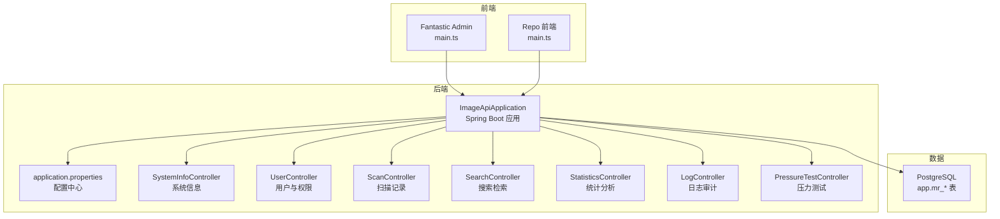
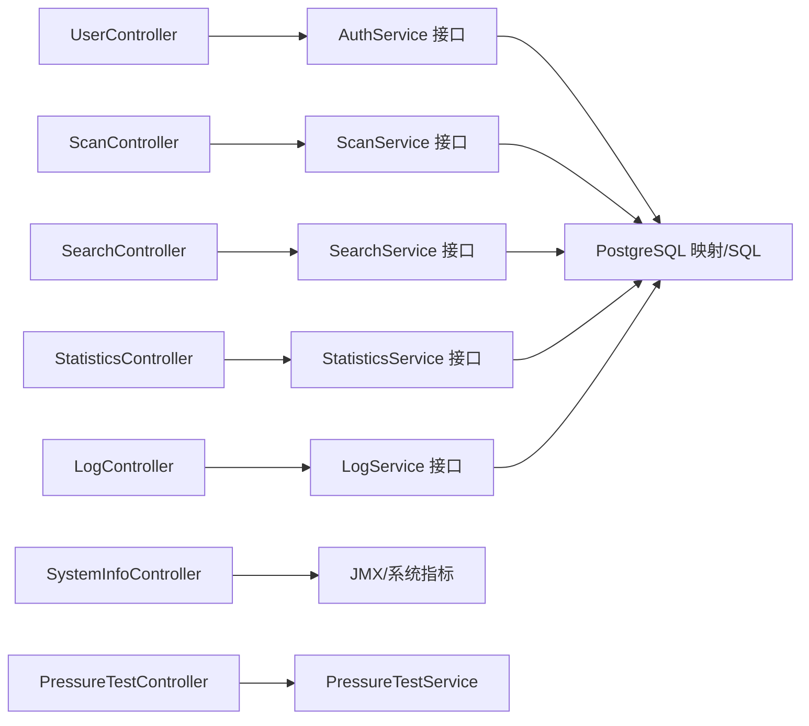
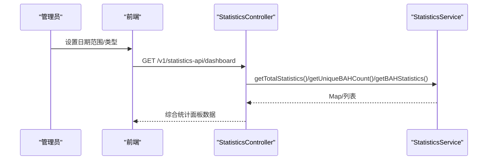
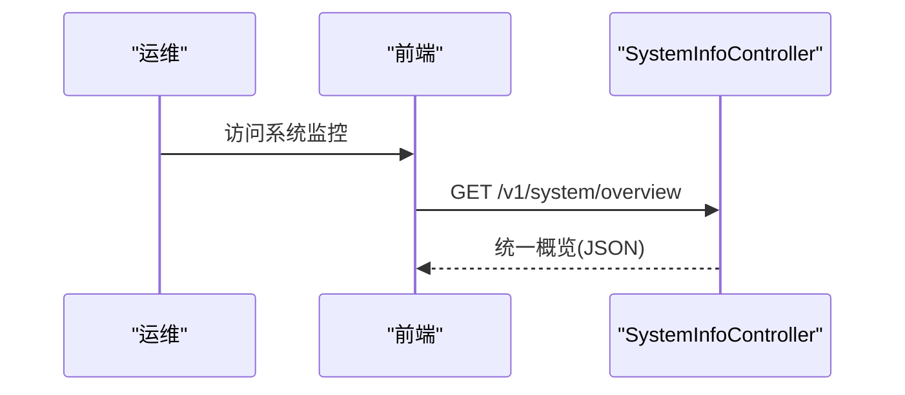
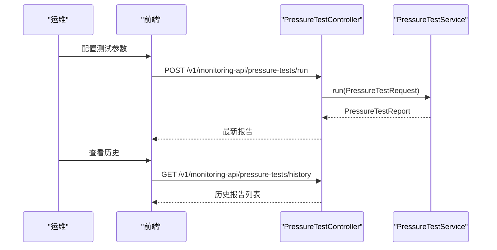
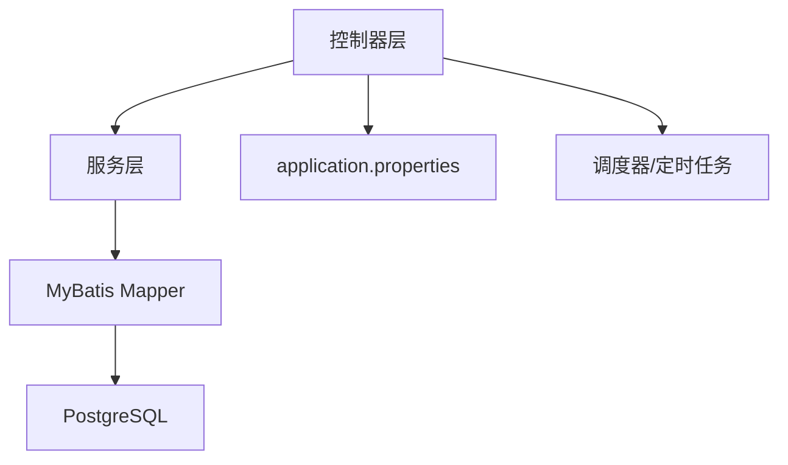

# 核心功能模块


**本文引用的文件**
- [ImageApiApplication.java](file://backend-repo/src/main/java/com/zjcxph/imgapi/ImageApiApplication.java)
- [application.properties](file://backend-repo/src/main/resources/application.properties)
- [SYSTEM_ARCHITECTURE.md](file://SYSTEM_ARCHITECTURE.md)
- [UserController.java](file://backend-repo/src/main/java/com/zjcxph/imgapi/controller/UserController.java)
- [AuthService.java](file://backend-repo/src/main/java/com/zjcxph/imgapi/service/AuthService.java)
- [ScanController.java](file://backend-repo/src/main/java/com/zjcxph/imgapi/controller/ScanController.java)
- [ScanService.java](file://backend-repo/src/main/java/com/zjcxph/imgapi/service/ScanService.java)
- [Scan.java](file://backend-repo/src/main/java/com/zjcxph/imgapi/entity/Scan.java)
- [SearchController.java](file://backend-repo/src/main/java/com/zjcxph/imgapi/controller/SearchController.java)
- [SearchService.java](file://backend-repo/src/main/java/com/zjcxph/imgapi/service/SearchService.java)
- [Patient.java](file://backend-repo/src/main/java/com/zjcxph/imgapi/entity/Patient.java)
- [StatisticsController.java](file://backend-repo/src/main/java/com/zjcxph/imgapi/controller/StatisticsController.java)
- [StatisticsService.java](file://backend-repo/src/main/java/com/zjcxph/imgapi/service/StatisticsService.java)
- [Statistics.java](file://backend-repo/src/main/java/com/zjcxph/imgapi/entity/Statistics.java)
- [LogController.java](file://backend-repo/src/main/java/com/zjcxph/imgapi/controller/LogController.java)
- [LogService.java](file://backend-repo/src/main/java/com/zjcxph/imgapi/service/LogService.java)
- [SystemInfoController.java](file://backend-repo/src/main/java/com/zjcxph/imgapi/controller/SystemInfoController.java)
- [PressureTestController.java](file://backend-repo/src/main/java/com/zjcxph/imgapi/controller/PressureTestController.java)
- [main.ts（前端Fantastic Admin）](file://frontend-fantastic-admin/src/main.ts)
- [main.ts（前端Repo）](file://frontend-repo/src/main.ts)


## 目录
1. [引言](#引言)
2. [项目结构](#项目结构)
3. [核心组件](#核心组件)
4. [架构总览](#架构总览)
5. [详细组件分析](#详细组件分析)
6. [依赖分析](#依赖分析)
7. [性能考虑](#性能考虑)
8. [故障排查指南](#故障排查指南)
9. [结论](#结论)
10. [附录](#附录)

## 引言
本文件面向MRR医疗记录影像管理系统的核心功能模块，系统围绕“患者记录管理、医学影像扫描、搜索检索、统计分析、日志审计、系统监控、用户管理”等主题展开。文档从架构与模块职责出发，结合控制器、服务层、实体模型与前后端入口，解释业务逻辑、用户交互流程与技术实现，并给出模块间依赖关系、数据流转图与常见使用场景，帮助管理员与开发者快速理解与落地。

## 项目结构
系统采用前后端分离架构：
- 后端：Spring Boot + MyBatis，提供REST API，负责认证授权、扫描记录、搜索检索、统计分析、日志审计、系统监控与压力测试等能力。
- 前端：两套前端工程，分别服务于运营后台与文档展示，均基于现代前端框架，提供用户界面与后台管理功能。
- 数据库：PostgreSQL，通过MyBatis映射访问核心业务表。



图表来源
- [ImageApiApplication.java:1-20](file://backend-repo/src/main/java/com/zjcxph/imgapi/ImageApiApplication.java#L1-L20)
- [application.properties:1-49](file://backend-repo/src/main/resources/application.properties#L1-L49)
- [SystemInfoController.java:1-236](file://backend-repo/src/main/java/com/zjcxph/imgapi/controller/SystemInfoController.java#L1-L236)
- [UserController.java:1-95](file://backend-repo/src/main/java/com/zjcxph/imgapi/controller/UserController.java#L1-L95)
- [ScanController.java:1-333](file://backend-repo/src/main/java/com/zjcxph/imgapi/controller/ScanController.java#L1-L333)
- [SearchController.java:1-92](file://backend-repo/src/main/java/com/zjcxph/imgapi/controller/SearchController.java#L1-L92)
- [StatisticsController.java:1-281](file://backend-repo/src/main/java/com/zjcxph/imgapi/controller/StatisticsController.java#L1-L281)
- [LogController.java:1-245](file://backend-repo/src/main/java/com/zjcxph/imgapi/controller/LogController.java#L1-L245)
- [PressureTestController.java:1-73](file://backend-repo/src/main/java/com/zjcxph/imgapi/controller/PressureTestController.java#L1-L73)

章节来源
- [SYSTEM_ARCHITECTURE.md:1-72](file://SYSTEM_ARCHITECTURE.md#L1-L72)
- [ImageApiApplication.java:1-20](file://backend-repo/src/main/java/com/zjcxph/imgapi/ImageApiApplication.java#L1-L20)
- [application.properties:1-49](file://backend-repo/src/main/resources/application.properties#L1-L49)
- [main.ts（前端Fantastic Admin）:1-33](file://frontend-fantastic-admin/src/main.ts#L1-L33)
- [main.ts（前端Repo）:1-18](file://frontend-repo/src/main.ts#L1-L18)

## 核心组件
- 用户与权限管理：登录、当前用户、用户列表、角色列表、更新用户、禁用用户。
- 医学影像扫描：创建、删除、更新、查询、分页、条件查询、批量下载。
- 搜索检索：支持加密ID解密与查询、历史接口兼容、直接ID查询。
- 统计分析：全量统计、按病案号/日期统计、类型统计、仪表盘聚合。
- 日志审计：按条件检索、导出CSV、保留策略清理。
- 系统监控：系统信息、内存与运行时、健康检查、统一概览。
- 压力测试：执行压力测试、查看历史与最新结果、清空历史。

章节来源
- [UserController.java:1-95](file://backend-repo/src/main/java/com/zjcxph/imgapi/controller/UserController.java#L1-L95)
- [ScanController.java:1-333](file://backend-repo/src/main/java/com/zjcxph/imgapi/controller/ScanController.java#L1-L333)
- [SearchController.java:1-92](file://backend-repo/src/main/java/com/zjcxph/imgapi/controller/SearchController.java#L1-L92)
- [StatisticsController.java:1-281](file://backend-repo/src/main/java/com/zjcxph/imgapi/controller/StatisticsController.java#L1-L281)
- [LogController.java:1-245](file://backend-repo/src/main/java/com/zjcxph/imgapi/controller/LogController.java#L1-L245)
- [SystemInfoController.java:1-236](file://backend-repo/src/main/java/com/zjcxph/imgapi/controller/SystemInfoController.java#L1-L236)
- [PressureTestController.java:1-73](file://backend-repo/src/main/java/com/zjcxph/imgapi/controller/PressureTestController.java#L1-L73)

## 架构总览
系统遵循“控制器薄化、服务层承载业务”的设计原则，控制器仅负责参数校验、鉴权与结果封装，业务逻辑集中在服务层；定时任务与清理作业通过调度器与配置驱动，确保日志保留安全可控。



图表来源
- [UserController.java:1-95](file://backend-repo/src/main/java/com/zjcxph/imgapi/controller/UserController.java#L1-L95)
- [ScanController.java:1-333](file://backend-repo/src/main/java/com/zjcxph/imgapi/controller/ScanController.java#L1-L333)
- [SearchController.java:1-92](file://backend-repo/src/main/java/com/zjcxph/imgapi/controller/SearchController.java#L1-L92)
- [StatisticsController.java:1-281](file://backend-repo/src/main/java/com/zjcxph/imgapi/controller/StatisticsController.java#L1-L281)
- [LogController.java:1-245](file://backend-repo/src/main/java/com/zjcxph/imgapi/controller/LogController.java#L1-L245)
- [SystemInfoController.java:1-236](file://backend-repo/src/main/java/com/zjcxph/imgapi/controller/SystemInfoController.java#L1-L236)
- [PressureTestController.java:1-73](file://backend-repo/src/main/java/com/zjcxph/imgapi/controller/PressureTestController.java#L1-L73)

## 详细组件分析

### 用户与权限管理
- 业务逻辑
  - 登录：接收用户名密码，调用认证服务生成令牌并返回会话信息。
  - 当前用户：读取上下文会话，返回当前登录用户信息。
  - 用户管理：列出用户、列出角色、更新用户资料、禁用用户（受权限注解保护）。
- 用户交互流程
  - 登录成功后，前端保存令牌，后续请求携带令牌访问受保护资源。
- 技术实现要点
  - 控制器使用注解进行权限校验与登录拦截。
  - 结果封装统一返回标准响应体。

```mermaid
sequenceDiagram
participant U as "用户"
participant FE as "前端"
participant C as "UserController"
participant S as "AuthService"
U->>FE : 输入账号密码
FE->>C : POST /login
C->>S : login(UserRequest)
S-->>C : LoginResponseDTO(token, user)
C-->>FE : Result&lt;LoginResponseDTO&gt;
FE->>FE : 存储令牌并跳转
```

图表来源
- [UserController.java:38-47](file://backend-repo/src/main/java/com/zjcxph/imgapi/controller/UserController.java#L38-L47)
- [AuthService.java:12-24](file://backend-repo/src/main/java/com/zjcxph/imgapi/service/AuthService.java#L12-L24)

章节来源
- [UserController.java:1-95](file://backend-repo/src/main/java/com/zjcxph/imgapi/controller/UserController.java#L1-L95)
- [AuthService.java:1-25](file://backend-repo/src/main/java/com/zjcxph/imgapi/service/AuthService.java#L1-L25)

### 医学影像扫描
- 业务逻辑
  - 支持创建、删除、更新扫描记录；按ID、病案号、病人序号查询；分页与条件查询；批量下载ZIP归档。
  - 文件路径构建规则：基于基础目录、父级目录、病案号与文件名组合定位物理文件。
- 用户交互流程
  - 管理员在后台录入扫描元数据；支持按条件筛选与导出；批量下载用于归档或离线备份。
- 技术实现要点
  - 控制器负责参数校验与HTTP响应；服务层负责业务处理；文件IO与ZIP打包在控制器内完成，便于直接下载。

```mermaid
sequenceDiagram
participant U as "管理员"
participant FE as "前端"
participant C as "ScanController"
participant S as "ScanService"
U->>FE : 选择若干扫描记录
FE->>C : POST /v1/scan-api/batch-download
C->>S : getImagePathList(ids)
S-->>C : List&lt;PathDO&gt;
C->>C : buildBatchZip(items)
C-->>FE : ZIP文件流
```

图表来源
- [ScanController.java:256-281](file://backend-repo/src/main/java/com/zjcxph/imgapi/controller/ScanController.java#L256-L281)
- [ScanController.java:283-331](file://backend-repo/src/main/java/com/zjcxph/imgapi/controller/ScanController.java#L283-L331)
- [ScanService.java:17-17](file://backend-repo/src/main/java/com/zjcxph/imgapi/service/ScanService.java#L17-L17)

章节来源
- [ScanController.java:1-333](file://backend-repo/src/main/java/com/zjcxph/imgapi/controller/ScanController.java#L1-L333)
- [ScanService.java:1-43](file://backend-repo/src/main/java/com/zjcxph/imgapi/service/ScanService.java#L1-L43)
- [Scan.java:1-116](file://backend-repo/src/main/java/com/zjcxph/imgapi/entity/Scan.java#L1-L116)

### 搜索检索
- 业务逻辑
  - 支持三种ID解密与查询路径：新式带时间戳、旧式不带时间戳、明文ID直查。
  - 返回患者关联的病案号集合，便于导航到对应扫描记录。
- 用户交互流程
  - 前端传递加密参数，后端解密后查询数据库，返回匹配的病案号列表。
- 技术实现要点
  - 使用对称加密工具解密ID卡；控制器负责参数提取与异常处理；服务层执行查询。

```mermaid
sequenceDiagram
participant FE as "前端"
participant C as "SearchController"
participant S as "SearchService"
FE->>C : GET /v2/search/getBAHByEncryptID?EncryptID&userId&iv&timestamp
C->>C : 解密 EncryptID
C->>S : getBAHByID(明文ID)
S-->>C : List&lt;Patient&gt;{bah,...}
C-->>FE : Result<List&lt;Patient&gt;>
```

图表来源
- [SearchController.java:39-55](file://backend-repo/src/main/java/com/zjcxph/imgapi/controller/SearchController.java#L39-L55)
- [SearchController.java:57-72](file://backend-repo/src/main/java/com/zjcxph/imgapi/controller/SearchController.java#L57-L72)
- [SearchService.java:7-11](file://backend-repo/src/main/java/com/zjcxph/imgapi/service/SearchService.java#L7-L11)
- [Patient.java:1-103](file://backend-repo/src/main/java/com/zjcxph/imgapi/entity/Patient.java#L1-L103)

章节来源
- [SearchController.java:1-92](file://backend-repo/src/main/java/com/zjcxph/imgapi/controller/SearchController.java#L1-L92)
- [SearchService.java:1-11](file://backend-repo/src/main/java/com/zjcxph/imgapi/service/SearchService.java#L1-L11)
- [Patient.java:1-103](file://backend-repo/src/main/java/com/zjcxph/imgapi/entity/Patient.java#L1-L103)

### 统计分析
- 业务逻辑
  - 支持全量分页+多条件查询、按病案号/日期统计、类型分布、总体汇总、最近趋势与TOP病案号。
  - 控制器对排序字段与方向进行规范化处理，保证查询稳定性。
- 用户交互流程
  - 管理员在统计面板设置时间范围与类型，后端返回聚合结果，前端渲染图表与表格。
- 技术实现要点
  - 服务层提供多种统计聚合方法；控制器组装分页与汇总数据。



图表来源
- [StatisticsController.java:216-242](file://backend-repo/src/main/java/com/zjcxph/imgapi/controller/StatisticsController.java#L216-L242)
- [StatisticsController.java:144-158](file://backend-repo/src/main/java/com/zjcxph/imgapi/controller/StatisticsController.java#L144-L158)
- [StatisticsService.java:10-56](file://backend-repo/src/main/java/com/zjcxph/imgapi/service/StatisticsService.java#L10-L56)
- [Statistics.java:1-74](file://backend-repo/src/main/java/com/zjcxph/imgapi/entity/Statistics.java#L1-L74)

章节来源
- [StatisticsController.java:1-281](file://backend-repo/src/main/java/com/zjcxph/imgapi/controller/StatisticsController.java#L1-L281)
- [StatisticsService.java:1-56](file://backend-repo/src/main/java/com/zjcxph/imgapi/service/StatisticsService.java#L1-L56)
- [Statistics.java:1-74](file://backend-repo/src/main/java/com/zjcxph/imgapi/entity/Statistics.java#L1-L74)

### 日志审计
- 业务逻辑
  - 提供日志检索、按客户端IP/URI过滤、导出CSV、保留策略清理与手动执行。
  - 导出采用流式写入，支持大体量数据分批输出。
- 用户交互流程
  - 管理员先导出过期日志，核对后再执行清理，确保可追溯性。
- 技术实现要点
  - 控制器负责参数标准化与分页；服务层负责查询与计数；清理器按配置周期执行。

```mermaid
sequenceDiagram
participant U as "管理员"
participant FE as "前端"
participant C as "LogController"
participant M as "LogMapper"
participant CL as "LogRetentionCleaner"
U->>FE : 触发导出过期日志
FE->>C : GET /v2/logs/retention/export
C->>M : findOlderThan(cutoff, batchSize, offset)
M-->>C : List&lt;Log&gt;
C-->>FE : CSV 流
U->>FE : 执行清理
FE->>C : POST /v2/logs/retention/cleanup
C->>CL : cleanupNow(cutoff?)
CL-->>C : 清理结果
C-->>FE : Result<清理结果>
```

图表来源
- [LogController.java:108-148](file://backend-repo/src/main/java/com/zjcxph/imgapi/controller/LogController.java#L108-L148)
- [LogController.java:94-106](file://backend-repo/src/main/java/com/zjcxph/imgapi/controller/LogController.java#L94-L106)
- [LogService.java:7-19](file://backend-repo/src/main/java/com/zjcxph/imgapi/service/LogService.java#L7-L19)

章节来源
- [LogController.java:1-245](file://backend-repo/src/main/java/com/zjcxph/imgapi/controller/LogController.java#L1-L245)
- [LogService.java:1-19](file://backend-repo/src/main/java/com/zjcxph/imgapi/service/LogService.java#L1-L19)

### 系统监控
- 业务逻辑
  - 提供系统信息、内存详情、运行时信息、健康检查、系统属性与统一概览。
- 用户交互流程
  - 运维人员通过监控面板查看系统状态，辅助容量规划与故障定位。
- 技术实现要点
  - 通过JMX采集运行时与内存指标；控制器格式化输出。



图表来源
- [SystemInfoController.java:171-180](file://backend-repo/src/main/java/com/zjcxph/imgapi/controller/SystemInfoController.java#L171-L180)

章节来源
- [SystemInfoController.java:1-236](file://backend-repo/src/main/java/com/zjcxph/imgapi/controller/SystemInfoController.java#L1-L236)

### 压力测试
- 业务逻辑
  - 支持运行压力测试、查看历史与最新结果、按运行ID查询、清空历史。
- 用户交互流程
  - 运维人员配置目标URL与并发参数，执行测试后查看报告与历史记录。
- 技术实现要点
  - 报告与样本在内存中维护，便于轻量验证与回溯。



图表来源
- [PressureTestController.java:35-71](file://backend-repo/src/main/java/com/zjcxph/imgapi/controller/PressureTestController.java#L35-L71)

章节来源
- [PressureTestController.java:1-73](file://backend-repo/src/main/java/com/zjcxph/imgapi/controller/PressureTestController.java#L1-L73)

## 依赖分析
- 控制器到服务层：强依赖注入，控制器仅承担薄层职责。
- 服务层到数据层：通过MyBatis Mapper访问数据库，保持关注点分离。
- 配置与调度：application.properties集中管理数据库、日志保留、压缩与开发工具等配置；调度器负责定时任务。
- 前端入口：两套前端分别挂载应用、注册路由与全局组件，统一对外提供UI与后台管理。



图表来源
- [application.properties:1-49](file://backend-repo/src/main/resources/application.properties#L1-L49)
- [SYSTEM_ARCHITECTURE.md:34-47](file://SYSTEM_ARCHITECTURE.md#L34-L47)

章节来源
- [application.properties:1-49](file://backend-repo/src/main/resources/application.properties#L1-L49)
- [SYSTEM_ARCHITECTURE.md:1-72](file://SYSTEM_ARCHITECTURE.md#L1-L72)

## 性能考虑
- 分页与限制：日志检索最大页大小限制，避免超大数据集一次性返回。
- 压缩与流式：日志导出采用流式写入与UTF-8 BOM，降低内存峰值。
- 批量处理：日志清理与导出支持批次大小配置，控制单次处理量。
- 响应压缩：启用服务器压缩，减少传输体积。
- 前端优化：静态资源缓存与图标预加载，提升首屏体验。

章节来源
- [LogController.java:36-36](file://backend-repo/src/main/java/com/zjcxph/imgapi/controller/LogController.java#L36-L36)
- [LogController.java:116-117](file://backend-repo/src/main/java/com/zjcxph/imgapi/controller/LogController.java#L116-L117)
- [application.properties:4-6](file://backend-repo/src/main/resources/application.properties#L4-L6)
- [application.properties:7-7](file://backend-repo/src/main/resources/application.properties#L7-L7)
- [main.ts（前端Fantastic Admin）:16-19](file://frontend-fantastic-admin/src/main.ts#L16-L19)

## 故障排查指南
- 登录失败
  - 检查用户名密码是否正确；确认令牌是否返回；查看控制器日志。
- 扫描记录查询为空
  - 核对病案号/病人序号拼写；确认条件查询参数；检查文件路径是否存在。
- 批量下载失败
  - 检查所选记录是否存在物理文件；确认基础路径配置；查看ZIP构建过程中的警告日志。
- 搜索解密失败
  - 确认加密参数完整性与密钥配置；检查时间戳或IV是否匹配。
- 统计结果异常
  - 校验日期范围与类型参数；确认排序字段与方向；检查服务层聚合逻辑。
- 日志导出/清理问题
  - 确认保留天数配置；先导出再清理；检查导出文件头与分批处理进度。
- 健康检查告警
  - 关注内存使用率阈值；必要时调整JVM堆大小与GC策略。

章节来源
- [UserController.java:42-46](file://backend-repo/src/main/java/com/zjcxph/imgapi/controller/UserController.java#L42-L46)
- [ScanController.java:256-281](file://backend-repo/src/main/java/com/zjcxph/imgapi/controller/ScanController.java#L256-L281)
- [SearchController.java:46-54](file://backend-repo/src/main/java/com/zjcxph/imgapi/controller/SearchController.java#L46-L54)
- [StatisticsController.java:66-72](file://backend-repo/src/main/java/com/zjcxph/imgapi/controller/StatisticsController.java#L66-L72)
- [LogController.java:108-148](file://backend-repo/src/main/java/com/zjcxph/imgapi/controller/LogController.java#L108-L148)
- [SystemInfoController.java:136-140](file://backend-repo/src/main/java/com/zjcxph/imgapi/controller/SystemInfoController.java#L136-L140)

## 结论
本系统通过清晰的分层架构与模块化设计，实现了从用户管理、扫描记录、搜索检索到统计分析、日志审计与系统监控的完整闭环。前后端分离与配置驱动提升了可维护性与可扩展性；日志保留策略与压力测试模块保障了运维与质量保障能力。建议后续按阶段演进：将管理员设置迁移至后端存储、拆分后端模块域包、引入对象存储与归档任务。

## 附录
- 管理员面板与用户界面
  - Fantastic Admin：提供用户、记录、测试、日志、监控与设置等运营视图。
  - Repo 前端：提供文档与后台管理页面，支持统计、测试与设置等功能。
- 后台管理功能概述
  - 用户管理：登录、当前用户、用户列表、角色列表、更新与禁用。
  - 记录管理：扫描记录的增删改查、分页与条件查询、批量下载。
  - 检索与统计：按ID解密查询、按病案号/日期统计、类型与仪表盘聚合。
  - 审计与监控：日志检索与导出、保留策略清理、系统健康与概览、压力测试历史。

章节来源
- [main.ts（前端Fantastic Admin）:1-33](file://frontend-fantastic-admin/src/main.ts#L1-L33)
- [main.ts（前端Repo）:1-18](file://frontend-repo/src/main.ts#L1-L18)
- [SYSTEM_ARCHITECTURE.md:10-25](file://SYSTEM_ARCHITECTURE.md#L10-L25)