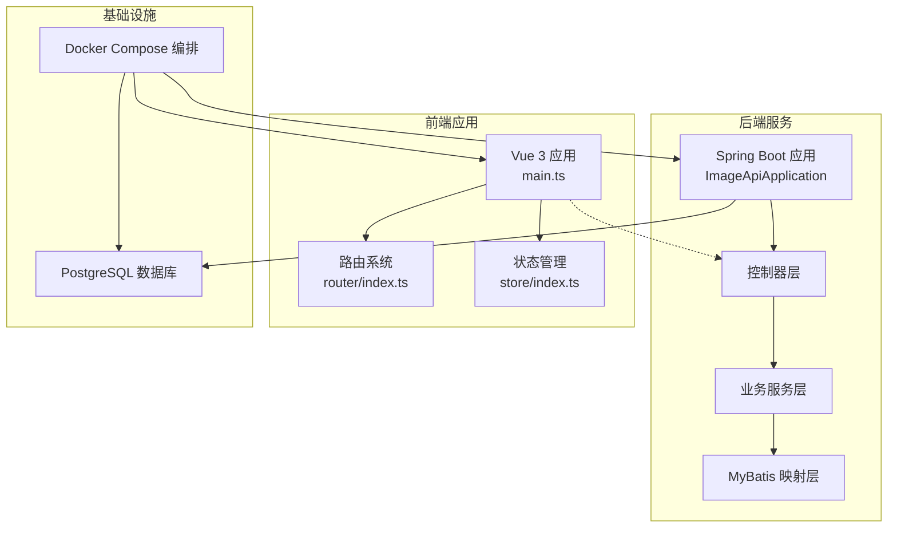
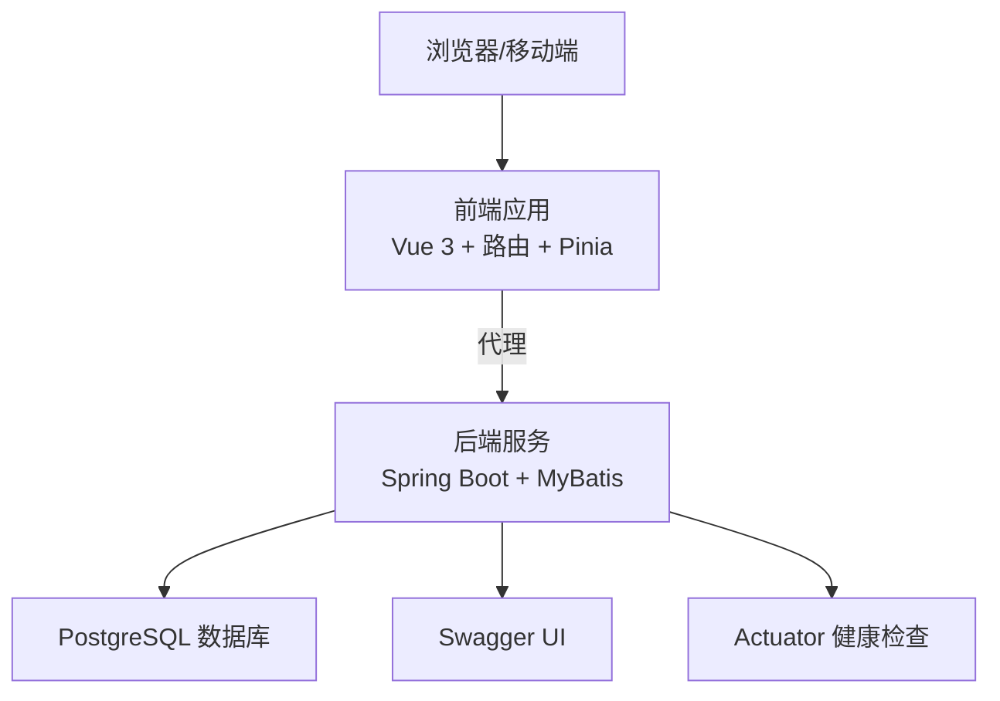
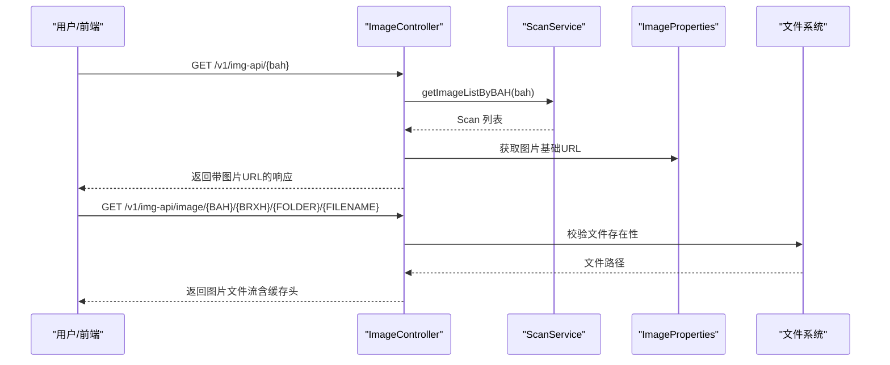
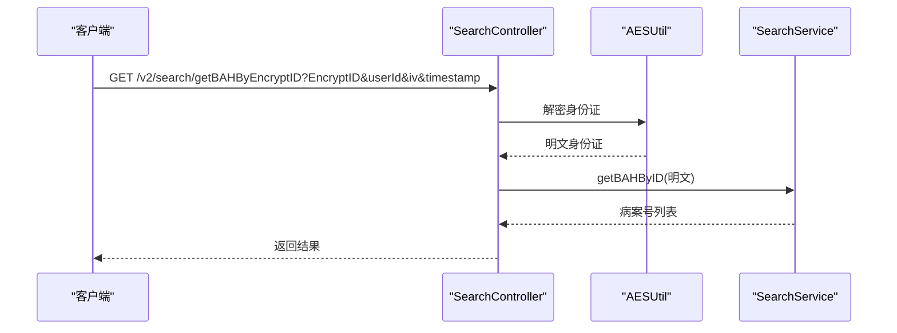
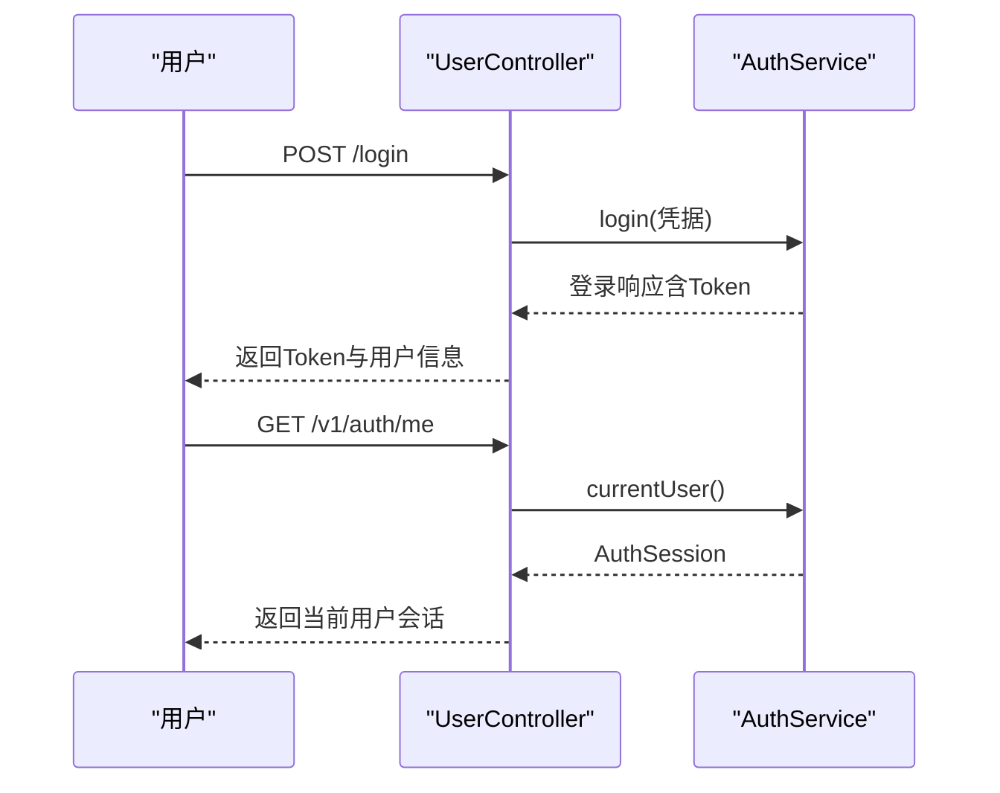
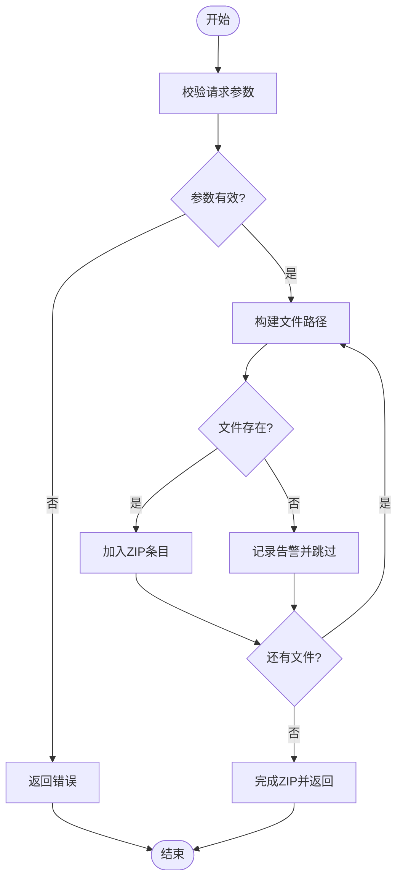
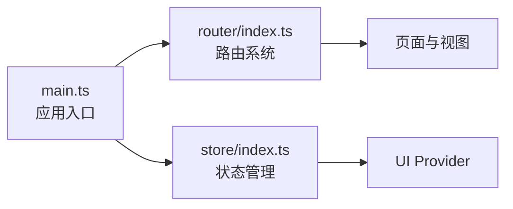
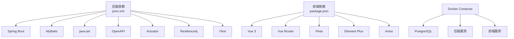

# 项目概览

**本文引用的文件**   
- [backend-repo/README.md](file://backend-repo/README.md)
- [frontend-fantastic-admin/README.md](file://frontend-fantastic-admin/README.md)
- [SYSTEM_ARCHITECTURE.md](file://SYSTEM_ARCHITECTURE.md)
- [backend-repo/src/main/java/com/zjcxph/imgapi/ImageApiApplication.java](file://backend-repo/src/main/java/com/zjcxph/imgapi/ImageApiApplication.java)
- [backend-repo/pom.xml](file://backend-repo/pom.xml)
- [backend-repo/src/main/java/com/zjcxph/imgapi/controller/ImageController.java](file://backend-repo/src/main/java/com/zjcxph/imgapi/controller/ImageController.java)
- [backend-repo/src/main/java/com/zjcxph/imgapi/controller/ScanController.java](file://backend-repo/src/main/java/com/zjcxph/imgapi/controller/ScanController.java)
- [backend-repo/src/main/java/com/zjcxph/imgapi/controller/SearchController.java](file://backend-repo/src/main/java/com/zjcxph/imgapi/controller/SearchController.java)
- [backend-repo/src/main/java/com/zjcxph/imgapi/controller/UserController.java](file://backend-repo/src/main/java/com/zjcxph/imgapi/controller/UserController.java)
- [backend-repo/src/main/java/com/zjcxph/imgapi/service/impl/ScanServiceImpl.java](file://backend-repo/src/main/java/com/zjcxph/imgapi/service/impl/ScanServiceImpl.java)
- [backend-repo/src/main/java/com/zjcxph/imgapi/service/impl/SearchServiceImpl.java](file://backend-repo/src/main/java/com/zjcxph/imgapi/service/impl/SearchServiceImpl.java)
- [frontend-fantastic-admin/src/main.ts](file://frontend-fantastic-admin/src/main.ts)
- [frontend-fantastic-admin/src/router/index.ts](file://frontend-fantastic-admin/src/router/index.ts)
- [frontend-fantastic-admin/src/store/index.ts](file://frontend-fantastic-admin/src/store/index.ts)
- [frontend-repo/docs/guide/项目说明文档.md](file://frontend-repo/docs/guide/项目说明文档.md)
- [docker-compose.yml](file://docker-compose.yml)

## 目录
1. [简介](#简介)
2. [项目结构](#项目结构)
3. [核心组件](#核心组件)
4. [架构总览](#架构总览)
5. [详细组件分析](#详细组件分析)
6. [依赖分析](#依赖分析)
7. [性能考虑](#性能考虑)
8. [故障排查指南](#故障排查指南)
9. [结论](#结论)
10. [附录](#附录)

## 简介
MRR 医疗记录影像管理系统是一套面向“病案/影像”的前后端一体化解决方案，旨在帮助医疗机构高效管理医学影像记录，提供登录认证与权限控制、病案/影像查询与浏览、批量下载与归档、统计分析、系统日志与监控等能力。系统通过清晰的模块划分与可演进的架构设计，兼顾初学者的易用性与资深开发者的技术深度。

- 业务价值
  - 提升病案检索效率：支持按身份证、病案号等多维度检索，快速定位影像资源。
  - 强化合规与审计：内置访问日志与可追溯的清理流程，满足长期留存与合规要求。
  - 降低运维成本：前后端分离、容器化编排、自动化初始化脚本，便于本地联调与生产部署。
  - 支撑日常测试与验收：提供测试页面与压力测试模块，辅助联调与性能评估。

- 核心特性
  - 登录认证与权限控制：基于 JWT 的会话与细粒度权限字符串。
  - 影像浏览与批量导出：按病案号聚合图片、单图直链访问、批量 ZIP 导出。
  - 病案元数据管理：支持新增、更新、分页与条件查询。
  - 搜索与隐私保护：支持加密身份证解密查询，结合 AES 密钥与时间戳增强安全性。
  - 日志与监控：访问审计日志、健康检查、压力测试指标采集与内存快照。

- 适用场景
  - 医院/卫生机构的病案室、信息科、质控部门。
  - 需要对医学影像进行集中存储、检索与归档的场景。
  - 需要合规审计与日志留存的监管要求场景。

- 预期收益
  - 显著缩短医生/护士检索病案的时间，提升工作效率。
  - 通过标准化接口与权限模型，降低越权与误操作风险。
  - 通过容器化与自动化初始化，缩短交付周期与部署成本。

**章节来源**
- [SYSTEM_ARCHITECTURE.md:1-72](file://SYSTEM_ARCHITECTURE.md#L1-L72)
- [frontend-repo/docs/guide/项目说明文档.md:1-333](file://frontend-repo/docs/guide/项目说明文档.md#L1-L333)

## 项目结构
系统采用多仓库结构组织，包含后端 Spring Boot 服务、前端 Vue 应用与文档站、数据库初始化脚本与 Docker 编排文件。前端仓库还包含 VitePress 文档站，形成“应用 + 文档”的一体化交付。

**图表来源**
- [backend-repo/src/main/java/com/zjcxph/imgapi/ImageApiApplication.java:1-20](file://backend-repo/src/main/java/com/zjcxph/imgapi/ImageApiApplication.java#L1-L20)
- [frontend-fantastic-admin/src/main.ts:1-33](file://frontend-fantastic-admin/src/main.ts#L1-L33)
- [frontend-fantastic-admin/src/router/index.ts:1-24](file://frontend-fantastic-admin/src/router/index.ts#L1-L24)
- [frontend-fantastic-admin/src/store/index.ts:1-4](file://frontend-fantastic-admin/src/store/index.ts#L1-L4)
- [docker-compose.yml:1-47](file://docker-compose.yml#L1-L47)

**章节来源**
- [frontend-repo/docs/guide/项目说明文档.md:60-76](file://frontend-repo/docs/guide/项目说明文档.md#L60-L76)
- [backend-repo/README.md:11-21](file://backend-repo/README.md#L11-L21)
- [docker-compose.yml:1-47](file://docker-compose.yml#L1-L47)

## 核心组件
- 后端核心
  - 应用入口与装配：Spring Boot 启动类启用调度、属性扫描与 Mapper 扫描。
  - 控制器层：提供影像、扫描记录、搜索、用户认证与权限等接口。
  - 服务层：封装业务逻辑，如扫描记录的增删改查、批量导出、类型更新等。
  - 数据访问层：MyBatis 映射器对接 PostgreSQL。
  - 配置与工具：图像访问基础路径、JWT、AES 工具、拦截器与全局异常处理等。

- 前端核心
  - 应用入口：挂载 Pinia、路由与 UI Provider。
  - 路由系统：支持文件系统路由与常量路由组合，内置守卫与扩展。
  - 状态管理：集中管理用户、菜单、标签页等全局状态。
  - 页面与组件：后台管理壳、病案浏览、统计分析、日志查看、测试页面等。

- 基础设施
  - PostgreSQL：承载认证、病案、统计、日志等业务表。
  - Docker Compose：一键拉起数据库、后端与前端服务，便于本地联调与部署。

**章节来源**
- [backend-repo/src/main/java/com/zjcxph/imgapi/ImageApiApplication.java:1-20](file://backend-repo/src/main/java/com/zjcxph/imgapi/ImageApiApplication.java#L1-L20)
- [backend-repo/src/main/java/com/zjcxph/imgapi/controller/ImageController.java:1-283](file://backend-repo/src/main/java/com/zjcxph/imgapi/controller/ImageController.java#L1-L283)
- [backend-repo/src/main/java/com/zjcxph/imgapi/controller/ScanController.java:1-333](file://backend-repo/src/main/java/com/zjcxph/imgapi/controller/ScanController.java#L1-L333)
- [backend-repo/src/main/java/com/zjcxph/imgapi/controller/SearchController.java:1-92](file://backend-repo/src/main/java/com/zjcxph/imgapi/controller/SearchController.java#L1-L92)
- [backend-repo/src/main/java/com/zjcxph/imgapi/controller/UserController.java:1-95](file://backend-repo/src/main/java/com/zjcxph/imgapi/controller/UserController.java#L1-L95)
- [backend-repo/src/main/java/com/zjcxph/imgapi/service/impl/ScanServiceImpl.java:1-135](file://backend-repo/src/main/java/com/zjcxph/imgapi/service/impl/ScanServiceImpl.java#L1-L135)
- [backend-repo/src/main/java/com/zjcxph/imgapi/service/impl/SearchServiceImpl.java:1-26](file://backend-repo/src/main/java/com/zjcxph/imgapi/service/impl/SearchServiceImpl.java#L1-L26)
- [frontend-fantastic-admin/src/main.ts:1-33](file://frontend-fantastic-admin/src/main.ts#L1-L33)
- [frontend-fantastic-admin/src/router/index.ts:1-24](file://frontend-fantastic-admin/src/router/index.ts#L1-L24)
- [frontend-fantastic-admin/src/store/index.ts:1-4](file://frontend-fantastic-admin/src/store/index.ts#L1-L4)
- [docker-compose.yml:1-47](file://docker-compose.yml#L1-L47)

## 架构总览
系统采用“前端静态资源 + 后端 API + 数据库”的三层架构，前端通过代理访问后端接口；后端通过 MyBatis 访问 PostgreSQL；日志与监控通过 Actuator 与压力测试模块提供。

**图表来源**
- [SYSTEM_ARCHITECTURE.md:49-56](file://SYSTEM_ARCHITECTURE.md#L49-L56)
- [backend-repo/README.md:49-50](file://backend-repo/README.md#L49-L50)

**章节来源**
- [SYSTEM_ARCHITECTURE.md:10-56](file://SYSTEM_ARCHITECTURE.md#L10-L56)
- [backend-repo/README.md:3-57](file://backend-repo/README.md#L3-L57)

## 详细组件分析

### 影像与病案管理（ImageController 与 ScanController）
- 设计要点
  - 控制器保持薄层职责，业务逻辑集中在服务层，便于测试与复用。
  - 提供按病案号聚合图片列表、单图直链访问、批量 ZIP 导出、图片类型更新等能力。
  - 严格的数据校验与错误返回，保证接口健壮性。

- 关键流程
  - 获取病案号下的图片数据：拼接远程图片访问 URL，返回 DTO 列表。
  - 单图直链访问：根据路径规则定位文件，设置缓存头与内容类型，返回文件流。
  - 批量下载：根据 ID 列表收集路径，构建 ZIP 并以附件形式返回。
  - 类型更新：对图片类型字段进行范围校验后更新。

**图表来源**
- [backend-repo/src/main/java/com/zjcxph/imgapi/controller/ImageController.java:176-253](file://backend-repo/src/main/java/com/zjcxph/imgapi/controller/ImageController.java#L176-L253)
- [backend-repo/src/main/java/com/zjcxph/imgapi/service/impl/ScanServiceImpl.java:26-46](file://backend-repo/src/main/java/com/zjcxph/imgapi/service/impl/ScanServiceImpl.java#L26-L46)

**章节来源**
- [backend-repo/src/main/java/com/zjcxph/imgapi/controller/ImageController.java:1-283](file://backend-repo/src/main/java/com/zjcxph/imgapi/controller/ImageController.java#L1-L283)
- [backend-repo/src/main/java/com/zjcxph/imgapi/service/impl/ScanServiceImpl.java:1-135](file://backend-repo/src/main/java/com/zjcxph/imgapi/service/impl/ScanServiceImpl.java#L1-L135)

### 搜索与隐私保护（SearchController）
- 设计要点
  - 支持两种解密模式：带时间戳与传统模式，解密后查询病案号集合。
  - 使用 AES 密钥与 IV 参数，结合用户标识与时间戳，提升安全性。
  - 记录访问日志，便于审计与问题追踪。

**图表来源**
- [backend-repo/src/main/java/com/zjcxph/imgapi/controller/SearchController.java:39-72](file://backend-repo/src/main/java/com/zjcxph/imgapi/controller/SearchController.java#L39-L72)
- [backend-repo/src/main/java/com/zjcxph/imgapi/service/impl/SearchServiceImpl.java:21-25](file://backend-repo/src/main/java/com/zjcxph/imgapi/service/impl/SearchServiceImpl.java#L21-L25)

**章节来源**
- [backend-repo/src/main/java/com/zjcxph/imgapi/controller/SearchController.java:1-92](file://backend-repo/src/main/java/com/zjcxph/imgapi/controller/SearchController.java#L1-L92)
- [backend-repo/src/main/java/com/zjcxph/imgapi/service/impl/SearchServiceImpl.java:1-26](file://backend-repo/src/main/java/com/zjcxph/imgapi/service/impl/SearchServiceImpl.java#L1-L26)

### 登录与权限（UserController）
- 设计要点
  - 提供登录、当前用户信息、用户与角色列表、更新用户与禁用用户等接口。
  - 使用注解式权限控制，配合前端路由守卫，实现细粒度访问控制。

**图表来源**
- [backend-repo/src/main/java/com/zjcxph/imgapi/controller/UserController.java:38-57](file://backend-repo/src/main/java/com/zjcxph/imgapi/controller/UserController.java#L38-L57)

**章节来源**
- [backend-repo/src/main/java/com/zjcxph/imgapi/controller/UserController.java:1-95](file://backend-repo/src/main/java/com/zjcxph/imgapi/controller/UserController.java#L1-L95)

### 扫描记录管理（ScanController）
- 设计要点
  - 提供扫描记录的增删改查、分页查询、条件查询与批量下载等能力。
  - 批量下载时构建 ZIP 并以附件形式返回，避免跨域与大文件传输问题。

**图表来源**
- [backend-repo/src/main/java/com/zjcxph/imgapi/controller/ScanController.java:256-331](file://backend-repo/src/main/java/com/zjcxph/imgapi/controller/ScanController.java#L256-L331)

**章节来源**
- [backend-repo/src/main/java/com/zjcxph/imgapi/controller/ScanController.java:1-333](file://backend-repo/src/main/java/com/zjcxph/imgapi/controller/ScanController.java#L1-L333)

### 前端应用与路由（main.ts、router、store）
- 设计要点
  - 应用入口集中注册 Pinia、路由与 UI Provider，统一加载图标与全局样式。
  - 路由系统支持文件系统路由与常量路由组合，内置守卫与扩展机制。
  - 状态管理集中管理用户、菜单、标签页等，支撑后台管理壳与页面切换。

**图表来源**
- [frontend-fantastic-admin/src/main.ts:1-33](file://frontend-fantastic-admin/src/main.ts#L1-L33)
- [frontend-fantastic-admin/src/router/index.ts:1-24](file://frontend-fantastic-admin/src/router/index.ts#L1-L24)
- [frontend-fantastic-admin/src/store/index.ts:1-4](file://frontend-fantastic-admin/src/store/index.ts#L1-L4)

**章节来源**
- [frontend-fantastic-admin/src/main.ts:1-33](file://frontend-fantastic-admin/src/main.ts#L1-L33)
- [frontend-fantastic-admin/src/router/index.ts:1-24](file://frontend-fantastic-admin/src/router/index.ts#L1-L24)
- [frontend-fantastic-admin/src/store/index.ts:1-4](file://frontend-fantastic-admin/src/store/index.ts#L1-L4)

## 依赖分析
- 技术栈与版本
  - 后端：Spring Boot 4、MyBatis、PostgreSQL、JWT、OpenAPI、Actuator、Resilience4j、iText 等。
  - 前端：Vue 3、Vite、Element Plus、Axios、Pinia、Vue Router 等。
  - 工程约束：后端自动执行初始化脚本，前端构建与文档站构建分离管理。

- 依赖关系
  - 前端通过代理访问后端 API，后端通过 JDBC 访问 PostgreSQL。
  - Docker Compose 将数据库、后端与前端串联，提供一键部署能力。

**图表来源**
- [backend-repo/pom.xml:27-114](file://backend-repo/pom.xml#L27-L114)
- [frontend-fantastic-admin/package.json:27-131](file://frontend-fantastic-admin/package.json#L27-L131)
- [docker-compose.yml:1-47](file://docker-compose.yml#L1-L47)

**章节来源**
- [backend-repo/pom.xml:1-136](file://backend-repo/pom.xml#L1-L136)
- [frontend-fantastic-admin/package.json:1-131](file://frontend-fantastic-admin/package.json#L1-L131)
- [SYSTEM_ARCHITECTURE.md:18-25](file://SYSTEM_ARCHITECTURE.md#L18-L25)
- [frontend-repo/docs/guide/项目说明文档.md:27-59](file://frontend-repo/docs/guide/项目说明文档.md#L27-L59)

## 性能考虑
- 接口层面
  - 单图直链访问设置合理的缓存头，减少重复请求与带宽消耗。
  - 批量下载采用流式 ZIP 输出，避免一次性加载全部文件到内存。
- 存储与索引
  - PostgreSQL 初始化脚本包含常用索引，建议结合查询模式持续优化。
- 监控与压测
  - 压力测试模块采集延迟、吞吐与内存快照，便于定位瓶颈。
- 安全与合规
  - 默认关闭自动清理，手动清理需先导出再删除，确保可追溯性。

**章节来源**
- [SYSTEM_ARCHITECTURE.md:43-47](file://SYSTEM_ARCHITECTURE.md#L43-L47)
- [SYSTEM_ARCHITECTURE.md:34-42](file://SYSTEM_ARCHITECTURE.md#L34-L42)

## 故障排查指南
- 后端启动与数据库
  - 确认 JDK 版本满足要求，Spring Boot 4 需要较高版本编译目标。
  - 确认 PostgreSQL 已执行初始化脚本且使用 app schema。
  - 如登录失败，检查数据库表结构与种子数据是否完整。
- 前端代理与路由
  - 开发环境代理规则需正确映射到后端端口与路径。
  - 文档站需先构建再预览，避免静态资源缺失。
- 容器化部署
  - 使用 Docker Compose 时，确保数据库健康检查通过后再启动后端与前端。
- 常见问题
  - “br_admin”密码不生效：执行重置脚本或重新初始化种子数据。
  - 文档站无法打开：先执行文档构建命令，再启动开发或生产服务。

**章节来源**
- [frontend-repo/docs/guide/项目说明文档.md:297-333](file://frontend-repo/docs/guide/项目说明文档.md#L297-L333)
- [backend-repo/README.md:37-57](file://backend-repo/README.md#L37-L57)

## 结论
MRR 医疗记录影像管理系统通过清晰的前后端分层、完善的权限控制与可追溯的日志体系，为医疗机构提供了稳定、可扩展的病案/影像管理能力。其模块化设计与容器化编排降低了部署与维护成本，适合在不同规模的医疗机构中推广使用。未来可在后台设置持久化、模块拆分、导出与归档任务等方面进一步演进。

## 附录
- 快速开始
  - 后端：准备 PostgreSQL，配置环境变量，执行构建并启动主类。
  - 前端：安装依赖，启动开发服务器，访问默认地址。
  - 文档站：先构建再预览，确保静态资源可用。
- 常用地址
  - Swagger UI：后端服务根路径下。
  - 健康检查：Actuator 健康端点。
- 默认账号
  - br_admin / br_password，可按需重置。

**章节来源**
- [backend-repo/README.md:11-57](file://backend-repo/README.md#L11-L57)
- [frontend-repo/docs/guide/项目说明文档.md:186-296](file://frontend-repo/docs/guide/项目说明文档.md#L186-L296)
- [docker-compose.yml:1-47](file://docker-compose.yml#L1-L47)