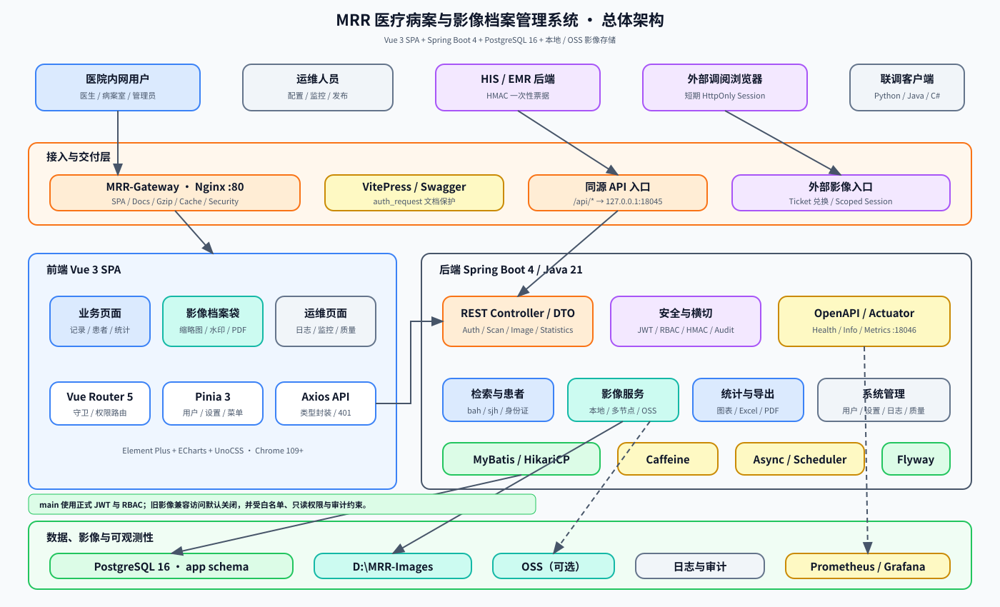

# MRR 系统架构图

可编辑源文件：[MRR-system-architecture.drawio](./MRR-system-architecture.drawio)

## 图纸内容

Draw.io 源文件包含三个页面：

1. **总体逻辑架构**：展示医院内网用户、HIS/EMR 外部接入、Nginx、Vue 3 SPA、Spring Boot 4 后端、PostgreSQL、影像存储及监控系统之间的关系。
2. **Windows 生产部署拓扑**：展示 Windows Server 上由 WinSW 管理的 Nginx 与 Spring Boot 服务、PostgreSQL、外置配置、不可变发布目录、影像目录和原生监控组件。
3. **外部影像调阅安全链路**：展示 HIS/EMR 后端使用 HMAC-SHA256 申请一次性 Ticket，浏览器兑换短期 HttpOnly Session，并按授权病案范围访问影像的完整流程。

## 架构边界

- 正式部署采用 Windows 原生单机方案；Docker Compose 仅用于本地开发、测试或演示。
- 生产请求由 Nginx `:80` 同源转发至 Spring Boot `127.0.0.1:18045`。
- PostgreSQL 使用 `app` schema；影像可来自本地目录、多节点图片服务或可选 OSS。
- Actuator 管理端口默认为 `127.0.0.1:18046`，可由 Prometheus、Grafana 和 PostgreSQL exporter 组成原生监控链路。
- 当前默认分支 `dev-no-login` 故意绕过登录与权限验证；该状态已在图中单独标注，不应作为正式生产认证架构。

## 编辑方式

使用 draw.io Desktop 或 diagrams.net 打开 `.drawio` 文件，可分别编辑三个页面。SVG 只用于文档预览，架构调整应以 `.drawio` 源文件为准。
