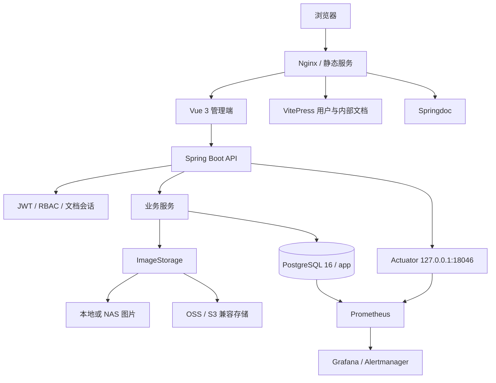
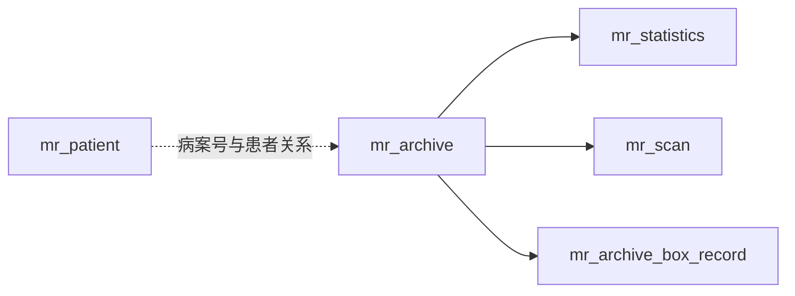

# 系统架构

## 设计目标

MRR 采用单前端、单 Spring Boot 后端、单 PostgreSQL 数据库的部署模型，图片存储支持本地/NAS 和 OSS。当前架构优先考虑医院内网环境下的部署简单、数据可追溯、大表可维护和权限边界清晰，不以微服务或分布式部署为前提。

## 运行结构



## 前端职责

前端位于 `frontend-fantastic-admin/`，负责：

- 登录状态、权限导航和页面路由。
- 患者、记录、统计、装箱、OSS 迁移和运维页面。
- 病案号、上架号和身份证查询交互。
- 图片选择、全屏预览、打印和浏览器端 PDF。
- 本地最近查询记录。
- 系统设置加载、服务端优先与本地回退。
- ECharts 图表和明暗主题。
- 系统监控、数据质量结果和公开状态页展示。

前端不直接连接 PostgreSQL，不读取本地文件系统，不直接访问 Actuator，也不承担服务端身份证令牌加密。

## 后端职责

后端位于 `backend-repo/`，负责：

- REST API、参数校验、统一响应和异常处理。
- JWT、RBAC 和文档访问会话。
- 患者、病案主档、统计、扫描、日志、装箱和迁移数据访问。
- `mr_archive` 主档解析和业务表 `archive_id` 关联。
- 编号原始格式保护和高位病案号约束。
- 图片存储边界、本地路径安全和 OSS 签名回退。
- Flyway 迁移、访问日志、图片审计和保留策略。
- 手动数据质量检查。
- 可用性区间与公开状态接口。
- Actuator 与 Prometheus 指标。

## 数据模型边界



`mr_archive.id` 是稳定技术主键。病案号 `bah` 不保证全局唯一，上架号 `sjh` 允许为空但非空时唯一。业务编号用于查询和外部数据交换，`archive_id` 用于系统内部可靠关联。

## 编号与路径边界

`bah/sjh` 会参与本地图片路径定位。规范化只去除首尾空格和空白值，不自动补零：

```text
123       -> 123
00000123  -> 00000123
```

图片目录、数据库和导入文件必须使用同一原始编号。高位病案号 `>= 10000000` 必须结合上架号查询。

## 图片存储边界

图片访问统一通过 `ImageStorage`：

- Controller 不直接拼接磁盘路径。
- 本地实现校验根目录、非法字符、路径穿越、存在性和可读性。
- 系统设置默认 `local`，可切换为 `oss`。
- OSS URL 缺失或签名失败时回退本地图片。
- 服务端 ZIP 当前仍从本地存储流式读取。
- 浏览器端 PDF 直接读取当前有效图片 URL，因此依赖 CORS。

## 大表边界

`mr_scan` 计划达到数千万行：

- 兼容列表接口在 SQL 层限制最多 1000 条。
- 顺序遍历使用 `id > last_id` 的主键游标。
- 不使用不断增长的深度 `OFFSET` 做全表迁移。
- `archive_id` 回填由独立 PowerShell 脚本分批完成。
- 大索引、批量导入和回填必须观察 WAL、磁盘、锁和正常查询延迟。

## 路由与权限

| 路径 | 服务 | 权限 |
| --- | --- | --- |
| `/` | Vue 管理端 | 登录和业务权限 |
| `/archive` | 影像档案袋 | `record:read` |
| `/status` | 公开状态页 | 无需登录，返回脱敏状态 |
| `/help` | 帮助中心 | 登录用户 |
| `/docs/` | 用户手册 | 已登录账号 |
| `/docs/internal/` | 内部文档 | `system:read` 或管理员 |
| `/api-docs/` | Swagger UI | `system:read` 或管理员 |
| `/api/v1/**` | 后端接口 | JWT，公开接口例外 |
| `127.0.0.1:18046/actuator/**` | 管理端点 | 本机或受控监控网络 |

## 可用性状态

状态页与主后端同部署。服务完全停止时状态页也无法访问；服务恢复后根据最后心跳和超时阈值补录停机区间。它适合展示历史可用率，但不能替代独立外部探针。
