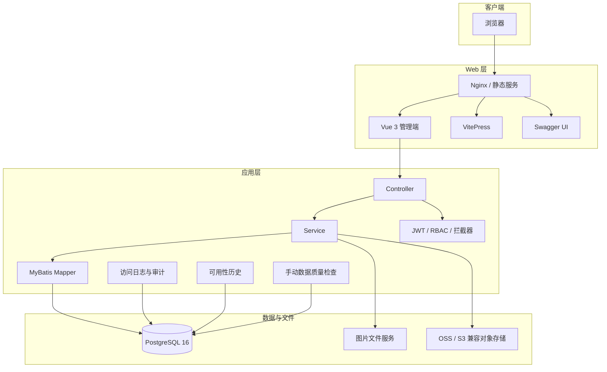

# 系统架构

## 设计目标

MRR 采用单前端、单后端、单 PostgreSQL 数据库的部署模型，围绕医疗病案文件记录管理提供业务、审计和运维能力。当前架构优先考虑部署简单、数据可追溯和医院内网环境下的可维护性，不以微服务或分布式部署为前提。

## 分层结构

## 前端职责

前端位于 `frontend-fantastic-admin/`，负责：

- 登录状态、用户资料和权限驱动导航。
- 病案记录、患者、统计、档案装箱、OSS 迁移等业务页面。
- 病案号、上架号和身份证查询交互。
- 图片选择、全屏切换、打印与浏览器端 PDF 合成。
- 系统设置的加载、保存、服务端优先与本地回退。
- ECharts 图表渲染和明暗主题适配。
- 系统监控、数据质量结果和公开状态页展示。

前端不直接连接数据库，不直接读取 Actuator 指标，也不承担服务端身份证令牌加密。

## 后端职责

后端位于 `backend-repo/`，负责：

- REST API、参数校验、统一响应和异常处理。
- JWT 认证、RBAC 权限判断和文档访问会话。
- 病案、患者、统计、日志、装箱和迁移数据访问。
- 病案号与上架号规范化及唯一性约束。
- 身份证查询、脱敏返回和 URL 安全令牌。
- PostgreSQL Flyway 迁移。
- 访问日志、图片访问审计和保留策略。
- 手动数据质量检查。
- 服务可用性区间与公开状态接口。
- Actuator 与 Prometheus 指标。

## 数据源与文件源

### PostgreSQL

正式环境使用 PostgreSQL 16，默认数据库为 `imgapi`，业务 Schema 为 `app`。新数据库从 `V0__baseline_schema.sql` 初始化；旧增量脚本位于 `db/migration-legacy`，不会被当前 Flyway 位置执行。

### 图片文件服务

数据库保存图片目录、文件名和服务地址等元数据。浏览器显示或导出 PDF 时访问实际图片 URL，因此图片服务必须稳定提供 HTTP 访问。浏览器端 PDF 需要图片服务返回允许前端来源的 CORS 响应头。

### OSS

OSS 迁移是可选能力。迁移记录、校验状态和对象 URL 保存在数据库中。密钥必须由部署环境注入，不应写入仓库。

## 路由与部署边界

| 路径 | 服务 | 权限 |
|------|------|------|
| `/` | Vue 管理端 | 业务登录与页面权限 |
| `/archive` | 影像档案袋独立路由 | `record:read` |
| `/status` | 公开状态页 | 无需登录 |
| `/help` | 管理端帮助中心 | 登录后访问 |
| `/docs/` | 用户手册 | 已登录账号 |
| `/docs/internal/` | 内部文档 | `system:read` 或管理员 |
| `/api-docs/` | Swagger UI | `system:read` 或管理员 |
| `/api/v1/**` | 后端业务接口 | JWT / 公开接口例外 |
| `127.0.0.1:18046/actuator/**` | 管理端点 | 本机网络边界 |

## 可用性状态模型

状态页与业务应用同部署，服务完全停止时状态页本身也不可访问。后端通过周期心跳保存 `UP` / `DOWN` 时间区间，服务恢复后根据最后心跳补录停机时间。该设计适合展示历史可用率，但不能替代独立外部探针。

## 非目标

当前架构明确不包含：

- 微服务拆分和服务注册中心。
- 分布式事务。
- 多租户数据隔离。
- 专业 DICOM 诊断工作站能力。
- 独立高可用状态站。
- 自动执行的数据质量定时任务。

上述能力若未来引入，应先形成架构决策记录，再更新本页。