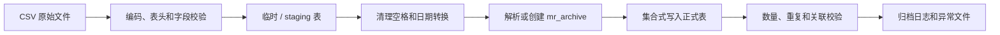

# 数据导入与迁移

本文用于指导 PostgreSQL 环境中的 CSV 导入、病案主档关联回填和大表迁移。所有生产操作都应先在数据库副本完成演练。

## 基本原则

1. 原始文件只读保留，不直接覆盖。
2. CSV 使用 UTF-8、逗号分隔和明确表头。
3. 先进入临时或 staging 表，再校验并写入正式表。
4. 使用 `COPY`/`\copy` 处理大批量数据，不使用逐行 INSERT。
5. 每批独立记录行数、错误样本和处理时间。
6. 空上架号写入 `NULL`，不生成占位编号。
7. 病案号和上架号保留原始格式，不自动补零。
8. 高位病案号缺少上架号时拒绝自动关联。
9. 正式写入前备份；写入后执行总量、关联和抽样校验。

## 建议 CSV 表头

### `mr_patient`

```csv
brxh,id,bah,name,idcard,ruyuan,admissiontime,department,chuangwei,bingqu,keshicode,bingqucode
```

当前正式表重点使用：

- `id`
- `bah`
- `name`
- `idcard`
- `ruyuan`
- `admissiontime`
- `department`
- `bingqu`
- `chuangwei`

导入转换程序应明确未落库字段，不要静默错列。病区字段使用 `bingqu`，不是 `binqu`。

### `mr_statistics`

```csv
bah,cid,openerno,date,type,pages,sjh,patientname,inpatientdepartment,patientid,dischargedate,brxh
```

字段是否可空、类型和冲突处理以当前数据库结构为准。日期建议转换为 ISO 格式后再导入。

### `mr_scan`

常见历史格式：

```csv
sjh,bah,brxh,folder,filename,btype,filesize
```

`mr_scan` 规模可能达到数千万行，必须拆分文件、使用 staging 和集合 SQL，并按主键或文件维护可恢复进度。

### `mr_archive_box_record`

```csv
bah,sjh,box_no,expected_box_no,status,remark
```

装箱记录应先解析目标 `archive_id`。病案号重复且缺少上架号时不得猜测目标病案。

## 推荐导入流程



### 1. 文件预检

检查：

- 编码是否为 UTF-8。
- 分隔符是否为逗号。
- 表头是否完整、无重复列。
- 每行列数是否一致。
- 日期是否可转换。
- 页数和类型是否在允许范围。
- `bah/sjh` 是否包含不可见字符。

### 2. 导入临时表

`psql` 示例：

```sql
CREATE TEMP TABLE import_statistics (
  bah text,
  cid text,
  openerno text,
  date_text text,
  type_text text,
  pages_text text,
  sjh text,
  patientname text,
  inpatientdepartment text,
  patientid text,
  dischargedate_text text,
  brxh text
);

\copy import_statistics FROM 'D:/MRR-Data/mr_statistics.csv' WITH (FORMAT csv, HEADER true, ENCODING 'UTF8')
```

Windows 路径建议使用正斜杠。`\copy` 在客户端读取文件；SQL `COPY` 在数据库服务器读取文件，两者路径权限不同。

### 3. 规范化

编号只清理空格：

```sql
NULLIF(btrim(bah), '')
NULLIF(btrim(sjh), '')
```

不要使用 `lpad(..., 8, '0')`。日期使用显式格式转换，无法转换的行先进入异常表。

### 4. 建立病案关联

优先调用当前数据库中的规范化和解析函数，或按相同规则处理：

- 非空唯一 `sjh` 可定位病案。
- 低位 `bah` 可按规则定位。
- 高位 `bah` 必须与 `sjh` 组合。
- 无法唯一定位的记录输出异常，不写错误 `archive_id`。

### 5. 正式写入

使用 `INSERT ... SELECT` 或明确冲突键的 `ON CONFLICT`。不要只凭 `bah` 对所有表做 UPSERT。

每个文件独立事务：

```sql
BEGIN;
-- 校验
-- 写入
-- 数量核对
COMMIT;
```

任一关键校验失败时回滚当前文件，保留失败文件和错误报告。

## 大表迁移

### `mr_scan` 分卷

建议根据机器磁盘、WAL 和维护窗口，从每卷 50 万～100 万行开始压测。不要直接以 3000 万行单文件作为首轮生产导入。

每卷记录：

- 文件名和校验和。
- 起止原始行号或 ID。
- 读取行数。
- 成功、跳过和失败行数。
- 开始与结束时间。
- 错误样本。

### 游标而非深度 OFFSET

读取数据库大表时使用：

```sql
SELECT *
FROM app.mr_scan
WHERE id > :last_id
ORDER BY id
LIMIT :batch_size;
```

每批成功后持久化 `last_id`，失败后从最近成功批次继续。

### 病案关联回填

当前仓库提供：

```powershell
./backend-repo/scripts/backfill-archive-links.ps1 -BatchSize 10000
```

执行期间观察：

- 数据库 CPU、磁盘和 WAL。
- 锁等待和长事务。
- HikariCP 使用量。
- 正常查询延迟。
- `archive_id IS NULL` 数量变化。

## 导入后校验

### 总数

```sql
SELECT count(*) FROM app.mr_patient;
SELECT count(*) FROM app.mr_statistics;
SELECT count(*) FROM app.mr_scan;
SELECT count(*) FROM app.mr_archive_box_record;
```

### 空关联

```sql
SELECT count(*) FROM app.mr_statistics WHERE archive_id IS NULL;
SELECT count(*) FROM app.mr_scan WHERE archive_id IS NULL;
SELECT count(*) FROM app.mr_archive_box_record WHERE archive_id IS NULL;
```

### 上架号重复

```sql
SELECT sjh, count(*)
FROM app.mr_archive
WHERE sjh IS NOT NULL
GROUP BY sjh
HAVING count(*) > 1;
```

### 图片路径抽样

抽样选择短编号、带前导零编号、高位病案号和空上架号记录，确认数据库值、图片文件夹和实际访问 URL 一致。

### 类型范围

```sql
SELECT btype, count(*)
FROM app.mr_scan
GROUP BY btype
ORDER BY btype;
```

允许范围为 `0`～`15`，其中 `0` 表示暂未分类。

## 失败处理

- 编码错误：重新以 UTF-8 导出，不在 SQL 中盲目替换乱码。
- `No such file or directory`：确认使用的是客户端 `\copy` 还是服务端 `COPY`，并检查执行机器上的实际路径。
- `\copy` 行尾解析错误：检查 SQL 文件编码、反斜杠命令是否独占一行、CSV 引号和换行。
- 客户端等待：`wait_event_type=Client` 通常表示 PostgreSQL 正等待客户端继续发送或接收数据，应检查 psql 进程、网络、磁盘和 CSV 读取状态。
- 迁移 checksum 不一致：不得修改已执行迁移，应恢复原文件并新增修正迁移。

## 上线检查

- [ ] 原始 CSV 和数据库均已备份
- [ ] 已在数据库副本完成全流程演练
- [ ] 已记录文件校验和和预期行数
- [ ] 已验证短编号和前导零编号不被改写
- [ ] 已验证高位病案号关联规则
- [ ] 已验证 `archive_id` 覆盖率
- [ ] 已验证图片路径可访问
- [ ] 已观察 WAL、磁盘、锁和查询延迟
- [ ] 已准备中止、回滚和继续执行方案
