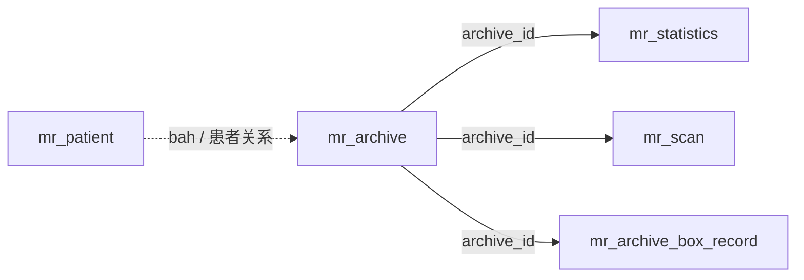

# 数据库

## 运行基线

正式环境使用 PostgreSQL 16，业务 Schema 为 `app`。默认连接配置：

```properties
spring.datasource.url=jdbc:postgresql://localhost:5432/imgapi?currentSchema=app
spring.flyway.locations=classpath:db/migration,classpath:db/callback
spring.flyway.schemas=app
spring.flyway.default-schema=app
spring.flyway.out-of-order=true
spring.flyway.baseline-on-migrate=false
spring.flyway.validate-on-migrate=true
spring.flyway.validate-migration-naming=true
```

当前仓库不存在单一 `V0__baseline_schema.sql` 作为唯一初始化入口。空数据库应执行 `db/migration` 下的完整当前迁移链；现有数据库必须保留并核对 `app.flyway_schema_history`。

## 病案主数据模型



`mr_archive` 是病案主档：

- `id` 使用 `BIGINT IDENTITY`，作为稳定技术主键。
- `bah` 是病案号，不保证全局唯一。
- `sjh` 是上架号，允许 `NULL`；非空值通过部分唯一索引保证唯一。
- 业务表通过 `archive_id` 关联，避免长期依赖松散文本 JOIN。
- 历史导入仍可提供 `bah/sjh`，由解析函数和触发器建立或刷新关联。

不要把上架号直接改成主键：历史数据存在空值，且业务编号可能调整；稳定主键与业务编号职责不同。

## 核心业务表

| 表 | 主要用途 |
| --- | --- |
| `mr_archive` | 病案主档和稳定 `archive_id` |
| `mr_scan` | 图片扫描记录、目录、文件名、类型、大小和 OSS 状态 |
| `mr_patient` | 患者、身份证、病案号、入院日期、科室、病区和床位 |
| `mr_statistics` | 病案统计、检索和扫描汇总数据 |
| `mr_count` | 病案及图片页数汇总 |
| `mr_archive_box_record` | 实体装箱位置、预期箱号、状态和备注 |
| `mr_system_settings` | 服务端系统设置键值 |

`mr_patient` 当前病区字段名为 `bingqu`，旧拼写 `binqu` 已通过独立迁移更正。

## 认证、审计与运维表

| 表 | 主要用途 |
| --- | --- |
| `mr_auth_user` | 用户账号、密码哈希、角色和状态 |
| `mr_auth_role` | 角色、权限集合和排序 |
| `access_log` | 请求、用户、来源、状态、耗时和审计动作 |
| `frontend_response_metric` | 前端上报的接口响应指标 |
| `image_migration_log` | 单文件 OSS 迁移、校验和错误信息 |
| `migration_job` | 批量迁移任务进度和状态 |
| `mrr_data_quality_run` | 数据质量检查批次 |
| `mrr_data_quality_check_result` | 检查项汇总 |
| `mrr_data_quality_issue` | 受样本上限控制的异常明细 |
| `system_availability_period` | 服务可用性状态区间 |

具体字段以当前迁移文件和运行数据库为准。

## 编号规范

`bah` 和 `sjh` 使用文本类型保存，因为它们是业务编号并参与本地图片路径定位。

当前规范化函数只执行：

- 去除首尾空格。
- 空白字符串转 `NULL`。
- 保留短数字。
- 保留原有前导零。

示例：

```text
" 123 "     -> "123"
"00000123"  -> "00000123"
"   "       -> NULL
```

不得自动把 `123` 改写为 `00000123`。历史上已被补零的数据不能通过统一“去零”安全恢复，因为无法判断前导零是否属于原始编号。

## 高位病案号

病案号从 `10000000` 开始可能重复：

- 低位病案号可单独解析。
- 高位病案号必须与上架号组合解析。
- 上架号非空且唯一时可单独解析。
- 同时提供两个编号时使用 `AND`，不能退化为 `OR`。

数据库函数、后端 Service 和导入脚本必须保持同一规则。

## 历史数据回填

`mr_scan` 可能达到数千万行。Flyway 不应在普通启动事务中一次性回填全部 `archive_id`。

使用：

```powershell
./backend-repo/scripts/backfill-archive-links.ps1 -BatchSize 10000
```

执行前后至少检查：

```sql
SELECT count(*) FROM app.mr_scan;
SELECT count(*) FROM app.mr_scan WHERE archive_id IS NULL;
SELECT count(*) FROM app.mr_statistics WHERE archive_id IS NULL;
SELECT count(*) FROM app.mr_archive_box_record WHERE archive_id IS NULL;
```

还应抽样核对 `archive_id` 指向的 `bah/sjh` 与原记录一致。

## Flyway 迁移规范

新迁移统一命名：

```text
VyyyyMMddHHmmss__short_description.sql
```

例如：

```text
V20260716163000__preserve_medical_record_codes.sql
V20260717010000__rename_mr_patient_binqu_to_bingqu.sql
```

规则：

1. 已执行迁移不可修改、删除或重命名。
2. 修正历史结构必须新增迁移，不得改旧文件规避问题。
3. 不删除或手工改写 `flyway_schema_history`。
4. 不使用 `flyway repair` 掩盖真实 checksum 或结构差异。
5. `out-of-order=true` 允许补执行尚未应用的较低版本，不代表迁移顺序可以随意。
6. 大表回填、`CREATE INDEX CONCURRENTLY` 和长时间数据转换应拆成维护脚本或非事务迁移。
7. 发布前在生产数据库副本验证迁移时间、锁、磁盘和回滚方案。

## 索引原则

针对 `mr_scan` 等大表：

- 常规主键顺序遍历优先使用游标分页。
- 避免深度 `OFFSET`。
- 新索引必须由真实 SQL 和 `EXPLAIN (ANALYZE, BUFFERS)` 支撑。
- 大索引评估磁盘、WAL、锁和构建时间。
- 可以使用部分索引、INCLUDE、BRIN 或 GIN Trigram，但必须明确查询场景。
- 批量导入期间避免重复维护不必要索引。

## 数据导入原则

- CSV 使用 UTF-8 编码和稳定表头。
- 先导入临时表，再执行校验、规范化和集合式写入。
- 数十万行优先使用 PostgreSQL `COPY`，不要逐行 INSERT。
- 数千万行拆分文件并按文件独立提交，保留失败记录和可恢复进度。
- 空上架号写入 `NULL`，不要创建 `00000000` 等虚假值。
- 高位病案号缺少上架号的记录应进入异常清单，不应猜测关联。
- 导入后核对总数、重复、空关联、页数、类型范围和图片路径。

详细流程见 [数据导入与迁移](./data-migration.md)。

## 备份与恢复

生产环境至少保留：

- PostgreSQL 全量备份。
- 必要的 WAL/时间点恢复能力。
- 图片目录或 NAS 备份。
- OSS 对象和迁移日志一致性检查。
- Nginx、应用、文档和监控配置备份。

恢复演练必须验证数据库记录、`archive_id` 关联和实际图片文件仍能对应，不能只确认 PostgreSQL 进程可以启动。