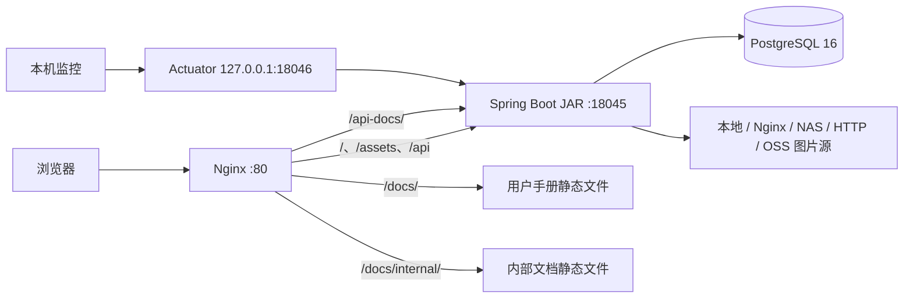
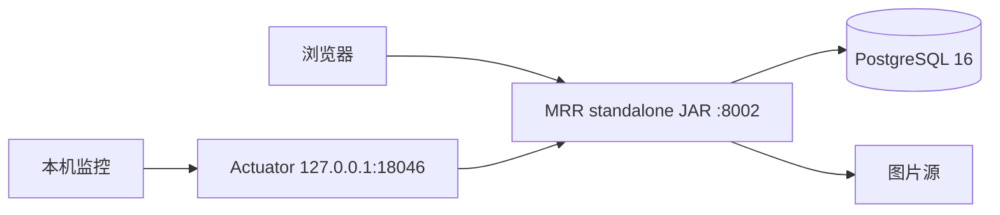

# 部署总览

MRR 当前提供两种正式交付方式：

1. **Windows 离线包**：包含内嵌前端 JAR、Nginx、WinSW、文档和运维脚本，适合医院 Windows Server 长期运行；
2. **单体 JAR**：只包含后端和内嵌 Vue 前端，适合直接运行、已有反向代理或轻量部署。

两种方式共享同一业务代码和数据库迁移，但默认端口、配套组件和运维能力不同。

## 1. 制品与端口

| 制品 | 默认业务端口 | 管理端口 | 前端 | Nginx / WinSW | 文档站点 |
| --- | ---: | ---: | --- | --- | --- |
| `MRR-vX.Y.Z.zip` | `18045` | `18046` | JAR 内嵌，保留外置回退 | 包含 | 包含 |
| `MRR-vX.Y.Z-standalone.jar` | `8002` | `18046` | JAR 内嵌 | 不包含 | 不包含 |
| 源码直接运行 | `18045` | `18046` | 需构建内嵌或单独启动 Vite | 不包含 | 不包含 |

所有业务端口都可以通过 `SERVER_PORT` 覆盖。Actuator 默认只监听：

```text
127.0.0.1:18046
```

不要把 `18046` 直接暴露给普通内网用户或公网。

## 2. 推荐的 Windows 正式拓扑



当前 Windows 模板默认使用“内嵌前端”模式：Nginx 的 `/` 请求代理到 Spring Boot JAR。发布包仍保留外置前端目录，只有在紧急回退或显式切换时才由 Nginx 直接读取静态文件。

### 内嵌前端模式

```nginx
location / {
    include C:/MRR/config/nginx/maintenance.inc;
    include C:/MRR/config/nginx/frontend-mode.inc;
}
```

`frontend-mode.inc` 在默认模式下等价于：

```nginx
proxy_pass http://mrr_backend;
```

### 外置前端回退模式

```nginx
root C:/MRR/current/frontend;
try_files $uri $uri/ /index.html;
```

外置目录不是第二套长期部署架构，只是受管理的回退手段。切换模式应通过仓库运维工具完成，避免手工修改当前生效配置后无法追踪。

## 3. 单体 JAR 拓扑



单体 JAR已经内嵌 Vue 管理端，不需要单独部署前端。它不包含：

- PostgreSQL；
- Nginx；
- WinSW；
- 用户手册和内部文档；
- 医院环境密码、密钥和 OSS 凭据；
- Windows 一键管理中心。

帮助中心的用户使用手册、开发文档和运维指南入口由系统设置维护，可以指向 Windows 包中的外置文档或独立文档服务。

完整操作见 [单体 JAR 部署](./standalone-jar.md)。

## 4. 构建产物

### 后端

```bash
cd backend-repo
mvn -B -ntp test package
```

普通产物：

```text
backend-repo/target/imgapi-*.jar
```

### 前端

```bash
cd frontend-fantastic-admin
corepack pnpm@10.33.0 install --frozen-lockfile
pnpm lint:tsc
pnpm test:run
pnpm build
```

产物：

```text
frontend-fantastic-admin/dist/
```

### 将前端内嵌到 JAR

正式工作流使用：

```bash
python scripts/embed_frontend_in_jar.py embed \
  --jar backend-repo/target/imgapi-*.jar \
  --dist frontend-fantastic-admin/dist

python scripts/embed_frontend_in_jar.py verify \
  --jar backend-repo/target/imgapi-*.jar
```

验证会检查：

```text
BOOT-INF/classes/static/index.html
BOOT-INF/classes/static/assets/
```

### 单体 JAR

单体工作流在内嵌前端后，将 `application.properties` 中的默认业务端口从 `18045` 改为 `8002`：

```bash
python scripts/build_standalone_jar.py build \
  --source backend-repo/target/imgapi-*.jar \
  --output build/MRR-vX.Y.Z-standalone.jar \
  --default-port 8002
```

这不会改变仓库源码的默认端口，也不会改变 Windows 离线包的后端端口。

### 文档

```bash
cd vitepress-doc
npm ci
npm run docs:changelog:test
npm run docs:build
```

产物：

```text
vitepress-doc/.vitepress/dist-user/
vitepress-doc/.vitepress/dist-internal/
```

## 5. 开发环境

开发时浏览器访问 Vite：

```text
http://localhost:9200
```

请求链路：

```text
浏览器 :9200
  → /proxy/api/**
Vite 开发代理
  → /api/**
Spring Boot :18045
```

正式构建不运行 Vite，也不应出现 `/proxy/api/**`。生产前端直接请求同源 `/api/**`。

如果正式环境仍发送 `/proxy/api/...`，说明部署了错误的环境构建，需要核对 `.env.production` 和重新执行 `pnpm build`。

## 6. Windows 离线包路由

| 路径 | 当前目标 |
| --- | --- |
| `/`、`/assets/**`、浏览器路由 | 默认代理到 JAR 内嵌前端；可切换到外置前端回退 |
| `/api/**` | Spring Boot `127.0.0.1:18045` |
| `/status` | 受维护模式控制后代理到内嵌前端 |
| `/docs/**` | 用户手册静态文件 |
| `/docs/internal/**` | 内部文档静态文件 |
| `/api-docs/**` | Springdoc Swagger UI 代理 |
| `/v3/api-docs` | Springdoc OpenAPI 数据 |

Nginx 入口日志不记录 Query String，避免外部 Ticket、Token 或敏感查询参数以明文写入访问日志。

## 7. 最小生产配置

```properties
SERVER_PORT=18045
MANAGEMENT_SERVER_PORT=18046
MANAGEMENT_SERVER_ADDRESS=127.0.0.1

SPRING_DATASOURCE_URL=jdbc:postgresql://127.0.0.1:5432/imgapi?currentSchema=app
SPRING_DATASOURCE_USERNAME=mrr_app
SPRING_DATASOURCE_PASSWORD=<数据库密码>
JWT_SECRET_KEY=<JWT随机密钥>
AES_SECRET_KEY=<AES随机密钥>
```

图片源按实际环境选择：

```properties
IMAGE_BASE_PATH=<后端可读目录>
IMAGE_SERVER_URL_DEFAULT=<默认Nginx图片地址>
IMAGE_SERVER_URL_BA01=<BA01地址>
IMAGE_SERVER_URL_BA02=<BA02地址>
IMAGE_SERVER_URL_BA03=<BA03地址>

ARCHIVE_IMAGE_SOURCE_PREFER_OSS=true
OSS_ENDPOINT=<endpoint>
OSS_BUCKET=<bucket>
OSS_ACCESS_KEY_ID=<access-key-id>
OSS_ACCESS_KEY_SECRET=<access-key-secret>
```

密码和密钥必须通过环境变量、服务配置或外部 Spring 配置注入，不要写入仓库或页面可见设置。

## 8. 数据库与 Flyway

正式迁移目录：

```text
backend-repo/src/main/resources/db/migration
backend-repo/src/main/resources/db/callback
```

迁移命名：

```text
VyyyyMMddHHmmss__description.sql
```

当前 `main` 的兼容迁移上限为：

```text
20260723163000
```

该迁移新增 `app.system_error_event` 和运行错误中心权限。已执行的 Flyway 文件禁止修改或重命名。

数千万行批量修复不应放入普通启动迁移，应使用可恢复、可观察、可分批执行的专用脚本。

## 9. 发布与升级顺序

1. 确认 `VERSION`、标签、构建 Commit 和 `release-baseline.json` 一致；
2. 校验下载资产的 SHA-256；
3. 备份 PostgreSQL、外部配置和当前完整发布目录；
4. 进入维护窗口或禁止写入；
5. 部署新制品；
6. 启动应用并观察 Flyway；
7. 检查 Actuator 健康状态；
8. 验证登录、权限、患者、病案、影像、ZIP/PDF、OSS/Nginx 和运行错误中心；
9. 恢复业务流量；
10. 观察日志、数据库、连接池、磁盘和错误率。

当前发布基线禁止只替换旧 JAR 回滚。需要回滚时，必须恢复发布前数据库、配置和完整发布目录备份。

## 10. 部署验证清单

### 通用

- 页面可以加载并登录；
- 浏览器请求使用 `/api/v1/...`，不是 `/proxy/api/v1/...`；
- `/status` 正常；
- `127.0.0.1:18046/actuator/health` 正常；
- Flyway 迁移状态正确；
- 患者、记录、统计和档案装箱可以读取；
- 影像档案袋可按病案号、上架号和身份证查询；
- 身份证查询后 URL 不保留明文；
- 图片来源、ZIP、PDF 和 Range 下载可用；
- 普通账号不能越权访问管理接口；
- 运行错误中心的读写权限正确。

### Windows 离线包

- Nginx :80 可访问；
- 后端实际监听 `18045`；
- 默认使用内嵌前端；
- 切换外置前端回退后仍可访问，再切回内嵌模式；
- WinSW 和一键管理中心可以启停、重启和进入维护模式；
- `/docs/`、`/docs/internal/`、`/api-docs/` 的鉴权正确。

### 单体 JAR

- 文件名包含 `-standalone.jar`；
- SHA-256 校验通过；
- 未设置 `SERVER_PORT` 时监听 `8002`；
- JAR内存在 `static/index.html` 和哈希静态资源；
- 不依赖外置前端目录。

## 11. 相关文档

- [Windows Server 部署](./windows-deployment.md)
- [单体 JAR 部署](./standalone-jar.md)
- [配置参考](./configuration-reference.md)
- [运行错误中心](./runtime-errors.md)
- [生产运行手册](./runbook.md)
- [发布流程](./release.md)
- [最新代码审查](./code-review.md)
