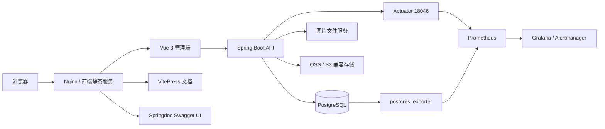

# MRR 内部文档

> 适用于开发、测试、部署与运维人员。本文档以 `v0.1.1` 和 `dev-no-login` 当前代码为准，不沿用旧自动生成文档中的推测性描述。

## 文档范围

| 模块 | 说明 |
|------|------|
| [系统架构](./architecture.md) | 运行边界、前后端职责、数据与外部依赖 |
| [前端工程](./frontend.md) | Vue 应用结构、路由、状态、样式与图表体系 |
| [后端工程](./backend.md) | Spring Boot 分层、配置、认证、日志与后台任务 |
| [数据库](./database.md) | PostgreSQL、V0 基线、核心表、索引与数据质量 |
| [API 与权限](./api.md) | 接口分组、认证方式、权限模型和实时 OpenAPI |
| [开发流程](./development.md) | 本地启动、分支、检查、测试和文档维护 |
| [部署](./deployment.md) | 非 Docker 正式部署、Nginx、文档和图片服务 |
| [运维与监控](./operations.md) | Actuator、Prometheus、Grafana、状态页与数据质量 |
| [安全](./security.md) | 密钥、个人信息、文档访问、日志与网络边界 |
| [故障排查](./troubleshooting.md) | 启动、数据库、前端、文档、图片和监控问题 |
| [发布流程](./release.md) | 版本说明、迁移、构建、验证和回滚 |

## 当前系统边界

MRR 是医疗病案文件记录管理系统，核心目标是管理病案扫描记录、患者关联信息、图片文件地址、统计数据、档案装箱位置和访问审计。

系统不是通用 DICOM 诊断工作站，不提供窗宽窗位、医学测量、多帧诊断播放等专业阅片能力。影像档案袋主要处理浏览器可显示的图片文件，并支持选择、打印和浏览器端 PDF 导出。

## 运行组成



## 权限分层

- 管理端业务接口使用 JWT 与 RBAC 权限控制。
- 用户手册 `/docs/` 需要已登录账号。
- 内部文档 `/docs/internal/` 和实时 API `/api-docs/` 需要 `system:read` 或管理员权限。
- 公开状态页 `/status` 和公开状态接口无需登录，但只返回脱敏可用性信息。
- Actuator 默认只监听 `127.0.0.1:18046`，不应直接暴露公网。

## 数据库迁移原则

- 新 PostgreSQL 数据库只从 `db/migration/V0__baseline_schema.sql` 初始化。
- `spring.flyway.baseline-on-migrate=false`，不为已有数据库自动写入基线记录。
- 旧增量迁移保存在 `db/migration-legacy`，只用于审计和历史追溯。
- 已部署旧迁移链的数据库不能直接切换到 V0，必须制定独立迁移方案。
- V0 发布后，如需修改结构，应增加新的增量迁移，不直接修改已经部署的基线文件。

## 文档维护原则

1. 代码与实际迁移链是事实来源，文档不能补充未实现能力。
2. 新增页面、路由、配置或接口时，同一 PR 内更新对应文档。
3. 用户手册只描述可见且可操作的功能；内部文档可以描述限制和维护流程。
4. API 字段优先查阅运行中的 Springdoc，不复制容易过期的完整生成内容。
5. 用户站点和内部站点独立构建，避免内部内容进入用户搜索索引。

## 快速验证

```bash
cd frontend-fantastic-admin
corepack pnpm@10.33.0 install --frozen-lockfile
pnpm lint:tsc
pnpm test:run
pnpm build

cd ../backend-repo
mvn test
mvn package

cd ../vitepress-doc
npm install
npm run docs:build
```

完整验证要求以当前 GitHub Actions 工作流和 PR 说明为准。